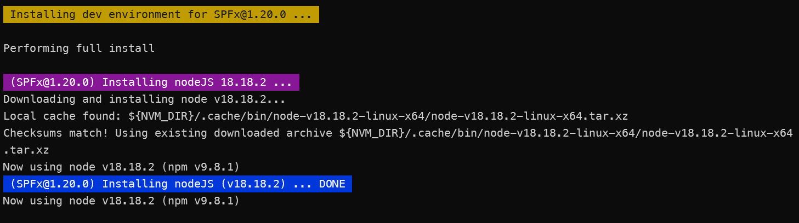
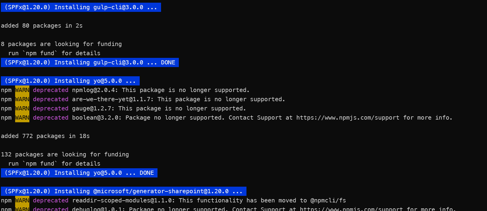

# spfx-install.sh

> ##### DEPRECATED: Please use the updated version of this script located at [scripts/spfx-install-js](../spfx-install/README.md)

## Summary

This script installs specific versions of SharePoint Framework (SPFx) development environments, including NodeJS, npm, and either @rushstack/heft or gulp-cli as needed. By including the 'full' option, Yeoman and the SPFx generator are also installed. If no version is specified, the SharePoint Online (spo/latest) version is installed.

This script is designed to be run from the command line in any version of Node.js. It can be run in a Windows environment using PowerShell, the command prompt, or Windows Subsystem for Linux (WSL). It can also be run in a macOS or Linux environment.

If you want to install a specific version of SPFx, you can specify the version number as an argument. For example, to install SPFx v1.11.0, you would run the script as follows:

```bash
./spfx-install.js 1.11.0
```
or 
```bash
./spfx-install.sh 1.11.0 full
```
To get help one all options for the command line, run the script as follows:

```bash
./spfx-install.sh -help
```
The script will also create an alias for the version of SPFx you installed. For example, if you installed SPFx v1.11.0, the alias will be `spfx-1.11.0`. You can use this alias to switch to that version of SPFx as follows:

```bash
nvm use spfx-<version>
```
You can also use the following commands to switch to special versions of SPFx:

```bash
nvm use spfx-spo    #latest released version supported by SharePoint Online
nvm use spfx-sp2019 #latest version supported by SP2019
nvm use spfx-sp2016 #latest version supported by SP2016
nvm use spfx-sse    #latest version supported by SharePoint Server Subscription Edition
nvm use spfx-next   #latest version in development
```

# Screenshots  
#### Command  

#### Results  




When new versions of SPFx are released, the script can be easily updated to include the new version. Instructions on how to do this are included in the script starting around line 138.


## Prerequisites
The script is designed to be run from a bash shell, and it requires Node Version Manager (nvm) to be installed. If you don't have nvm installed, follow the installation instructions here: [Installing nvm-sh](https://github.com/nvm-sh/nvm?tab=readme-ov-file#installing-and-updating)

If you install the script in a location that is not in your PATH, you can create a bash alias to make it easier to run. For example, you could add the following line to your `.bashrc` or `.bash_profile` file:

```bash
alias spfx-install='/path/to/spfx-install.sh'
```

Then, you can run the script from any directory by simply typing `spfx-install`.

# [Bash Script](#tab/bash)
```bash
########################################################################################
# This script quickly installs an environment for specific versions of SPFx.           #
#                                                                                      #
# For details on how to use this script, see the #HELP section at the bottom of this   #
# file.                                                                                #
#                                                                                      #
# Node Version Manager (nvm) is required to run this script. If you don't have nvm     #
# installed, follow the installation instructions here:                                #
#    https://github.com/nvm-sh/nvm?tab=readme-ov-file#installing-and-updating          #
#                                                                                      #
# To uninstall nvm, run the following command:                                         #
#    rm -rf ~/.nvm                                                                     #
#                                                                                      # 
######################################################################################## 
#!/bin/bash
if [[ -n $1 ]]; then
  version=$1
else
  version="spo"
fi

if [[ "$1" == "-help" ||
  "$1" == "-H" ||
  "$1" == "--help" ||
  "$1" == "help" ]] \
  ; then
  gotoHelp="true"
else
  gotoHelp="false"
fi

if [[ $gotoHelp == "false" ]]; then

  if [[ -n $2 ]]; then
    fullInstall="true"
  else
    fullInstall="false"
  fi
  unset latestAlias

  ############################################################
  # This is the function to install specific versions of     #
  # NodeJs, npm, and gulp-cli.                               #
  #                                                          #
  # If $6(FULL INSTALL) is included, Yeoman and the SPFx     #
  # generator are also installed.                            #
  #                                                          #
  # PARAMETERS:                                              #
  # $1 = SPFX VERSION                                        #
  # $2 = NODE VERSION                                        #
  # $3 = NPM VERSION                                         #
  # $4 = YO VERSION                                          #
  # $5 = GULP VERSION                                        #
  # $6 = FULL INSTALL (true/false)                           #
  ############################################################
  installSPFx() {
    spfxVersion=$1
    nodeVersion=$2
    npmVersion=$3
    yoVersion=$4
    gulpVersion=$5
    unset fullInstall
    fullInstall=$6

    . ~/.nvm/nvm.sh

    echo
    echo -e "\e[1;43m Installing dev environment for SPFx@$1 ... \e[0m"
    echo
    if [[ $fullInstall == "true" ]]; then
      echo "Performing full install"
    else
      echo "Performing basic install (NodeJs & gulp-cli)"
    fi
    echo

    nodeInstalled=$(nvm ls $nodeVersion)
    if [[ $nodeInstalled == *"N/A"* ]]; then
      echo -e "\e[1;45m (SPFx@$spfxVersion) Installing nodeJS $nodeVersion ... \e[0m"
      nvm install $nodeVersion
      echo -e "\e[1;44m (SPFx@$spfxVersion) Installing nodeJS (v$nodeVersion) ... DONE \e[0m"
    else
      echo -e "\e[1;45m (SPFx@$spfxVersion) NodeJs v'$nodeVersion' already installed \e[0m"
    fi
    nvm use $nodeVersion
    previousloglevel=$(npm get loglevel)
    npm config set loglevel warn

    #always install gulp-cli
    echo
    echo -e "\e[1;44m (SPFx@$spfxVersion) Installing gulp-cli@$gulpVersion ... \e[0m"
    npm install -g gulp-cli@$gulpVersion --quiet
    echo -e "\e[1;44m (SPFx@$spfxVersion) Installing gulp-cli@$gulpVersion ... DONE \e[0m"

    if [[ "$fullInstall" == "true" && "$npmVersion" != "0" ]]; then
      echo
      echo -e "\e[1;44m (SPFx@$spfxVersion) Installing npm@$npmVersion ... \e[0m"
      npm install -g npm@$npmVersion --quiet
      echo -e "\e[1;44m (SPFx@$spfxVersion) Installing npm@$npmVersion ... DONE \e[0m"
    fi

    if [[ "$fullInstall" == "true" ]]; then
      echo
      echo -e "\e[1;44m (SPFx@$spfxVersion) Installing yo@$yoVersion ... \e[0m"
      npm install -g yo@$yoVersion --quiet
      echo -e "\e[1;44m (SPFx@$spfxVersion) Installing yo@$yoVersion ... DONE \e[0m"
      if [[ $nodeVersion[1] == 6 ]]; then
        echo
        echo -e "\e[1;45m (SPFx@$spfxVersion) Fixing yeoman-environment issue for Node v6 \e[0m"
        echo
        echo -e "\e[1;45m Deleting the yeoman-environment package installed by yeoman as a dependency ... \e[0m"
        rm -rf ~/.nvm/versions/node/v$nodeVersion/lib/node_modules/yo/node_modules/yeoman-environment
        echo -e "\e[1;45m Deleting the yeoman-environment package installed by yeoman as a dependency ... DONE \e[0m"
        echo
        echo -e "\e[1;45m Installing yeoman-environment@2.7.0 ... \e[0m"
        npm install -g yeoman-environment@2.7.0 --quiet
        echo -e "\e[1;45m Installing yeoman-environment@2.7.0 ... DONE \e[0m"
        echo
        echo -e "\e[1;45m (SPFx@$spfxVersion) Fixing yeoman-environment issue for Node v6... DONE \e[0m"
      fi
    fi

    if [[ "$fullInstall" == "true" ]]; then
      echo
      echo -e "\e[1;44m (SPFx@$spfxVersion) Installing @microsoft/generator-sharepoint@$spfxVersion ... \e[0m"
      npm install -g @microsoft/generator-sharepoint@$spfxVersion --quiet
      echo -e "\e[1;44m (SPFx@$spfxVersion) Installing @microsoft/generator-sharepoint@$spfxVersion ... DONE \e[0m"
    fi

    echo
    echo -e "\e[1;45m Creating alias 'spfx-$spfxVersion' ... \e[0m"
    nvm alias spfx-$spfxVersion $nodeVersion
    npm set loglevel $previousloglevel

  }

  ############################################################
  # HERE IS WHERE TO UPDATE WITH NEW VERSIONS                #
  #                     IMPORTANT!!!                         #
  #    MAKE SURE EACH VERSION GETS A UNIQUE NODEJS VERSION   #
  #                                                          #
  # TO UPDATE:                                               #
  # 1. Change $spoVersion to latest LTS version              #
  # 2. Add section for new spfx version                      #
  # 3. Update versions of yo and gulp-cli, as needed         #
  #                                                          #
  # spfxInstall parameters                                   #
  # $1 = SPFX VERSION                                        #
  # $2 = NODE VERSION                                        #
  # $3 = NPM VERSION (0 means to use npm from nodejs)        #
  # $4 = YO VERSION                                          #
  # $5 = GULP-CLI VERSION                                    #
  # $6 = FULL INSTALL (true/false)                           #
  ############################################################
  clear
  echo

  if [[ "$version" == "next" ]]; then
    nextNodeVersion=22.11.0 # THIS IS THE NODE VERSION, NOT SPFX
    nextAlias=$nextNodeVersion
    echo -e "\e[1;43m Installing dev environment for SPFx@next using NodeJs v$nextNodeVersion ... \e[0m"
    installSPFx next $nextNodeVersion 0 5 3 true
  fi

  if [[ "$version" == "spo" ]]; then
    spoVersion="1.21.1" #used to create the alias
    version=$spoVersion
    echo -e "\e[1;43m Installing dev environment for SPFx@spo(v$version) ... \e[0m"
  fi

  if [[ "$version" == "1.21.1" || "$version" == "all" ]]; then 
    installSPFx 1.21.1 22.14.0 0 5.1 3.0.0 $fullInstall
  fi

  if [[ "$version" == "1.21.0" || "$version" == "all" ]]; then 
    installSPFx 1.21.0 22.15.0 0 5.1 3.0.0 $fullInstall
  fi

  if [[ "$version" == "1.20.0" || "$version" == "all" ]]; then 
    installSPFx 1.20.0 18.18.2 0 5.0.0 3.0.0 $fullInstall
  fi

  if [[ "$version" == "1.19.0" || "$version" == "all" ]]; then
    installSPFx 1.19.0 18.18.1 0 5.0.0 3.0.0 $fullInstall
  fi

  if [[ "$version" == "1.18.1" || "$version" == "all" ]]; then
    installSPFx 1.18.1 18.18.0 0 4.3.1 2.3.0 $fullInstall
  fi

  if [[ "$version" == "1.18.0" || "$version" == "all" ]]; then
    installSPFx 1.18.0 18.17.1 0 4.3.1 2.3.0 $fullInstall
  fi

  if [[ "$version" == "1.17.4" || "$version" == "all" ]]; then
    installSPFx 1.17.4 16.20.2 0 4.3.1 2.3.0 $fullInstall
  fi

  if [[ "$version" == "1.17.3" || "$version" == "all" ]]; then
    installSPFx 1.17.3 16.20.1 0 4.3.1 2.3.0 $fullInstall
  fi

  if [[ "$version" == "1.17.2" || "$version" == "all" ]]; then
    installSPFx 1.17.2 16.20.0 0 4.3.1 2.3.0 $fullInstall
  fi

  if [[ "$version" == "1.17.0" || "$version" == "all" ]]; then
    installSPFx 1.17.0 16.19.1 0 4.3.1 2.3.0 $fullInstall
  fi

  if [[ "$version" == "1.16.1" || "$version" == "all" ]]; then
    installSPFx 1.16.1 16.19.0 0 4.3.1 2.3.0 $fullInstall
  fi

  if [[ "$version" == "1.16.0" || "$version" == "all" ]]; then
    installSPFx 1.16.0 16.18.1 0 4.3.1 2.3.0 $fullInstall
  fi

  if [[ "$version" == "1.15.2" || "$version" == "all" ]]; then
    installSPFx 1.15.2 16.15.0 0 4.3.1 2.3.0 $fullInstall
  fi

  if [[ "$version" == "1.15.0" || "$version" == "all" ]]; then
    installSPFx 1.15.0 16.15.1 0 4.3.0 2.3.0 $fullInstall
  fi

  if [[ "$version" == "1.14.0" || "$version" == "all" ]]; then
    installSPFx 1.14.0 14.18.1 0 4.3.0 2.3.0 $fullInstall
  fi

  if [[ "$version" == "1.13.1" || "$version" == "all" ]]; then
    installSPFx 1.13.1 14.18.0 0 4.3.0 2.3.0 $fullInstall
  fi

  if [[ "$version" == "1.13.0" || "$version" == "all" ]]; then
    installSPFx 1.13.0 14.17.1 0 4.3.0 2.3.0 $fullInstall
  fi

  if [[ "$version" == "1.12.1" || "$version" == "all" ]]; then
    installSPFx 1.12.1 14.17.0 0 4.1.0 2.3.0 $fullInstall
  fi

  if [[ "$version" == "1.11.0" || "$version" == "all" ]]; then
    installSPFx 1.11.0 10.22.0 0 3.1.1 2.3.0 $fullInstall
  fi

  if [[ "$version" == "1.10.0" || "$version" == "all" ]]; then
    installSPFx 1.10.0 10.18.1 0 3.1.1 2.3.0 $fullInstall
  fi

  if [[ "$version" == "1.9.1" || "$version" == "all" ]]; then
    installSPFx 1.9.1 10.23.3 0 2.0.5 2.3.0 $fullInstall
  fi

  if [[ "$version" == "1.8.2" || "$version" == "all" ]]; then
    installSPFx 1.8.2 10.24.1 0 2.0.5 2.3.0 $fullInstall
  fi

  if [[ "$version" == "1.8.1" || "$version" == "all" ]]; then
    installSPFx 1.8.1 8.16.2 0 2.0.5 2.3.0 $fullInstall
  fi

  if [[ "$version" == "1.8.0" || "$version" == "all" ]]; then
    installSPFx 1.8.0 8.16.1 0 2.0.5 2.3.0 $fullInstall
  fi

  if [[ "$version" == "1.7.1" || "$version" == "all" ]]; then
    installSPFx 1.7.1 8.16.0 0 2.0.5 2.3.0 $fullInstall
  fi

  if [[ "$version" == "1.7.0" || "$version" == "all" ]]; then
    installSPFx 1.7.0 8.17.0 0 3.1.1 2.3.0 $fullInstall
  fi

  if [[ "$version" == "1.6.0" || "$version" == "all" ]]; then
    installSPFx 1.6.0 8.12.0 0 2.0.5 2.3.0 $fullInstall
  fi

  if [[ "$version" == "1.5.1" || "$version" == "all" ]]; then
    installSPFx 1.5.1 8.11.4 0 2.0.2 2.3.0 $fullInstall
  fi

  if [[ "$version" == "1.5.0" || "$version" == "all" || "$version" == "sse" ]]; then
    installSPFx 1.5.0 8.11.3 0 2.0.2 2.3.0 $fullInstall
    echo
    echo -e "\e[1;45m Creating alias 'spfx-sse' ... \e[0m"
    nvm alias spfx-sse spfx-1.5.1
  fi

  if [[ "$version" == "1.4.1" || "$version" == "all" || "$version" == "sp2019" ]]; then
    installSPFx 1.4.1 8.9.4 0 2.0.1 2.3.0 $fullInstall
    echo
    echo -e "\e[1;45m Creating alias 'spfx-sp2019' ... \e[0m"
    nvm alias spfx-sp2019 spfx-1.4.1
  fi

  if [[ "$version" == "1.4.0" || "$version" == "all" ]]; then
    installSPFx 1.4.0 6.12.1 0 2.0.0 2.3.0 $fullInstall
  fi

  if [[ "$version" == "1.3.0" || "$version" == "all" ]]; then
    installSPFx 1.3.0 6.11.3 0 2.0.0 2.3.0 $fullInstall
  fi

  if [[ "$version" == "1.1.0" || "$version" == "all" || "$version" == "sp2016" ]]; then
    installSPFx 1.1.0 6.10.3 0 2.0.0 2.3.0 $fullInstall
    #installSPFx 1.1.0 6 0 1.8.5 2.3.0 $fullInstall
    echo
    echo -e "\e[1;45m Creating alias 'spfx-sp2016' ... \e[0m"
    nvm alias spfx-sp2016 spfx-1.1.0
  fi

  if [[ "$version" == "1.0.0" || "$version" == "all" ]]; then
    installSPFx 1.0.0 6.15.1 0 2.0.0 2.3.0 $fullInstall
  fi

  #additional aliases
  if [[ -n "$spoVersion" ]]; then
    echo
    echo -e "\e[1;45m Creating alias 'spfx-spo (latest)' ... \e[0m"
    nvm alias spfx-spo spfx-$spoVersion
    nvm alias default spfx-spo
  fi
  if [[ -n "$nextAlias" ]]; then
    echo
    echo -e "\e[1;45m Creating alias 'spfx-next' ... \e[0m"
    nvm alias spfx-next $nextAlias
  fi

  echo
  echo -e "\e[1;46m Current Node installations \e[0m"
  nvm ls
  echo
  echo -e "\e[1;46m Current environment \e[0m"
  echo "Node version: $(node -v)"
  npm ls -g --depth=0

  echo -e "\e[1;43m Installing dev environment for SPFx@$1 ... DONE\e[0m"

else 
#HELP
  echo "Installs specific versions of SPFx environments, including NodeJS, npm, and gulp-cli."
  echo "By including the 'full' option, yeoman and the SPFx generator are also installed."
  echo "If no version is specified, the SharePoint Online (spo/latest) version is installed."
  echo
  echo "Usage: install-spfx [options]"
  echo "  if bash alias is installed, the above can be run from any folder, "
  echo "  otherwise run from the folder where the script is located"
  echo
  echo "Options:"
  echo "  help, -help, -H, --help      output usage information"
  echo "  <version> full               installs yeoman, SPFx generator, and gulp-cli"
  echo "  <version>                    if 'full' ommitted, only gulp-cli is installed"
  echo
  echo "Examples:"
  echo "  spfx-install spo full        installs full tools to build SPFx solutions with latest version"
  echo "  spfx-install 1.11.0          installs basic tools to use SPFx v1.11.0"
  echo "  spfx-install 1.15.0 full     installs full tools to build SPFx v1.15.0 solutions"
  echo "  spfx-install next            installs full tools to build SPFx solutions with next (beta) version"
  echo "  spfx-install all             installs basic tools for all versions of SPFx"
  echo "  spfx-install sp2016          installs basic tools for SPFx v1.4.1 (latest version supported by SP2016)"
  echo "  spfx-install sp2019          installs basic tools for SPFx v1.8.2 (latest version supported by SP2019)"
  echo "  spfx-install sse             installs basic tools for SPFx v1.5.0 (latest version supported by SharePoint Server Subscription Edition)"
  echo
  echo "Once a specific version of SPFx is installed, you can use the following command to switch to it:"
  echo "  nvm use spfx-<version>"
  echo
  echo "You can also use the following command to switch to special versions of SPFx:"
  echo "  nvm use spfx-spo    #latest released version supported by SharePoint Online"
  echo "  nvm use spfx-sp2019 #latest version supported by SP2019"
  echo "  nvm use spfx-sp2016 #latest version supported by SP2016"
  echo "  nvm use spfx-sse    #latest version supported by SharePoint Server Subscription Edition"
  echo "  nvm use spfx-next   #latest version in development"
fi
```
***
## Contributors

| Author(s) |
|-----------|
| Don Kirkham |


[!INCLUDE [DISCLAIMER](../../docfx/includes/DISCLAIMER.md)]

