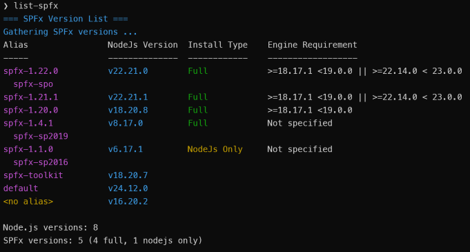
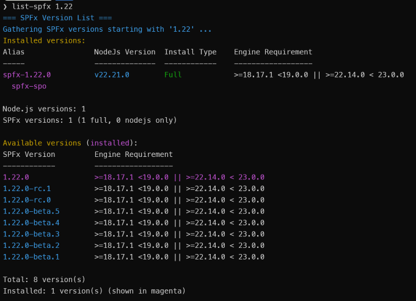

# List SPFx Versions

## Summary

This Node.js script lists SharePoint Framework (SPFx) versions installed via fnm (Fast Node Manager) along with their corresponding Node.js versions. It can also query the npm registry to show all available SPFx versions that can be installed.

The script provides several useful features:

- Lists installed SPFx versions with their Node.js requirements and installation types (Full or Node-only)
- Optionally displays all available SPFx versions from the npm registry
- Filters results by version pattern (e.g., show only versions starting with "1.19")
- Shows installation status (Full installation includes Yeoman and SPFx generator, Node-only is just Node.js)
- Displays aliases configured with the "spfx-" prefix
- Limits output when querying available versions

> **Note:** This script is a companion to the [install-spfx.js](../spfx-install/README.md) script, which installs SPFx versions and configures the "spfx-" aliases that this script highlights.

## Prerequisites

- Node.js installed. This script uses features that are only available in Node.js 14 and later.
- **fnm (Fast Node Manager)** installed and configured
  - Windows: `winget install Schniz.fnm`
  - macOS/Linux: `curl -fsSL https://fnm.vercel.app/install | bash`
  
  > **Note:** fnm is used to provide cross-platform support for Windows, macOS, and Linux, whereas nvm only works on macOS/Linux.

- For available(i.e., remote) version lookups, internet connectivity is needed to access the npm registry

## Setup as a Command

You can set up this script to run as a simple command like `list-spfx` instead of typing `node /path/to/list-spfx.js` every time.

**Linux/macOS (bash/zsh):**
```bash
# Navigate to script directory and make script executable
cd /path/to/list-spfx.js
chmod +x list-spfx.js

# Add to PATH in ~/.bashrc (or ~/.zshrc if using zsh)
echo 'export PATH="$PATH:$PWD"' >> ~/.bashrc
source ~/.bashrc
```

**Windows (PowerShell):**
```powershell
# Edit PowerShell profile
notepad $PROFILE

# Add this line:
function list-spfx { node C:\path\to\list-spfx.js $args }

# Reload profile
. $PROFILE
```

## Screenshots

**Basic Usage - Installed Versions Only**


**Show All Available Versions**


**Filter by Version Pattern**
 

**Limit Available Versions**


**Help Output**


# [Javascript](#tab/javascript)

```javascript
#!/usr/bin/env node

/**
 * List SPFx Versions Script
 * Lists SharePoint Framework (SPFx) versions installed via fnm with their Node.js versions
 */

const { execSync } = require('child_process');
const https = require('https');
const fs = require('fs');
const path = require('path');
const os = require('os');

// ANSI color codes for terminal output
const colors = {
    reset: '\x1b[0m',
    cyan: '\x1b[36m',
    green: '\x1b[32m',
    yellow: '\x1b[33m',
    red: '\x1b[31m',
    white: '\x1b[37m',
    magenta: '\x1b[35m'
};

// Constants
const INSTALL_TYPE = {
    FULL: 'Full',
    NODE_ONLY: 'NodeJs Only',
    NONE: ''
};

const LABELS = {
    NO_ALIAS: '<no alias>',
    NOT_SPECIFIED: 'Not specified'
};

const ALIAS_PREFIX = 'spfx-';

function colorize(text, color) {
    return `${colors[color]}${text}${colors.reset}`;
}

// Helper: Check if version matches pattern
function matchesPattern(version, pattern) {
    return !pattern || version.startsWith(pattern);
}

// Helper: Sort aliases with spfx- aliases first, then others
function sortAliases(aliases) {
    return aliases.sort((a, b) => {
        const aIsSpfx = a.startsWith(ALIAS_PREFIX);
        const bIsSpfx = b.startsWith(ALIAS_PREFIX);
        
        // Both spfx or both non-spfx: maintain alphabetical order
        if (aIsSpfx === bIsSpfx) return a.localeCompare(b);
        
        // spfx aliases come first
        return aIsSpfx ? -1 : 1;
    });
}

// Parse command line arguments
function parseArgs() {
    const args = process.argv.slice(2);
    const params = {
        pattern: null,
        all: false,
        limit: 0,
        help: false
    };

    for (let i = 0; i < args.length; i++) {
        const arg = args[i].toLowerCase();
        if (arg === '-all' || arg === '--all') {
            params.all = true;
        } else if (arg === '-limit' || arg === '--limit') {
            params.limit = parseInt(args[++i], 10) || 0;
        } else if (arg === '-h' || arg === '--help' || arg === '-help') {
            params.help = true;
        } else if (!params.pattern) {
            params.pattern = args[i];
        }
    }

    // If Pattern or Limit is provided, automatically enable -all behavior
    if ((params.pattern || params.limit > 0) && !params.all) {
        params.all = true;
    }

    return params;
}

// Show help message
function showHelp() {
    console.log(colorize('=== SPFx Version List ===', 'cyan'));
    console.log('');
    console.log('Usage: node list-spfx.js [pattern] [-all] [-limit <number>]');
    console.log('');
    console.log('Arguments:');
    console.log('  [pattern]     Filter to show only SPFx versions starting with pattern (e.g., "1.19")');
    console.log('  -all          Show both installed and available versions from npm registry');
    console.log('  -limit <num>  Limits the number of available versions shown');
    console.log('');
    console.log('Examples:');
    console.log('  node list-spfx.js              # Shows only installed SPFx versions');
    console.log('  node list-spfx.js -all         # Shows both installed and available versions');
    console.log('  node list-spfx.js 1.19         # Shows all versions starting with "1.19"');
    console.log('  node list-spfx.js -all -limit 20  # Shows installed + first 20 available versions');
    console.log('');
    console.log(colorize('Setup as "list-spfx" command:', 'cyan'));
    console.log('');
    
    const platform = os.platform();
    
    if (platform === 'win32') {
        // Windows
        console.log(colorize('  Windows (PowerShell):', 'yellow'));
        console.log('    1. Create alias in PowerShell profile:');
        console.log(colorize('       notepad $PROFILE', 'white'));
        console.log('    2. Add this line:');
        console.log(colorize('       function list-spfx { node C:\\path\\to\\list-spfx.js $args }', 'white'));
        console.log('    3. Reload profile:');
        console.log(colorize('       . $PROFILE', 'white'));
    } else {
        // Linux/macOS
        const shell = process.env.SHELL || '/bin/bash';
        const shellName = shell.includes('zsh') ? 'zsh' : 'bash';
        const rcFile = shellName === 'zsh' ? '~/.zshrc' : '~/.bashrc';
        
        console.log(colorize(`  Linux/macOS (${shellName}):`, 'yellow'));
        console.log('    1. Navigate to script directory and make executable:');
        console.log(colorize('       cd /path/to/list-spfx.js', 'white'));
        console.log(colorize('       chmod +x list-spfx.js', 'white'));
        console.log(`    2. Add current folder to PATH in ${rcFile}:`);
        console.log(colorize(`       echo 'export PATH="$PATH:$PWD"' >> ${rcFile}`, 'white'));
        console.log('    3. Reload shell:');
        console.log(colorize(`       source ${rcFile}`, 'white'));
        console.log('');
        console.log(colorize('  Alternative (use alias):', 'yellow'));
        console.log(`    Add alias to ${rcFile}:`);
        console.log(colorize(`       echo "alias list-spfx='/path/to/list-spfx.js'" >> ${rcFile}`, 'white'));
        console.log(colorize(`       source ${rcFile}`, 'white'));
    }
}

// Execute shell command synchronously
function execCommand(command, options = {}) {
    try {
        const result = execSync(command, {
            encoding: 'utf8',
            stdio: options.silent ? 'pipe' : 'inherit',
            ...options
        });
        return { success: true, output: result, exitCode: 0 };
    } catch (error) {
        return { success: false, output: error.stdout || '', exitCode: error.status || 1 };
    }
}

// Check if fnm is installed
function checkFnmInstalled() {
    const result = execCommand('fnm --version', { silent: true });
    return result.success;
}

// Show fnm installation instructions
function showFnmInstallInstructions() {
    console.log('');
    console.log(colorize('ERROR: fnm (Fast Node Manager) is not installed or not in PATH', 'red'));
    console.log('');
    console.log(colorize('To install fnm:', 'yellow'));
    console.log(colorize('  Windows (PowerShell): ', 'white') + colorize('winget install Schniz.fnm', 'cyan'));
    console.log(colorize('  macOS/Linux:          ', 'white') + colorize('curl -fsSL https://fnm.vercel.app/install | bash', 'cyan'));
    console.log('');
}

// HTTP GET request helper
function httpGet(url) {
    return new Promise((resolve, reject) => {
        https.get(url, (res) => {
            let data = '';
            res.on('data', (chunk) => data += chunk);
            res.on('end', () => {
                try {
                    resolve(JSON.parse(data));
                } catch (e) {
                    reject(e);
                }
            });
        }).on('error', reject);
    });
}

// Parse SPFx version from alias
function getSpfxVersionFromAlias(alias) {
    const match = alias.match(new RegExp(`^${ALIAS_PREFIX}(\\d+\\.\\d+\\.\\d+.*)$`));
    return match ? match[1] : null;
}

// Get sortable version with pre-release info
function getSortVersion(ver) {
    if (!ver) {
        return { major: 0, minor: 0, patch: 0, preRelease: null, preReleaseNum: 0 };
    }
    const match = ver.match(/^(\d+)\.(\d+)\.(\d+)(?:-([a-z]+)\.(\d+))?/);
    if (match) {
        return {
            major: parseInt(match[1]),
            minor: parseInt(match[2]),
            patch: parseInt(match[3]),
            preRelease: match[4] || null, // 'beta' or 'rc' or null
            preReleaseNum: match[5] ? parseInt(match[5]) : 0
        };
    }
    return { major: 0, minor: 0, patch: 0, preRelease: null, preReleaseNum: 0 };
}

// Compare Node.js version strings (descending order)
function compareNodeVersions(a, b) {
    const aVer = a.split('.').map(Number);
    const bVer = b.split('.').map(Number);
    for (let i = 0; i < 3; i++) {
        if (aVer[i] !== bVer[i]) return bVer[i] - aVer[i];
    }
    return 0;
}

// Compare version objects (descending order)
// GA versions first, then rc (highest first), then beta (highest first)
function compareVersions(a, b) {
    // Compare major.minor.patch first
    if (a.major !== b.major) return b.major - a.major;
    if (a.minor !== b.minor) return b.minor - a.minor;
    if (a.patch !== b.patch) return b.patch - a.patch;
    
    // If versions are equal, handle pre-release tags (GA comes first)
    if (!a.preRelease && !b.preRelease) return 0;
    if (!a.preRelease) return -1;
    if (!b.preRelease) return 1;
    
    // Both have pre-release tags: rc before beta
    if (a.preRelease !== b.preRelease) {
        return a.preRelease === 'rc' ? -1 : 1;
    }
    
    // Same pre-release type, compare numbers (higher first)
    return b.preReleaseNum - a.preReleaseNum;
}

// Main function
async function main() {
    const params = parseArgs();

    if (params.help) {
        showHelp();
        process.exit(0);
    }

    // Check fnm
    if (!checkFnmInstalled()) {
        showFnmInstallInstructions();
        process.exit(1);
    }

    // Display header
    console.log(colorize('=== SPFx Version List ===', 'cyan'));

    if (params.pattern) {
        console.log(colorize(`Gathering SPFx versions starting with '${params.pattern}' ...`, 'cyan'));
    }
    else {
        console.log(colorize(`Gathering SPFx versions ...`, 'cyan'));
    }

    // Get list of Node versions from fnm
    const fnmResult = execCommand('fnm list', { silent: true });
    if (!fnmResult.success) {
        console.log(colorize('ERROR: Failed to get fnm list', 'red'));
        console.log(colorize(`Error details: ${fnmResult.output}`, 'red'));
        process.exit(1);
    }

    // Parse fnm output
    const nodeVersions = {};
    const aliasPattern = /^\*?\s*v(\d+\.\d+\.\d+)(?:\s+(.+))?$/;

    fnmResult.output.split('\n').forEach(line => {
        const match = line.match(aliasPattern);
        if (match) {
            const nodeVersion = match[1];
            const aliasesString = match[2];

            if (!nodeVersions[nodeVersion]) {
                nodeVersions[nodeVersion] = {
                    aliases: [],
                    isCurrent: line.startsWith('*')
                };
            }

            if (aliasesString) {
                const aliases = aliasesString
                    .split(/[,\s]+/)
                    .filter(a => a && a !== 'system')
                    .map(a => a.trim());
                nodeVersions[nodeVersion].aliases.push(...aliases);
            }
        }
    });

    // Collect installed versions
    const installedVersions = [];
    const currentNodeResult = execCommand('fnm current', { silent: true });
    const currentNode = currentNodeResult.success ? currentNodeResult.output.trim() : null;

    // Build cache of generator versions for each Node version (check file system directly - much faster!)
    const generatorCache = {};
    const fnmDir = process.env.FNM_DIR || path.join(os.homedir(), '.fnm');
    const nodeInstallsDir = path.join(fnmDir, 'node-versions');
    
    for (const nodeVersion in nodeVersions) {
        const aliases = nodeVersions[nodeVersion].aliases;
        const spfxAliases = aliases.filter(a => a.match(/^spfx-(\d+\.\d+\.\d+.*)$/));

        if (spfxAliases.length > 0) {
            // Check file system directly without switching Node versions
            const nodePath = path.join(nodeInstallsDir, `v${nodeVersion}`);
            
            const genPaths = [
                path.join(nodePath, 'installation', 'lib', 'node_modules', '@microsoft', 'generator-sharepoint', 'package.json'),
                path.join(nodePath, 'installation', 'node_modules', '@microsoft', 'generator-sharepoint', 'package.json')
            ];

            for (const fullPath of genPaths) {
                if (fs.existsSync(fullPath)) {
                    try {
                        const pkgContent = JSON.parse(fs.readFileSync(fullPath, 'utf8'));
                        generatorCache[nodeVersion] = pkgContent.version;
                        break;
                    } catch (e) {
                        // Ignore JSON parse errors and try next path
                    }
                }
            }
        }
    }

    // Now build the installed versions list using the cache
    for (const nodeVersion in nodeVersions) {
        const aliases = nodeVersions[nodeVersion].aliases;
        const spfxAliases = aliases.filter(a => a.startsWith(ALIAS_PREFIX) && a.match(/\d+\.\d+\.\d+/));

        // If filtering by pattern, skip versions without SPFx aliases early
        if (params.pattern && spfxAliases.length === 0) {
            continue;
        }

        const installedGenVersion = generatorCache[nodeVersion] || null;

        if (spfxAliases.length > 0) {
            for (const alias of spfxAliases) {
                const spfxVersion = getSpfxVersionFromAlias(alias);
                if (!spfxVersion || !matchesPattern(spfxVersion, params.pattern)) continue;

                // Verify generator version matches SPFx version
                const isFullInstall = installedGenVersion && installedGenVersion === spfxVersion;

                installedVersions.push({
                    spfxVersion,
                    nodeVersion,
                    alias,
                    installType: isFullInstall ? INSTALL_TYPE.FULL : INSTALL_TYPE.NODE_ONLY,
                    hasAlias: true
                });
            }
        } else if (!params.pattern) {
            // Only include node-only versions if not filtering by pattern
            const otherAliases = aliases.join(', ');
            installedVersions.push({
                spfxVersion: null,
                nodeVersion,
                alias: otherAliases || LABELS.NO_ALIAS,
                installType: INSTALL_TYPE.NONE,
                hasAlias: otherAliases.length > 0
            });
        }
    }

    // Fetch npm requirements (only fetch if we have installed versions or need all versions)
    const npmRequirements = {};
    const availableVersions = [];

    let npmDataPromise = null;
    if (params.all || installedVersions.length > 0) {
        npmDataPromise = httpGet('https://registry.npmjs.org/@microsoft/sp-core-library').catch(() => null);
    }

    if (npmDataPromise) {
        try {
            const npmData = await npmDataPromise;
            
            if (npmData) {
                // Create Set of installed versions for faster lookup
                const installedSpfxVersions = new Set(
                    installedVersions.filter(v => v.spfxVersion).map(v => v.spfxVersion)
                );

                if (params.all) {
                    // Get all available versions from npm registry
                    for (const version in npmData.versions) {
                        if (!matchesPattern(version, params.pattern)) continue;

                        const versionData = npmData.versions[version];
                        const nodeRequirement = versionData.engines?.node || LABELS.NOT_SPECIFIED;
                        npmRequirements[version] = nodeRequirement;

                        availableVersions.push({
                            spfxVersion: version,
                            nodeRequirement
                        });
                    }

                    // Add installed versions not in npm registry
                    for (const spfxVer of installedSpfxVersions) {
                        if (!matchesPattern(spfxVer, params.pattern)) continue;
                        
                        if (!npmRequirements[spfxVer]) {
                            npmRequirements[spfxVer] = LABELS.NOT_SPECIFIED;
                            availableVersions.push({
                                spfxVersion: spfxVer,
                                nodeRequirement: LABELS.NOT_SPECIFIED
                            });
                        }
                    }
                } else {
                    // Only fetch requirements for installed versions
                    for (const spfxVer of installedSpfxVersions) {
                        const versionData = npmData.versions[spfxVer];
                        if (versionData) {
                            npmRequirements[spfxVer] = versionData.engines?.node || LABELS.NOT_SPECIFIED;
                        }
                    }
                }
            }
        } catch (error) {
            console.log(colorize('Warning: Failed to fetch Node.js requirements from npm registry', 'yellow'));
        }
    }

    // Display installed versions
    if (installedVersions.length === 0) {
        const msg = params.pattern 
            ? `No SPFx versions found starting with '${params.pattern}'`
            : 'No SPFx versions installed via fnm';
        console.log(colorize(msg, 'yellow'));
        if (!params.all) {
            console.log(colorize('Use -all to see all available versions.', 'white'));
        }
    } else {
        if (params.all) {
            console.log(colorize('Installed versions:', 'yellow'));
        }

        // Display table header
        console.log(colorize(sprintf('%-20s %-15s %-15s %-18s', 'Alias', 'NodeJs Version', 'Install Type', 'Engine Requirement'), 'white'));
        console.log(colorize(sprintf('%-20s %-15s %-15s %-18s', '-----', '--------------', '------------', '------------------'), 'white'));

        // Partition and sort versions once
        const withAliases = [];
        const withoutAliases = [];
        
        for (const version of installedVersions) {
            (version.hasAlias ? withAliases : withoutAliases).push(version);
        }
        
        withAliases.sort((a, b) => compareVersions(getSortVersion(a.spfxVersion), getSortVersion(b.spfxVersion)));
        withoutAliases.sort((a, b) => compareNodeVersions(a.nodeVersion, b.nodeVersion));

        // Track displayed primary versions
        const displayedPrimary = {};

        // Display versions with aliases
        for (const version of withAliases) {
            const key = `${version.nodeVersion}-${version.spfxVersion}`;

            if (!displayedPrimary[key]) {
                displayedPrimary[key] = true;

                const installColor = version.installType === INSTALL_TYPE.FULL ? 'green' : 'yellow';
                const nodeReq = npmRequirements[version.spfxVersion] || '';

                // Display row
                process.stdout.write(colorize(sprintf('%-20s', version.alias), 'magenta') + ' ');
                process.stdout.write(colorize(sprintf('%-15s', `v${version.nodeVersion}`), 'cyan') + ' ');
                process.stdout.write(colorize(sprintf('%-15s', version.installType), installColor) + ' ');
                console.log(colorize(nodeReq, 'white'));

                // Display additional aliases (spfx- aliases first, then others)
                const allNodeAliases = nodeVersions[version.nodeVersion].aliases;
                const additionalAliases = sortAliases(
                    allNodeAliases.filter(a => a !== version.alias)
                );
                for (const addAlias of additionalAliases) {
                    console.log(colorize(`  ${addAlias}`, 'magenta'));
                }
            }
        }

        // Display versions without aliases
        for (const version of withoutAliases) {
            const installColor = version.installType === INSTALL_TYPE.FULL ? 'green' : 'yellow';

            // Display alias or no alias label
            const aliasText = version.alias || LABELS.NO_ALIAS;
            process.stdout.write(colorize(sprintf('%-20s', aliasText), 'yellow') + ' ');
            process.stdout.write(colorize(sprintf('%-15s', `v${version.nodeVersion}`), 'cyan') + ' ');
            console.log(colorize(sprintf('%-15s', version.installType), installColor));

            // Display any aliases this node version has (spfx- aliases first, then others)
            if (nodeVersions[version.nodeVersion] && version.alias !== LABELS.NO_ALIAS) {
                const allNodeAliases = nodeVersions[version.nodeVersion].aliases;
                const additionalAliases = sortAliases(
                    allNodeAliases.filter(a => a !== version.alias)
                );
                for (const alias of additionalAliases) {
                    console.log(colorize(`  ${alias}`, 'magenta'));
                }
            }
        }

        console.log('');

        // Summary for installed versions (single pass)
        const uniqueNodeVersions = new Set();
        let fullSpfxCount = 0;
        let nodeOnlySpfxCount = 0;
        
        for (const v of installedVersions) {
            uniqueNodeVersions.add(v.nodeVersion);
            if (v.spfxVersion) {
                if (v.installType === INSTALL_TYPE.FULL) fullSpfxCount++;
                else if (v.installType === INSTALL_TYPE.NODE_ONLY) nodeOnlySpfxCount++;
            }
        }

        console.log(colorize(`Node.js versions: ${uniqueNodeVersions.size}`, 'white'));
        console.log(colorize(`SPFx versions: ${fullSpfxCount + nodeOnlySpfxCount} (${fullSpfxCount} full, ${nodeOnlySpfxCount} nodejs only)`, 'white'));
    }

    // Display available versions if -all is specified
    if (params.all && availableVersions.length > 0) {
        console.log('');
        console.log(colorize('Available versions ', 'yellow') + '(' + colorize('installed', 'magenta') + '):');
        console.log(colorize(sprintf('%-20s %-18s', 'SPFx Version', 'Engine Requirement'), 'white'));
        console.log(colorize(sprintf('%-20s %-18s', '------------', '------------------'), 'white'));

        // Get list of installed SPFx versions for highlighting
        const installedSpfxVersions = installedVersions
            .filter(v => v.spfxVersion)
            .map(v => v.spfxVersion);

        // Sort all available versions descending
        let sortedAvailable = availableVersions.sort((a, b) => 
            compareVersions(getSortVersion(a.spfxVersion), getSortVersion(b.spfxVersion))
        );

        // Apply limit if specified
        if (params.limit > 0) {
            sortedAvailable = sortedAvailable.slice(0, params.limit);
        }

        for (const version of sortedAvailable) {
            const isInstalled = installedSpfxVersions.includes(version.spfxVersion);

            if (isInstalled) {
                console.log(colorize(sprintf('%-20s %-18s', version.spfxVersion, version.nodeRequirement), 'magenta'));
            } else {
                process.stdout.write(colorize(sprintf('%-20s', version.spfxVersion), 'cyan') + ' ');
                console.log(colorize(version.nodeRequirement, 'white'));
            }
        }

        console.log('');
        if (params.limit > 0 && sortedAvailable.length < availableVersions.length) {
            console.log(colorize(`Showing: ${sortedAvailable.length} of ${availableVersions.length} available version(s)`, 'white'));
        } else {
            console.log(colorize(`Total: ${availableVersions.length} version(s)`, 'white'));
        }
        if (installedVersions.length > 0) {
            const uniqueInstalled = new Set(installedVersions.filter(v => v.spfxVersion).map(v => v.spfxVersion)).size;
            console.log(colorize(`Installed: ${uniqueInstalled} version(s) (shown in magenta)`, 'white'));
        }
    }

    console.log('');
}

// Simple sprintf implementation for padding
function sprintf(format, ...args) {
    let argIndex = 0;
    return format.replace(/%-?(\d+)s/g, (match, width) => {
        const arg = String(args[argIndex++] || '');
        const w = parseInt(width);
        return match.startsWith('%-') ? arg.padEnd(w) : arg.padStart(w);
    });
}

// Run main function
main().catch(error => {
    console.error(colorize('Unexpected error:', 'red'), error);
    process.exit(1);
});
```
***
## Contributors

| Author(s) |
|-----------|
| [Don Kirkham](https://github.com/donkirkham) |

[!INCLUDE [DISCLAIMER](../../docfx/includes/DISCLAIMER.md)]
