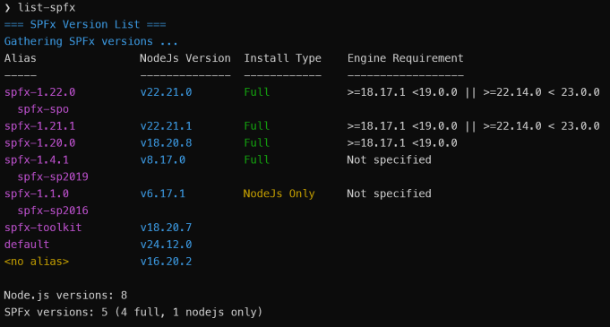
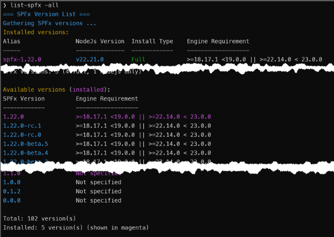
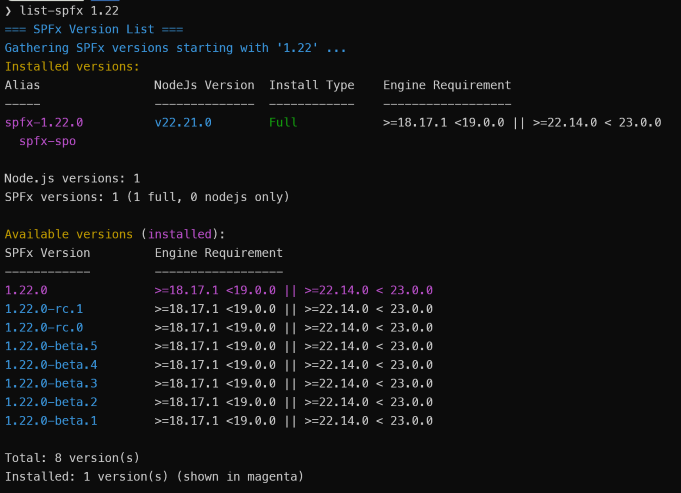
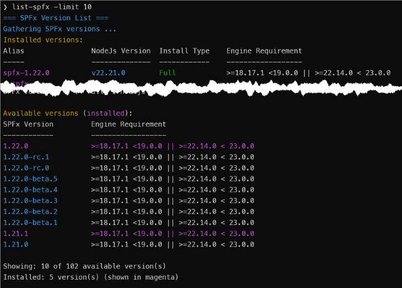
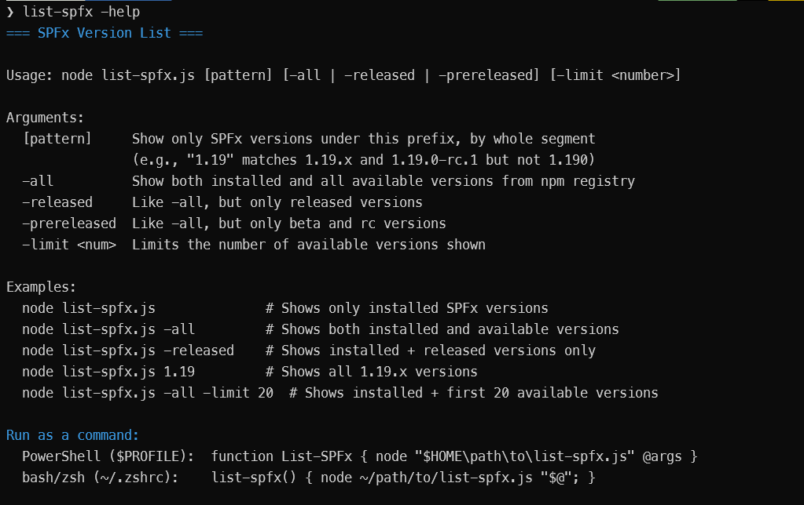

# List SPFx Versions

## Summary

This Node.js script lists SharePoint Framework (SPFx) versions installed via fnm (Fast Node Manager) along with their corresponding Node.js versions. It can also query the npm registry to show all available SPFx versions that can be installed.

The script provides several useful features:

- Lists installed SPFx versions, one row per Node.js version, with their Node.js requirements and installation type (Full or Node-only)
- Shows every `spfx-` alias pointing at each Node.js version, preset aliases (`spfx-spo`, `spfx-next`, ...) first, then version aliases in descending order
- Optionally queries the npm registry for all available SPFx versions (`-all`), or only released (`-released`) or only prerelease (`-prereleased`) versions
- Filters results by version prefix, matched by whole segment (e.g., `1.19` matches 1.19.x and 1.19.0-rc.1 but not 1.190)
- Limits the number of available versions shown (`-limit`)
- Falls back to a built-in compatibility matrix and reports the failure clearly if the npm registry is unreachable

## Arguments

| Argument | Description |
|----------|-------------|
| `[pattern]` | Show only SPFx versions under this prefix, by whole segment. Implies `-all`. |
| `-all` | Show installed and all available versions from the npm registry. |
| `-released` | Like `-all`, but only released versions. |
| `-prereleased` | Like `-all`, but only prerelease versions (beta, rc, etc.). |
| `-limit <n>` | Limit the number of available versions shown. Implies `-all`. |
| `-help` | Show usage. |

Examples:

```bash
node list-spfx.js                 # Installed versions only
node list-spfx.js -all            # Installed + all available versions
node list-spfx.js -released       # Installed + released versions only
node list-spfx.js 1.19            # All 1.19.x versions
node list-spfx.js -all -limit 20  # Installed + first 20 available versions
```

> **Note:** This script is a companion to the [install-spfx.js](../spfx-install-js/README.md) script, which installs SPFx versions and configures the "spfx-" aliases that this script highlights.

## Prerequisites

- Node.js installed. This script uses features that are only available in Node.js 14 and later.
- **fnm (Fast Node Manager)** installed and configured
  - Windows: `winget install Schniz.fnm`
  - macOS/Linux: `curl -fsSL https://fnm.vercel.app/install | bash`
  
  > **Note:** fnm is used to provide cross-platform support for Windows, macOS, and Linux, whereas nvm only works on macOS/Linux.

- For available(i.e., remote) version lookups, internet connectivity is needed to access the npm registry

## Setup as a Command

You can set up this script to run as a simple command like `list-spfx` instead of typing `node /path/to/list-spfx.js` every time.

**Linux/macOS (bash/zsh):**
```bash
# Navigate to script directory and make script executable
cd /path/to/list-spfx.js
chmod +x list-spfx.js

# Add to PATH in ~/.bashrc (or ~/.zshrc if using zsh)
echo 'export PATH="$PATH:$PWD"' >> ~/.bashrc
source ~/.bashrc
```

**Windows (PowerShell):**
```powershell
# Edit PowerShell profile
notepad $PROFILE

# Add this line:
function list-spfx { node C:\path\to\list-spfx.js $args }

# Reload profile
. $PROFILE
```

## Screenshots

**Basic Usage - Installed Versions Only**  


**Show All Available Versions**  


**Filter by Version Pattern**  


**Limit Available Versions**  


**Help Output**  


# [Javascript](#tab/javascript)

```javascript
#!/usr/bin/env node

/**
 * List SPFx Versions Script
 * Lists SharePoint Framework (SPFx) versions installed via fnm with their Node.js versions
 */

const { execSync } = require('child_process');
const https = require('https');
const fs = require('fs');
const path = require('path');
const os = require('os');

// Colour only when a person is looking: a pipe or a redirect gets plain text, NO_COLOR
// (https://no-color.org) turns it off on a terminal, and FORCE_COLOR turns it back on for
// a pager or a capture that renders escapes.
const useColor = process.env.FORCE_COLOR
    ? true
    : Boolean(process.stdout.isTTY) && !process.env.NO_COLOR;

const colors = {
    reset: "\x1b[0m",
    cyan: "\x1b[36m",
    green: "\x1b[32m",
    yellow: "\x1b[33m",
    red: "\x1b[31m",
    gray: "\x1b[90m",
    white: "\x1b[37m",
    magenta: "\x1b[95m",
};

function colorize(text, color) {
    if (!useColor) return String(text);
    return `${colors[color]}${text}${colors.reset}`;
}

const ALIAS_PREFIX = "spfx-";

// spfx-<semver> aliases carry the SPFx version; friendly ones (spfx-spo, spfx-next) do not.
const SPFX_VERSION_ALIAS = new RegExp(`^${ALIAS_PREFIX}(\\d+\\.\\d+\\.\\d+.*)$`);

function getSpfxVersionFromAlias(alias) {
    const match = alias.match(SPFX_VERSION_ALIAS);
    return match ? match[1] : null;
}

// SPFx to Node.js compatibility matrix for the releases that never declared an engines
// range in the registry (everything before 1.12.1-rc.1), taken from the "SPFx development
// environment compatibility" table at
// https://learn.microsoft.com/sharepoint/dev/spfx/compatibility. Entries are keyed by
// major.minor; an exact version entry overrides its minor where one patch differs.
const COMPATIBILITY_MATRIX = {
    "1.0": ">=6.9.1 <7.0.0",
    "1.1": ">=6.9.1 <7.0.0",
    "1.2": ">=6.9.1 <7.0.0",
    "1.3": ">=6.9.1 <7.0.0",
    "1.4.0": ">=6.9.1 <7.0.0",
    "1.4": ">=6.9.1 <7.0.0 || >=8.9.4 <9.0.0",
    "1.5": ">=6.9.1 <7.0.0 || >=8.9.4 <9.0.0",
    "1.6": ">=6.9.1 <7.0.0 || >=8.9.4 <9.0.0",
    "1.7": ">=8.9.4 <9.0.0",
    "1.8.0": ">=8.9.4 <9.0.0",
    "1.8.1": ">=8.9.4 <9.0.0",
    "1.8": ">=8.9.4 <9.0.0 || >=10.13.0 <11.0.0",
    "1.9": ">=8.9.4 <9.0.0 || >=10.13.0 <11.0.0",
    "1.10": ">=8.9.4 <9.0.0 || >=10.13.0 <11.0.0",
    "1.11": ">=10.13.0 <11.0.0",
    "1.12": ">=10.13.0 <11.0.0 || >=12.13.0 <13.0.0",
};

// The matrix range for a version: an entry for the exact version wins (so one release can
// pin a single Node.js version, e.g. "1.1.1": "6.10.3"), then its major.minor, else null.
function matrixEngineRange(version) {
    const exact = COMPATIBILITY_MATRIX[version];
    if (exact) return exact;
    const match = String(version).match(/^(\d+)\.(\d+)/);
    return match ? COMPATIBILITY_MATRIX[`${match[1]}.${match[2]}`] || null : null;
}

const REGISTRY_URL = "https://registry.npmjs.org";

// The package whose registry entry defines what an SPFx version is: the generator is what
// install-spfx installs, and its version list is exactly the installable set (it has patch
// releases sp-core-library never shipped, and none of that package's plusbeta builds).
const SPFX_PACKAGE = '@microsoft/generator-sharepoint';

// Registry documents are large and a run asks for the same ones more than once, so each
// request is made at most once per run. The key carries the options as well as the URL:
// the abbreviated document is a different representation, and allowNotFound changes what a
// 404 resolves to, so callers asking differently must not share a response.
const registryCache = new Map();

function registryCacheKey(url, abbreviated, allowNotFound) {
    return `${url}|${abbreviated ? "abbreviated" : "full"}|${allowNotFound ? "404-null" : "404-error"}`;
}

const HTTP_TIMEOUT_MS = 60 * 1000;

// The registry's abbreviated document format: dist-tags plus, per version, dependencies,
// devDependencies, engines and dist. Everything these scripts read, at roughly half the
// size of the full document. Only whole-package documents support it; /pkg/version
// returns 406.
const ABBREVIATED_ACCEPT = "application/vnd.npm.install-v1+json";

// HTTP GET request helper. Rejects on a non-200 status rather than parsing the error body
// as a package document, and on a stalled connection rather than waiting forever.
// `abbreviated` asks for the slim document; `allowNotFound` resolves null on a 404.
function httpGet(url, { abbreviated = false, allowNotFound = false } = {}) {
    const key = registryCacheKey(url, abbreviated, allowNotFound);
    if (registryCache.has(key)) return registryCache.get(key);

    const headers = abbreviated ? { Accept: ABBREVIATED_ACCEPT } : {};
    const request = new Promise((resolve, reject) => {
        const req = https.get(url, { headers }, (res) => {
            if (res.statusCode === 404 && allowNotFound) {
                res.resume();
                resolve(null);
                return;
            }
            if (res.statusCode !== 200) {
                res.resume();
                reject(
                    new Error(`${url} returned HTTP ${res.statusCode}`),
                );
                return;
            }

            res.setEncoding("utf8");
            let data = "";
            res.on("data", (chunk) => (data += chunk));
            res.on("end", () => {
                try {
                    resolve(JSON.parse(data));
                } catch (e) {
                    reject(new Error(`${url} returned a malformed response`));
                }
            });
        });

        req.on("error", reject);
        req.setTimeout(HTTP_TIMEOUT_MS, () => {
            req.destroy(new Error(`${url} timed out after ${HTTP_TIMEOUT_MS}ms`));
        });
    });

    // A failed lookup must not be replayed to every later caller from cache.
    registryCache.set(key, request);
    request.catch(() => registryCache.delete(key));

    return request;
}

// Whole-package document for a (possibly scoped) package name.
function packageUrl(packageName) {
    return `${REGISTRY_URL}/${packageName.replace("/", "%2f")}`;
}

// Capped so a wedged npm fails instead of hanging the run. Callers may override `timeout`.
const DEFAULT_COMMAND_TIMEOUT_MS = 15 * 60 * 1000;

// Runs a command and reports {success, output, exitCode} rather than throwing. `silent`
// captures output instead of streaming it; the remaining options go to execSync as-is.
function execCommand(command, { silent = false, ...execOptions } = {}) {
    try {
        const result = execSync(command, {
            encoding: "utf8",
            stdio: silent ? "pipe" : "inherit",
            timeout: DEFAULT_COMMAND_TIMEOUT_MS,
            ...execOptions,
        });
        return { success: true, output: result, exitCode: 0 };
    } catch (error) {
        return {
            success: false,
            output: error.stdout || "",
            exitCode: error.status || 1,
        };
    }
}

function checkFnmInstalled() {
    const result = execCommand("fnm --version", { silent: true });
    return result.success;
}

function showFnmInstallInstructions() {
    console.log(colorize("ERROR: fnm is not installed!", "red"));
    console.log("");
    console.log(colorize("Please install fnm first:", "yellow"));
    console.log("");

    if (process.platform === "win32") {
        console.log(colorize("Windows Installation Options:", "cyan"));
        console.log(colorize("  1. Using winget:", "white"));
        console.log(colorize("     winget install Schniz.fnm", "gray"));
        console.log("");
        console.log(colorize("  2. Using Chocolatey:", "white"));
        console.log(colorize("     choco install fnm", "gray"));
        console.log("");
        console.log(colorize("  3. Using Scoop:", "white"));
        console.log(colorize("     scoop install fnm", "gray"));
    } else {
        console.log(colorize("Linux/macOS Installation Options:", "cyan"));
        console.log(colorize("  1. Using curl:", "white"));
        console.log(
            colorize("     curl -fsSL https://fnm.vercel.app/install | bash", "gray"),
        );
        console.log("");
        console.log(colorize("  2. Using Homebrew (macOS):", "white"));
        console.log(colorize("     brew install fnm", "gray"));
    }
    console.log("");
    console.log(colorize("More info: https://github.com/Schniz/fnm", "cyan"));
}

// Ask fnm rather than guess: a machine that has moved its fnm data leaves the old tree in
// place, and a stale copy is indistinguishable from the live one on disk.
let cachedFnmDir = null;

function resolveFnmDir() {
    if (cachedFnmDir) return cachedFnmDir;

    const shell = process.platform === "win32" ? "cmd" : "bash";
    const reported = execCommand(`fnm env --shell ${shell}`, { silent: true });
    if (reported.success && reported.output) {
        const match = reported.output.match(/FNM_DIR[="\s]+([^"\r\n]+)/);
        if (match) {
            // cmd renders the path bare; POSIX shells escape backslashes for the quoted form.
            cachedFnmDir = match[1].replace(/\\\\/g, "\\").trim();
            return cachedFnmDir;
        }
    }

    // fnm unavailable or unparseable: fall back to its documented default locations.
    const fallback = path.join(os.homedir(), ".fnm");
    const candidates =
        process.platform === "win32"
            ? [
                    process.env.FNM_DIR,
                    path.join(process.env.APPDATA || "", "fnm"),
                    path.join(process.env.LOCALAPPDATA || "", "fnm"),
                    fallback,
                ]
            : [
                    process.env.FNM_DIR,
                    path.join(os.homedir(), "Library", "Application Support", "fnm"),
                    path.join(os.homedir(), ".local", "share", "fnm"),
                    fallback,
                ];

    cachedFnmDir =
        candidates.find((dir) => dir && fs.existsSync(dir)) || fallback;
    return cachedFnmDir;
}

// Node version an alias resolves to, or null when the alias is broken. The link target
// names the version, so a process spawn is only needed for an alias fnm made some other
// way. realpath follows alias->alias chains (e.g. default -> lts-latest).
function getNodeVersionForAlias(aliasName) {
    const fnmDir = resolveFnmDir();
    const aliasPath = path.join(fnmDir, "aliases", aliasName);

    try {
        const resolved = fs.realpathSync(aliasPath);
        const match = resolved.match(/node-versions[\\/]v(\d+\.\d+\.\d+)/);
        if (match) return match[1];
    } catch (e) {
        return null; // dangling link
    }

    const nodeExe = path.join(aliasPath, "node.exe");
    const nodeUnix = path.join(aliasPath, "bin", "node");
    const exe = fs.existsSync(nodeExe) ? nodeExe : nodeUnix;
    const result = execCommand(`"${exe}" --version`, { silent: true });
    return result.success ? result.output.trim().replace(/^v/, "") : null;
}

// Every fnm alias as { name, version }; version is null for a broken alias.
function listAliases() {
    const fnmDir = resolveFnmDir();
    const aliasesDir = path.join(fnmDir, "aliases");
    if (!fs.existsSync(aliasesDir)) return [];

    return fs
        .readdirSync(aliasesDir)
        .map((name) => ({ name, version: getNodeVersionForAlias(name) }));
}

// Global node_modules directory of an fnm-installed Node version.
// Windows: <installation>/node_modules, Linux/macOS: <installation>/lib/node_modules
function getGlobalModulesDir(nodeVersion) {
    const fnmDir = resolveFnmDir();
    const installation = path.join(
        fnmDir,
        "node-versions",
        `v${nodeVersion}`,
        "installation",
    );
    const candidates = [
        path.join(installation, "lib", "node_modules"),
        path.join(installation, "node_modules"),
    ];
    return candidates.find((dir) => fs.existsSync(dir)) || null;
}

// Widen a possibly-partial numeric version ("22.13", "18") to a full [major, minor, patch].
// Anything non-numeric, including a range operator, yields null: callers that read engine
// ranges strip the operator first (see tokenizeComparatorSet in install-spfx.js).
function parseVersionParts(text) {
    const parts = text.split(".").map(Number);
    if (parts.some((n) => !Number.isInteger(n))) return null;
    while (parts.length < 3) parts.push(0);
    return parts.slice(0, 3);
}

function compareVersions(a, b) {
    for (let i = 0; i < 3; i++) {
        if (a[i] !== b[i]) return a[i] - b[i];
    }
    return 0;
}

// Constants
const INSTALL_TYPE = {
    FULL: 'Full',
    NODE_ONLY: 'Node.js Only'
};

const LABELS = {
    NO_ALIAS: '<no alias>',
    NOT_SPECIFIED: 'Not specified'
};

// Friendly aliases install-spfx.js creates for its named versions, in display order
const PRESET_ALIASES = ['spo', 'next', 'spse', 'sp2019', 'sp2016'].map(p => `${ALIAS_PREFIX}${p}`);

// Whether a parsed version belongs on the requested channel: -released keeps GA versions
// only, -prereleased keeps anything with a prerelease tag (beta, rc, plusbeta, ...), and
// neither flag keeps everything.
function onChannel(parsed, { released = false, prerelease = false } = {}) {
    if (released) return !parsed.preRelease;
    if (prerelease) return Boolean(parsed.preRelease);
    return true;
}

// A pattern names a version prefix by whole segment: '1.2' matches 1.2, 1.2.x and
// 1.2.0-beta.1 but not 1.20.0 or 1.23.x.
function matchesPattern(version, pattern) {
    if (!pattern) return true;
    return version === pattern
        || version.startsWith(`${pattern}.`)
        || version.startsWith(`${pattern}-`);
}

// Helper: Sort aliases as preset aliases, then spfx- version aliases descending, then others
function sortAliases(aliases) {
    return aliases.sort((a, b) => {
        const aPreset = PRESET_ALIASES.indexOf(a);
        const bPreset = PRESET_ALIASES.indexOf(b);
        if (aPreset !== -1 || bPreset !== -1) {
            if (aPreset === -1) return 1;
            if (bPreset === -1) return -1;
            return aPreset - bPreset;
        }

        const aIsSpfx = a.startsWith(ALIAS_PREFIX);
        const bIsSpfx = b.startsWith(ALIAS_PREFIX);
        if (aIsSpfx !== bIsSpfx) return aIsSpfx ? -1 : 1;

        // Version aliases sort by version so 1.22.0 outranks 1.9.0
        const aVersion = getSpfxVersionFromAlias(a);
        const bVersion = getSpfxVersionFromAlias(b);
        if (aVersion && bVersion) {
            return compareSpfxVersions(getSortVersion(aVersion), getSortVersion(bVersion));
        }
        if (aVersion) return -1;
        if (bVersion) return 1;

        return b.localeCompare(a);
    });
}

function usageError(message) {
    console.log(colorize(`ERROR: ${message}`, 'red'));
    console.log('');
    showHelp();
    process.exit(2);
}

// Parse command line arguments
function parseArgs() {
    const args = process.argv.slice(2);
    const params = {
        pattern: null,
        all: false,
        released: false,
        prerelease: false,
        limit: 0,
        help: false
    };

    for (let i = 0; i < args.length; i++) {
        const arg = args[i].toLowerCase();
        if (arg === '-all' || arg === '--all') {
            params.all = true;
        } else if (arg === '-released' || arg === '--released') {
            params.released = true;
        } else if (arg === '-prereleased' || arg === '--prereleased') {
            params.prerelease = true;
        } else if (arg === '-limit' || arg === '--limit') {
            const value = args[++i];
            if (!/^[1-9]\d*$/.test(value ?? '')) {
                usageError(`-limit needs a positive whole number, got '${value ?? ''}'`);
            }
            params.limit = Number(value);
        } else if (arg === '-h' || arg === '--help' || arg === '-help') {
            params.help = true;
        } else if (arg.startsWith('-')) {
            usageError(`Unknown option '${args[i]}'`);
        } else if (!params.pattern) {
            params.pattern = args[i];
        } else {
            usageError(`Unexpected argument '${args[i]}'`);
        }
    }

    if (params.released && params.prerelease) {
        usageError('-released and -prereleased exclude each other; -all shows both');
    }

    // A pattern, a limit or a release filter all describe the available list, so they imply -all
    if (params.pattern || params.limit > 0 || params.released || params.prerelease) {
        params.all = true;
    }

    return params;
}

// Show help message
function showHelp() {
    console.log(colorize('=== SPFx Version List ===', 'cyan'));
    console.log('');
    console.log('Usage: node list-spfx.js [pattern] [-all | -released | -prereleased] [-limit <number>]');
    console.log('');
    console.log('Arguments:');
    console.log('  [pattern]     Show only SPFx versions under this prefix, by whole segment');
    console.log('                (e.g., "1.19" matches 1.19.x and 1.19.0-rc.1 but not 1.190)');
    console.log('  -all          Show both installed and all available versions from npm registry');
    console.log('  -released     Like -all, but only released versions');
    console.log('  -prereleased  Like -all, but only prerelease versions (beta, rc, etc.)');
    console.log('  -limit <num>  Limits the number of available versions shown');
    console.log('');
    console.log('Examples:');
    console.log('  node list-spfx.js              # Shows only installed SPFx versions');
    console.log('  node list-spfx.js -all         # Shows both installed and available versions');
    console.log('  node list-spfx.js -released    # Shows installed + released versions only');
    console.log('  node list-spfx.js 1.19         # Shows all 1.19.x versions');
    console.log('  node list-spfx.js -all -limit 20  # Shows installed + first 20 available versions');
    console.log('');
    console.log(colorize('Run as a command:', 'cyan'));
    console.log('  PowerShell ($PROFILE):  function List-SPFx { node "$HOME\\path\\to\\list-spfx.js" @args }');
    console.log('  bash/zsh (~/.zshrc):    list-spfx() { node ~/path/to/list-spfx.js "$@"; }');
}

// Split '1.24.0-beta.3' into sortable parts. Any -suffix is a prerelease: the tag is the
// text before its first '.', the number what follows (0 when absent, as in '1.5.0-plusbeta').
function getSortVersion(ver) {
    const match = (ver || '').match(/^(\d+)\.(\d+)\.(\d+)(?:-([^.]+)(?:\.(\d+))?)?/);
    if (!match) {
        return { major: 0, minor: 0, patch: 0, preRelease: null, preReleaseNum: 0 };
    }
    return {
        major: Number(match[1]),
        minor: Number(match[2]),
        patch: Number(match[3]),
        preRelease: match[4] || null,
        preReleaseNum: match[5] ? Number(match[5]) : 0
    };
}

// Prerelease tags newest-first: rc outranks beta, and any other tag follows alphabetically.
const PRERELEASE_RANK = { rc: 0, beta: 1 };
const prereleaseRank = tag => PRERELEASE_RANK[tag] ?? 2;

// Compare parsed SPFx versions, newest first: GA before any prerelease of the same number,
// then by tag rank, then higher prerelease numbers first within a tag.
function compareSpfxVersions(a, b) {
    if (a.major !== b.major) return b.major - a.major;
    if (a.minor !== b.minor) return b.minor - a.minor;
    if (a.patch !== b.patch) return b.patch - a.patch;

    if (!a.preRelease && !b.preRelease) return 0;
    if (!a.preRelease) return -1;
    if (!b.preRelease) return 1;

    const rank = prereleaseRank(a.preRelease) - prereleaseRank(b.preRelease);
    if (rank !== 0) return rank;
    if (a.preRelease !== b.preRelease) return a.preRelease.localeCompare(b.preRelease);
    return b.preReleaseNum - a.preReleaseNum;
}

// Node.js version strings, newest first
function compareNodeVersions(a, b) {
    return compareVersions(parseVersionParts(b) || [0, 0, 0], parseVersionParts(a) || [0, 0, 0]);
}

// Installed Node versions from `fnm list`, each with the aliases that link to it, or null
// when fnm cannot be run. Aliases come from the alias links themselves; a broken alias
// resolves to no version and is left out.
function getInstalledNodeVersions() {
    const fnmResult = execCommand('fnm list', { silent: true });
    if (!fnmResult.success) {
        console.log(colorize('ERROR: Failed to get fnm list', 'red'));
        console.log(colorize(`Error details: ${fnmResult.output}`, 'red'));
        return null;
    }

    const nodeVersions = new Map();
    for (const line of fnmResult.output.split('\n')) {
        const match = line.match(/^\*?\s*v(\d+\.\d+\.\d+)/);
        if (match && !nodeVersions.has(match[1])) nodeVersions.set(match[1], []);
    }

    for (const { name, version } of listAliases()) {
        if (version && nodeVersions.has(version)) nodeVersions.get(version).push(name);
    }
    return nodeVersions;
}

// Version of @microsoft/generator-sharepoint installed globally under a Node version, read
// from disk rather than by switching Node versions, or null when it is not installed.
// install-spfx pins the generator to the SPFx version, so a match means a full install.
function getInstalledGeneratorVersion(nodeVersion) {
    const modulesDir = getGlobalModulesDir(nodeVersion);
    if (!modulesDir) return null;

    try {
        const generatorPkg = path.join(modulesDir, '@microsoft', 'generator-sharepoint', 'package.json');
        return JSON.parse(fs.readFileSync(generatorPkg, 'utf8')).version;
    } catch (e) {
        return null; // not installed, or unreadable: either way not a full install
    }
}

// A full install is one whose globally installed generator matches the SPFx version exactly;
// install-spfx pins the generator to the SPFx version, so any other version (or none) means
// only the Node.js side is in place.
function installTypeFor(generatorVersion, spfxVersion) {
    return generatorVersion === spfxVersion ? INSTALL_TYPE.FULL : INSTALL_TYPE.NODE_ONLY;
}

// Engine requirement for one SPFx version: the registry's engines.node, else the curated
// matrix for the early releases that never declared one.
function engineRequirementFor(version, versionData) {
    return versionData?.engines?.node || matrixEngineRange(version) || LABELS.NOT_SPECIFIED;
}

const COLUMN = { alias: 20, node: 12, type: 15 };

// One table row. Each cell is { text, color, width }; a cell without a width (the last
// column) is left unpadded so lines carry no trailing spaces.
function printRow(cells) {
    const rendered = cells.map(({ text, color, width }) =>
        colorize(width ? String(text).padEnd(width) : String(text), color)
    );
    console.log(rendered.join(' '));
}

// Main function
async function main() {
    const params = parseArgs();

    if (params.help) {
        showHelp();
        process.exit(0);
    }

    if (!checkFnmInstalled()) {
        showFnmInstallInstructions();
        process.exit(1);
    }

    console.log(colorize('=== SPFx Version List ===', 'cyan'));
    console.log(colorize(
        params.pattern
            ? `Gathering SPFx versions starting with '${params.pattern}' ...`
            : 'Gathering SPFx versions ...',
        'cyan'
    ));

    // The registry document is only needed for the -all table or to annotate installed SPFx
    // versions. -all is known up front, so that fetch overlaps the fnm work below; otherwise
    // it starts once the installed list shows there is something to annotate.
    let npmDataPromise = null;
    const startRegistryFetch = () => {
        if (!npmDataPromise) {
            npmDataPromise = httpGet(packageUrl(SPFX_PACKAGE), { abbreviated: true });
        }
    };
    if (params.all) startRegistryFetch();

    const nodeVersions = getInstalledNodeVersions();
    if (!nodeVersions) process.exit(1);

    // One row per spfx-<version> alias, plus one per Node version that has none (those are
    // only listed when there is no pattern to filter by).
    const spfxRows = [];
    const otherNodeRows = [];

    for (const [nodeVersion, aliases] of nodeVersions) {
        const versionAliases = aliases.filter(alias => getSpfxVersionFromAlias(alias));
        if (versionAliases.length === 0) {
            if (!params.pattern) otherNodeRows.push({ nodeVersion, aliases });
            continue;
        }

        const matching = versionAliases
            .map(alias => ({ alias, spfxVersion: getSpfxVersionFromAlias(alias) }))
            .filter(({ spfxVersion }) => matchesPattern(spfxVersion, params.pattern));
        if (matching.length === 0) continue;

        const generatorVersion = getInstalledGeneratorVersion(nodeVersion);
        for (const { alias, spfxVersion } of matching) {
            spfxRows.push({
                spfxVersion,
                nodeVersion,
                alias,
                aliases,
                installType: installTypeFor(generatorVersion, spfxVersion)
            });
        }
    }

    const installedSpfxVersions = new Set(spfxRows.map(row => row.spfxVersion));
    if (installedSpfxVersions.size > 0) startRegistryFetch();

    // SPFx version -> engine requirement. With -all this holds every listable version and
    // doubles as the available-versions table; otherwise only the installed ones.
    const engineRequirements = new Map();

    if (npmDataPromise) {
        try {
            const npmData = await npmDataPromise;

            if (params.all) {
                // Listable: 1.0.0 and later, matching the pattern, and on the requested channel
                const isListable = version => {
                    const parsed = getSortVersion(version);
                    return matchesPattern(version, params.pattern) && parsed.major >= 1 && onChannel(parsed, params);
                };

                for (const version in npmData.versions) {
                    if (!isListable(version)) continue;
                    engineRequirements.set(version, engineRequirementFor(version, npmData.versions[version]));
                }

                // Installed versions the registry no longer lists still belong in the table
                for (const spfxVersion of installedSpfxVersions) {
                    if (engineRequirements.has(spfxVersion) || !isListable(spfxVersion)) continue;
                    engineRequirements.set(spfxVersion, engineRequirementFor(spfxVersion, null));
                }
            } else {
                for (const spfxVersion of installedSpfxVersions) {
                    engineRequirements.set(spfxVersion, engineRequirementFor(spfxVersion, npmData.versions[spfxVersion]));
                }
            }
        } catch (error) {
            console.log(colorize('Warning: Failed to fetch Node.js requirements from npm registry', 'yellow'));
            console.log(colorize(`  ${error.message}`, 'yellow'));
        }
    }

    // ---- Installed table ----
    if (spfxRows.length === 0 && otherNodeRows.length === 0) {
        const msg = params.pattern
            ? `No SPFx versions found starting with '${params.pattern}'`
            : 'No SPFx versions installed via fnm';
        console.log(colorize(msg, 'yellow'));
        if (!params.all) {
            console.log(colorize('Use -all to see all available versions.', 'white'));
        }
    } else {
        if (params.all) {
            console.log(colorize('Installed versions:', 'yellow'));
        }

        const header = (alias, node, type, engine) => printRow([
            { text: alias, color: 'white', width: COLUMN.alias },
            { text: node, color: 'white', width: COLUMN.node },
            { text: type, color: 'white', width: COLUMN.type },
            { text: engine, color: 'white' }
        ]);
        header('Alias', 'Node.js', 'Install Type', 'Engine Requirement');
        header('-----', '-------', '------------', '------------------');

        spfxRows.sort((a, b) => compareSpfxVersions(getSortVersion(a.spfxVersion), getSortVersion(b.spfxVersion)));
        otherNodeRows.sort((a, b) => compareNodeVersions(a.nodeVersion, b.nodeVersion));

        // One row per Node.js version, placed by its newest SPFx alias. The row is labelled
        // by the first alias in sortAliases order (named alias such as spfx-spo first, then
        // spfx-<version> aliases descending) and the rest are listed beneath it. Known
        // limitation: the Install Type and Engine Requirement shown are those of the newest
        // SPFx alias only.
        const displayedNodeVersions = new Set();
        for (const row of spfxRows) {
            if (displayedNodeVersions.has(row.nodeVersion)) continue;
            displayedNodeVersions.add(row.nodeVersion);

            const [primaryAlias, ...additionalAliases] = sortAliases([...row.aliases]);
            printRow([
                { text: primaryAlias, color: 'magenta', width: COLUMN.alias },
                { text: `v${row.nodeVersion}`, color: 'cyan', width: COLUMN.node },
                { text: row.installType, color: row.installType === INSTALL_TYPE.FULL ? 'green' : 'yellow', width: COLUMN.type },
                { text: engineRequirements.get(row.spfxVersion) || '', color: 'white' }
            ]);
            for (const alias of additionalAliases) {
                console.log(colorize(`  ${alias}`, 'magenta'));
            }
        }

        // Node versions with no SPFx alias: the first alias labels the row, the rest follow
        for (const row of otherNodeRows) {
            const [primaryAlias = LABELS.NO_ALIAS, ...additionalAliases] = sortAliases([...row.aliases]);
            printRow([
                { text: primaryAlias, color: 'yellow', width: COLUMN.alias },
                { text: `v${row.nodeVersion}`, color: 'cyan' }
            ]);
            for (const alias of additionalAliases) {
                console.log(colorize(`  ${alias}`, 'magenta'));
            }
        }

        console.log('');

        const uniqueNodeVersions = new Set([...spfxRows, ...otherNodeRows].map(row => row.nodeVersion));
        const fullSpfxCount = spfxRows.filter(row => row.installType === INSTALL_TYPE.FULL).length;
        const nodeOnlySpfxCount = spfxRows.length - fullSpfxCount;

        console.log(colorize(`Node.js versions: ${uniqueNodeVersions.size}`, 'white'));
        console.log(colorize(`SPFx versions: ${spfxRows.length} (${fullSpfxCount} full, ${nodeOnlySpfxCount} Node.js only)`, 'white'));
    }

    // ---- Available table (-all) ----
    if (params.all && engineRequirements.size > 0) {
        console.log('');
        console.log(colorize('Available versions ', 'yellow') + '(' + colorize('installed', 'magenta') + '):');
        printRow([{ text: 'SPFx Version', color: 'white', width: COLUMN.alias }, { text: 'Engine Requirement', color: 'white' }]);
        printRow([{ text: '------------', color: 'white', width: COLUMN.alias }, { text: '------------------', color: 'white' }]);

        const sortedAvailable = [...engineRequirements.keys()]
            .sort((a, b) => compareSpfxVersions(getSortVersion(a), getSortVersion(b)));
        const shown = params.limit > 0 ? sortedAvailable.slice(0, params.limit) : sortedAvailable;

        for (const version of shown) {
            const color = installedSpfxVersions.has(version) ? 'magenta' : 'cyan';
            printRow([
                { text: version, color, width: COLUMN.alias },
                { text: engineRequirements.get(version), color: installedSpfxVersions.has(version) ? 'magenta' : 'white' }
            ]);
        }

        console.log('');
        if (shown.length < sortedAvailable.length) {
            console.log(colorize(`Showing: ${shown.length} of ${sortedAvailable.length} available version(s)`, 'white'));
        } else {
            console.log(colorize(`Total: ${sortedAvailable.length} version(s)`, 'white'));
        }
        const installedShown = shown.filter(version => installedSpfxVersions.has(version)).length;
        if (installedShown > 0) {
            console.log(colorize(`Installed: ${installedShown} version(s) (shown in magenta)`, 'white'));
        }
    }

    console.log('');
}

// Run only when invoked directly; scripts/test requires this file for its pure helpers.
if (require.main === module) {
    main().catch(error => {
        console.error(colorize('Unexpected error:', 'red'), error);
        process.exit(1);
    });
}

module.exports = { INSTALL_TYPE, compareSpfxVersions, getSortVersion, installTypeFor, matchesPattern, onChannel };
```
***
## Version history

Version|Date|Comments
-------|----|--------
1.0|Dec 14, 2025|Initial release
2.0|Sep 30, 2026|One row per Node.js version with all its aliases; preset aliases listed first, version aliases sorted descending; `-released` and `-prereleased` channel filters; segment-aware version pattern; flag validation; prerelease tags ranked consistently; registry failures surfaced with fallback to the compatibility matrix; a Full install now detected from the generator alone

## Contributors

| Author(s) |
|-----------|
| [Don Kirkham](https://github.com/donkirkham) |

[!INCLUDE [DISCLAIMER](../../docfx/includes/DISCLAIMER.md)]
