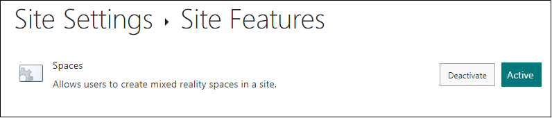

# Activate a site feature in SharePoint online

## Summary

This sample script shows how to Activate a site feature in SharePoint online site.

Scenario inspired from this blog post: [Activate a site feature in SharePoint Online using PnP PowerShell](https://ganeshsanapblogs.wordpress.com/2020/12/03/activate-a-site-feature-in-sharepoint-online-using-pnp-powershell/)



# [PnP PowerShell](#tab/pnpps)

```powershell

# SharePoint online site url
$siteUrl = Read-Host -Prompt "Enter your site url (e.g https://<tenant>.sharepoint.com/contoso)";

# Scope of feature: Web or Site
$scopes = @("Web", "Site")
Write-Host "Select the feature scope:"
for ($count = 1; $count -le $scopes.Count; $count++) {
    Write-Host "[$count] -" $scopes[$count - 1];
}

$featureScope = $scopes[(Read-Host -Prompt "Type (1/2)") - 1]

$siteFeatures = @(
    @{Name = "DocumentRoutingResources"; Id = "0c8a9a47-22a9-4798-82f1-00e62a96006e" },
    @{Name = "PublishingPrerequisites"; Id = "a392da98-270b-4e85-9769-04c0fde267aa" },
    @{Name = "HelpCollectionRemoveDefault"; Id = "232b3f94-9d6e-4ed6-8d55-04d5a44ac449" },
    @{Name = "PublishingSite"; Id = "f6924d36-2fa8-4f0b-b16d-06b7250180fa" },
    @{Name = "EnhancedTheming"; Id = "068bc832-4951-11dc-8314-0800200c9a66" },
    @{Name = "TenantSitesList"; Id = "3019c9b4-e371-438d-98f6-0a08c34d06eb" },
    @{Name = "Ratings"; Id = "915c240e-a6cc-49b8-8b2c-0bff8b553ed3" },
    @{Name = "Preservation"; Id = "bfc789aa-87ba-4d79-afc7-0c7e45dae01a" },
    @{Name = "WebPartAdderGroups"; Id = "2ed1c45e-a73b-4779-ae81-1524e4de467a" },
    @{Name = "SPListNextSiteOptOut"; Id = "e3540c7d-6bea-403c-a224-1a12eafee4c4" },
    @{Name = "PremiumSite"; Id = "8581a8a7-cf16-4770-ac54-260265ddb0b2" },
    @{Name = "GlobalHold"; Id = "2a6bf8e8-10b5-42f2-9d3e-267dfb0de8d4" },
    @{Name = "CTypes"; Id = "695b6570-a48b-4a8e-8ea5-26ea7fc1d162" },
    @{Name = "SocialSite"; Id = "4326e7fc-f35a-4b0f-927c-36264b0a4cf0" },
    @{Name = "MixedRealityResources"; Id = "f4c52091-703d-431c-ac2d-41f9f257052a" },
    @{Name = "Navigation"; Id = "89e0306d-453b-4ec5-8d68-42067cdbf98e" },
    @{Name = "PublishingMobile"; Id = "57cc6207-aebf-426e-9ece-45946ea82e4a" },
    @{Name = "ShareWithEveryone"; Id = "10f73b29-5779-46b3-85a8-4817a6e9a6c2" },
    @{Name = "ItemFormRecommendations"; Id = "39d18bbf-6e0f-4321-8f16-4e3b51212393" },
    @{Name = "FastEndUserHelpCollection"; Id = "6e8f2b8d-d765-4e69-84ea-5702574c11d6" },
    @{Name = "Fields"; Id = "ca7bd552-10b1-4563-85b9-5ed1d39c962a" },
    @{Name = "SearchDrivenContent"; Id = "592ccb4a-9304-49ab-aab1-66638198bb58" },
    @{Name = "VisioWebAccess"; Id = "9fec40ea-a949-407d-be09-6cba26470a0c" },
    @{Name = "MediaWebPart"; Id = "5b79b49a-2da6-4161-95bd-7375c1995ef9" },
    @{Name = "SearchTaxonomyRefinementWebPartsHtml"; Id = "8c34f59f-8dfb-4a39-9a08-7497237e3dc4" },
    @{Name = "BizAppsSiteTemplates"; Id = "4248e21f-a816-4c88-8cab-79d82201da7b" },
    @{Name = "ViewFormPagesLockDown"; Id = "7c637b23-06c4-472d-9a9a-7c175762c5c4" },
    @{Name = "EnterpriseWikiSecondPhase"; Id = "3f6680ba-94db-4c92-a5b6-7d5c66f467a7" },
    @{Name = "PortalLayouts"; Id = "5f3b0127-2f1d-4cfd-8dd2-85ad1fb00bfc" },
    @{Name = "SharePointHomeCache"; Id = "94280101-dc63-4b83-842a-8707b1afb62d" },
    @{Name = "IssueTrackingWorkflow"; Id = "fde5d850-671e-4143-950a-87b473922dc7" },
    @{Name = "ProjectBasedPolicy"; Id = "2fcd5f8a-26b7-4a6a-9755-918566dba90a" },
    @{Name = "PublishingLayouts"; Id = "d3f51be2-38a8-4e44-ba84-940d35be1566" },
    @{Name = "PublishingResources"; Id = "aebc918d-b20f-4a11-a1db-9ed84d79c87e" },
    @{Name = "spoguestintegration"; Id = "9836d446-3785-4579-8480-a27d5c965b19" },
    @{Name = "HtmlDesign"; Id = "a4c654e4-a8da-4db3-897c-a386048f7157" },
    @{Name = "Translation"; Id = "4e7276bc-e7ab-4951-9c4b-a74d44205c32" },
    @{Name = "ExcelServerWebPart"; Id = "4c42ab64-55af-4c7c-986a-ac216a6e0c0e" },
    @{Name = "SearchWebParts"; Id = "eaf6a128-0482-4f71-9a2f-b1c650680e77" },
    @{Name = "BizAppsCTypes"; Id = "43f41342-1a37-4372-8ca0-b44d881e4434" },
    @{Name = "LocationBasedPolicy"; Id = "063c26fa-3ccc-4180-8a84-b6f98e991df3" },
    @{Name = "RecordResources"; Id = "5bccb9a4-b903-4fd1-8620-b795fa33c9ba" },
    @{Name = "SearchTaxonomyRefinementWebParts"; Id = "67ae7d04-6731-42dd-abe1-ba2a5eaa3b48" },
    @{Name = "BasicWebParts"; Id = "00bfea71-1c5e-4a24-b310-ba51c3eb7a57" },
    @{Name = "EnterpriseWikiLayouts"; Id = "a942a218-fa43-4d11-9d85-c01e3e3a37cb" },
    @{Name = "IPFSSiteFeatures"; Id = "c88c4ff1-dbf5-4649-ad9f-c6c426ebcbf5" },
    @{Name = "OpenInClient"; Id = "8a4b8de2-6fd8-41e9-923c-c7c3c00f8295" },
    @{Name = "BizAppsFields"; Id = "5a979115-6b71-45a5-9881-cdc872051a69" },
    @{Name = "MossChart"; Id = "875d1044-c0cf-4244-8865-d2a0039c2a49" },
    @{Name = "LocalSiteDirectoryControl"; Id = "14aafd3a-fcb9-4bb7-9ad7-d8e36b663bbd" },
    @{Name = "ExcelServerSite"; Id = "3cb475e7-4e87-45eb-a1f3-db96ad7cf313" },
    @{Name = "AccSrvSolutionGallery"; Id = "744b5fd3-3b09-4da6-9bd1-de18315b045d" },
    @{Name = "AssetLibrary"; Id = "4bcccd62-dcaf-46dc-a7d4-e38277ef33f4" },
    @{Name = "SitePageResources"; Id = "ff77ac56-88d0-4147-b865-e84f5f03fc42" },
    @{Name = "TaxonomyFieldAdded"; Id = "73ef14b1-13a9-416b-a9b5-ececa2b0604c" },
    @{Name = "SearchExtensions"; Id = "5eac763d-fbf5-4d6f-a76b-eded7dd7b0a5" },
    @{Name = "SearchTemplatesandResources"; Id = "8b2c6bcb-c47f-4f17-8127-f8eae47a44dd" },
    @{Name = "Reporting"; Id = "7094bd89-2cfe-490a-8c7e-fbace37b4a34" }    
)

$webFeatures = @(
    @{Name = "WebPageLibrary"; Id = "00bfea71-c796-4402-9f2f-0eb9a6e71b18" },
    @{Name = "BizAppsListTemplates"; Id = "065c78be-5231-477e-a972-14177cc5b3c7" },
    @{Name = "IssuesList"; Id = "00bfea71-5932-4f9c-ad71-1557e5751100" },
    @{Name = "DocumentLibraryInstance"; Id = "b77b6484-364e-4356-8c72-1bb55b81c6b3" },
    @{Name = "RollupPages"; Id = "dffaae84-60ee-413a-9600-1cf431cf0560" },
    @{Name = "PublishingWeb"; Id = "94c94ca6-b32f-4da9-a9e3-1f3d343d7ecb" },
    @{Name = "PremiumWeb"; Id = "0806d127-06e6-447a-980e-2e90b03101b8" },
    @{Name = "WorkflowHistoryList"; Id = "00bfea71-4ea5-48d4-a4ad-305cf7030140" },
    @{Name = "ReportListTemplate"; Id = "2510d73f-7109-4ccc-8a1c-314894deeb3a" },
    @{Name = "MixedReality"; Id = "2ac9c540-6db4-4155-892c-3273957f1926" },
    @{Name = "PromotedLinksList"; Id = "192efa95-e50c-475e-87ab-361cede5dd7f" },
    @{Name = "NoCodeWorkflowLibrary"; Id = "00bfea71-f600-43f6-a895-40c0de7b0117" },
    @{Name = "DefaultSPGroupsSiteMaster"; Id = "d5a4ed08-27b9-4142-9804-45dec6fda126" },
    @{Name = "SurveysList"; Id = "00bfea71-eb8a-40b1-80c7-506be7590102" },
    @{Name = "RecommendedItems"; Id = "780ac353-eaf8-4ac2-8c47-536d93c03fd6" },
    @{Name = "GroupifyMenuButton"; Id = "5007df5b-1eea-49f8-9c02-5debc81ce3f2" },
    @{Name = "GridList"; Id = "00bfea71-3a1d-41d3-a0ee-651d11570120" },
    @{Name = "Publishing"; Id = "22a9ef51-737b-4ff2-9346-694633fe4416" },
    @{Name = "MaintenanceLogs"; Id = "8c6f9096-388d-4eed-96ff-698b3ec46fc4" },
    @{Name = "GanttTasksList"; Id = "00bfea71-513d-4ca0-96c2-6a47775c0119" },
    @{Name = "SiteNotebook"; Id = "f151bb39-7c3b-414f-bb36-6bf18872052f" },
    @{Name = "09cce83d-4d4e-42fb-a0e3-6ffdffbf0e61"; Id = "09cce83d-4d4e-42fb-a0e3-6ffdffbf0e61" },
    @{Name = "LinksList"; Id = "00bfea71-2062-426c-90bf-714c59600103" },
    @{Name = "TemplateExtensions"; Id = "de12eebe-9114-4a4a-b7da-7585dc36a907" },
    @{Name = "workflowProcessList"; Id = "00bfea71-2d77-4a75-9fca-76516689e21a" },
    @{Name = "TasksList"; Id = "00bfea71-a83e-497e-9ba0-7a5c597d0107" },
    @{Name = "SitePages"; Id = "b6917cb1-93a0-4b97-a84d-7cf49975d4ec" },
    @{Name = "TeamCollab"; Id = "00bfea71-4ea5-48d4-a4ad-7ea5c011abe5" },
    @{Name = "AccSvcAddAccessApp"; Id = "d2b9ec23-526b-42c5-87b6-852bd83e0364" },
    @{Name = "BaseWeb"; Id = "99fe402e-89a0-45aa-9163-85342e865dc8" },
    @{Name = "WorkflowTask"; Id = "57311b7a-9afd-4ff0-866e-9393ad6647b1" },
    @{Name = "HierarchyTasksList"; Id = "f9ce21f8-f437-4f7e-8bc6-946378c850f0" },
    @{Name = "TaskListNewsFeed"; Id = "ff13819a-a9ac-46fb-8163-9d53357ef98d" },
    @{Name = "AnnouncementsList"; Id = "00bfea71-d1ce-42de-9c63-a44004ce0104" },
    @{Name = "DefaultSPGroupsAsync"; Id = "e233eb34-e720-4ff9-9f53-a5aabc706d12" },
    @{Name = "MUIWeb"; Id = "9eabd738-48b1-4a40-a109-aa75458ed7ea" },
    @{Name = "PictureLibrary"; Id = "00bfea71-52d4-45b3-b544-b1c71b620109" },
    @{Name = "WorkflowServiceStore"; Id = "2c63df2b-ceab-42c6-aeff-b3968162d4b1" },
    @{Name = "ContactsList"; Id = "00bfea71-7e6d-4186-9ba8-c047ac750105" },
    @{Name = "CustomList"; Id = "00bfea71-de22-43b2-a848-c05709900100" },
    @{Name = "DocumentLibrary"; Id = "00bfea71-e717-4e80-aa17-d0c71b360101" },
    @{Name = "DiscussionsList"; Id = "00bfea71-6a49-43fa-b535-d15c05500108" },
    @{Name = "DataSourceLibrary"; Id = "00bfea71-f381-423d-b9d1-da7a54c50110" },
    @{Name = "DataConnectionLibrary"; Id = "00bfea71-dbd7-4f72-b8cb-da7ac0440130" },
    @{Name = "ExternalList"; Id = "00bfea71-9549-43f8-b978-e47e54a10600" },
    @{Name = "GroupHomepage"; Id = "e3dc7334-cec0-4d2c-8b90-e4857698fc4e" },
    @{Name = "EventsList"; Id = "00bfea71-ec85-4903-972d-ebe475780106" },
    @{Name = "XmlFormLibrary"; Id = "00bfea71-1e1d-4562-b56a-f05371bb0115" },
    @{Name = "IPFSWebFeatures"; Id = "a0e5a010-1329-49d4-9e09-f280cdbed37d" },
    @{Name = "Viewers"; Id = "fa6a1bcc-fb4b-446b-8460-f4de5f7411d5" }    
)

# SharePoint Feature ID: E.g. Spaces feature ID
$featureId = ""
Write-Host "Select the feature to activate:"
if ($featureScope -eq "Web") {
    for ($count = 1; $count -le $webFeatures.Count; $count++) {
        Write-Host "[$count] -" ($webFeatures[$count - 1].Name);
    }
    
    $featureId = $webFeatures[(Read-Host -Prompt "Feature to activate") - 1].Id
}
else {
    for ($count = 1; $count -le $siteFeatures.Count; $count++) {
        Write-Host "[$count] -" $siteFeatures[$count - 1].Name;
    }
    
    $featureId = $siteFeatures[(Read-Host -Prompt "Feature to activate") - 1].Id
}


# Connect to SharePoint Online site  
Connect-PnPOnline -Url $siteUrl -Interactive

# Get Feature from SharePoint site
$spacesFeature = Get-PnPFeature -Scope $featureScope -Identity $featureId

# Check if feature found or not
if($spacesFeature.DefinitionId -eq $null) {  
    Write-host "Activating Feature ($featureId)..." 
	
    # Activate the site feature eature
    Enable-PnPFeature -Scope $featureScope -Identity $FeatureId -Force
 
    Write-host -f Green "Feature ($featureId) has been activated Successfully!"
}
else {
    Write-host "Feature ($featureId) is already active on this site!"
}

```

[!INCLUDE [More about PnP PowerShell](../../docfx/includes/MORE-PNPPS.md)]

***

## Contributors

| Author(s) |
|-----------|
| [Ganesh Sanap](https://ganeshsanapblogs.wordpress.com/about) |
| Dan Toft |

[!INCLUDE [DISCLAIMER](../../docfx/includes/DISCLAIMER.md)]

