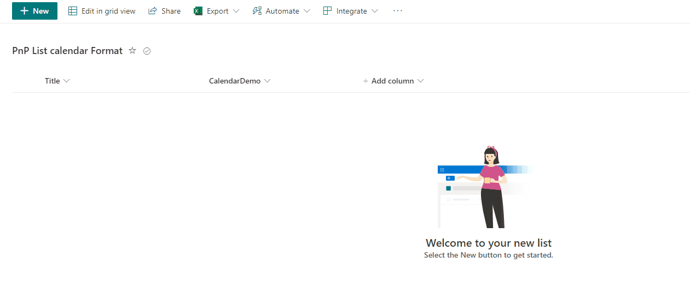
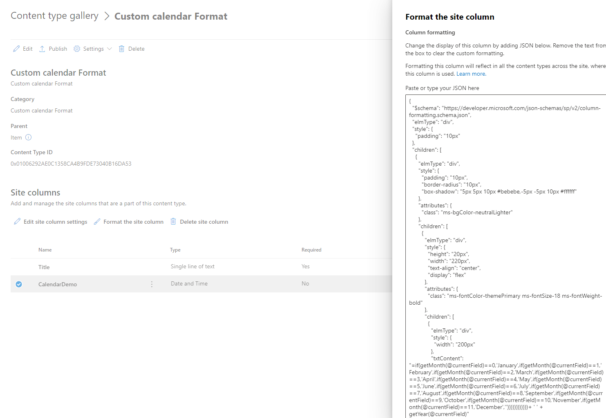
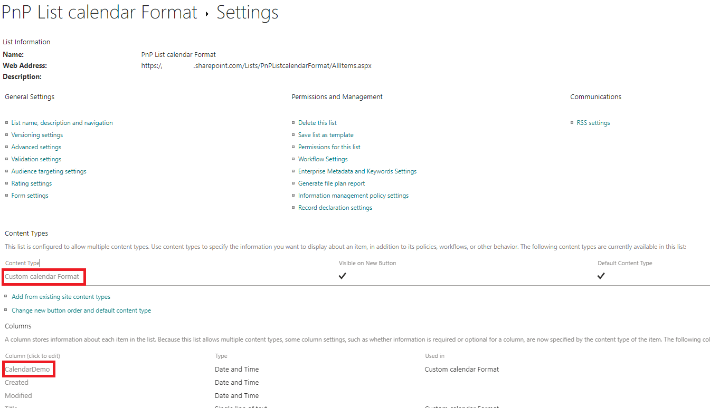

# Add Content Type Hub with calendar format field to List

## Summary

 This script will create Content Type Hub with custom calendar List field formatting and include in destination site and associated custom List. 
 - Retrieve custom calendar Formatting json from [https://github.com/pnp/List-Formatting/](https://github.com/pnp/List-Formatting/).
 - Creates custom content type in Hub site.
 - Adds new field "CalendarDemo" to new content type Hub.
 - Publish custom Content Type and add to destination site.
 - Create Custom Lists with enable content type.
 - Remove default Item Content and include custom Content Type from Hub.
 - Add fields "Title,CalendarDemo" in default View.

More about List Formatting github repository.
 [https://github.com/pnp/List-Formatting/](https://github.com/pnp/List-Formatting/)



# [PnP PowerShell](#tab/pnpps)

```powershell
[CmdletBinding()]
param(
  [Parameter( Mandatory=$false,HelpMessage="json format custom calendar field.")]
  [string]$FieldFormatUrl="https://raw.githubusercontent.com/pnp/List-Formatting/25e27c252be744fabe6ea312ccc526b4d676fbae/column-samples/generic-neumorphism/generic-neumorphism-calendar.json",
  [Parameter(Mandatory=$false,HelpMessage="Custom Content Type Name")]
  [String]$ContentTypeName="Custom calendar Format",
  [Parameter(Mandatory=$false,HelpMessage="List Name to create")]
  [String]$ListName="PnP List calendar Format",
  [Parameter(Mandatory=$true,HelpMessage="Destination Site Url")]
  [String]$DestinationSiteUrl="https://contoso.sharepoint.com"
)

    Begin
    {
        #Connect to destination SharePoint Site
        Connect-PnPOnline -Url $DestinationSiteUrl -Interactive
        
        #Get Content Type Hub Site associated to destination site   
        $HubUrl = Get-PnPContentTypePublishingHubUrl

        #Connect to destination SharePoint Site Hub        
        Connect-PnPOnline -Url $HubUrl -Interactive
    }
    Process
    {
        try
        {
            #https://github.com/pnp/List-Formatting/pull/559/files
            #Get Calendar json Formatting from Github List Repository
            $formattingCalendarDemo = Invoke-WebRequest -Uri $FieldFormatUrl

            #Content Type Name
            #Content Type Based on CT "Item"
            #Create new Content Type 
            $ContentTypeGroupName = $ContentTypeName
            $ParentContentType = Get-PnPContentType | Where-Object { $_.Name -eq "Item" }
            $CustomContentType = Add-PnPContentType -Name $ContentTypeGroupName -Description $ContentTypeGroupName -Group $ContentTypeGroupName -ParentContentType $ParentContentType

            #Create field "CalendarDemo"
            #Add list formatting "formattingCalendarDemo"
            $Customfield= Add-PnPField -Type DateTime -InternalName "CalendarDemo" -DisplayName "CalendarDemo" -Group "Custom Columns"
            $Field | Set-PnPField -Values @{CustomFormatter = $formattingCalendarDemo.Content; DefaultValue="[today]" } -Identity $Customfield.Id
            Add-PnPFieldToContentType -Field $Customfield.Id -ContentType $CustomContentType.Name

            #Publish Content Type in Hub and destination site
            Publish-PnPContentType -ContentType $CustomContentType.Id 
            Add-PnPContentTypesFromContentTypeHub -ContentTypes $CustomContentType.Id -Site $DestinationSiteUrl

            #Connect to DestinationSiteUrl
            Connect-PnPOnline -Url $DestinationSiteUrl -Interactive
            
            #Create List with EnableContentTypes
            New-PnPList -Title $ListName -Template GenericList -Url "lists/$($ListName.Replace(" ","""))" -EnableContentTypes  | Out-Null
            
            #Remove default Item Content Type
            #Add Content Type to List
            Remove-PnPContentTypeFromList -List $ListName -ContentType "Item"
            Add-PnPContentTypeToList -List $ListName -ContentType $ContentTypeName
        
            #Add fields to default View
            Set-PnPView -List $ListName -Identity (Get-PnPView -List $ListName).Id -Fields "Title","CalendarDemo" | Out-Null
        }
        catch{
            Write-Output "Something threw an exception or used Write-Error"
            Write-Output $_
        }
        finally{
            # Disconnect the context  
            Disconnect-PnPOnline  
        }
    }
    End
    {
        # Disconnect the context  
        Disconnect-PnPOnline  
        Write-Host "END" -BackgroundColor Red
    }

```

## Results running the script 
When accessing to Content Type Hub the following content should be available


When accessing to created custom List the new Content Type Hub should be available.



[!INCLUDE [More about PnP PowerShell](../../docfx/includes/MORE-PNPPS.md)]

***

## Contributors

| Author(s) |
|-----------|
| [André Lage](https://github.com/aaclage) |


[!INCLUDE [DISCLAIMER](../../docfx/includes/DISCLAIMER.md)]


