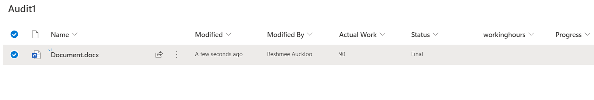

# Create and add list template to SharePoint site with content types,site columns and list views 

## Summary

  [Creating custom list templates](https://docs.microsoft.com/en-us/sharepoint/lists-custom-template) is now possible to create both custom document libraries and lists although official microsoft documentation has not specified anything about supporting custom document library templates. This script will create list template with associated site columns, site content types and views for a document library and also creates an instance of a document library.
 
More about list template 
 [https://docs.microsoft.com/en-us/sharepoint/lists-custom-template](https://docs.microsoft.com/en-us/sharepoint/lists-custom-template)



# [SPO Management Shell](#tab/spoms-ps)

```powershell
Import-Module Microsoft.Online.SharePoint.PowerShell
###### Declare and Initialize Variables ######  
#SharePoint Admin site
$adminSiteUrl = "https://<tenant>-admin.sharepoint.com"

#Destination site collection url
$url="https://<tenant>.sharepoint.com/sites/sitename"

# log file will be saved in same directory script was started from  
$currentTime= $(get-date).ToString("yyyyMMddHHmmss")  
$logFilePath=".\log-"+$currentTime+".log"  


## Start the Transcript  
Start-Transcript -Path $logFilePath 

## Connect to SharePoint Online site  
Connect-PnPOnline -Url $Url -Interactive

##connect-sposervice is needed to do cmdlets involving SPO
Connect-SPOService $adminSiteUrl 

#list template script
# - Create site columns 
# - Create site content type with created site columns

# the cmdlet Get-SPOSiteScriptFromList can be used to get schema of an existing list or library in json
# e.g $extracted = Get-SPOSiteScriptFromList  -ListUrl $listUrl

$list_script = '{
  "$schema": "https://developer.microsoft.com/json-schemas/sp/site-design-script-actions.schema.json",
  "actions": [
    {
      "verb": "createSiteColumnXml",
      "schemaXml": "<Field ID=\"{fc2e188e-ba91-48c9-9dd3-16431afddd50}\" Name=\"WorkAddress\" SourceID=\"http://schemas.microsoft.com/sharepoint/v3\" StaticName=\"WorkAddress\" Group=\"Core Contact and Calendar Columns\" DisplayName=\"Address\" Type=\"Note\" NumLines=\"2\" Sortable=\"FALSE\" Customization=\"\" Sealed=\"FALSE\" />",
      "pushChanges": true
    },
    {
      "verb": "createSiteColumnXml",
      "schemaXml": "<Field ID=\"{1dab9b48-2d1a-47b3-878c-8e84f0d211ba}\" Name=\"_Status\" Group=\"Core Document Columns\" Type=\"Choice\" DisplayName=\"Status\" SourceID=\"http://schemas.microsoft.com/sharepoint/v3/fields\" StaticName=\"_Status\" FillInChoice=\"TRUE\" Required=\"TRUE\" Hidden=\"FALSE\" Customization=\"\" ReadOnly=\"FALSE\" PITarget=\"\" PrimaryPITarget=\"\" PIAttribute=\"\" PrimaryPIAttribute=\"\" Aggregation=\"\" Node=\"\" Sealed=\"FALSE\"><CHOICES><CHOICE>Not Started</CHOICE><CHOICE>Draft</CHOICE><CHOICE>Reviewed</CHOICE><CHOICE>Scheduled</CHOICE><CHOICE>Published</CHOICE><CHOICE>Final</CHOICE><CHOICE>Expired</CHOICE></CHOICES><Default>Not Started</Default></Field>",
      "pushChanges": true
    },
    {
      "verb": "createSiteColumnXml",
      "schemaXml": "<Field Type=\"Number\" DisplayName=\"digits\" Required=\"TRUE\" EnforceUniqueValues=\"FALSE\" Indexed=\"FALSE\" Group=\"Custom Columns\" ID=\"{7075d07b-be6f-40b8-a6d3-3f340f2fc8e4}\" StaticName=\"digits\" Name=\"digits\" Hidden=\"FALSE\" Customization=\"\" ReadOnly=\"FALSE\" PITarget=\"\" PrimaryPITarget=\"\" PIAttribute=\"\" PrimaryPIAttribute=\"\" Aggregation=\"\" Node=\"\" />",
      "pushChanges": true
    },
    {
      "verb": "createSiteColumnXml",
      "schemaXml": "<Field Name=\"remarks\" FromBaseType=\"FALSE\" Type=\"Note\" DisplayName=\"remarks\" Required=\"TRUE\" EnforceUniqueValues=\"FALSE\" Indexed=\"FALSE\" NumLines=\"6\" RichText=\"TRUE\" RichTextMode=\"Compatible\" IsolateStyles=\"FALSE\" Sortable=\"FALSE\" Group=\"Custom Columns\" ID=\"{b975f483-0490-42cf-b417-db61f26c5e5d}\" StaticName=\"remarks\" CustomFormatter=\"\" RestrictedMode=\"TRUE\" AppendOnly=\"FALSE\" UnlimitedLengthInDocumentLibrary=\"FALSE\" Hidden=\"FALSE\" Customization=\"\" ReadOnly=\"FALSE\" PITarget=\"\" PrimaryPITarget=\"\" PIAttribute=\"\" PrimaryPIAttribute=\"\" Aggregation=\"\" Node=\"\" />",
      "pushChanges": true
    },
    {
      "verb": "createSiteColumnXml",
      "schemaXml": "<Field Type=\"Number\" DisplayName=\"workinghours\" Required=\"TRUE\" EnforceUniqueValues=\"FALSE\" Indexed=\"FALSE\" Group=\"Custom Columns\" ID=\"{ac62eb85-458b-419a-848c-202817fc10c7}\" StaticName=\"workinghours\" Name=\"workinghours\" Hidden=\"FALSE\" Customization=\"\" ReadOnly=\"FALSE\" PITarget=\"\" PrimaryPITarget=\"\" PIAttribute=\"\" PrimaryPIAttribute=\"\" Aggregation=\"\" Node=\"\" />",
      "pushChanges": true
    },
    {
      "verb": "createSiteColumnXml",
      "schemaXml": "<Field Type=\"Choice\" DisplayName=\"Progress\" Required=\"TRUE\" EnforceUniqueValues=\"FALSE\" Indexed=\"FALSE\" Format=\"Dropdown\" FillInChoice=\"FALSE\" Group=\"Custom Columns\" ID=\"{de9d568f-f172-48b1-af97-bd5601bde297}\" StaticName=\"Progress\" Name=\"Progress\" CustomFormatter=\"\" Hidden=\"FALSE\" Customization=\"\" ReadOnly=\"FALSE\" PITarget=\"\" PrimaryPITarget=\"\" PIAttribute=\"\" PrimaryPIAttribute=\"\" Aggregation=\"\" Node=\"\"><CHOICES><CHOICE>draft</CHOICE><CHOICE>review</CHOICE><CHOICE>complete</CHOICE><CHOICE>confirmed</CHOICE></CHOICES></Field>",
      "pushChanges": true
    },
    {
      "verb": "createContentType",
      "name": "Legal",
      "id": "0x01010010BDA71827FC714696179F9B00423E33",
      "description": "",
      "parentId": "0x0101",
      "hidden": false,
      "group": "EDRM",
      "subactions": [
        {
          "verb": "addSiteColumn",
          "internalName": "WorkAddress"
        },
        {
          "verb": "addSiteColumn",
          "internalName": "_Status"
        }
      ]
    },
    {
      "verb": "createContentType",
      "name": "test_210304",
      "id": "0x010100744FB7B7A02E8242BFB1ABC49CB1CD55",
      "description": "",
      "parentId": "0x0101",
      "hidden": false,
      "group": "Custom Content Types",
      "subactions": [
        {
          "verb": "addSiteColumn",
          "internalName": "digits"
        },
        {
          "verb": "addSiteColumn",
          "internalName": "remarks"
        },
        {
          "verb": "addSiteColumn",
          "internalName": "workinghours"
        },
        {
          "verb": "addSiteColumn",
          "internalName": "Progress"
        },
        {
          "verb": "addSiteColumn",
          "internalName": "_Status"
        }
      ]
    },
    {
      "verb": "createContentType",
      "name": "test_StatusComm",
      "id": "0x0101005B84CA678AB99C42BFE3447386B910C6",
      "description": "",
      "parentId": "0x0101",
      "hidden": false,
      "group": "Custom Content Types",
      "subactions": [
        {
          "verb": "addSiteColumn",
          "internalName": "_Status"
        }
      ]
    },
    {
      "verb": "createContentType",
      "name": "test_11",
      "id": "0x010100C9A9A0DB54AA6047920A4B13E90DC80B",
      "description": "",
      "parentId": "0x0101",
      "hidden": false,
      "group": "Custom Content Types",
      "subactions": [
        {
          "verb": "addSiteColumn",
          "internalName": "_Status"
        }
      ]
    },
    {
      "verb": "createSPList",
      "listName": "Audit1",
      "templateType": 101,
      "subactions": [
        {
          "verb": "addSPFieldXml",
          "schemaXml": "<Field ID=\"{b0b3407e-1c33-40ed-a37c-2430b7a5d081}\" Name=\"ActualWork\" StaticName=\"ActualWork\" SourceID=\"http://schemas.microsoft.com/sharepoint/v3\" DisplayName=\"Actual Work\" Group=\"Core Task and Issue Columns\" Type=\"Number\" Sealed=\"TRUE\" AllowDeletion=\"TRUE\" Required=\"FALSE\" Hidden=\"FALSE\" Customization=\"\" ReadOnly=\"FALSE\" PITarget=\"\" PrimaryPITarget=\"\" PIAttribute=\"\" PrimaryPIAttribute=\"\" Aggregation=\"\" Node=\"\" />"
        },
        {
          "verb": "addSPFieldXml",
          "schemaXml": "<Field ID=\"{7a282f86-69d9-40ff-ae1c-c746cf21256b}\" Name=\"Initials\" StaticName=\"Initials\" SourceID=\"http://schemas.microsoft.com/sharepoint/v3\" DisplayName=\"Initials\" Group=\"Core Contact and Calendar Columns\" Type=\"Text\" Sealed=\"TRUE\" AllowDeletion=\"TRUE\" Required=\"FALSE\" Hidden=\"FALSE\" Customization=\"\" ReadOnly=\"FALSE\" PITarget=\"\" PrimaryPITarget=\"\" PIAttribute=\"\" PrimaryPIAttribute=\"\" Aggregation=\"\" Node=\"\" />"
        },
        {
          "verb": "addSPFieldXml",
          "schemaXml": "<Field Name=\"remarks\" FromBaseType=\"FALSE\" Type=\"Note\" DisplayName=\"remarks\" Required=\"TRUE\" EnforceUniqueValues=\"FALSE\" Indexed=\"FALSE\" NumLines=\"6\" RichText=\"FALSE\" RichTextMode=\"Compatible\" IsolateStyles=\"FALSE\" Sortable=\"FALSE\" Group=\"Custom Columns\" ID=\"{b975f483-0490-42cf-b417-db61f26c5e5d}\" StaticName=\"remarks\" CustomFormatter=\"\" RestrictedMode=\"TRUE\" AppendOnly=\"FALSE\" UnlimitedLengthInDocumentLibrary=\"FALSE\" Hidden=\"FALSE\" Customization=\"\" ReadOnly=\"FALSE\" PITarget=\"\" PrimaryPITarget=\"\" PIAttribute=\"\" PrimaryPIAttribute=\"\" Aggregation=\"\" Node=\"\" />"
        },
        {
          "verb": "addSPFieldXml",
          "schemaXml": "<Field ID=\"{52578fc3-1f01-4f4d-b016-94ccbcf428cf}\" Name=\"_Comments\" SourceID=\"http://schemas.microsoft.com/sharepoint/v3\" StaticName=\"_Comments\" Group=\"Core Document Columns\" Type=\"Note\" DisplayName=\"Comments\" Sortable=\"FALSE\" Description=\"A summary of this resource\" Sealed=\"TRUE\" UnlimitedLengthInDocumentLibrary=\"TRUE\" AllowDeletion=\"TRUE\" ShowInFileDlg=\"FALSE\" DelayActivateTemplateBinding=\"GROUP,SPSPERS,SITEPAGEPUBLISHING\" />"
        },
        {
          "verb": "addContentType",
          "name": "Document",
          "id": "0x0101"
        },
        {
          "verb": "addContentType",
          "name": "Folder",
          "id": "0x0120"
        },
        {
          "verb": "addContentType",
          "name": "Legal",
          "id": "0x01010010BDA71827FC714696179F9B00423E33"
        },
        {
          "verb": "addContentType",
          "name": "test_210304",
          "id": "0x010100744FB7B7A02E8242BFB1ABC49CB1CD55"
        },
        {
          "verb": "addContentType",
          "name": "test_StatusComm",
          "id": "0x0101005B84CA678AB99C42BFE3447386B910C6"
        },
        {
          "verb": "addContentType",
          "name": "test_11",
          "id": "0x010100C9A9A0DB54AA6047920A4B13E90DC80B"
        },
        {
          "verb": "addSPView",
          "name": "All Documents",
          "viewFields": [
            "DocIcon",
            "LinkFilename",
            "Modified",
            "Editor"
          ],
          "query": "<OrderBy><FieldRef Name=\"FileLeafRef\" /></OrderBy>",
          "rowLimit": 30,
          "isPaged": true,
          "makeDefault": true,
          "replaceViewFields": true
        },
        {
          "verb": "addSPView",
          "name": "All Documents sorted",
          "viewFields": [
            "DocIcon",
            "LinkFilename",
            "Modified",
            "Editor",
            "ActualWork",
            "_Status",
            "workinghours",
            "Progress"
          ],
          "query": "<OrderBy><FieldRef Name=\"FileLeafRef\" /></OrderBy>",
          "rowLimit": 30,
          "isPaged": true,
          "replaceViewFields": true
        }
      ]
    }
  ]
}'

Add-SPOSiteScript -Title "Test Document Library" -Description "This creates a custom document library" -Content $extracted 
$siteScripts = Get-SPOSiteScript

$siteScriptObj = $siteScripts | Where-Object {$_.Title -eq "Test Document Library"} 

Add-SPOListDesign -Title "Test Document Library" -Description "Deploy document library with content types and views" -SiteScripts $siteScriptObj.Id-ListColor Pink -ListIcon BullseyeTarget

$listDesigns = Get-SPOListDesign
$listDesign = $listDesigns | Where-Object {$_.Title -eq "Test Document Library"} 

 #invoke list template to create an instance of the library
Invoke-SPOListDesign -Identity $listDesign.Id -WebUrl $siteUrl 

## Disconnect the context  
Disconnect-PnPOnline  
 
## Stop Transcript  
Stop-Transcript  

```


> [!Note]
> SharePoint tenant admin right are required to be able add list design

[!INCLUDE [More about SPO Management Shell](../../docfx/includes/MORE-SPOMS.md)]

***
## Source Credit

Inspired by [Invoke-SPOListDesign to create instances of lists/libraires](https://reshmeeauckloo.wordpress.com/2021/10/27/invoke-spolistdesign-to-create-instances-of-lists-libraires/)

## Contributors

| Author(s) |
|-----------|
| Reshmee Auckloo |


[!INCLUDE [DISCLAIMER](../../docfx/includes/DISCLAIMER.md)]


