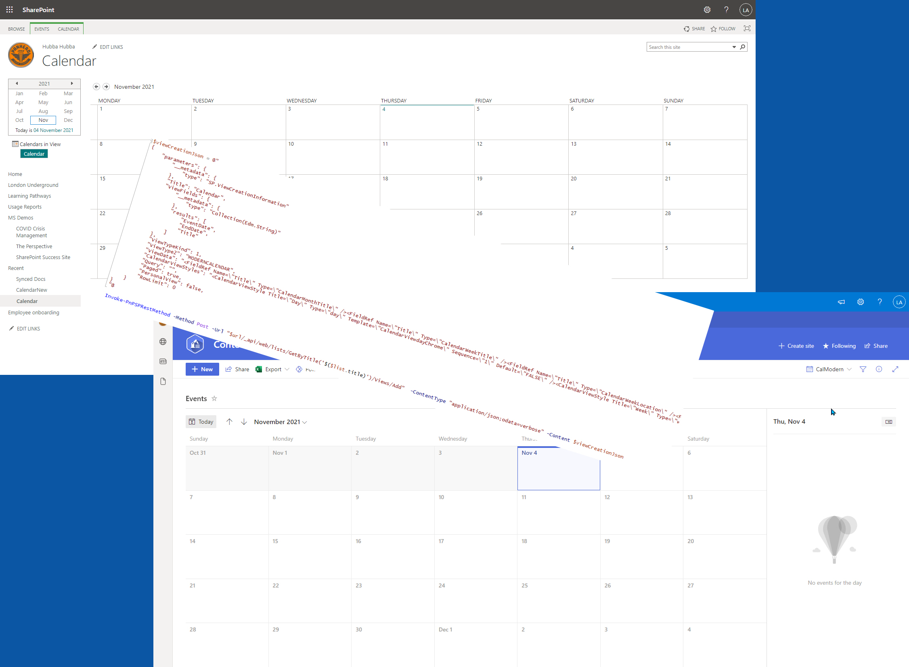

# Adding a new modern calendar view to a SharePoint list using PnP PowerShell

## Summary

Recently we have finally been able to add a modern calendar view to a list in SharePoint Online but only through the UI. Before this a calendar view was only available in SharePoint classic mode.



This script allow you to add a new modern calendar view to an existing SharePoint list. It uses the SharePoint REST API to add the view using the PnP cmdlet **Invoke-PnPSPRestMethod** as currently modern calendar view is not available using just **Add-PnPView**.

Key points to note regarding the JSON body:

* **RowLimit** is set to zero – this is to ensure all items for the current month/week/day are fetched correctly.
* **StartDate** (internal field name) is mapped to 0th entry in ViewFields
* **EndDate** (internal field name) is mapped to 1st entry in ViewFields
* **ViewData** has 5 FieldRef entries – 1 for month view and 2 each for week and day view. The fields are used as ‘Title’ for respective visualizations. If this is missing, you will see the popup to ‘fix’ calendar view.
* **CalendarViewStyles** has 3 CalendarViewStyle entry – will be used in future. Even if this is missing, View creation will succeed.
* **ViewType2** is MODERNCALENDAR
* **ViewTypeKind** is 1 – which maps to HTML.
* **Query** can be set if required.


# [PnP PowerShell](#tab/pnpps)

```powershell
###### Declare and Initialize Variables ######  

$url = 'https://<tenant>.sharepoint.com/sites/sitename'
$listname = "Calendar" #Change to the SharePoint list name to be used
$newViewTitle = "Modern Calendar View" #Change if you require a different View name


## Connect to SharePoint Online site  
Connect-PnPOnline -Url $url -Interactive

$viewCreationJson = @"
{
    "parameters": {
        "__metadata": {
            "type": "SP.ViewCreationInformation"
        },
        "Title": "$newViewTitle",
        "ViewFields": {
            "__metadata": {
                "type": "Collection(Edm.String)"
            },
            "results": [
                "EventDate",
                "EndDate",
                "Title"
            ]
        },
        "ViewTypeKind": 1,
        "ViewType2": "MODERNCALENDAR",
        "ViewData": "<FieldRef Name=\"Title\" Type=\"CalendarMonthTitle\" /><FieldRef Name=\"Title\" Type=\"CalendarWeekTitle\" /><FieldRef Name=\"Title\" Type=\"CalendarWeekLocation\" /><FieldRef Name=\"Title\" Type=\"CalendarDayTitle\" /><FieldRef Name=\"Title\" Type=\"CalendarDayLocation\" />",
        "CalendarViewStyles": "<CalendarViewStyle Title=\"Day\" Type=\"day\" Template=\"CalendarViewdayChrome\" Sequence=\"1\" Default=\"FALSE\" /><CalendarViewStyle Title=\"Week\" Type=\"week\" Template=\"CalendarViewweekChrome\" Sequence=\"2\" Default=\"FALSE\" /><CalendarViewStyle Title=\"Month\" Type=\"month\" Template=\"CalendarViewmonthChrome\" Sequence=\"3\" Default=\"TRUE\" />",
        "Query": "",
        "Paged": true,
        "PersonalView": false,
        "RowLimit": 0
    }
}
"@

Invoke-PnPSPRestMethod -Method Post -Url "$url/_api/web/lists/GetByTitle('$listname')/Views/Add" -ContentType "application/json;odata=verbose" -Content $viewCreationJson

#Optional Commands
Set-PnPList -Identity $listname -ListExperience NewExperience # Set list experience to force the list to display in Modern
Set-PnPView -List $listname -Identity $newViewTitle -Values @{DefaultView=$true;MobileView=$true;MobileDefaultView=$true} #Set newly created view To Be Default
```
[!INCLUDE [More about PnP PowerShell](../../docfx/includes/MORE-PNPPS.md)]
  
***

## Source Credit

* Sample first appeared on [Adding the New Modern Calendar View to a SharePoint List using PnP PowerShell - Leon Armston Blog](https://www.leonarmston.com/2021/11/adding-the-new-modern-calendar-view-to-a-sharepoint-list-using-pnp-powershell/)
* JSON body explanation [stackoverflow](https://stackoverflow.com/questions/67271425/create-modern-calendar-view-for-sharepoint-online-list-using-the-rest-api) - credit [@shagra-ms](https://github.com/shagra-ms)


## Contributors

| Author(s) |
|-----------|
| [Leon Armston](https://github.com/LeonArmston) |


[!INCLUDE [DISCLAIMER](../../docfx/includes/DISCLAIMER.md)]


