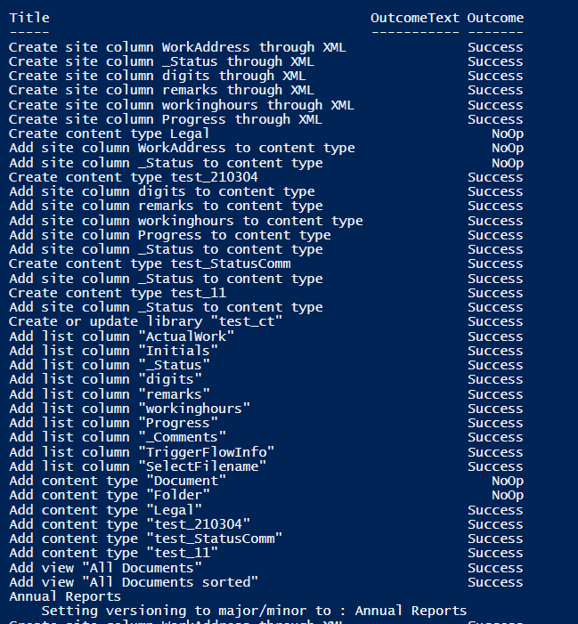

# Create multiple document libraries using custom list template

## Summary

  [Creating custom list templates](https://docs.microsoft.com/en-us/sharepoint/lists-custom-template) is now possible to create both custom document libraries and lists although official microsoft documentation has not specified anything about supporting custom document library templates. This script will create multiple instances of document library by applying custom list template. Please refer to [Create and add list template to SharePoint site with content types,site columns and list views](https://github.com/pnp/script-samples/blob/main/scripts/spo-add-list-template-with-custom-library/README.md/#L1) to add a custom list template. However there are some limitations with the list design to  set permissions, apply versionings, create indexed columns , etc.. The script calls the cmdlet Invoke-SPOListDesign iteratively and amends the document library url and display name before applying versioning settings and creating indexed columns.  
 
More about list template 
 [https://docs.microsoft.com/en-us/sharepoint/lists-custom-template](https://docs.microsoft.com/en-us/sharepoint/lists-custom-template)

# [PnP PowerShell](#tab/pnpps)

```powershell
[CmdletBinding()] 
    Param(
    [Parameter(Mandatory=$false,  Position=0)]
    [String]$adminSiteUrl = "https://<tenant>-admin.sharepoint.com",
    [Parameter(Mandatory=$false,  Position=1)]
    [String]$siteUrl =  "https://<tenant>.sharepoint.com/sites/investment",
    [Parameter(Mandatory=$false,  Position=2)]
    [String]$librariesCSV =  "C:\Scripts\DocumentLibraryTemplate\libraries.csv",

    [Parameter(Mandatory=$false,  Position=4)]
    [String]$listDesignId = "5b38e500-0fab-4da7-b011-ad7113228920" # use Get-SPOListDesign to find the Id of the list design containing the document library template
  )
#creating indexed columns might help with performance of large libraries, i.e. >5000 files
function Create-Index ($list, $targetFieldName)
{
  $targetField = Get-PnPField -List $list -Identity $targetFieldName
  $targetField.Indexed = 1;
  $targetField.Update();
  $list.Context.ExecuteQuery();
}

# log file will be saved in same directory script was started from  
$currentTime= $(get-date).ToString("yyyyMMddHHmmss")  
$logFilePath=".\log-"+$currentTime+".log"  


## Start the Transcript  
Start-Transcript -Path $logFilePath 

Connect-SPOService $adminSiteUrl 
Connect-PnPOnline -Url $siteUrl -Interactive
Import-Csv $librariesCSV | ForEach-Object {
Invoke-SPOListDesign -Identity $listDesignId -WebUrl $siteUrl
#Get library just created and update Internal name and display name, replace <listName> with the name specified in the custom list template
$lib = Get-PnPList -Identity "<listName>" -Includes RootFolder
#wait until document library has been created
while(!$lib)
{
 $lib = Get-PnPList -Identity "<listName>" -Includes RootFolder
 sleep -second 5
}
if($lib)
{
    $lib.Rootfolder.MoveTo($($_.InternalName))  
    Invoke-PnPQuery  
    #this will change library title  
    Set-PnPList -Identity $lib.Id -Title $($_.DisplayName)
    #add document library to quick launch
    Add-PnPNavigationNode -Title $_.DisplayName -Url $($_.InternalName + "/") -Location "QuickLaunch"
    #enable versioning on the library
    Set-PnPList -Identity $lib.Id -EnableVersioning $True -EnableMinorVersions $True -MajorVersions 500 -MinorVersions 10
    Write-host "`tSetting versioning to major/minor to :"$_.DisplayName
    Create-Index $lib "Created By"
    Create-Index $lib "Modified"
 }
}


## Disconnect the context  
Disconnect-PnPOnline  
 
## Stop Transcript  
Stop-Transcript  

```
# [CSV file sample](#tab/csv)
```csv
InternalName,DisplayName 
AR,Annual Reports 
CR,Credit Risk 
Audit,Audit 
PO,Purchase Orders 

```
## Results running the script 



[!INCLUDE [More about PnP PowerShell](../../docfx/includes/MORE-PNPPS.md)]

***
## Source Credit

Inspired by [Invoke-SPOListDesign to create instances of lists/libraires](https://reshmeeauckloo.wordpress.com/2021/10/27/invoke-spolistdesign-to-create-instances-of-lists-libraires/)

## Contributors

| Author(s) |
|-----------|
| Reshmee Auckloo |


[!INCLUDE [DISCLAIMER](../../docfx/includes/DISCLAIMER.md)]


