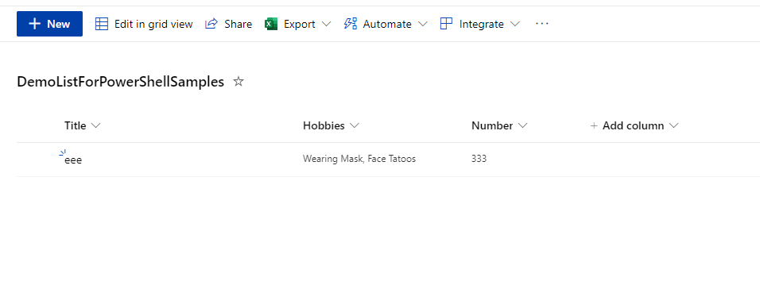

# Create and add site design to SharePoint site with site columns, content type. 

## Summary

This script will create site design with different column types. 
 - Sets regional settings
 - Creates custom content type 
 - Adds new fields to new content type
 - Creates new list with new content type
 - Changes list view to custom one

More about site design schema
 [https://docs.microsoft.com/en-us/sharepoint/dev/declarative-customization/site-design-json-schema](https://docs.microsoft.com/en-us/sharepoint/dev/declarative-customization/site-design-json-schema)



# [PnP PowerShell](#tab/pnpps)

```powershell

###### Declare and Initialize Variables ######  

#Destination site collection url
$url="https://<tenant>.sharepoint.com/sites/sitename"

# log file will be saved in same directory script was started from  
$currentTime= $(get-date).ToString("yyyyMMddHHmmss")  
$logFilePath=".\log-"+$currentTime+".log"  


## Start the Transcript  
Start-Transcript -Path $logFilePath 

## Connect to SharePoint Online site  
Connect-PnPOnline -Url $Url -Interactive


#Site design script
# - Set site regionalsettings (useful for formatting date type field)
# - Apply custom theme
# - Create site columns (text, number, person, choice)
# - Create site content type with created site columns

#site design version, can be static, for me it is easier check versions
$v = "1"

#content type Id
$ctId = "0x010100A45633E36EDA6040B00F4AE79CBF8F32"

$site_script = '{
    "$schema": "https://developer.microsoft.com/json-schemas/sp/site-design-script-actions.schema.json",
    "actions": [
         {
          "verb": "setRegionalSettings",
          "timeZone": 4, 
          "locale": 2057, 
          "sortOrder": 25, 
          "hourFormat": "24"
        },
        {
        "verb": "applyTheme",
        "themeJson": {
          "version": "2",
          "isInverted": false,
          "palette": {
            "themePrimary":"#0047ba",
            "themeLighterAlt":"#f2f6fc",
            "themeLighter":"#c3d4eb",
            "themeLight":"#7aabde",
            "themeTertiary":"#0091a5",
            "themeSecondary":"#c3d4eb",
            "themeDarkAlt":"#0040a8",
            "themeDark":"#00368d",
            "themeDarker":"#002868",
            "neutralLighterAlt":"#f8f8f8",
            "neutralLighter":"#f4f4f4",
            "neutralLight":"#eaeaea",
            "neutralQuaternaryAlt":"#dadada",
            "neutralQuaternary":"#d0d0d0",
            "neutralTertiaryAlt":"#c8c8c8",
            "neutralTertiary":"#595959",
            "neutralSecondary":"#373737",
            "neutralPrimaryAlt":"#2f2f2f",
            "neutralPrimary":"#000000",
            "neutralDark":"#151515",
            "black":"#0b0b0b",
            "white":"#ffffff",
            "primaryBackground":"#ffffff",
            "primaryText":"#000000",
            "bodyBackground":"#ffffff",
            "bodyText":"#000000",
            "disabledBackground":"#f4f4f4",
            "disabledText":"#c8c8c8"
           }
         }
        },
        {
          "verb": "createSiteColumnXml",
          "schemaXml": "<Field ID=\"{e1605fb4-611a-4eae-b119-77b4b633b436}\" Type=\"MultiChoice\" DisplayName=\"Hobbies\" Required=\"FALSE\" FillInChoice=\"FALSE\" StaticName=\"Hobbies\" Name=\"Hobbies\"><DefaultFormula>=\"\"</DefaultFormula><CHOICES><CHOICE>PingPong</CHOICE><CHOICE>Books</CHOICE><CHOICE>Sharing Is Carring</CHOICE><CHOICE>This is easter egg</CHOICE><CHOICE>Wearing Mask</CHOICE><CHOICE>Face Tatoos</CHOICE><CHOICE>Flying with no Cape</CHOICE></CHOICES></Field>"
        },
        {
          "verb": "createSiteColumn",
          "fieldType": "Text",
          "internalName": "SimpleTextField",
          "displayName": "SimpleTextField",
          "isRequired": false,
          "id": "60f37466-fd00-47a3-9665-44b48a743e27"
        },
        {
          "verb": "createSiteColumn",
          "fieldType": "User",
          "internalName": "siteColumn4User",
          "displayName": "Owner",
          "isRequired": false,
          "id": "181c4370-cdae-471b-9499-730046e55b75"
        },
        {
          "verb": "createSiteColumn",
          "fieldType": "Number",
          "internalName": "Number",
          "displayName": "Number",
          "isRequired": false,
          "id": "151c4370-cdae-471b-9499-730046e55b78"
        },
        {
          "verb": "createContentType",
          "name": "Powershel Samples",
          "description": "Create something with fields",
          "id":"'+$ctId+'",
          "hidden": false,
          "group": "Power Samples",
          "subactions":
            [
              {
                "verb": "addSiteColumn",
                "internalName": "Hobbies"
              },
              {
                "verb": "addSiteColumn",
                "internalName": "SimpleTextField"
              },
              {
                "verb": "addSiteColumn",
                "internalName": "siteColumn4User"
              },
              {
                "verb": "addSiteColumn",
                "internalName": "Number"
              }
            ]
        }
 ],
    "bindata": { },
    "version": "'+$v+'"
}'

#site script to create list and update it with columns by adding content type
 $site_script_CreateAndUpdateSiteList = '
 {
    "$schema": "https://developer.microsoft.com/json-schemas/sp/site-design-script-actions.schema.json",
    "actions": [
    {
                  "verb": "createSPList",
                  "listName": "DemoListForPowerShellSamples",
                  "templateType": 100,
                  "subactions": [
                  {
                      "verb": "addContentType",
                      "name": "Powershel Samples"
                    },
                    {
                        "verb": "addSPView",
                        "name": "Custom View",
                        "viewFields":
                        [
                          "Hobbies",
                          "Number"
                        ],
                        "query": "<OrderBy><FieldRef Title=\"FileLeafRef\" Ascending=\"TRUE\" /></OrderBy>",
                        "rowLimit": 100,
                        "isPaged": true,
                        "makeDefault": true
                    },
                    {
                        "verb": "removeContentType",
                        "name": "Item"
                    }
                  
                  ]
                  
    }
            
],
     "bindata": { },
    "version": "'+$v+'"
}'

 #add Script to SharePoint sharepoint tenant
 $addScript = Add-PnPSiteScript -Title "This is first script"  -Content $site_script  -Description "Sets regional settings and creates site columns and content type."
 $site_script_CreateAndUpdateSiteList = Add-PnPSiteScript  -Title "This is second script for list"  -Content $site_script_CreateAndUpdateSiteList  -Description "Create and Update list"

 #add site design to site collection with site script
 $siteDesign = Add-PnPSiteDesign  -Title "DevGods site design"  -WebTemplate "64"  -SiteScriptIds  $addScript.Id,  $site_script_CreateAndUpdateSiteList.Id -Description "Site design for the sample"

 #set design on site collection
 Set-PnPSiteDesign -Identity $siteDesign.Id -Title "DevGods site design"  -WebTemplate "64"  -SiteScriptIds  $addScript.Id,  $site_script_CreateAndUpdateSiteList.Id -Description "Site design for the sample"

 #invoke site design
 Invoke-PnPSiteDesign -Identity $siteDesign.Id -WebUrl $url


## Disconnect the context  
Disconnect-PnPOnline  
 
## Stop Transcript  
Stop-Transcript  

```

> [!Note]
> SharePoint tenant admin right are required to be able add site design

[!INCLUDE [More about PnP PowerShell](../../docfx/includes/MORE-PNPPS.md)]

# [CLI for Microsoft 365](#tab/cli-m365-ps)
```powershell
###### Declare and Initialize Variables ######  

#Destination site collection url
$url="https://<tenant>.sharepoint.com/sites/siteurl"

Write-host 'setup script example'

Write-host 'ensure logged in'
$m365Status = m365 status
if ($m365Status -match "Logged Out") {
  m365 login --authType browser
}


## Connect to SharePoint Online site  
$site = m365 spo site get --url $url 
$site = $site | ConvertFrom-Json


#Site design script
# - Set site regionalsettings (useful for formatting date type field)
# - Apply custom theme
# - Create site columns (text, number, person, choice)
# - Create site content type with created site columns


 #add Script to SharePoint sharepoint tenant 
 $addScript = m365 spo sitescript add --title "This is first script CLI 1" --description "some description " --content "@firstscript.json"
 $addScript =  $addScript | ConvertFrom-Json

 $site_script_CreateAndUpdateSiteList = m365 spo sitescript add --title "This is second script for list CLI 2" --description "Create and Update list CLI2" --content "@secondscript.json"
 $site_script_CreateAndUpdateSiteList = $site_script_CreateAndUpdateSiteList | ConvertFrom-Json
 
 #add site design to site collection with site script
 $siteDesign = m365 spo sitedesign add --title "DevGods site design CLI" --webTemplate "TeamSite" --siteScripts "$($addScript.Id),$($site_script_CreateAndUpdateSiteList.Id)"
 $siteDesign =$siteDesign | ConvertFrom-Json
 
 
 #set design on site collection
 m365 spo sitedesign set --id $siteDesign.Id --title "DevGods site design from cli" --version 2
 
 #invoke site design
 m365 spo sitedesign apply --id $siteDesign.Id --webUrl  $url
 
 m365 logout

```
[!INCLUDE [More about CLI for Microsoft 365](../../docfx/includes/MORE-CLIM365.md)]


> [!Note]
> PowerShell cant correctly pass json of design script if it is added directly in the code. 
> To make this work save json files in same directory you are running script, in the code above files names "firstscript.json" and "secondscript.json"


# [JSON Site Script](#tab/json1)

```
{
    "$schema": "https://developer.microsoft.com/json-schemas/sp/site-design-script-actions.schema.json",
    "actions": [
         {
          "verb": "setRegionalSettings",
          "timeZone": 4, 
          "locale": 2057, 
          "sortOrder": 25, 
          "hourFormat": "24"
        },
        {
        "verb": "applyTheme",
        "themeJson": {
          "version": "2",
          "isInverted": false,
          "palette": {
            "themePrimary":"#0047ba",
            "themeLighterAlt":"#f2f6fc",
            "themeLighter":"#c3d4eb",
            "themeLight":"#7aabde",
            "themeTertiary":"#0091a5",
            "themeSecondary":"#c3d4eb",
            "themeDarkAlt":"#0040a8",
            "themeDark":"#00368d",
            "themeDarker":"#002868",
            "neutralLighterAlt":"#f8f8f8",
            "neutralLighter":"#f4f4f4",
            "neutralLight":"#eaeaea",
            "neutralQuaternaryAlt":"#dadada",
            "neutralQuaternary":"#d0d0d0",
            "neutralTertiaryAlt":"#c8c8c8",
            "neutralTertiary":"#595959",
            "neutralSecondary":"#373737",
            "neutralPrimaryAlt":"#2f2f2f",
            "neutralPrimary":"#000000",
            "neutralDark":"#151515",
            "black":"#0b0b0b",
            "white":"#ffffff",
            "primaryBackground":"#ffffff",
            "primaryText":"#000000",
            "bodyBackground":"#ffffff",
            "bodyText":"#000000",
            "disabledBackground":"#f4f4f4",
            "disabledText":"#c8c8c8"
           }
         }
        },
        {
          "verb": "createSiteColumnXml",
          "schemaXml": "<Field ID=\"{e1605fb4-611a-4eae-b119-77b4b633b436}\" Type=\"MultiChoice\" DisplayName=\"Hobbies\" Required=\"FALSE\" FillInChoice=\"FALSE\" StaticName=\"Hobbies\" Name=\"Hobbies\"><DefaultFormula>=\"\"</DefaultFormula><CHOICES><CHOICE>PingPong</CHOICE><CHOICE>Books</CHOICE><CHOICE>Sharing Is Carring</CHOICE><CHOICE>This is easter egg</CHOICE><CHOICE>Wearing Mask</CHOICE><CHOICE>Face Tatoos</CHOICE><CHOICE>Flying with no Cape</CHOICE></CHOICES></Field>"
        },
        {
          "verb": "createSiteColumn",
          "fieldType": "Text",
          "internalName": "SimpleTextField",
          "displayName": "SimpleTextField",
          "isRequired": false,
          "id": "60f37466-fd00-47a3-9665-44b48a743e27"
        },
        {
          "verb": "createSiteColumn",
          "fieldType": "User",
          "internalName": "siteColumn4User",
          "displayName": "Owner",
          "isRequired": false,
          "id": "181c4370-cdae-471b-9499-730046e55b75"
        },
        {
          "verb": "createSiteColumn",
          "fieldType": "Number",
          "internalName": "Number",
          "displayName": "Number",
          "isRequired": false,
          "id": "151c4370-cdae-471b-9499-730046e55b78"
        },
        {
          "verb": "createContentType",
          "name": "Powershel Samples",
          "description": "Create something with fields",
          "id":"'+$ctId+'",
          "hidden": false,
          "group": "Power Samples",
          "subactions":
            [
              {
                "verb": "addSiteColumn",
                "internalName": "Hobbies"
              },
              {
                "verb": "addSiteColumn",
                "internalName": "SimpleTextField"
              },
              {
                "verb": "addSiteColumn",
                "internalName": "siteColumn4User"
              },
              {
                "verb": "addSiteColumn",
                "internalName": "Number"
              }
            ]
        }
 ],
    "bindata": { },
    "version": "1"
}
```

# [JSON Site Script 2](#tab/json2)
```
{
    "$schema": "https://developer.microsoft.com/json-schemas/sp/site-design-script-actions.schema.json",
    "actions": [
    {
                  "verb": "createSPList",
                  "listName": "DemoListForPowerShellSamples",
                  "templateType": 100,
                  "subactions": [
                  {
                      "verb": "addContentType",
                      "name": "Powershel Samples"
                    },
                    {
                        "verb": "addSPView",
                        "name": "Custom View",
                        "viewFields":
                        [
                          "Hobbies",
                          "Number"
                        ],
                        "query": "<OrderBy><FieldRef Title=\"FileLeafRef\" Ascending=\"TRUE\" /></OrderBy>",
                        "rowLimit": 100,
                        "isPaged": true,
                        "makeDefault": true
                    },
                    {
                        "verb": "removeContentType",
                        "name": "Item"
                    }
                  
                  ]
                  
    }
            
],
     "bindata": { },
    "version": "1"
}
```
[!INCLUDE [More about PnP PowerShell](../../docfx/includes/MORE-PNPPS.md)]

***

## Contributors

| Author(s) |
|-----------|
| Valeras Narbutas |


[!INCLUDE [DISCLAIMER](../../docfx/includes/DISCLAIMER.md)]

