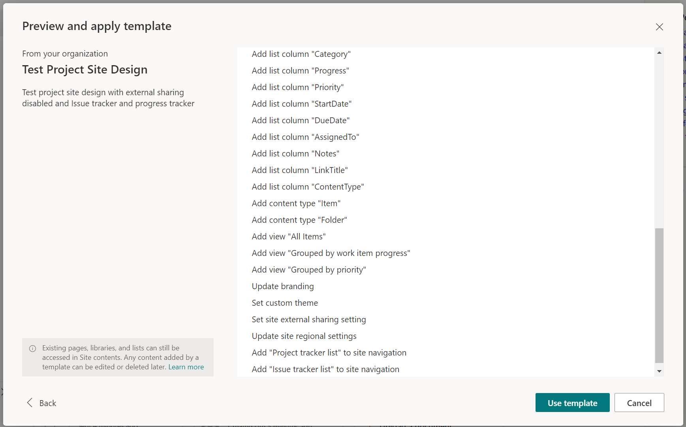

# Create and add list template to SharePoint site with content types,site columns and list views 

## Summary

  [Creating site designs](https://learn.microsoft.com/en-us/sharepoint/dev/declarative-customization/site-design-overview) provides an option to easily provision sites consistently.
 
More about site design 
 [https://learn.microsoft.com/en-us/sharepoint/dev/declarative-customization/site-design-overview](https://learn.microsoft.com/en-us/sharepoint/dev/declarative-customization/site-design-overview)

  

# [PnP PowerShell](#tab/pnpps)

```powershell
$adminSiteUrl = "https://tenant-admin.sharepoint.com/"
$siteUrl = "https://tenant.sharepoint.com/sites/Project"
#path where to store the site script
$siteScriptFile = "C:\temp\ProjectSite1.json";
$relativeListUrls = "/Lists/Issue tracker list", "/Lists/Progress tracker list";
$siteScriptTitle = "Test Project Site Common Script"
$siteDesignTitle = "Test Project Site Design"
$webTemplate = "64" #64 = Team Site, 68 = Communication Site, 1 = Groupless Team Site
$siteDesignDescription = "Test project site design with external sharing disabled and Issue tracker and progress tracker"
$previewImageUrl =  "https://tenant.sharepoint.com/sites/Project/Assets/siteicon.png"

Connect-PnPOnline -url $siteUrl -interactive
#Team Site, only once and modify to include options to remove links and other actions
$extracted = Get-PnPSiteScriptFromWeb –Url $siteUrl -Lists $relativeListUrls -IncludeRegionalSettings -IncludeSiteExternalSharingCapability -IncludeTheme -IncludeLinksToExportedItems -IncludeBranding
$extracted | Out-File $siteScriptFile

$siteScript =  Add-PnPSiteScript -Title $siteScriptTitle -Content (Get-Content $siteScriptFile -Raw)

$siteDesign = Add-PnPSiteDesign -SiteScriptIds $siteScript.Id -Title $siteDesignTitle -WebTemplate $webTemplate -Description $siteDesignDescription -PreviewImageUrl $previewImageUrl 

Grant-PnPSiteDesignRights -Identity $siteDesign -Principals "testuser1@tenant.onmicrosoft.com"

```


> [!Note]
> SharePoint tenant admin right are required to be able add site design

[!INCLUDE [More about PnP PowerShell](../../docfx/includes/MORE-PNPPS.md)]

***

## Contributors

| Author(s) |
|-----------|
| Reshmee Auckloo |


[!INCLUDE [DISCLAIMER](../../docfx/includes/DISCLAIMER.md)]


