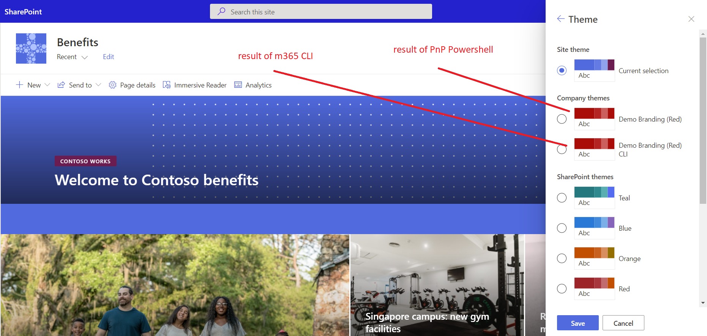

# Add a tenant theme to SharePoint Online

## Summary

This example adds a tenant theme to the SharePoint.
When working with themes, it is recommended to use the Theme Designer to get started and check for accessibility.

> [!Note]
> For reference the themes can be generated at: https://aka.ms/themedesigner





# [PnP PowerShell](#tab/pnpps)

```powershell

$url = "https://contoso-admin.sharepoint.com"
$themeName = "Demo Branding (Red) PnP"

# -------------------------------------------------------------
# Theme Palette  
# -------------------------------------------------------------

$themePalette = @{
    "themePrimary" = "#b21212";
    "themeLighterAlt" = "#fcf3f3";
    "themeLighter" = "#f3d0d0";
    "themeLight" = "#e8a9a9";
    "themeTertiary" = "#d16060";
    "themeSecondary" = "#bc2727";
    "themeDarkAlt" = "#a11010";
    "themeDark" = "#880e0e";
    "themeDarker" = "#640a0a";
    "neutralLighterAlt" = "#f8f8f8";
    "neutralLighter" = "#f4f4f4";
    "neutralLight" = "#eaeaea";
    "neutralQuaternaryAlt" = "#dadada";
    "neutralQuaternary" = "#d0d0d0";
    "neutralTertiaryAlt" = "#c8c8c8";
    "neutralTertiary" = "#c2c2c2";
    "neutralSecondary" = "#858585";
    "neutralPrimaryAlt" = "#4b4b4b";
    "neutralPrimary" = "#333333";
    "neutralDark" = "#272727";
    "black" = "#1d1d1d";
    "white" = "#ffffff";
    "bodyBackground" = "#ffffff";
    "bodyText" = "#333333";
}

# -------------------------------------------------------------
# Connection  
# -------------------------------------------------------------

Write-Host "Connecting to " $url
Connect-PnPOnline -Url $url -Interactive

# -------------------------------------------------------------
# Apply Theme  
# -------------------------------------------------------------

Add-PnPTenantTheme -Identity $themeName -Palette $themePalette -IsInverted $false -Overwrite

Write-Host "Done! :)" -ForegroundColor Green

```
[!INCLUDE [More about PnP PowerShell](../../docfx/includes/MORE-PNPPS.md)]

# [CLI for Microsoft 365 with PowerShell](#tab/cli-m365-ps)
```powershell

$themeName = "Demo Branding (Red) CLI"

# -------------------------------------------------------------
# Theme Palette  
# -------------------------------------------------------------

$themePalette = '{
    \"themePrimary\": \"#b21212\",
    \"themeLighterAlt\": \"#fcf3f3\",
    \"themeLighter\": \"#f3d0d0\",
    \"themeLight\": \"#e8a9a9\",
    \"themeTertiary\": \"#d16060\",
    \"themeSecondary\": \"#bc2727\",
    \"themeDarkAlt\": \"#a11010\",
    \"themeDark\": \"#880e0e\",
    \"themeDarker\": \"#640a0a\",
    \"neutralLighterAlt\": \"#f8f8f8\",
    \"neutralLighter\": \"#f4f4f4\",
    \"neutralLight\": \"#eaeaea\",
    \"neutralQuaternaryAlt\": \"#dadada\",
    \"neutralQuaternary\": \"#d0d0d0\",
    \"neutralTertiaryAlt\": \"#c8c8c8\",
    \"neutralTertiary\": \"#c2c2c2\",
    \"neutralSecondary\": \"#858585\",
    \"neutralPrimaryAlt\": \"#4b4b4b\",
    \"neutralPrimary\": \"#333333\",
    \"neutralDark\": \"#272727\",
    \"black\": \"#1d1d1d\",
    \"white\": \"#ffffff\",
    \"bodyBackground\": \"#ffffff\",
    \"bodyText\": \"#333333\"
}'


# -------------------------------------------------------------
# Connection  
# -------------------------------------------------------------

$m365Status = m365 status
if ($m365Status -match "Logged Out") {
    m365 login
}

# -------------------------------------------------------------
# Apply Theme  
# -------------------------------------------------------------

m365 spo theme set --name $themeName --theme $themePalette

Write-Host "Done! :)" -ForegroundColor Green


```
[!INCLUDE [More about CLI for Microsoft 365](../../docfx/includes/MORE-CLIM365.md)]

# [SPO Management Shell](#tab/spoms-ps)

```powershell

$adminSiteURL = "https://domain-admin.sharepoint.com/"
$userName = "chandani@domain.onmicrosoft.com"
$password = "********"
$secureStringPwd = $password | ConvertTo-SecureString -AsPlainText -Force 
$creds = New-Object System.Management.Automation.PSCredential -ArgumentList $userName, $secureStringPwd
$themePalette = @{
    "themePrimary"         = "#b21212";
    "themeLighterAlt"      = "#fcf3f3";
    "themeLighter"         = "#f3d0d0";
    "themeLight"           = "#e8a9a9";
    "themeTertiary"        = "#d16060";
    "themeSecondary"       = "#bc2727";
    "themeDarkAlt"         = "#a11010";
    "themeDark"            = "#880e0e";
    "themeDarker"          = "#640a0a";
    "neutralLighterAlt"    = "#f8f8f8";
    "neutralLighter"       = "#f4f4f4";
    "neutralLight"         = "#eaeaea";
    "neutralQuaternaryAlt" = "#dadada";
    "neutralQuaternary"    = "#d0d0d0";
    "neutralTertiaryAlt"   = "#c8c8c8";
    "neutralTertiary"      = "#c2c2c2";
    "neutralSecondary"     = "#858585";
    "neutralPrimaryAlt"    = "#4b4b4b";
    "neutralPrimary"       = "#333333";
    "neutralDark"          = "#272727";
    "black"                = "#1d1d1d";
    "white"                = "#ffffff";
    "bodyBackground"       = "#ffffff";
    "bodyText"             = "#333333";
}
$themeName = "Demo Branding (Red) SPO"

Function Login() {
    [cmdletbinding()]
    param([parameter(Mandatory = $true, ValueFromPipeline = $true)] $creds)
    Write-Host "Connecting to Tenant Admin Site '$($adminSiteURL)'" -f Yellow   
    Connect-SPOService -Url $adminSiteURL -Credential $creds
    Write-Host "Connecting successfully!..." -f Green 
}

Function ApplyTheme {
    try {
        Write-Host "Applying theme..."  -ForegroundColor Yellow
        Add-SPOTheme -Identity $themeName -Palette $themePalette -IsInverted $false -Overwrite
        Write-Host "Done! :)"  -ForegroundColor Green	 						
    } 
    catch {
        Write-Host "Getting error in applying theme:" $_.Exception.Message -ForegroundColor Red                 
    } 
}	 
     
Function StartProcessing {
    Login($creds); 
    ApplyTheme         
}

StartProcessing

```
[!INCLUDE [More about SPO Management Shell](../../docfx/includes/MORE-SPOMS.md)]
***

## Contributors

| Author(s) |
|-----------|
| Paul Bullock |
| [Adam Wójcik](https://github.com/Adam-it)|
| Chandani Prajapati |

[!INCLUDE [DISCLAIMER](../../docfx/includes/DISCLAIMER.md)]

