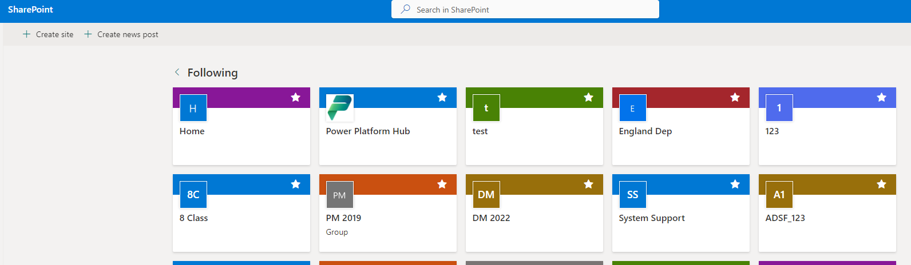
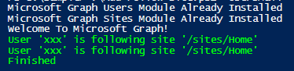

# Add users to follow SharePoint Sites

## Summary

This script helps M365 admin to provision follow SharePoint Online sites to users and display in Out of the box SharePoint Site  https://[ domain]/_layouts/15/sharepoint.aspx?v=following. 
When users are created and they access the first time to Out of Box SharePoint sites, by default no sites appear since there are no following sites, this provision script will help and provide initial list of sites to access.




## Implementation

- Save script to support file "Add-FollowUserSite.ps1.ps1"
- Open Windows PowerShell
- Change console path where file is saved
- Include following parameters **"UsersMail"** (List of Users Mails), **"SitesUrl"** (List of SharePoint Url to follow)
- Press enter to execute line command
- Accept Microspft Graph permission request 



# [Microsoft Graph PowerShell](#tab/graphps)

```powershell
# Example: .\Add-FollowUserSite.ps1 -UsersMail "user1@[domain].com","user2@[domain].com","user3@[domain].com" -SitesUrl "https://[domain].sharepoint.com"

[CmdletBinding()]
param(
[Parameter(Mandatory=$true,HelpMessage="List of Users Mails")]
  [String[]]$UsersMail=@("user1@[domain].com","user2@[domain].com","user3@[domain].com"),
  [Parameter(Mandatory=$true,HelpMessage="List of SharePoint Url to follow")]
  [String[]]$SitesUrl=@("https://[domain].sharepoint.com")
)

Begin{

    # Validate Modules ffor Microsoft graph users exist
    if (Get-Module -ListAvailable -Name microsoft.graph.users) {
        Write-Host "Microsoft Graph Users Module Already Installed"
    } 
    else {
        try {
            Install-Module -Name microsoft.graph.users -Scope CurrentUser -Repository PSGallery -Force -AllowClobber 
        }
        catch [Exception] {
            $_.message 
        }
    }
    # Validate Modules ffor Microsoft graph users exist
    if (Get-Module -ListAvailable -Name microsoft.graph.sites) {
        Write-Host "Microsoft Graph Sites Module Already Installed"
    } 
    else {
        try {
            Install-Module -Name microsoft.graph.sites -Scope CurrentUser -Repository PSGallery -Force -AllowClobber 
        }
        catch [Exception] {
            $_.message 
        }
    }

    # Import Modules Microsoft.Graph.users and Microsoft.Graph.sites to be used
    Import-Module Microsoft.Graph.users
    Import-Module Microsoft.Graph.sites

    Write-Host "Connecting to Tenant" -f Yellow
    Connect-MgGraph -Scopes "Sites.ReadWrite.All", "User.Read.All"

    Write-Host "Connection Successful!" -f Green
}
Process{
    $count = 0

    $UsersMail | foreach {

        #Get user Graph properties
        $mail = $_

        $user = Get-MgUser -ConsistencyLevel eventual -Count 1 -Search ([string]::Format('"Mail:{0}"',$mail))
        $SitesUrl | foreach {

            #Get Site Graph properties
            $domain = ([System.Uri]$_).Host
            $AbsolutePath = ([System.Uri]$_).AbsolutePath
            $uriSite = [string]::Format('https://graph.microsoft.com/v1.0/sites/{0}:{1}',$domain,$AbsolutePath)
            $site = Invoke-MgGraphRequest -Method GET $uriSite

#Create Body for Post request
$body = @'
    {
        "value": [
            {
                "id": "{$SiteID}"
            }
        ]
    }
'@.Replace('{$SiteID}',$site.id)
            
            #Graph call that include user to follow site
            $uriFollow = [string]::Format('https://graph.microsoft.com/v1.0/users/{0}/followedSites/add',$user.Id)
           
            #Include follow option from user to SharePoint Site
            try{
                $response = Invoke-MgGraphRequest -Method POST $uriFollow -Body $body -ContentType "application/json"
                Write-Host "User '$($user.DisplayName)' is following site '$($AbsolutePath)'" -f Green
            }
            catch {
                Write-Error $_.Exception
            } 
            
        }
        
        $count += 1 
        #progress bar
        Write-Progress -Activity 'Add users to follow site(s)' -Status "Adding user '$($user.DisplayName)' to follow sites... ($($count)/$($UsersMail.Count))" -PercentComplete (($count / $UsersMail.Count) * 100)
    }
}
End {
    Disconnect-MgGraph
    Write-Host "Finished" -ForegroundColor Green
}
       
```
[!INCLUDE [More about Microsoft Graph PowerShell SDK](../../docfx/includes/MORE-GRAPHSDK.md)]
***


## Contributors

| Author(s)                                            |
|------------------------------------------------------|
| [Andre Lage](https://github.com/aaclage) |


[!INCLUDE [DISCLAIMER](../../docfx/includes/DISCLAIMER.md)]
