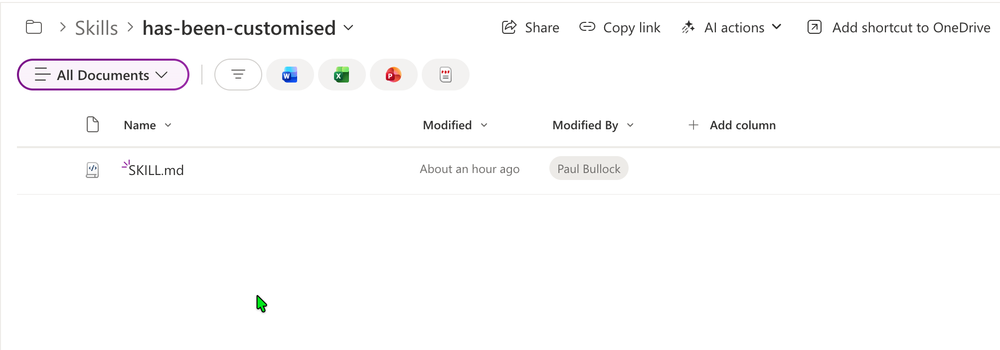

# Upload SharePoint AI Skills to Agent Assets

## Summary

This sample uploads a local `SKILL.md` file into the SharePoint `AgentAssets/Skills/<folder>` location for a site where Agent Assets are enabled. It checks the site feature, validates that the Agent Assets library exists, resolves the target folder, and uploads the skill file.



## Implementation

- Open PowerShell 7+ and install/connect PnP PowerShell.
- Save your skills markdown file locally (default expected name is `SKILL.md`).
- Update parameters for your target site and folder.
- Run the script from the same folder as your skill file.

> Note: The skill itself is largely untested, just an illustration of where to upload the skill to SharePoint.

# [PnP PowerShell](#tab/pnpps)

```powershell

<# 
----------------------------------------------------------------------------

Created:      Paul Bullock
Date:         04/05/2026

.Example

	./Set-SiteAISkills.ps1 -SiteUrl "https://<tenant>.sharepoint.com/sites/Site1" -ClientId "<application-client-id-for-pnp-powershell>" -SkillFolderName "has-been-customised" -SkillFileName "SKILL.md"

.Notes

	https://pnp.github.io/powershell/cmdlets/Get-PnPFeature.html
	https://pnp.github.io/powershell/cmdlets/Resolve-PnPFolder.html
	https://pnp.github.io/powershell/cmdlets/Add-PnPFile.html

 ----------------------------------------------------------------------------
#>

[CmdletBinding()]
param (
	$SiteUrl = "https://<tenant>.sharepoint.com/sites/Site1", #SharePointAISkills
	$ClientId = "<application-client-id-for-pnp-powershell>",
	$SkillFolderName = "has-been-customised",
	$SkillFileName = "SKILL.md"
)
begin {

	# ------------------------------------------------------------------------------
	# Introduction
	# ------------------------------------------------------------------------------

	Write-Host " This script will set SharePoint skills into the Agents Assets library" -ForegroundColor Green
    
	# ------------------------------------------------------------------------------

	$featureName = "AgentAssets"
	$featureId = "9e14d30c-1e0d-4c8c-8dcb-a8d29f7d4c15"
	$baseSkillsFolderName = "Skills"
	$agentAssetsLibraryName = "AgentAssets"

}
process {

	Connect-PnPOnline -Url $SiteUrl -ClientId $ClientId -Interactive

	# Check if feature is activate and get the document library called "Agent Assets"
	$agentAssetsFeature = Get-PnPFeature -Identity $featureId -Scope Site

	if ($null -ne $agentAssetsFeature) {
		Write-Host "Feature $featureName is activated." -ForegroundColor Green

		# Check if the "Agent Assets" library exists
		$library = Get-PnPList -Identity $agentAssetsLibraryName -ErrorAction SilentlyContinue

		if ($library) {
			Write-Host "Document library '$agentAssetsLibraryName' exists as expected" -ForegroundColor Cyan

			# Ensure Folder called Skills Exist
			Write-Host "Ensuring folder '$baseSkillsFolderName' exists in library '$agentAssetsLibraryName'..." -ForegroundColor Cyan
			$targetFolderPath = "$agentAssetsLibraryName/$baseSkillsFolderName/$SkillFolderName"
			$targetFolder = Resolve-PnPFolder -SiteRelativePath $targetFolderPath

			if ($null -ne $targetFolder) {

				# Uploading the SKILL file to the library in the subfolder            
				Write-Host "Uploading skill file '$SkillFileName' to '$targetFolderPath'..." -ForegroundColor Cyan
				Add-PnPFile -Path "$SkillFileName" -Folder $targetFolderPath
				Write-Host "Skill file '$SkillFileName' uploaded successfully to '$targetFolderPath'." -ForegroundColor Green
                
			}else{
				Write-Host "Folder '$targetFolderPath' does not exist. Skipping folder creation and file upload." -ForegroundColor Yellow
			}
            

		} 
	}
	else {
		Write-Host "Feature $featureName is not activated. Please activate the Site Collection feature to create the 'Agent Assets' library." -ForegroundColor Red
	}
}
end {
	Write-Host "Done! :)" -ForegroundColor Green
}

```
[!INCLUDE [More about PnP PowerShell](../../docfx/includes/MORE-PNPPS.md)]

# [SKILL.md](#tab/skill)

File found in repo at scripts/spo-ai-skills-upload/assets/SKILL.md
```markdown
---
name: has-been-customised
description: This is a skill to check whether a list has been customised beyond the default list or document library template. 
---

# Check if a list has been customised beyond the default list or library template

This is a simple skill that checks whether a list has been customised beyond the default list or library template. It does this by comparing the list schema with the default schema for the list template. If there are any differences, it returns true, indicating that the list has been customised.

## Example of customised library or list

These are examples of how a document library or list has been customised:

- The view has changed from the default columns
- New Columns have been added to the library or list
- The default content type has been changed
- The permissions have been changed from inheriting the site permissions

```
***


## Contributors

| Author(s) |
|-----------|
| Paul Bullock |


[!INCLUDE [DISCLAIMER](../../docfx/includes/DISCLAIMER.md)]

