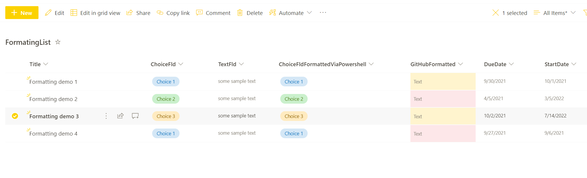

# Apply column format to SharePoint column

## Summary

This sample script shows how to apply column format using:

* Existing column format
* Format added in script
* Getting format sample from GitHub sample page

Scenario inspired by Paul Bullock [Blog post about column formatting](https://www.pkbullock.com/blog/2018/using-pnp-powershell-to-apply-modern-column-formatting/)



# [PnP PowerShell](#tab/pnpps)

```powershell
#site collection url
$url = "https://<tenant>.sharepoint.com"

#list to be exported  
$listName = "ListTitle"

## Connect to SharePoint Online site  
Connect-PnPOnline -Url $Url -Interactive

#----method 1 Apply formatting from existing column sample in sharepoint-------#
# field title with existing format - ChoiceFld
$field = Get-PnPField -Identity "ChoiceFld" -List $listName

#copy field format
$fieldFormat = $field.CustomFormatter

#apply field format to other column
# field title with no format - ChoiceFldFormattedViaPowershell
Set-PnPField -List $listName -Identity "ChoiceFldFormattedViaPowershell" -Values @{CustomFormatter=$fieldFormat}

#---method 2 Apply formatting directly from script
Set-PnPField -List $listName -Identity "ChoiceFldFormattedViaPowershell" -Values @{CustomFormatter=@'
{
  "$schema": "https://developer.microsoft.com/json-schemas/sp/column-formatting.schema.json",
  "elmType": "div",
  "style": {
    "position": "relative"
  },
  "children": [
    {
      "elmType": "div",
      "attributes": {
        "class": "=if([$DueDate] <= @now, 'sp-field-severity--severeWarning', if(1 - Number([$DueDate] - @now) / Number([$DueDate] - [$StartDate]) >= 0.7, 'sp-field-severity--war
ning', 'sp-field-severity--good'))"
      },
      "style": {
        "min-height": "inherit",
        "width": "=if([$DueDate] <= @now, '100%', (1 - Number([$DueDate] - @now) / Number([$DueDate] - [$StartDate])) * 100 + '%')"
      }
    },
    {
      "elmType": "span",
      "txtContent": "@currentField",
      "style": {
        "position": "absolute",
        "left": "8px"
      },
      "attributes": {
        "class": "ms-fontColor-neutralSecondary"
      }
    }
  ]
}
'@
}

#----method 3 Apply formatting using sample from github-------#
$webContent = Invoke-WebRequest -Uri 'https://raw.githubusercontent.com/pnp/List-Formatting/master/column-samples/date-range-rag/date-range-rag.json' 
$fieldFormatFromGit = $webContent.Content 

$fieldToFormat = Get-PnPField -Identity "GitHubFormatted" -List $listName
$fieldToFormat.CustomFormatter = $fieldFormatFromGit
$fieldToFormat.UpdateAndPushChanges($true)

```
[!INCLUDE [More about PnP PowerShell](../../docfx/includes/MORE-PNPPS.md)]

> [!Note]
> In 3rd method i use **$fieldToFormat.UpdateAndPushChanges($true)** but it is perfectly fine to use **Set-PnPField** command as in method 1 and 2

# [CLI for Microsoft 365](#tab/cli-m365-ps)
```powershell
#site collection url
$url = "https://<tenant>.sharepoint.com"

#list to be exported  
$listName = "ListTitle"

## Connect to SharePoint Online 
$m365Status = m365 status
if ($m365Status -match "Logged Out") {
  m365 login
}

#----method 1 Apply formatting from existing column sample in sharepoint-------#
# field title with existing format - ChoiceFld
$field = m365 spo field get --webUrl $url --listTitle $listName --fieldTitle "ChoiceFld" | ConvertFrom-Json

#copy field format
$fieldFormat = $field.CustomFormatter.Replace('"', '""')

#apply field format to other column
# field title with no format - ChoiceFldFormattedViaPowershell
m365 spo field set --webUrl $url --listTitle $listName --name "ChoiceFldFormattedViaPowershell" --CustomFormatter $fieldFormat

#---method 2 Apply formatting directly from script

$fieldFormat = @'
{
  "$schema": "https://developer.microsoft.com/json-schemas/sp/column-formatting.schema.json",
  "elmType": "div",
  "style": {
    "position": "relative"
  },
  "children": [
    {
      "elmType": "div",
      "attributes": {
        "class": "=if([$DueDate] <= @now, 'sp-field-severity--severeWarning', if(1 - Number([$DueDate] - @now) / Number([$DueDate] - [$StartDate]) >= 0.7, 'sp-field-severity--warning', 'sp-field-severity--good'))"
      },
      "style": {
        "min-height": "inherit",
        "width": "=if([$DueDate] <= @now, '100%', (1 - Number([$DueDate] - @now) / Number([$DueDate] - [$StartDate])) * 100 + '%')"
      }
    },
    {
      "elmType": "span",
      "txtContent": "@currentField",
      "style": {
        "position": "absolute",
        "left": "8px"
      },
      "attributes": {
        "class": "ms-fontColor-neutralSecondary"
      }
    }
  ]
}
'@

m365 spo field set --webUrl $url --listTitle $listName --name "ChoiceFldFormattedViaPowershell" --CustomFormatter $fieldFormat.Replace('"', '""')

#----method 3 Apply formatting using sample from github-------#
$webContent = Invoke-WebRequest -Uri 'https://raw.githubusercontent.com/pnp/List-Formatting/master/column-samples/date-range-rag/date-range-rag.json' 
$fieldFormatFromGit = $webContent.Content 

m365 spo field set --webUrl $url --listTitle $listName --name "GitHubFormatted" --CustomFormatter $fieldFormatFromGit.Replace('"', '""')

```
[!INCLUDE [More about CLI for Microsoft 365](../../docfx/includes/MORE-CLIM365.md)]

# [JSON](#tab/json)

```

{
  "$schema": "https://developer.microsoft.com/json-schemas/sp/column-formatting.schema.json",
  "elmType": "div",
  "style": {
    "position": "relative"
  },
  "children": [
    {
      "elmType": "div",
      "attributes": {
        "class": "=if([$DueDate] <= @now, 'sp-field-severity--severeWarning', if(1 - Number([$DueDate] - @now) / Number([$DueDate] - [$StartDate]) >= 0.7, 'sp-field-severity--warning', 'sp-field-severity--good'))"
      },
      "style": {
        "min-height": "inherit",
        "width": "=if([$DueDate] <= @now, '100%', (1 - Number([$DueDate] - @now) / Number([$DueDate] - [$StartDate])) * 100 + '%')"
      }
    },
    {
      "elmType": "span",
      "txtContent": "@currentField",
      "style": {
        "position": "absolute",
        "left": "8px"
      },
      "attributes": {
        "class": "ms-fontColor-neutralSecondary"
      }
    }
  ]
}

```

> [!Note]
> This is JSON used in examples

***

## Contributors

| Author(s) |
|-----------|
| Valeras Narbutas |
| [Jasey Waegebaert](https://github.com/Jwaegebaert) |


[!INCLUDE [DISCLAIMER](../../docfx/includes/DISCLAIMER.md)]

