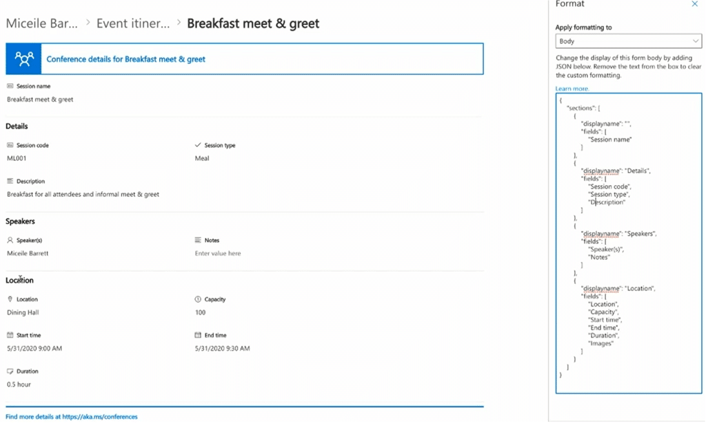

# Sample showing how to apply a custom Form Formatting as part of your Site Provisioning

## Summary

From time to time your client will need a list/Content type that consist of a lot of fields and it looks awful while entering data. One option could be to replace the Edit form with a Power App but as far as I know it is not possible to deploy a Power App as part of your Provisioning.
Another option is to use Form formatting :
https://learn.microsoft.com/en-us/sharepoint/dev/declarative-customization/list-form-configuration

Samples here: https://github.com/pnp/List-Formatting/tree/master/form-samples

However the PnP Provisioning Engine /Schema does not yet support this kind of Form Formatting so what to do?

Well, if in doubt just spin up an Azure Function and call it from your provisioning engine ;-)

## Implementation

- Open VS Code
- Create a new file
- Write a script as below,
- Change the variables to target to your environment
- Run the script.
 
## Screenshot of Output 



# [PnP PowerShell](#tab/pnpps)
```powershell


#Apply Form Formatting to your site using an Azure Function
using namespace System.Net

# Input bindings are passed in via param block.
param($Request, $TriggerMetadata)

# Write to the Azure Functions log stream.
Write-Host "PowerShell HTTP trigger function processed a request."

# Interact with query parameters or the body of the request.
$targetURL = $Request.Query.TargetURL
if (-not $targetURL) 
{
    Write-Host " no targeturl received, aborting"
    $body = "No TargetUrl received"
    $HttpStatusCode = [HttpStatusCode]::BadRequest
    Push-OutputBinding -Name Response -Value ([HttpResponseContext]@{
    StatusCode = $HttpStatusCode
    Body = $body
})

}

$ListName = $Request.Query.ListName
if (-not $ListName) 
{
    Write-Host " no ListName received, aborting"
    $body = "No ListName received"
    $HttpStatusCode = [HttpStatusCode]::BadRequest
    Push-OutputBinding -Name Response -Value ([HttpResponseContext]@{
    StatusCode = $HttpStatusCode
    Body = $body
})

}
$JSONFileName = $Request.Query.JSONFileName
if (-not $JSONFileName) 
{
    Write-Host " no JSONFileName received, aborting"
    $body = "No JSONFileName received"
    $HttpStatusCode = [HttpStatusCode]::BadRequest
    Push-OutputBinding -Name Response -Value ([HttpResponseContext]@{
    StatusCode = $HttpStatusCode
    Body = $body
})

}
$ContenttypeName = $Request.Query.ContenttypeName
if (-not $ContenttypeName) 
{
    Write-Host " no ContenttypeName received, aborting"
    $body = "No ContenttypeName received"
    $HttpStatusCode = [HttpStatusCode]::BadRequest
    Push-OutputBinding -Name Response -Value ([HttpResponseContext]@{
    StatusCode = $HttpStatusCode
    Body = $body
})

}

else
{

    $body=  " Targeturl received: $targetURL, ListName $ListName, JSONFileName $JSONFileName ,ContenttypeName : $ContenttypeName"
    $clientId = $env:ClientId
    $clientSecret = $env:clientSecret
    
    $SiteWhereTheJSONFileIsStored = "https://[YourTenant].sharepoint.com/sites/[YourSite]" #could also be a parameter if required
    Connect-PnPOnline -Url $SiteWhereTheJSONFileIsStored -ClientId $clientId -ClientSecret $clientSecret
    $ClientFormCustomFormatter = Get-PnPFile -Url $JSONFileName -AsString
    if(-not $ClientFormCustomFormatter)
    {
        Write-Host " no ClientFormCustomFormatter found, aborting"
        $body = "No ClientFormCustomFormatter found "
        $HttpStatusCode = [HttpStatusCode]::BadRequest
        Push-OutputBinding -Name Response -Value ([HttpResponseContext]@{
        StatusCode = $HttpStatusCode
        Body = $body
    })    
    }
    
    Connect-PnPOnline -Url $targetURL -ClientId $clientId -ClientSecret $clientSecret 
    
    $clientContext = Get-PnPContext 

    $list = Get-PnPList $ListName -ErrorAction Stop

    #Get Content Type
    $contentType = Get-PnPContentType -List $ListName | Where-Object { $_.Name -eq $ContenttypeName -or $_.Name -eq "Element" }
    if(-not $contentType)
    {
        Write-Host " no contenttype found, aborting"
        $body += "No contenttype found "
        $HttpStatusCode = [HttpStatusCode]::BadRequest
        Push-OutputBinding -Name Response -Value ([HttpResponseContext]@{
        StatusCode = $HttpStatusCode
        Body = $body
    })  
    }
    $clientContext.Load($contentType)
    $clientContext.Load($contentType.FieldLinks)
    $clientContext.ExecuteQuery()
    #open the ct if it is read only
    if($contentType.ReadOnly)
    {
        $contentType.ReadOnly = $false    
        $contentType.Update(0)
        $clientContext.ExecuteQuery()
    }


    $contentType.ClientFormCustomFormatter = $ClientFormCustomFormatter
    $contentType.Update(0)
    $clientContext.ExecuteQuery()

    if($contentType.ReadOnly)
    {
        $contentType.ReadOnly = $true    
        $contentType.Update(0)
        $clientContext.ExecuteQuery()
    }
    $body += "ClientFormCustomFormatter updated for $ListName on $targetURL"
    $HttpStatusCode = [HttpStatusCode]::OK
}

# Associate values to output bindings by calling 'Push-OutputBinding'.
Push-OutputBinding -Name Response -Value ([HttpResponseContext]@{
    StatusCode = $HttpStatusCode
    Body = $body
})

```
[!INCLUDE [More about PnP PowerShell](../../docfx/includes/MORE-PNPPS.md)]
***

## Contributors

| Author(s) |
|-----------|
| Kasper Larsen, Fellowmind|

[!INCLUDE [DISCLAIMER](../../docfx/includes/DISCLAIMER.md)]

