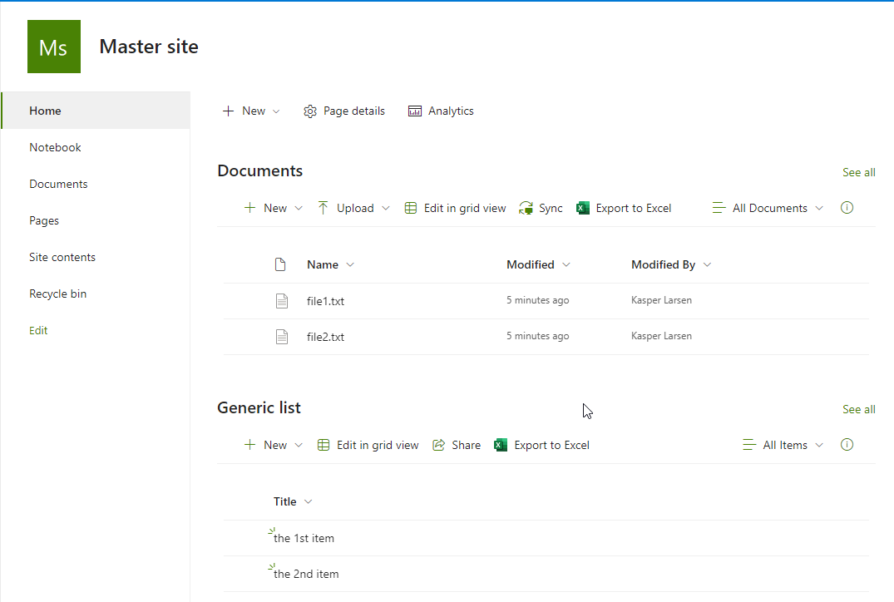

# Using a PnP Site Template including files and list items

> [!Note]
> This is a submission helper template please find the [contributor guidance](/docfx/contribute.md) to help you write this scenario.

## Summary

Sometime you are required to create a site including some specific files and/or list items. You can do this in servaral ways, but in this sample we are using the PnP Provisioning Engine



The files and list items are "imbedded" in the .pnp file and thus portable.

# [PnP PowerShell](#tab/pnpps)

```powershell

# Extract PnP Provisioning template including documents and listitems  , using PS7.3 and PnP.Powershell 1.12*
# Kasper Larsen, Fellowmind DK


#Creating the Master site, which will serve as a template for any new site 
$tenantName = "[Contoso]"  #Change this
$tenantBaseUrl = "https://"+$tenantName+".sharepoint.com"
$serverrelativeUrl = "/sites/testA"  #Change THIS
$masterSiteUrl = $tenantBaseUrl + $serverrelativeUrl
$owner =  "Admin@Consoso.onmicrosoft.com" #Change THIS

$SharePointAdminUrl =  "https://" +$tenantName+ "-admin.sharepoint.com/" 
$adminConn = Connect-PnPOnline -Url $SharePointAdminUrl -Interactive -ReturnConnection
$res = New-PnPTenantSite -Title "Master site " -Url $masterSiteUrl -Owner $owner -TimeZone 3 -Connection $adminConn -Template "STS#3"
Start-Sleep -Seconds 60
$mastersiteConn = Connect-PnPOnline -Url $masterSiteUrl -Interactive -ReturnConnection
New-PnPList -Title "Generic list" -Template GenericList -Url "Generic" -Connection $mastersiteConn
Add-PnPListItem -List "Generic list" -Values @{"Title" = "the 1st item"} -Connection $mastersiteConn
Add-PnPListItem -List "Generic list" -Values @{"Title" = "the 2nd item"} -Connection $mastersiteConn

#copy a few preexisting file to the document library
Copy-PnPFile -SourceUrl "$serverrelativeUrl/SitePages/Home.aspx" -TargetUrl "$serverrelativeUrl/Shared Documents/file1.txt" -Overwrite -Force -Connection $mastersiteConn
Copy-PnPFile -SourceUrl "$serverrelativeUrl/SitePages/Home.aspx" -TargetUrl "$serverrelativeUrl/Shared Documents/file2.txt" -Overwrite -Force -Connection $mastersiteConn

#Now we are gone creating the master site, time to create the pnp template and add some files 
$path = "C:\temp\PnPProvisioningIncludingFilesAndListItems.pnp"
$dummy = Get-PnPSiteTemplate -Out $path -Schema V202103 -Connection $mastersiteConn -force -ExcludeHandlers Navigation, SiteSecurity 
Add-PnPFileToSiteTemplate -Path $path -SourceUrl "$tenantBaseUrl$serverrelativeUrl/Shared%20Documents/file1.txt" -Container "Shared Documents" -FileOverwrite  -Connection $mastersiteConn
Add-PnPFileToSiteTemplate -Path $path -SourceUrl "$tenantBaseUrl$serverrelativeUrl/Shared%20Documents/file2.txt"  -Container "Shared Documents" -FileOverwrite  -Connection $mastersiteConn

#and add the items from the generic list
$query = "<Query><Where><Gt><FieldRef Name='ID' /><Value Type=’Counter’>0</Value></Gt></Where></Query>"
Add-PnPDataRowsToSiteTemplate -Path $path -List "Generic list" -Query $query -Connection $mastersiteConn


# connect to the target site
$provisionTargetSite = "https://"+$tenantName+".sharepoint.com/sites/thenewsite"  #Change THIS
Connect-PnPOnline -Url $provisionTargetSite -Interactive
Invoke-PnPSiteTemplate -Path $path
write-host "Done :-)"

```
[!INCLUDE [More about PnP PowerShell](../../docfx/includes/MORE-PNPPS.md)]
***


## Contributors

| Author(s) |
|-----------|
| Kasper Larsen |

[!INCLUDE [DISCLAIMER](../../docfx/includes/DISCLAIMER.md)]

