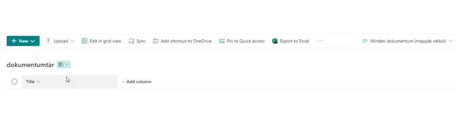

# This sample shows how you can extract a PnP Provisioning template , update the XML and use parameters with Invoke-PnPSiteTemplate in order to name a Document Library and a View according to your requirements. In this sample the title of the library and the view is based on the LocaleId of the Site Collection where we apply the template.

## Summary

Rather then creating a PnP Provisioning Template for each supported language this sample shows how to manage the naming using parameters when using Invoke-PnPSiteTemplate.

## Implementation

- Open VS Code
- Create a new file
- Copy the code below,
- Change the variables to target to your environment
- Run the script.
 
## Screenshot of Output 



# [PnP PowerShell](#tab/pnpps)
```powershell

# Extract PnP Provisioning template and apply it using Parameter , using PS7.3 and PnP.Powershell 1.12*
# Made by Kasper Larsen, Fellowmind DK


#extract XML from the source site
function Extract-PnPSiteTemplate 
{
    param ([Parameter(Mandatory=$true)][string]$sourceSiteUrl,[Parameter(Mandatory=$true)][string]$path)

    #connect using one of the options, Interactive if running supervised, and clientid, tenant and thumbprint if unsupervised
    $conn = Connect-PnPOnline -Url $sourceSiteUrl -ReturnConnection -Interactive -ForceAuthentication
    $dummy = Get-PnPSiteTemplate -Out $path -Schema V202103 -Connection $conn -force -ListsToExtract "TBD" -ExcludeHandlers Navigation

    #Injecting the parameter , in this case "ListTitle" into the XML.
    #This can be done by editing the XML by hand or by code like this:
    [XML]$content = Get-Content -Path $path -Encoding utf8BOM
    $Namespace = New-Object -TypeName "Xml.XmlNamespaceManager" -ArgumentList $content.NameTable
    $Namespace.AddNamespace("pnp", $content.DocumentElement.NamespaceURI)
    

    
    $nodes = $content.SelectNodes("//pnp:Views", $Namespace)
    foreach($node in $nodes.View)
    {
        $DisplayName = $node.GetAttribute("DisplayName")
        if($DisplayName -eq "All Documents (without Folders)")
        {
            $node.SetAttribute("DisplayName","{parameter:ViewDisplayName}")  
        }
    }
    
    
    $nodes = $content.SelectNodes("//pnp:ListInstance", $Namespace)
    foreach($node in $nodes)
    {
        $title = $node.GetAttribute("Title")
        if($title)
        {
            $node.SetAttribute("Title","{parameter:ListTitle}")
        }
        $DocumentTemplate = $node.GetAttribute("DocumentTemplate")
        if($DocumentTemplate)
        {
           $node.SetAttribute("DocumentTemplate","{site}/{parameter:ListTitle}/Forms/template.dotx")
        }
        $Url = $node.GetAttribute("Url")
        if($Url)
        {
           $node.SetAttribute("Url","{parameter:ListTitle}")
        }
        $DefaultNewFormUrl = $node.GetAttribute("DefaultNewFormUrl")
        if($DefaultNewFormUrl)
        {
           $node.SetAttribute("DefaultNewFormUrl","{site}/{parameter:ListTitle}/Forms/Upload.aspx")
        }
        $DefaultEditFormUrl = $node.GetAttribute("DefaultEditFormUrl")
        if($DefaultEditFormUrl)
        {
           $node.SetAttribute("DefaultEditFormUrl","{site}/{parameter:ListTitle}/Forms/EditForm.aspx")
        }
        $DefaultDisplayFormUrl = $node.GetAttribute("DefaultDisplayFormUrl")
        if($DefaultDisplayFormUrl)
        {
           $node.SetAttribute("DefaultDisplayFormUrl","{site}/{parameter:ListTitle}/Forms/DispForm.aspx")
        }
        
    }
    $content.Save($path) 
   
    
}


function Apply-PnPSiteTemplate 
{
    param ([Parameter(Mandatory=$true)][string]$targetSiteUrl,[Parameter(Mandatory=$true)][string]$SPAdminSiteUrl,[Parameter(Mandatory=$true)][string]$path)
    # Precondition: The site collection in $targetSiteUrl is expected to exist already
    
    #Getting the site collection properties in order to get the LocaleID 
    $SPAdminConn = Connect-PnPOnline -Url $SPAdminSiteUrl -ReturnConnection -Interactive
    $siteprops = Get-PnPTenantSite -Identity $targetSiteUrl -Connection $SPAdminConn| Select -Property * 

    $targetConn = Connect-PnPOnline -Url $targetSiteUrl -ReturnConnection -Interactive 
    
    switch ($siteprops.LocaleId) 
    {
        1030
        { 
            Write-Host "The library should be in English (simplyfied)" -ForegroundColor Green
            Invoke-PnPSiteTemplate -Path $path -Parameters @{"ListTitle" = "Document Library";"ViewDisplayName"="All Documents (without Folders)"} -Connection $targetConn 
        }
        1031
        {
            Write-Host "The library should be in German" -ForegroundColor Green
            Invoke-PnPSiteTemplate -Path $path -Parameters @{"ListTitle" = "Dokumentenbibliothek";"ViewDisplayName"="Alles Documenten (kein mappen)"} -Connection $targetConn 
        }
        1033
        {
            Write-Host "The library should be in Danish" -ForegroundColor Green
            Invoke-PnPSiteTemplate -Path $path -Parameters @{"ListTitle" = "Dokumentbibliotek";"ViewDisplayName"="Alle Dokumenter (uden foldere)"} -Connection $targetConn -ClearNavigation
        }
        1038
        {
            Write-Host "The library should be in Hungarian" -ForegroundColor Green
            Invoke-PnPSiteTemplate -Path $path -Parameters @{"ListTitle" = "dokumentumtár";"ViewDisplayName"="Minden dokumentum (mappák nélkül)"} -Connection $targetConn -ClearNavigation
        }
        Default 
        {
            Throw "No LocaleId found"
        }
    }


}

# the title of the new Template Site Collection
$newsiteTitle =  "test" 
# the URL of the new Template Site Collection
$newsiteUrl = "https://[Tenant].sharepoint.com/sites/test" 
# the primary site collection owner of the new Template Site Collection
$owner =  "Admin@[Tenant].onmicrosoft.com"
$provisionTargetSite =  "https://[Tenant].sharepoint.com/sites/XXXXXXX"

$SharePointAdminUrl =  "https://[Tenant]-admin.sharepoint.com/" 
$conn = Connect-PnPOnline -Url $SharePointAdminUrl -Interactive -ReturnConnection
$res = New-PnPTenantSite -Title $newsiteTitle -Url $newsiteUrl -Owner $owner -TimeZone 3 -Connection $conn -Template "STS#3"

#this loop is required as the time it take to get the new template site ready varies 
$success = $false
while ($success -eq $false) 
{
    try {
        $conn = Connect-PnPOnline -Url $newsiteUrl -Interactive -ReturnConnection -ErrorAction Stop
        Get-PnPWeb -Connection $conn -ErrorAction Stop
        $success = $true
    }
    catch {
        Start-Sleep -Seconds 10
    }    
}

# Adding a new Document Library. This library is the target of the parameters in the provisioning and is names according to the LocaleID of the receiving site collection
$res = New-PnPList -Title "TBD" -Template DocumentLibrary -Connection $conn
#adding a view as the title of this view is also handled using parameters
Add-PnPView -List $res -Title "All Documents (without Folders)" -SetAsDefault -Query "" -Fields "Title" -Connection $conn

Extract-PnPSiteTemplate -sourceSiteUrl $newsiteUrl -path "C:\temp\PnPProvisioningUsingParameters.xml"
Apply-PnPSiteTemplate -targetSiteUrl $provisionTargetSite  -SPAdminSiteUrl $SharePointAdminUrl -path "C:\temp\PnPProvisioningUsingParameters.xml"


```
[!INCLUDE [More about PnP PowerShell](../../docfx/includes/MORE-PNPPS.md)]
***

## Contributors

| Author(s) |
|-----------|
| Kasper Larsen, Fellowmind|

[!INCLUDE [DISCLAIMER](../../docfx/includes/DISCLAIMER.md)]

