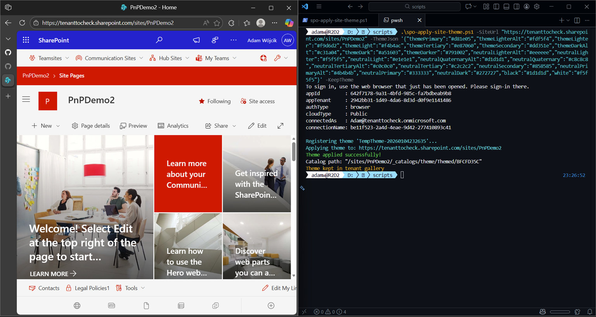

# Apply site theme

## Summary

Apply a theme to a specific SharePoint site without adding a tenant theme that would be available for all sites through "Change the look" menu.




# [PnP PowerShell](#tab/pnpps)

```powershell

$siteUrl = "https://contoso.sharepoint.com/sites/DemoSite"

$themePalette = @{
    "palette" = @{
        "themePrimary"= "#1BF242";
        "themeLighterAlt"= "#0d0b00";
        "themeLighter"= "#0b35bc";
        "themeLight"= "#322d00";
        "themeTertiary"= "#6a5f00";
       "themeSecondary"= "#1B22F2";
        "themeDarkAlt"= "#ffe817";
        "themeDark"= "#ffed4b";
        "themeDarker"= "#fff171";
        "neutralLighterAlt"= "#252525";
        "neutralLighter"= "#282828";
        "neutralLight"= "#313131";
        "neutralQuaternaryAlt"= "#3f3f3f";
        "neutralQuaternary"= "#484848";
        "neutralTertiaryAlt"= "#4f4f4f";
        "neutralTertiary"= "#c8c8c8";
        "neutralSecondaryAlt"= "#d0d0d0";
        "neutralSecondary"= "#dadada";
        "neutralPrimary"= "#ffffff";
        "neutralDark"= "#eaeaea";
        "black"= "#f8f8f8";
        "white"= "#1f1f1f";
        "primaryBackground"= "#1f1f1f";
        "primaryText"= "#ffffff";
        "error"= "#ff5f5f"
    }
}

Connect-PnPOnline -Url $siteUrl -ClientId "" -Interactive

$accessToken = Get-PnPAccessToken -ResourceTypeName SharePoint
$bodyObject = @{
    name      = "Sample theme"
    themeJson = ($themePalette | ConvertTo-Json -Depth 10 -Compress)
}

$bodyJson = $bodyObject | ConvertTo-Json -Depth 10

$headers = @{
    "Authorization" = "Bearer $accessToken"
    "Accept"        = "application/json;odata.metadata=minimal"
    "Content-type"  = "application/json; charset=utf-8"
    "ODATA-VERSION" = "4.0"
}

$uri = "$siteUrl/_api/thememanager/Applytheme"

Invoke-RestMethod -Method POST -Uri $uri -Headers $headers -Body $bodyJson

Disconnect-PnPOnline

```
[!INCLUDE [More about PnP PowerShell](../../docfx/includes/MORE-PNPPS.md)]


***

## Contributors

| Author(s) |
|-----------|
| [Aimery Thomas](https://github.com/a1mery)|

[!INCLUDE [DISCLAIMER](../../docfx/includes/DISCLAIMER.md)]

