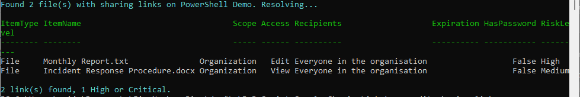

# Find and risk-rate SharePoint sharing links (spot oversharing before Copilot)

## Summary

Broad sharing links — **"Anyone with the link"** and **"People in your organization"** — are a common source of Microsoft Search and Copilot oversharing. This script finds them on a site and risk-rates each one, so you can act on the exposure that matters first.

It does **not** walk every file. Instead it discovers links through the hidden groups SharePoint creates to back each one — named `SharingLinks.<fileGuid>.<type>.<linkId>` — so the work scales with how much is actually shared, not with library size. Then it:

1. reads the `SharingLinks` groups to get the file GUIDs,
2. resolves those GUIDs to file paths in one pass over the document libraries (`Get-PnPFile` has no `-UniqueId`, so a metadata match is the reliable resolution),
3. pulls the real link with `Get-PnPFileSharingLink` — the *type* in the group name is only a hint; the authoritative scope and access come from the cmdlet,
4. scores each link:

| Risk factor | Effect |
| ----------- | ------ |
| **Anonymous** ("anyone with the link") | worst starting point |
| **Organization** ("anyone in the company") | real internal exposure |
| **Users** (specific people) | sharing working as intended |
| **Edit** vs View | Edit is worse everywhere |
| No expiry on a broad link | it lingers |
| Anonymous with no password | a plain open door |

giving each link a **Low / Medium / High / Critical** rating. Use `-MinRisk` to show only the links worth acting on, and `-CsvPath` to export.



> [!Note]
> Reading sharing links requires **Site Owner / Site Collection Administrator** rights on the site. Register an app for interactive sign-in once with `Register-PnPEntraIDAppForInteractiveLogin` and pass its client id with `-ClientId`.

This is a focused, single-site sample. The full tool it is drawn from adds tenant-wide scanning, revoke-by-filter, and CSV/HTML reporting: [SharingLinkAudit](https://github.com/gvijaikumar9/SharingLinkAudit).

# [PnP PowerShell](#tab/pnpps)

```powershell
<#
.SYNOPSIS
    Finds and risk-rates the sharing links on a SharePoint Online site, so you can
    spot oversharing (the "Anyone" and "People in your organization" links that
    quietly widen access) before Microsoft Search and Copilot surface it.

.DESCRIPTION
    Rather than walking every file, this discovers links through the hidden groups
    SharePoint creates to back them - each one is named
    SharingLinks.<fileGuid>.<type>.<linkId> - so the work scales with how much is
    actually shared, not with how big the library is. For each file that has a
    link it:

      1. reads the SharingLinks groups to get the file GUIDs,
      2. resolves those GUIDs to file paths in one pass over the document
         libraries (Get-PnPFile has no -UniqueId, so a metadata match is the
         reliable resolution),
      3. pulls the real link with Get-PnPFileSharingLink - the "type" in the group
         name is only a hint, the authoritative scope/access come from here,
      4. scores each link:
            Anonymous "anyone with the link"     is the worst starting point
            Organization "anyone in the company"  is real internal exposure
            Users "specific people"               is sharing working as intended
            Edit is worse than View; a broad link with no expiry lingers; an
            anonymous link with no password is a plain open door
      giving each a Low / Medium / High / Critical risk word.

.PARAMETER SiteUrl
    The SharePoint Online site to audit, e.g. https://contoso.sharepoint.com/sites/Marketing

.PARAMETER ClientId
    The Entra app (client) ID registered for PnP PowerShell interactive sign-in.

.PARAMETER IncludeFolders
    Also report folder sharing links (off by default; file links are the common case).

.PARAMETER MinRisk
    Only return links at or above this risk level (Low, Medium, High, Critical).

.PARAMETER CsvPath
    Optional. Also write the rows to this CSV path.

.EXAMPLE
    .\Audit-SharingLinks.ps1 -SiteUrl https://contoso.sharepoint.com/sites/Marketing -ClientId 00000000-0000-0000-0000-000000000000

    Lists every sharing link on the site, most risky first.

.EXAMPLE
    .\Audit-SharingLinks.ps1 -SiteUrl https://contoso.sharepoint.com/sites/Marketing -ClientId <id> -MinRisk High -CsvPath .\risky-links.csv

    Only the High and Critical links, exported to CSV.

.NOTES
    Requires the PnP.PowerShell module and enough rights to read sharing links
    (Site Owner / Site Collection Administrator for a single site). Register an app
    for interactive sign-in once with Register-PnPEntraIDAppForInteractiveLogin.

    This is a focused, single-site sample. The full tool it is drawn from adds
    tenant-wide scanning, revoke-by-filter, and CSV/HTML reporting:
    https://github.com/gvijaikumar9/SharingLinkAudit
#>
[CmdletBinding()]
param(
    [Parameter(Mandatory)][string] $SiteUrl,
    [Parameter(Mandatory)][string] $ClientId,
    [switch] $IncludeFolders,
    [ValidateSet('Low', 'Medium', 'High', 'Critical')][string] $MinRisk = 'Low',
    [string] $CsvPath
)

Set-StrictMode -Version Latest
$ErrorActionPreference = 'Stop'

# --------------------------------------------------------------------------
# Pure helper - turn a link's shape into a single risk word.
# --------------------------------------------------------------------------

function Get-LinkRisk {
    param(
        [string] $Scope,        # Anonymous | Organization | Users
        [string] $LinkType,     # View | Edit
        $Expiration,            # $null when none set
        [bool]   $HasPassword
    )
    $score = 0
    switch ($Scope) {
        'Anonymous'    { $score += 3 }
        'Organization' { $score += 1 }
        default        { $score += 0 }   # Users / specific people
    }
    if ($LinkType -eq 'Edit') { $score += 2 }
    $broad = $Scope -in @('Anonymous', 'Organization')
    if ($broad -and -not $Expiration) { $score += 1 }
    if ($Scope -eq 'Anonymous' -and -not $HasPassword) { $score += 1 }

    if     ($score -ge 5) { 'Critical' }
    elseif ($score -ge 3) { 'High' }
    elseif ($score -ge 1) { 'Medium' }
    else                  { 'Low' }
}

# --------------------------------------------------------------------------
# Resolve a set of file GUIDs to their paths, by walking the document
# libraries once. The SharingLinks group name gives a file GUID, but
# Get-PnPFileSharingLink needs a URL, and Get-PnPFile has no -UniqueId - so
# this metadata match is the reliable resolution. It stops early once every
# needed GUID is found.
# --------------------------------------------------------------------------

function Resolve-FileRefMap {
    param([Parameter(Mandatory)][string[]] $NeededGuids)

    $want = [System.Collections.Generic.HashSet[string]]::new()
    foreach ($g in $NeededGuids) { [void]$want.Add($g.ToLower()) }

    $map  = @{}
    $libs = Get-PnPList | Where-Object { -not $_.Hidden -and $_.BaseTemplate -eq 101 }

    foreach ($lib in $libs) {
        if ($map.Count -ge $want.Count) { break }
        $items = Get-PnPListItem -List $lib -PageSize 500
        foreach ($item in $items) {
            $uid = "$($item.FieldValues['UniqueId'])".ToLower()
            if ($uid -and $want.Contains($uid) -and -not $map.ContainsKey($uid)) {
                $map[$uid] = [pscustomobject]@{
                    FileRef  = $item.FieldValues['FileRef']
                    FileName = $item.FieldValues['FileLeafRef']
                    IsFolder = $item.FileSystemObjectType -eq 'Folder'
                }
                if ($map.Count -ge $want.Count) { break }
            }
        }
    }
    return $map
}

# --------------------------------------------------------------------------
# Main
# --------------------------------------------------------------------------

Connect-PnPOnline -Url $SiteUrl -Interactive -ClientId $ClientId
$siteTitle = (Get-PnPWeb).Title
$rank = @{ Low = 0; Medium = 1; High = 2; Critical = 3 }

# 1. discovery - only the files that actually have links
$linkGroups = Get-PnPGroup | Where-Object { $_.Title -like 'SharingLinks.*' }
if (-not $linkGroups) {
    Write-Host "No sharing links found on $siteTitle." -ForegroundColor DarkYellow
    return
}
$guids = $linkGroups | ForEach-Object { ($_.Title -split '\.')[1] } | Select-Object -Unique
Write-Host ("Found {0} file(s) with sharing links on {1}. Resolving..." -f @($guids).Count, $siteTitle) -ForegroundColor Cyan

# 2. resolve GUIDs to file paths in one pass
$map = Resolve-FileRefMap -NeededGuids $guids

# 3. enrich per file with the real link data and score it
$rows = foreach ($guid in $guids) {
    $entry = $map[$guid.ToLower()]
    if (-not $entry) {
        Write-Warning "A link exists for GUID $guid but its file could not be resolved (deleted, or in a list this pass did not cover)."
        continue
    }
    if ($entry.IsFolder -and -not $IncludeFolders) { continue }

    $links =
        if ($entry.IsFolder) { Get-PnPFolderSharingLink -Folder $entry.FileRef -ErrorAction SilentlyContinue }
        else                 { Get-PnPFileSharingLink   -Identity $entry.FileRef -ErrorAction SilentlyContinue }

    foreach ($link in $links) {
        $lk = $link.Link
        if (-not $lk) { continue }   # a link with no Link facet - skip rather than crash under StrictMode

        $granted    = $link.GrantedToIdentitiesV2
        $recipients =
            if ($granted) {
                ($granted | ForEach-Object {
                    $u = $_.User
                    if     ($u -and $u.Email)       { $u.Email }
                    elseif ($u -and $u.DisplayName) { $u.DisplayName }
                    else                            { '(unknown)' }
                }) -join '; '
            }
            elseif ($lk.Scope -eq 'Organization') { 'Everyone in the organisation' }
            elseif ($lk.Scope -eq 'Anonymous')    { 'Anyone with the link' }
            else { '(none resolved)' }

        [pscustomobject]@{
            ItemType    = if ($entry.IsFolder) { 'Folder' } else { 'File' }
            ItemName    = $entry.FileName
            Scope       = $lk.Scope        # Anonymous | Organization | Users
            Access      = $lk.Type         # View | Edit
            Recipients  = $recipients
            Expiration  = $link.ExpirationDateTime
            HasPassword = $link.HasPassword
            RiskLevel   = Get-LinkRisk $lk.Scope $lk.Type $link.ExpirationDateTime $link.HasPassword
            ItemPath    = $entry.FileRef
        }
    }
}

$rows = @($rows | Where-Object { $rank[$_.RiskLevel] -ge $rank[$MinRisk] })
# Most risky first.
$rows = @($rows | Sort-Object @{ Expression = { $rank[$_.RiskLevel] }; Descending = $true }, ItemName)

if ($rows.Count -eq 0) {
    Write-Host "No sharing links at or above '$MinRisk' risk on $siteTitle." -ForegroundColor DarkYellow
}
else {
    $rows | Format-Table ItemType, ItemName, Scope, Access, Recipients, Expiration, HasPassword, RiskLevel -AutoSize
    $critical = @($rows | Where-Object { $_.RiskLevel -in 'High', 'Critical' }).Count
    Write-Host ("{0} link(s) found, {1} High or Critical." -f $rows.Count, $critical) -ForegroundColor Cyan
}

if ($CsvPath -and $rows.Count -gt 0) {
    $rows | Export-Csv -Path $CsvPath -NoTypeInformation -Encoding UTF8
    Write-Host "Report written to $CsvPath" -ForegroundColor Green
}
```

[!INCLUDE [More about PnP PowerShell](../../docfx/includes/MORE-PNPPS.md)]

***

## Source Credit

Sample first appeared on [https://github.com/gvijaikumar9/SharingLinkAudit](https://github.com/gvijaikumar9/SharingLinkAudit)

## Contributors

| Author(s) |
| --------- |
| Vijay Kumar G |

[!INCLUDE [DISCLAIMER](../../docfx/includes/DISCLAIMER.md)]

