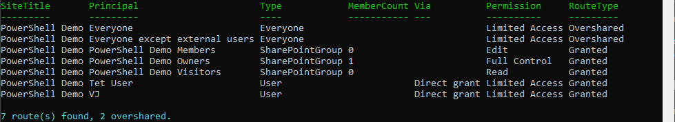

# Report SharePoint site access and flag oversharing (by site or by user)

## Summary

Permission reports usually tell you the *what* (this group has Edit) but not *how* the access was granted or whether it should be there. This script walks a site's role assignments and classifies every route as one of:

| Route type | Meaning |
| ---------- | ------- |
| **Granted** | A named user, or a group someone deliberately added. |
| **Overshared** | An "Everyone" / "Everyone except external users" claim, or a sharing-link group. Access nobody was explicitly given, and the usual source of Microsoft Search and Copilot exposure. |

It runs in two directions:

- **`-Mode BySite`** (default) lists every principal that can reach the site, one row each, **Overshared first**, with the member count for groups. Answers *"who can see this site?"*.
- **`-Mode ByUser`** reports what a given user can reach and by which route. It first asks the definitive question with `GetUserEffectivePermissions` (can they actually access the site, and at what level), then attributes that access to each route: a direct grant, a SharePoint group membership, or an Everyone claim.

Everyone-claim and sharing-link detection is matched on the login name, not the display title, because a tenant can rename a group but not its underlying claim. Add `-OversharedOnly` to see just the routes worth acting on, `-ExpandGroups` to expand SharePoint groups to people, and `-CsvPath` to export.



> [!Note]
> Reading permissions requires **Full Control** on the site (Contributor is not enough). Register an app for interactive sign-in once with `Register-PnPEntraIDAppForInteractiveLogin` and pass its client id with `-ClientId`.

This is a focused, single-site sample. The full tool it is drawn from adds tenant-wide scans, item-level deep crawl, Entra-group expansion via Microsoft Graph, and a GUI: [User Access Explorer](https://github.com/gvijaikumar9/UserAccessExplorer).

# [PnP PowerShell](#tab/pnpps)

```powershell
<#
.SYNOPSIS
    Reports who can reach a SharePoint Online site and how, and flags oversharing
    (access nobody was explicitly given). Works from two directions: the site's
    side ("who can reach this site?") or a user's side ("what can this user reach
    here, and by which route?").

.DESCRIPTION
    Permission reports usually tell you the "what" (this group has Edit) but not
    the "how it got there" or "should it be there". This script walks a site's
    role assignments and classifies every route as one of:

        Granted    - a named user or a group someone deliberately added
        Overshared - an "Everyone" / "Everyone except external users" claim, or a
                     sharing-link group. Access that was never explicitly granted
                     and is the usual source of Copilot / search oversharing.

    -Mode BySite (default): one row per principal that can reach the site, with the
        member count for groups. Answers "who can see this site?".

    -Mode ByUser: pick a user. First it asks the definitive question with
        GetUserEffectivePermissions (can they actually access the site, at what
        level), then it attributes that access to each route (direct grant,
        SharePoint group membership, or an Everyone claim).

    Everyone-claim and sharing-link detection is matched on the login name, not the
    display title, because a tenant can rename the group but not its claim.

.PARAMETER SiteUrl
    The SharePoint Online site to audit, e.g. https://contoso.sharepoint.com/sites/Marketing

.PARAMETER Mode
    BySite (default) = who can reach the site. ByUser = what a given user can reach.

.PARAMETER UserLogin
    Required for -Mode ByUser. A UPN (jane@contoso.com) or a full claims login.

.PARAMETER ClientId
    The Entra app (client) ID registered for PnP PowerShell interactive sign-in.

.PARAMETER ExpandGroups
    BySite only. Expand each SharePoint group to one row per member.

.PARAMETER OversharedOnly
    Return only the Overshared routes (the ones worth acting on first).

.PARAMETER CsvPath
    Optional. Also write the rows to this CSV path.

.EXAMPLE
    .\Audit-UserAndSiteAccess.ps1 -SiteUrl https://contoso.sharepoint.com/sites/Marketing -ClientId 00000000-0000-0000-0000-000000000000

    Lists every principal that can reach the Marketing site, Overshared first.

.EXAMPLE
    .\Audit-UserAndSiteAccess.ps1 -SiteUrl https://contoso.sharepoint.com/sites/Marketing -Mode ByUser -UserLogin jane@contoso.com -ClientId 00000000-0000-0000-0000-000000000000

    Shows what Jane can reach on the site and by which route.

.EXAMPLE
    .\Audit-UserAndSiteAccess.ps1 -SiteUrl https://contoso.sharepoint.com/sites/Marketing -ClientId <id> -OversharedOnly -CsvPath .\marketing-oversharing.csv

.NOTES
    Requires the PnP.PowerShell module and Full Control on the site (reading
    permissions is not possible with Contributor). Register an app for interactive
    sign-in once with Register-PnPEntraIDAppForInteractiveLogin.

    This is a focused, single-site sample. The full tool it is drawn from adds
    tenant-wide scans, item-level deep crawl, Entra-group expansion via Graph, and
    a GUI: https://github.com/gvijaikumar9/UserAccessExplorer
#>
[CmdletBinding()]
param(
    [Parameter(Mandatory)][string] $SiteUrl,
    [ValidateSet('BySite', 'ByUser')][string] $Mode = 'BySite',
    [string] $UserLogin,
    [Parameter(Mandatory)][string] $ClientId,
    [switch] $ExpandGroups,
    [switch] $OversharedOnly,
    [string] $CsvPath
)

Set-StrictMode -Version Latest
$ErrorActionPreference = 'Stop'

# --------------------------------------------------------------------------
# Pure helpers - the classification logic, no SharePoint calls.
# --------------------------------------------------------------------------

function Test-EveryoneClaim {
    # The two claims that mean "everyone in the organisation". Matched on the login
    # name because the title is whatever the tenant renamed it to.
    param([string] $LoginName, [string] $Title)
    return $LoginName -match 'spo-grid-all-users' -or
           $LoginName -match 'c:0\(\.s\|true' -or
           $Title -match '^Everyone'
}

function Test-SystemGroup {
    # SharePoint's internal "Limited Access System Group" plumbing - noise, never a
    # meaningful route.
    param([string] $Title)
    return $Title -like 'Limited Access System Group*'
}

function Test-SharingLinkGroup {
    # The hidden group SharePoint creates to back a sharing link
    # (SharingLinks.<guid>.<type>.<linkId>). Its presence in role assignments is
    # what a sharing link IS at the permission layer.
    param([string] $Title, [string] $LoginName)
    return $Title -like 'SharingLinks.*' -or $LoginName -like '*SharingLinks.*'
}

function Get-SharingLinkKind {
    # Pull the link type (Flexible / etc.) from the group name for display.
    param([string] $Title)
    $parts = $Title -split '\.'
    if ($parts.Count -ge 3) { return $parts[2] }
    return 'Unknown'
}

function ConvertTo-ClaimLogin {
    # UPN -> the claims login SharePoint stores for an Entra member user. Passes a
    # value that is already a claims login (has a pipe) straight through.
    param([Parameter(Mandatory)][string] $User)
    if ($User -match '\|') { return $User }
    return "i:0#.f|membership|$User"
}

function Get-PrincipalClassification {
    # Classify one role-assignment principal: what it is, and Granted vs Overshared.
    param([string] $PrincipalType, [string] $LoginName, [string] $Title)

    if (Test-EveryoneClaim $LoginName $Title) {
        return [pscustomobject]@{ Kind = 'Everyone'; RouteType = 'Overshared'; Display = $Title }
    }
    if (Test-SharingLinkGroup $Title $LoginName) {
        return [pscustomobject]@{ Kind = 'SharingLink'; RouteType = 'Overshared'; Display = "Sharing link ($(Get-SharingLinkKind $Title))" }
    }
    switch ("$PrincipalType") {
        'User'            { [pscustomobject]@{ Kind = 'User';            RouteType = 'Granted'; Display = $Title } }
        'SharePointGroup' { [pscustomobject]@{ Kind = 'SharePointGroup'; RouteType = 'Granted'; Display = $Title } }
        'SecurityGroup'   { [pscustomobject]@{ Kind = 'EntraGroup';      RouteType = 'Granted'; Display = $Title } }
        default           { [pscustomobject]@{ Kind = 'Other';           RouteType = 'Granted'; Display = $Title } }
    }
}

# --------------------------------------------------------------------------
# Engines
# --------------------------------------------------------------------------

function Get-RoleAssignmentMember {
    # Load a securable's role assignments with every principal sub-property loaded
    # explicitly - under StrictMode a lazily-loaded LoginName/Title/PrincipalType
    # throws "property cannot be found".
    param($Securable)
    $assignments = Get-PnPProperty -ClientObject $Securable -Property RoleAssignments
    foreach ($ra in $assignments) {
        $member = Get-PnPProperty -ClientObject $ra -Property Member
        [pscustomobject]@{
            LoginName     = Get-PnPProperty -ClientObject $member -Property LoginName
            Title         = Get-PnPProperty -ClientObject $member -Property Title
            PrincipalType = Get-PnPProperty -ClientObject $member -Property PrincipalType
            Roles         = (Get-PnPProperty -ClientObject $ra -Property RoleDefinitionBindings |
                                ForEach-Object { $_.Name }) -join ', '
        }
    }
}

function Get-SiteAccessRow {
    # BySite: one row per principal that can reach the web.
    param($Web, [string] $SiteTitle, [switch] $ExpandGroups)
    foreach ($m in Get-RoleAssignmentMember -Securable $Web) {
        if (Test-SystemGroup $m.Title) { continue }
        $c = Get-PrincipalClassification -PrincipalType "$($m.PrincipalType)" -LoginName $m.LoginName -Title $m.Title

        $memberCount = $null
        $people      = @()
        if ($c.Kind -eq 'SharePointGroup') {
            $mem = @(Get-PnPGroupMember -Group $m.Title -ErrorAction SilentlyContinue)
            $memberCount = $mem.Count
            if ($ExpandGroups) { $people = $mem }
        }
        elseif ($c.Kind -eq 'EntraGroup') {
            $memberCount = 'Entra group (not expanded in this sample)'
        }

        if ($ExpandGroups -and $c.Kind -eq 'SharePointGroup' -and $people.Count -gt 0) {
            foreach ($p in $people) {
                [pscustomobject]@{
                    SiteTitle   = $SiteTitle
                    Principal   = if ($p.Title) { $p.Title } else { ($p.LoginName -split '\|')[-1] }
                    Type        = 'User'
                    MemberCount = $null
                    Via         = $c.Display
                    Permission  = $m.Roles
                    RouteType   = $c.RouteType
                }
            }
        }
        else {
            [pscustomobject]@{
                SiteTitle   = $SiteTitle
                Principal   = $c.Display
                Type        = $c.Kind
                MemberCount = $memberCount
                Via         = if ($c.Kind -eq 'User') { 'Direct grant' } else { '' }
                Permission  = $m.Roles
                RouteType   = $c.RouteType
            }
        }
    }
}

function Get-UserAccessRow {
    # ByUser: does the user have effective access, and by which routes.
    param($Web, [string] $SiteTitle, [string] $ClaimsLogin, [string] $Display)

    $ctx   = Get-PnPContext
    $perms = $Web.GetUserEffectivePermissions($ClaimsLogin)
    $ctx.ExecuteQuery()

    $level =
        if     ($perms.Value.Has('FullMask') -or $perms.Value.Has('ManagePermissions')) { 'Full Control' }
        elseif ($perms.Value.Has('EditListItems')) { 'Edit' }
        elseif ($perms.Value.Has('ViewListItems')) { 'Read' }
        elseif ($perms.Value.Has('Open'))          { 'Limited Access' }  # reached an item, not the site itself
        else                                        { 'None' }

    if ($level -eq 'None') {
        Write-Host "$Display has no effective access to $SiteTitle." -ForegroundColor DarkYellow
        return
    }

    foreach ($m in Get-RoleAssignmentMember -Securable $Web) {
        if (Test-SystemGroup $m.Title) { continue }

        $route = $null; $routeType = $null
        if (Test-EveryoneClaim $m.LoginName $m.Title) {
            $route = "Everyone claim ($($m.Title))"; $routeType = 'Overshared'
        }
        elseif ("$($m.PrincipalType)" -eq 'User' -and $m.LoginName -eq $ClaimsLogin) {
            $route = 'Direct grant'; $routeType = 'Granted'
        }
        elseif ("$($m.PrincipalType)" -eq 'SharePointGroup') {
            $mem = @(Get-PnPGroupMember -Group $m.Title -ErrorAction SilentlyContinue)
            if ($mem | Where-Object { $_.LoginName -eq $ClaimsLogin }) {
                $route = "SharePoint group '$($m.Title)'"; $routeType = 'Granted'
            }
        }
        elseif ("$($m.PrincipalType)" -eq 'SecurityGroup') {
            # Entra security / M365 group. This sample does not confirm membership
            # (that needs Graph), so it is reported as a possible route.
            $route = "Entra group '$($m.Title)' (membership not checked in this sample)"; $routeType = 'Granted'
        }

        if ($route) {
            [pscustomobject]@{
                User            = $Display
                SiteTitle       = $SiteTitle
                EffectiveAccess = $level
                Via             = $route
                Permission      = $m.Roles
                RouteType       = $routeType
            }
        }
    }
}

# --------------------------------------------------------------------------
# Main
# --------------------------------------------------------------------------

if ($Mode -eq 'ByUser' -and [string]::IsNullOrWhiteSpace($UserLogin)) {
    throw "-UserLogin is required when -Mode is ByUser."
}

Connect-PnPOnline -Url $SiteUrl -Interactive -ClientId $ClientId
$web = Get-PnPWeb
$siteTitle = if ([string]::IsNullOrWhiteSpace($web.Title)) { $SiteUrl } else { $web.Title }

if ($Mode -eq 'ByUser') {
    $claims  = ConvertTo-ClaimLogin $UserLogin
    $display = ($UserLogin -split '\|')[-1]
    $rows = @(Get-UserAccessRow -Web $web -SiteTitle $siteTitle -ClaimsLogin $claims -Display $display)
}
else {
    $rows = @(Get-SiteAccessRow -Web $web -SiteTitle $siteTitle -ExpandGroups:$ExpandGroups)
}

if ($OversharedOnly) { $rows = @($rows | Where-Object { $_.RouteType -eq 'Overshared' }) }

# Overshared first, so the rows that matter are at the top.
$rows = @($rows | Sort-Object @{ Expression = { $_.RouteType -eq 'Overshared' }; Descending = $true }, Principal, Via)

if ($rows.Count -eq 0) {
    Write-Host "No matching access routes found on $siteTitle." -ForegroundColor DarkYellow
}
else {
    $rows | Format-Table -AutoSize
    $overshared = @($rows | Where-Object { $_.RouteType -eq 'Overshared' }).Count
    Write-Host ("{0} route(s) found, {1} overshared." -f $rows.Count, $overshared) -ForegroundColor Cyan
}

if ($CsvPath -and $rows.Count -gt 0) {
    $rows | Export-Csv -Path $CsvPath -NoTypeInformation -Encoding UTF8
    Write-Host "Report written to $CsvPath" -ForegroundColor Green
}
```

[!INCLUDE [More about PnP PowerShell](../../docfx/includes/MORE-PNPPS.md)]

***

## Source Credit

Sample first appeared on [https://github.com/gvijaikumar9/UserAccessExplorer](https://github.com/gvijaikumar9/UserAccessExplorer)

## Contributors

| Author(s) |
| --------- |
| Vijay Kumar G |

[!INCLUDE [DISCLAIMER](../../docfx/includes/DISCLAIMER.md)]

