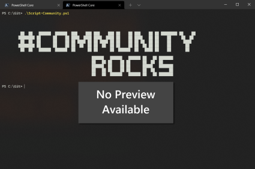

# Create Hub Navigation from Teams and Channels 

## Summary

This script shows how to add navigation links to a SharePoint hub site based on Microsoft Teams team or channel links  connecting to the hub site, find or create a parent navigation node (for example "Projects"), add the team as a parent node and then add channels as child links under that team in alphabetical order.



# [PnP PowerShell](#tab/pnpps)

```powershell
#connection details
$clientId = "xxxxxxx-xxxx-xxxx-xxxx-xxxxxxxx"
$invocation = (Get-Variable MyInvocation).Value
$directorypath = Split-Path $invocation.MyCommand.Path

$csvPath = $directorypath + "\TeamsChannelsExport.csv" # CSV should have a column`TeamName`, `ChannelName`, `SiteUrl` and `HubSiteUrl`.

# Read sites from CSV
$sites = Import-Csv -Path $csvPath

function Add-ChannelNavigationLink {
    param(
        [string]$teamName,
        [string]$channelName,
        [string]$hubSiteUrl,
        [string]$channelSiteURL,
        [string]$teamSiteUrl,
        [string]$navParent
    )
    write-host "Adding site to hub navigation - $($channelSiteURL)" -ForegroundColor Green
    if($hubSiteUrl)
    {
        try {
            $pnpHubConnection = Connect-PnPOnline -ClientId $clientId  -Url $hubSiteUrl  -ReturnConnection
          
            $CurrentNavigation = Get-PnPNavigationNode -Location TopNavigationBar -Connection $pnpHubConnection

            $teamNode = $null
                #check if the parent node exists
                $parentNode = $null
                if($navParent)
                {
                    $parentNode = $CurrentNavigation | Where-Object { $_.Title -eq $navParent}
                    if(!$parentNode)
                    {
                        $parentNode = Add-PnPNavigationNode -Location TopNavigationBar -Title $navParent -url "http://linkless.header/"  -Connection $pnpHubConnection
                         write-host "Added Parent Node: $($navParent) to Hub navigation" -ForegroundColor Green
                    }
                }
                
                ###new code
                write-host "Adding team site: $($teamName) to Hub navigation" -ForegroundColor Green
                # Find the correct position to insert alphabetically
                $preNode = $null
                if($parentNode)
                {
                    Get-PnPProperty -ClientObject $parentNode -Property Children -Connection $pnpHubConnection| Out-Null
                    $teamNode = $parentNode.Children| Where-Object { $_.Title -eq $teamName}
           
                    if(!$teamNode){
                        write-host "Team site not found in navigation: $teamName" -ForegroundColor Green
                    
                      $preNode =  $parentNode.Children | Where-Object { $_.Title -lt $teamName } | Select-Object -Last 1 -ErrorAction SilentlyContinue
                      if ($preNode) {
                        $teamNode = Add-PnPNavigationNode -Location TopNavigationBar -Title $teamName -Url $teamSiteUrl -PreviousNode $preNode.Id -Parent $parentNode.Id -OpenInNewTab -Connection $pnpHubConnection
                       }
                       else {
                        $teamNode = Add-PnPNavigationNode -Location TopNavigationBar -Title $teamName -Url $teamSiteUrl  -First -Parent $parentNode.Id -OpenInNewTab -Connection $pnpHubConnection
                       }
                    }
                }
                else {       
                    $teamNode = $CurrentNavigation | Where-Object { $_.Title -eq $teamName}
                    if(!$teamNode){
                        write-host "Team site not found in navigation: $teamName" -ForegroundColor Green
                      $preNode = $CurrentNavigation | Where-Object { $_.Title -lt $teamName } | Select-Object -Last 1 -ErrorAction SilentlyContinue
                      if ($preNode) {
                        $teamNode = Add-PnPNavigationNode -Location TopNavigationBar -Title $teamName -Url $teamSiteUrl -PreviousNode $preNode.Id  -OpenInNewTab -Connection $pnpHubConnection
                       }
                       else {
                        $teamNode = Add-PnPNavigationNode -Location TopNavigationBar -Title $teamName -Url $teamSiteUrl  -First -OpenInNewTab -Connection $pnpHubConnection
                       }
                    }
                }            
          if($channelName -ne "General"){
            $channelNodeExists = $null
            Get-PnPProperty -ClientObject $teamNode -Property Children -Connection $pnpHubConnection| Out-Null
            if ($teamNode.Children) {
                $channelNodeExists = $teamNode.Children | Where-Object { $_.Url -eq $channelSiteURL }
            }
 
            if (!$channelNodeExists) {
                # Add channel navigation link in alphabetical order
                if (!$teamNode.Children) {
                    # No existing children, add as first child
                    Add-PnPNavigationNode -Location TopNavigationBar -Title $channelName -Url $channelSiteURL -Parent $teamNode.Id -OpenInNewTab -Connection $pnpHubConnection | Out-Null
                }
                else {
                    # Find correct position alphabetically among existing children
                    $preNode = $teamNode.Children | Where-Object { $_.Title -lt $channelName } | Select-Object -Last 1 -ErrorAction SilentlyContinue
                    if ($preNode) {
                      Add-PnPNavigationNode -Location TopNavigationBar -Title $channelName -Url $channelSiteURL -Parent $teamNode.Id -PreviousNode $preNode.Id -OpenInNewTab -Connection $pnpHubConnection | Out-Null
                    }
                    else{
                       Add-PnPNavigationNode -Location TopNavigationBar -Title $channelName -Url $channelSiteURL -Parent $teamNode.Id -OpenInNewTab -Connection $pnpHubConnection -First  | Out-Null
                    }
                }
 
                write-host "Added channel navigation: $($channelName) under $($teamNode.Title)" -ForegroundColor Green
            }
            else {
                write-host "Channel navigation already exists: $($channelName)" -ForegroundColor Green
            }
         }
        }
        catch {
            write-host "Error adding channel navigation link for $($channelName)`: $($_.Exception.Message)" -ForegroundColor Red
        }
    }
    else {
        write-host "Hub site url not provided for '$($channelSiteURL)'" -ForegroundColor Red
    }
}


foreach ($site in $sites) {
    if($site.ChannelName -eq "General")
    {
        Add-ChannelNavigationLink -teamName $site.TeamName -channelName $site.ChannelName -hubSiteUrl $site.HubSiteUrl -teamSiteUrl $site.SiteUrl  -navParent "Projects"
    }
    else{
        Add-ChannelNavigationLink -teamName $site.TeamName -channelName $site.ChannelName -hubSiteUrl $site.HubSiteUrl -channelSiteURL $site.SiteUrl -navParent "Projects"
    }
}
```

[!INCLUDE [More about PnP PowerShell](../../docfx/includes/MORE-PNPPS.md)]

***

## Source Credit

Sample first appeared on [Create Hub Navigation from Teams and Channels with PnP PowerShell](https://reshmeeauckloo.com/posts/powershell-pnp-navigation-team-channel/)

## Contributors

| Author(s) |
|-----------|
| [Reshmee Auckloo](https://github.com/reshmee011) |


[!INCLUDE [DISCLAIMER](../../docfx/includes/DISCLAIMER.md)]

