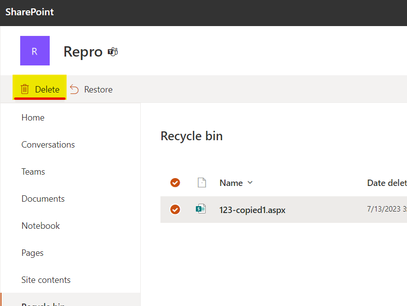

# Bulk delete recycle bin items from a site in batch

## Summary

This script performs a two-step process to manage the recycle bin items in a SharePoint Online site. Here's a summary of the script's functionality: 

Step 1: 
- The script connects to a SharePoint Online site using PnP PowerShell. 
- It defines a date range and retrieves recycle bin items meeting specific conditions based on a defined CSV file. 
- The retrieved items are exported to a CSV file named "recyclebin.csv." 

Step 2: 
- The script connects again to the same SharePoint Online site using PnP PowerShell. 
- It reads the "recyclebin.csv" file, which should have been manually modified to contain only the items intended for deletion. 
- The script processes the items in batches (default batch size: 10) and deletes them from the recycle bin using SharePoint's REST API. 
- The results of the deletion process are written to "recyclebinresults.csv." 

Both steps include informative messages to keep users updated on the progress and status of the operations. 

Note: The script relies on the PnP PowerShell module to interact with SharePoint Online, and it is essential to have the module installed and authenticated before executing the script. Additionally, users should carefully review and modify the "recyclebin.csv" file in Step 2 to ensure that only the intended items are deleted. 



# [PnP PowerShell](#tab/pnpps)

```powershell

######################################################### 
# Step 1: Execute this part only and wait for it to complete.
# This step will get the items from the recycle bin based on the defined condition in CSV
######################################################### 

## PnP PowerShell 

$today = (Get-Date)  

# Specify date from  
$date1 = $today.Date.AddDays(-8)  

# Specify date to  
$date2 = $today.Date.AddDays(-5)  

Connect-PnPOnline -Url https://o365premier.sharepoint.com/sites/repro -Interactive 

$recycleBinItems = Get-PnPRecycleBinItem -RowLimit 999999 | ? { 
    ($_.DeletedByEmail -eq 'Eilaf.Barmare@o365premier.onmicrosoft.com') -and 
    (($_.DeletedDate -gt $date1) -and ($_.DeletedDate -lt $Date2))
}

$recycleBinItems | Export-Csv C:\recyclebin.csv -NoTypeInformation 

# Open CSV and remove rows you do not wish to delete. Save the CSV file.

######################################################### 
# Step 2: Now execute the below part and wait for it to complete.
# This step will fetch the items from the CSV report stored locally and delete the items by IDs in a batch of 10 items (default)
######################################################### 

# Input file 
$Path = "C:\recyclebin.csv" 

# Output file 
$OutputFile = "C:\recyclebinresults.csv" 

$NoInBatch = 10 

$ErrorActionPreference = 'Stop' 
$InformationPreference = 'Continue' 

Connect-PnPOnline -Url "https://o365premier.sharepoint.com/sites/repro" -Interactive 

function Start-Processing { 
    [CmdletBinding()] 
    param( 
        [Parameter(Mandatory = $true)] 
        [string] 
        $csvFilePath, 

        [Parameter(Mandatory = $true)] 
        [int] 
        $processBatchCount 
    ) 

    $csvItems = Get-Content -Path $csvFilePath | ConvertFrom-Csv 
    $recycleBinSplit = Split-Array -InputObject $csvItems -Size $processBatchCount 

    $batchCount = $recycleBinSplit.Count 
    $i = 0 

    if ($recycleBinSplit.Count -eq $csvItems.Count) { 
        Write-Information -MessageData "Purging deleted items batch 1 of 1 containing $($recycleBinSplit.Count) items..." 
        Clear-RecycleBinItems -Ids $recycleBinSplit 
    } else { 
        $recycleBinSplit | ForEach-Object { 
            $items = $PSItem 
            $i++
            Write-Information -MessageData "Purging deleted items batch $i of $batchCount containing $($items.Count)..." 
            Clear-RecycleBinItems -Ids $items 
        } 
    } 
} 

function Split-Array { 
    [CmdletBinding()] 
    param ( 
        [Parameter(Mandatory)] 
        [object[]] $InputObject, 

        [int] $Size = 10 
    ) 

    $outArray = @() 
    $parts = [math]::Ceiling($InputObject.Count / $Size) 

    for ($i = 0; $i -le $parts - 1; $i++) { 
        $start = $i * $Size 
        $end = (($i + 1) * $Size) - 1 
        $outArray += , @($InputObject[$start..$end]) 
    } 

    Write-Output $outArray 
} 

function Clear-RecycleBinItems { 
    param( 
        [Parameter(Mandatory)] 
        [Object[]] 
        $Ids 
    ) 

    $apiCall = "/_api/site/RecycleBin/DeleteByIds" 
    $idsString = ($Ids).Id -join "','" 
    $body = "{'ids':['$idsString']}" 

    try { 
        Invoke-PnPSPRestMethod -Method Post -Url $apiCall -Content $body | Out-Null 
        Write-Information "Batch Success" 
        $Ids | ForEach-Object { 
            $id = $PSItem 
            $id | Add-Member -MemberType NoteProperty -Name "Status" -Value "Success" 
            Write-Output $id 
        } 
    } catch { 
        $Exception = $_ 
        Write-Warning "Unable to process as a batch, processing individually...." 
        $Ids | ForEach-Object { 
            $id = $PSItem 
            try { 
                $body = "{'ids':['$($id.Id)']}" 
                Invoke-PnPSPRestMethod -Method Post -Url $apiCall -Content $body | Out-Null 
                Write-Information "Success: $($id.Id)" 
                $id | Add-Member -MemberType NoteProperty -Name "Status" -Value "Success" 
                Write-Output $id 
            } catch { 
                $Exception = $_ 
                $odataError = $Exception.Exception.Message | ConvertFrom-Json 
                $message = $odataError.'odata.error'.message.value 

                if ($message.Contains("Value does not fall within the expected range.") -eq $true) { 
                    $message = "No longer in recycle bin / Previously deleted" 
                } 

                $id | Add-Member -MemberType NoteProperty -Name "Status" -Value $message 
                Write-Information "Failed: $($id.Id) - $message" 
                Write-Output $id 
            } 
        } 
    } 
} 

Write-Information -MessageData "Processing file $Path and purging recycle bin items in batches of $NoInBatch..." 
Start-Processing -csvFilePath $Path -processBatchCount $NoInBatch | Export-Csv $OutputFile -NoTypeInformation


```
[!INCLUDE [More about PnP PowerShell](../../docfx/includes/MORE-PNPPS.md)]

## Source Credit

Sample first appeared on [https://pnp.github.io/script-samples/bulk-restore-from-recyclebin/]

## Contributors

| Author(s) |
|-----------|
| Eilaf Barmare |


[!INCLUDE [DISCLAIMER](../../docfx/includes/DISCLAIMER.md)]
