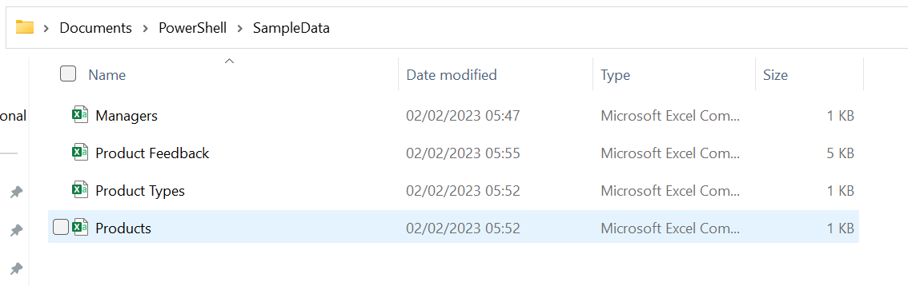

# Bulk import data from multiple files to multiple lists

## Summary
The script can help import test data in bulk into multiple lists in SharePoint Online. 

  

# [PnP PowerShell](#tab/pnpps)

```powershell
#The script is to import sample data into a test environment for one or multiple lists
$config = @{ lists = @("Product Types","Managers", "Products","Product Feedback" ) }


#Config Variables
$SiteURL = "https://tenant.sharepoint.com/teams/test"
#the file names need to match the list names provided in the lists array.
$path = "E:\Sample_Data\"


#Function to get Lookup ID from Lookup Value
Function Get-LookupID($listName, $LookupFieldName, $LookupValue)
{
    #Get Parent Lookup List and Field from Child Lookup Field's Schema XML
    $LookupField =  Get-PnPField -List $listName -Identity $LookupFieldName
    [Xml]$Schema = $LookupField.SchemaXml
    $ParentListID = $Schema.Field.Attributes["List"].'#text'
    $ParentField  = $Schema.field.Attributes["ShowField"].'#text'
    $ParentLookupItem  = Get-PnPListItem -List $ParentListID -Fields $ParentField | Where {$_[$ParentField] -eq $LookupValue} | Select -First 1
    If($ParentLookupItem -ne $Null)  { Return $ParentLookupItem["ID"] }  Else  { Return $Null }
}

Try {
    #Connect to the Site
    Connect-PnPOnline -URL $SiteURL -Interactive


    foreach($listName in $config.lists){
      $CSVFilePath = "{0}{1}{2}{3}" -f  $path,"\",$listName ,".csv"
      #Get the data from CSV file
      $CSVData = Import-CSV $CSVFilePath

      #Get the List to Add Items
      $List = Get-PnPList -Identity $listName

       #Get fields to Update from the List - Skip Read only, hidden fields, content type and attachments
       $ListFields = Get-PnPField -List $listName | Where { (-Not ($_.ReadOnlyField)) -and (-Not ($_.Hidden)) -and ($_.InternalName -ne  "ContentType") -and ($_.InternalName -ne  "Attachments") }

       #Loop through each Row in the CSV file and update the matching list item ID
       ForEach($Row in $CSVData){
         #Frame the List Item to update
         $ItemValue = @{}           
         $CSVFields = $Row | Get-Member -MemberType NoteProperty | Select -ExpandProperty Name
         #Map each field from CSV to target list
         Foreach($CSVField in $CSVFields){
            $MappedField = $ListFields | Where {$_.InternalName -eq $CSVField}
            If($MappedField -ne $Null){
               $FieldName = $MappedField.InternalName
                #Check if the Field value is not Null
                If($Row.$CSVField -ne $Null){
                    #Handle Special Fields
                    $FieldType  = $MappedField.TypeAsString
                    If($FieldType -eq "User" -or $FieldType -eq "UserMulti"){ #People Picker Field
                        $PeoplePickerValues = $Row.$FieldName.Split(",")
                        $ItemValue.add($FieldName,$PeoplePickerValues)
                    }
                    ElseIf($FieldType -eq "Lookup" -or $FieldType -eq "LookupMulti"){ #Lookup Field
                        $LookupIDs = $Row.$FieldName.Split(",") | ForEach-Object { Get-LookupID -ListName $listName -LookupFieldName $FieldName -LookupValue $_ }               
                        $ItemValue.Add($FieldName,$LookupIDs)
                    }
                    ElseIf($FieldType -eq "DateTime"){
                       if($Row.$FieldName -ne ""){
                          $datetime = [datetime]::ParseExact( $Row.$FieldName, 'dd/MM/yyyy', $null)
                         $ItemValue.Add($FieldName,$datetime)
                      }
                    }
                    Else{
                        #Get Source Field Value and add to Hashtable
                        $ItemValue.Add($FieldName,$Row.$FieldName)
                    }
                }
            }
        }
        Write-host "Adding List item with values:"
        $ItemValue | Format-Table
        #Add New List Item
        Add-PnPListItem -List $listName -Values $ItemValue | Out-Null
    }
  }
}
Catch {
    write-host "Error: $($_.Exception.Message)" -foregroundcolor Red
}

```


[!INCLUDE [More about PnP PowerShell](../../docfx/includes/MORE-PNPPS.md)]

***

## Contributors

| Author(s) |
|-----------|
| Reshmee Auckloo |


[!INCLUDE [DISCLAIMER](../../docfx/includes/DISCLAIMER.md)]


