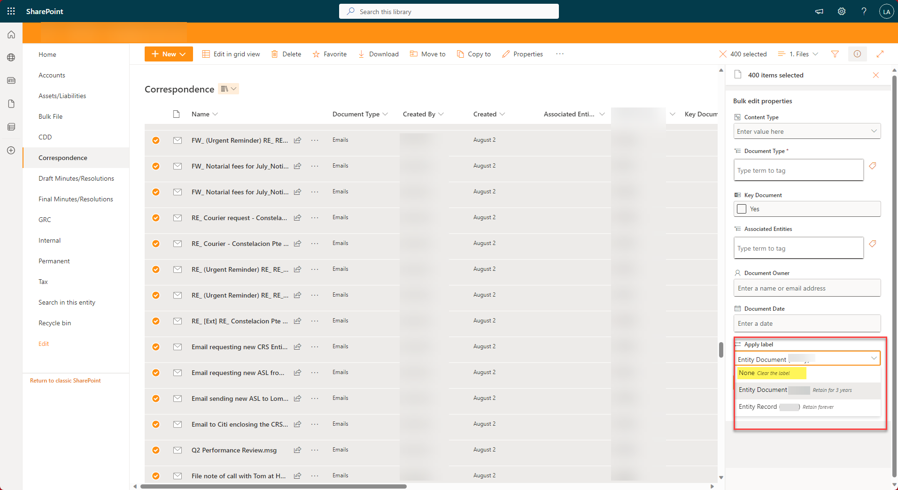

# Bulk remove retention labels from files in a SharePoint Library

## Summary

Bulk remove all retention labels from all files in a library that are labelled with the retention label. These files will now no longer be tagged with a retentionlabel

I had a requirement to complete a migration again but first needed to remove the labels from the files before I could complete the re-migration. It was slow removing the labels one by one using PowerShell and was quicker using the UI by bulk selecting 200 files and then removing the label in the details pain. I then looked using the developer tools to see how this took place behind the scenes and saw it uses the endpoint **/_api/SP.CompliancePolicy.SPPolicyStoreProxy.ApplyLabelOnBulkItems()**

This script
- Finds all the files in a library tagged with a specified label(s) and obtains their ID
- Splits the list of IDs into batches of 200 (the max supported per call to endpoint)
- Creates a JSON payload formulated with the library details and the list item IDs (max 200) of labelled files.
- Send this JSON payload to /_api/SP.CompliancePolicy.SPPolicyStoreProxy.ApplyLabelOnBulkItems() to remove all labels from the files.
- Repeats in batches of 200 until all the labels are removed from named labelled files in a library.

See below for how the above can be done in the UI but use this script instead and save lots of button clicking :)


# [PnP PowerShell](#tab/pnpps)

```powershell
#----------------------------------------------------------[Local variables to update]----------------------------------------------------------
$labelsToRemove =  "Entity Document","Entity Record" #Enter name of labels to remove
$siteURL = "https://contoso.sharepoint.com/sites/EntitySite" # Enter site url
$libraries = "Documents","Reports" # Enter Document Library Names Here
#---------------------------------------------------------[Initialisation]--------------------------------------------------------
Clear-Host
#-----------------------------------------------------------[Execution]-----------------------------------------------------------


function Split-Collection {
    [CmdletBinding()]
    param(
        [Parameter(Mandatory, ValueFromPipeline)]
        [object[]] $InputObject,

        [Parameter(Position = 0)]
        [ValidateRange(1, [int]::MaxValue)]
        [int] $ChunkSize = 5
    )

    begin {
        $list = [System.Collections.Generic.List[object]]::new()
    }
    process {
        foreach($item in $InputObject) {
            $list.Add($item)
            if($list.Count -eq $ChunkSize) {
                $PSCmdlet.WriteObject($list.ToArray())
                $list.Clear()
            }
        }
    }
    end {
        if($list.Count) {
            $PSCmdlet.WriteObject($list.ToArray())
        }
    }
}

Write-Host "Connecting to site: $($siteURL)" -foregroundcolor Green

try
{
    Connect-PnPOnline -url $siteURL -Interactive
    $ctx = Get-PnPContext
}
catch
{
    write-host  "You don't have permission to site - $($siteURL)" -foregroundcolor Red
    write-host  "Error: $($_.Exception.Message)" -foregroundcolor Red
    exit
}


foreach($label in $labelsToRemove)
{
    foreach($lib in $libraries)
    {
        try
        {
            Write-Host "Processing $lib library in $siteURL"
            $DocumentsLib = Get-PnPList -Identity $lib

            #Gettings All Items with Label - workaround if more than 5000 items as CAML can then not be used.
            if($DocumentsLib.ItemCount -gt 4999)
            {
                $items = Get-PnPListItem -List $DocumentsLib -PageSize 5000 | Where-Object { $_.FieldValues._ComplianceTag -eq $label} | Select-Object Id
            }
            else 
            {
                $CAML = "<View><Query><Where><Eq><FieldRef Name='_ComplianceTag' /><Value Type='Text'>$label</Value></Eq></Where></Query></View>"
                $items = Get-PnPListItem -List $DocumentsLib -PageSize 5000 -Query $caml | Select-Object Id
            }

            if($items.Count -gt 0)
            {
                Write-Host "   $($items.Count) items with $label label found for $($lib.Title)" -ForegroundColor Magenta
                
                $items.Id | Split-Collection 200 | ForEach-Object {

                $JSON ="{
                    ""blockDelete"": false,
                    ""blockEdit"": false,
                    ""complianceTagValue"": """",
                    ""itemIds"": [
                        $($_ -join "","")
                    ],
                    ""listUrl"": ""$($DocumentsLib.RootFolder.ServerRelativeUrl)""
                }"

                Write-Host "     Created JSON Payload to Remove Label: $label from $($_.Count) files" -ForegroundColor Yellow

                Invoke-PnPSPRestMethod -Method Post -Url "$($ctx.Url)/_api/SP.CompliancePolicy.SPPolicyStoreProxy.ApplyLabelOnBulkItems()"  -ContentType "application/json;odata=verbose" -Content $JSON
                }
            }
            else
            {
                Write-Host "   No items with $label label found for $($lib.Title)" -ForegroundColor Green
            }
        }
        catch
        {
            Write-Host  "Error: $($_.Exception.Message)" -ForegroundColor Red
        }
    }
}


```
[!INCLUDE [More about PnP PowerShell](../../docfx/includes/MORE-PNPPS.md)]
***


## Contributors

| Author(s) |
|-----------|
| [Leon Armston](https://github.com/LeonArmston) |

[!INCLUDE [DISCLAIMER](../../docfx/includes/DISCLAIMER.md)]

