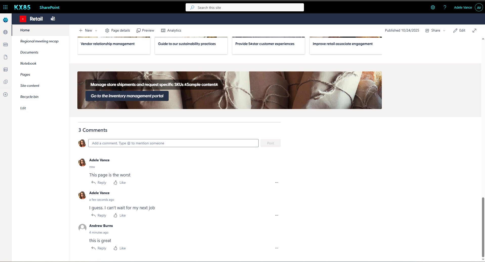
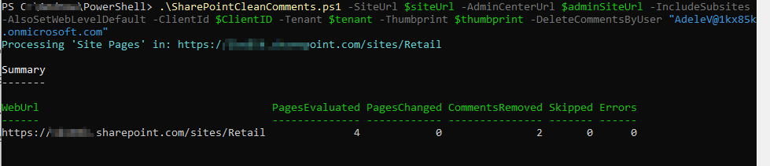

# SharePoint Clean Comments

> [!Note]
> Further details on registering an app for using PnP PowerShell see Saluadeen > Rajacks [blog article](https://www.sharepointdiary.com/2022/10/connect-to-sharepoint-online-using-azure-ad-app-id-from-powershell.html) (External Site)

## Summary

Remove comments for user(s) across entire site collection or remove all comments or disable them completely:

* Follow the article above to create a pnp app registration
* Use a combination of flags for your desired outcome
* By User -DeleteCommentsByUser "alex.wu@contoso.com","i:0#.f|membership|olduser@contoso.com" 
* All Comments -DeleteExistingComment
* Disable Comments -DisableComment




This Page lists all of Adeles Comments.

Next we'll execute the script to remove her comments (I've added a new one so you can compare the time stamps)



Here we can see her comments are gone.


# [PnP PowerShell](#tab/pnpps)

```powershell

<# 
----------------------------------------------------------------------------

Created:      Andrew Burns
Date:         10/17/2025
Disclaimer:   

THE SOFTWARE IS PROVIDED "AS IS", WITHOUT WARRANTY OF ANY KIND, EXPRESS OR
IMPLIED, INCLUDING BUT NOT LIMITED TO THE WARRANTIES OF MERCHANTABILITY,
FITNESS FOR A PARTICULAR PURPOSE AND NONINFRINGEMENT. IN NO EVENT SHALL THE
AUTHORS OR COPYRIGHT HOLDERS BE LIABLE FOR ANY CLAIM, DAMAGES OR OTHER
LIABILITY, WHETHER IN AN ACTION OF CONTRACT, TORT OR OTHERWISE, ARISING FROM,
OUT OF OR IN CONNECTION WITH THE SOFTWARE OR THE USE OR OTHER DEALINGS IN THE
SOFTWARE.

.Synopsis

    Disable comments and/or delete existing comments on all modern SharePoint pages in a site collection.
    PnP.PowerShell + App Registration (certificate / thumbprint).

.Usage

    Delete all comments or turn off comments on all pages within a site collection or both.

.Parameters
-DisableComments            Turn off comments at site/web/page scope.
-DeleteExistingComments     Delete all comments on each page.
-DeleteCommentsByUser       One or more UPNs/emails/claims to delete comments from specific user(s).
-AlsoSetWebLevelDefault     Also set web-level default (subsites too if included).
-SkipSiteLevelDisable       Skip the site collection level toggle.
-IncludeSubsites            Include subsites.
-WhatIfMode                 Dry run—no changes.

    
.Auth
    Connect-PnPOnline -Url <...> -ClientId <GUID> -Tenant <tenant> -Thumbprint <thumb>
    (Requires an Entra ID app with suitable SharePoint **Application** permissions; typically Sites.FullControl.All.) 
    See: Register an Entra ID app for PnP PowerShell. 

.Reqs
    - PowerShell 7+
    - Module: PnP.PowerShell

.References
    Salaudeen Rajack Connect to SharePoint Online using PnP PowerShell with App Registration
    https://www.sharepointdiary.com/2022/10/connect-to-sharepoint-online-using-azure-ad-app-id-from-powershell.html

.Examples
    
    Remove All Comments By User(s)
    .\SharePointCleanComments.ps1 -SiteUrl $siteUrl -AdminCenterUrl $adminSiteUrl -IncludeSubsites -AlsoSetWebLevelDefault -ClientId $ClientID -Tenant $tenant -Thumbprint $thumbprint -DeleteCommentsByUser "alex.wu@contoso.com","i:0#.f|membership|olduser@contoso.com

    Remove All Comments
    .\SharePointCleanComments.ps1 -SiteUrl $siteUrl -AdminCenterUrl $adminSiteUrl -IncludeSubsites -AlsoSetWebLevelDefault -ClientId $ClientID -Tenant $tenant -Thumbprint $thumbprint -DeleteExistingComments

    Remove All Comments and Disable all Comments
    .\SharePointCleanComments.ps1 -SiteUrl $siteUrl -AdminCenterUrl $adminSiteUrl -IncludeSubsites -AlsoSetWebLevelDefault -ClientId $ClientID -Tenant $tenant -Thumbprint $thumbprint -DisableComments -DeleteExistingComments

 ----------------------------------------------------------------------------

 .REFERENCES
- Connect-PnPOnline (auth options) – https://pnp.github.io/powershell/cmdlets/Connect-PnPOnline.html
- Get-PnPListItemComment (cmdlet + properties) – PnP repo docs/source
- Remove-PnPListItemComment (source implementation) – PnP repo
- Comment replies REST shape – PnP discussion (replies endpoint)
#>


[CmdletBinding()]
param(
    [Parameter(Mandatory=$true)]
    [string]$SiteUrl,

    [Parameter(Mandatory=$false)]
    [string]$AdminCenterUrl,

    [Parameter(Mandatory=$false)]
    [switch]$IncludeSubsites,

    [Parameter(Mandatory=$false)]
    [switch]$SkipSiteLevelDisable,

    [Parameter(Mandatory=$false)]
    [switch]$AlsoSetWebLevelDefault,

    [Parameter(Mandatory=$false)]
    [switch]$WhatIfMode,

    # --- Work flags ---
    [Parameter(Mandatory=$false)]
    [switch]$DisableComments,

    [Parameter(Mandatory=$false)]
    [switch]$DeleteExistingComments,

    [Parameter(Mandatory=$false)]
    [Alias('DeleteCommentsByEmail','DeleteCommentsByUpn')]
    [string[]]$DeleteCommentsByUser,               # UPN/email/claims; accepts multiple

    # --- App registration (certificate) ---
    [Parameter(Mandatory=$true)]
    [string]$ClientId,

    [Parameter(Mandatory=$true)]
    [string]$Tenant,      # e.g. contoso.onmicrosoft.com or Tenant GUID

    [Parameter(Mandatory=$true)]
    [string]$Thumbprint
)

function Ensure-Module {
    param([Parameter(Mandatory=$true)][string]$Name)
    if (-not (Get-Module -ListAvailable -Name $Name)) {
        Write-Host "Installing module $Name..." -ForegroundColor Yellow
        try { Install-Module $Name -Scope CurrentUser -Force -AllowClobber -ErrorAction Stop }
        catch { throw "Failed to install module '$Name'. Error: $($_.Exception.Message)" }
    }
    Import-Module $Name -ErrorAction Stop
}

function Connect-PnPApp {
    param(
        [Parameter(Mandatory=$true)][string]$Url,
        [Parameter(Mandatory=$true)][string]$ClientId,
        [Parameter(Mandatory=$true)][string]$Tenant,
        [Parameter(Mandatory=$true)][string]$Thumbprint
    )
    Connect-PnPOnline -Url $Url -ClientId $ClientId -Tenant $Tenant -Thumbprint $Thumbprint -ReturnConnection
}

function Normalize-IdentityString {
    param([string]$Value)
    if ([string]::IsNullOrWhiteSpace($Value)) { return $null }
    return ($Value.Trim().ToLower() -replace '^i:0#.f\|membership\|','')
}

function Should-DeleteByUser {
    param(
        [Parameter(Mandatory=$true)]$Comment,      # PnP comment object
        [Parameter(Mandatory=$true)][string[]]$UserFilters
    )
    if (-not $UserFilters -or $UserFilters.Count -eq 0) { return $false }

    $targets = $UserFilters | ForEach-Object { Normalize-IdentityString $_ } | Where-Object { $_ }
    if ($targets.Count -eq 0) { return $false }

    $login = $null; $email = $null; $title = $null
    try { $login = Normalize-IdentityString $Comment.Author.LoginName } catch {}
    try { $email = Normalize-IdentityString $Comment.Author.Email } catch {}
    try { $title = Normalize-IdentityString $Comment.Author.Title } catch {}

    foreach ($t in $targets) {
        if ($t -and ($t -eq $login -or $t -eq $email -or $t -eq $title)) { return $true }
    }
    return $false
}

function Remove-CommentByIdRest {
    param(
        [Parameter(Mandatory=$true)][string]$WebUrl,
        [Parameter(Mandatory=$true)][int]$ItemId,
        [Parameter(Mandatory=$true)][int]$CommentId,
        [Parameter(Mandatory=$true)]$Connection
    )
    # DELETE /_api/web/lists/getByTitle('Site%20Pages')/items({id})/comments({commentId})
    $url = "$WebUrl/_api/web/lists/getByTitle('Site%20Pages')/items($ItemId)/comments($CommentId)"
    Invoke-PnPSPRestMethod -Method Delete -Url $url -Connection $Connection -ErrorAction Stop | Out-Null
}

function Disable-SiteLevelComments {
    param(
        [Parameter(Mandatory=$true)][string]$AdminCenterUrl,
        [Parameter(Mandatory=$true)][string]$TargetSiteUrl,
        [Parameter(Mandatory=$true)][string]$ClientId,
        [Parameter(Mandatory=$true)][string]$Tenant,
        [Parameter(Mandatory=$true)][string]$Thumbprint,
        [switch]$WhatIfMode
    )
    if (-not $DisableComments) { return }

    Write-Host "Disabling comments at the *site collection* level for $TargetSiteUrl..." -ForegroundColor Cyan
    if ($WhatIfMode) {
        Write-Host "[WhatIf] Set-PnPSite -Identity $TargetSiteUrl -CommentsOnSitePagesDisabled" -ForegroundColor DarkGray
        return
    }

    $adminCon = Connect-PnPApp -Url $AdminCenterUrl -ClientId $ClientId -Tenant $Tenant -Thumbprint $Thumbprint
    try {
        Set-PnPSite -Identity $TargetSiteUrl -CommentsOnSitePagesDisabled -Connection $adminCon -ErrorAction Stop
        Write-Host "Site-level comments disabled." -ForegroundColor Green
    } catch {
        Write-Warning "Set-PnPSite failed for $TargetSiteUrl. Error: $($_.Exception.Message)"
    }
}

function Get-AllWebUrls {
    param(
        [Parameter(Mandatory=$true)][string]$RootSiteUrl,
        [Parameter(Mandatory=$true)][string]$ClientId,
        [Parameter(Mandatory=$true)][string]$Tenant,
        [Parameter(Mandatory=$true)][string]$Thumbprint,
        [switch]$IncludeSubsites
    )

    $urls = New-Object System.Collections.Generic.List[string]
    $urls.Add($RootSiteUrl)

    $rootCon = Connect-PnPApp -Url $RootSiteUrl -ClientId $ClientId -Tenant $Tenant -Thumbprint $Thumbprint

    if ($IncludeSubsites) {
        try {
            $subs = Get-PnPSubWeb -Recurse -IncludeRootWeb:$false -Connection $rootCon -ErrorAction Stop
            foreach ($w in $subs) { if ($w.Url) { $urls.Add($w.Url) } }
        } catch {
            Write-Warning "Failed to enumerate subsites. Error: $($_.Exception.Message)"
        }
    }
    return $urls
}

function Set-WebDefaultIfRequested {
    param(
        [Parameter(Mandatory=$true)][string]$WebUrl,
        [Parameter(Mandatory=$true)][string]$ClientId,
        [Parameter(Mandatory=$true)][string]$Tenant,
        [Parameter(Mandatory=$true)][string]$Thumbprint,
        [switch]$WhatIfMode
    )
    if (-not ($AlsoSetWebLevelDefault -and $DisableComments)) { return }

    if ($WhatIfMode) {
        Write-Host "[WhatIf] $WebUrl : Set-PnPWeb -CommentsOnSitePagesDisabled" -ForegroundColor DarkGray
    } else {
        $con = Connect-PnPApp -Url $WebUrl -ClientId $ClientId -Tenant $Tenant -Thumbprint $Thumbprint
        try {
            Set-PnPWeb -CommentsOnSitePagesDisabled -Connection $con -ErrorAction Stop
            Write-Host "Set web-level default (comments disabled) for $WebUrl" -ForegroundColor Green
        } catch {
            Write-Warning "Failed to set web-level default for $WebUrl. Error: $($_.Exception.Message)"
        }
    }
}

function Process-PagesInWeb {
    param(
        [Parameter(Mandatory=$true)][string]$WebUrl,
        [Parameter(Mandatory=$true)][string]$ClientId,
        [Parameter(Mandatory=$true)][string]$Tenant,
        [Parameter(Mandatory=$true)][string]$Thumbprint,
        [switch]$WhatIfMode
    )

    Write-Host "Processing 'Site Pages' in: $WebUrl" -ForegroundColor Cyan
    $con = Connect-PnPApp -Url $WebUrl -ClientId $ClientId -Tenant $Tenant -Thumbprint $Thumbprint

    try { $null = Get-PnPList -Identity "Site Pages" -Connection $con -ErrorAction Stop }
    catch {
        Write-Host "No 'Site Pages' library in $WebUrl. Skipping." -ForegroundColor DarkYellow
        return [pscustomobject]@{ WebUrl=$WebUrl; PagesEvaluated=0; PagesChanged=0; CommentsRemoved=0; Skipped=0; Errors=0 }
    }

    $pagesChanged = 0
    $pagesEvaluated = 0
    $commentsRemoved = 0
    $skipped = 0
    $errors = 0

    $query = @"
<View Scope='RecursiveAll'>
  <Query>
    <Where>
      <And>
        <Eq><FieldRef Name='FSObjType'/><Value Type='Integer'>0</Value></Eq>
        <Contains><FieldRef Name='FileLeafRef'/><Value Type='File'>.aspx</Value></Contains>
      </And>
    </Where>
  </Query>
  <RowLimit>5000</RowLimit>
</View>
"@

    try {
        $items = Get-PnPListItem -List "Site Pages" -PageSize 2000 -Query $query -Connection $con -ErrorAction Stop
    } catch {
        Write-Warning "Failed to enumerate pages in $WebUrl. Error: $($_.Exception.Message)"
        return [pscustomobject]@{ WebUrl=$WebUrl; PagesEvaluated=0; PagesChanged=0; CommentsRemoved=0; Skipped=0; Errors=1 }
    }

    $hasField = $false
    try { $fld = Get-PnPField -List "Site Pages" -Identity "CommentsDisabled" -Connection $con -ErrorAction Stop; if ($fld) { $hasField = $true } } catch {}

    $targetUsers = @()
    if ($DeleteCommentsByUser) { $targetUsers = $DeleteCommentsByUser | ForEach-Object { Normalize-IdentityString $_ } | Where-Object { $_ } }

    foreach ($i in $items) {
        try {
            $pagesEvaluated++
            $name = $i.FieldValues["FileLeafRef"]

            # --- DELETE EXISTING COMMENTS (All OR by user) ---
            if ($DeleteExistingComments -or ($targetUsers.Count -gt 0)) {

                if ($WhatIfMode) {
                    if ($DeleteExistingComments) {
                        Write-Host "[WhatIf] $WebUrl : $name -> Remove-PnPListItemComment -List 'Site Pages' -Identity $($i.Id) -All -Force" -ForegroundColor DarkGray
                    } elseif ($targetUsers.Count -gt 0) {
                        Write-Host "[WhatIf] $WebUrl : $name -> delete comments from user(s): $($targetUsers -join ', ')" -ForegroundColor DarkGray
                    }
                } else {
                    # Fetch comments once
                    $existing = @()
                    try { $existing = Get-PnPListItemComment -List "Site Pages" -Identity $i.Id -Connection $con -ErrorAction SilentlyContinue } catch {}
                    $existing = @($existing)

                    if ($DeleteExistingComments) {
                        if ($existing.Count -gt 0) {
                            try {
                                Remove-PnPListItemComment -List "Site Pages" -Identity $i.Id -All -Force -Connection $con -ErrorAction Stop
                                $commentsRemoved += $existing.Count
                            } catch {
                                $errors++; Write-Warning "Failed to remove all comments on $name. Error: $($_.Exception.Message)"
                            }
                        }
                    } elseif ($targetUsers.Count -gt 0 -and $existing.Count -gt 0) {
                        # Filter by author; delete precisely by ID through REST, fallback to -Text if needed
                        foreach ($c in $existing) {
                            if (Should-DeleteByUser -Comment $c -UserFilters $targetUsers) {
                                try {
                                    if ($c.Id -is [int]) {
                                        Remove-CommentByIdRest -WebUrl $WebUrl -ItemId $i.Id -CommentId $c.Id -Connection $con
                                    } else {
                                        # Fallback to text-based deletion (less precise if duplicates)
                                        Remove-PnPListItemComment -List "Site Pages" -Identity $i.Id -Text $c.Text -Force -Connection $con -ErrorAction Stop
                                    }
                                    $commentsRemoved++
                                } catch {
                                    $errors++; Write-Warning "Failed to remove a comment on $name (author=$($c.Author.LoginName)). Error: $($_.Exception.Message)"
                                }
                            }
                        }
                    }
                } # end not WhatIf
            } # end deletion block

            # --- DISABLE COMMENTS (optional) ---
            if ($DisableComments) {
                if ($hasField) {
                    $current = $i.FieldValues["CommentsDisabled"]
                    if ($current -ne $true) {
                        if ($WhatIfMode) {
                            Write-Host "[WhatIf] $WebUrl : $name -> Set CommentsDisabled = \$true" -ForegroundColor DarkGray
                        } else {
                            Set-PnPListItem -List "Site Pages" -Identity $i.Id -Values @{"CommentsDisabled"=$true} -SystemUpdate -Connection $con | Out-Null
                        }
                        $pagesChanged++
                    } else { $skipped++ }
                } else {
                    if ($WhatIfMode) {
                        Write-Host "[WhatIf] $WebUrl : $name -> Set-PnPPage -Identity '$name' -CommentsEnabled:\$false" -ForegroundColor DarkGray
                    } else {
                        $setOk = $false
                        try { Set-PnPPage -Identity $name -CommentsEnabled:$false -Connection $con -ErrorAction Stop; $setOk = $true }
                        catch {
                            try { Set-PnPClientSidePage -Identity $name -CommentsEnabled:$false -Connection $con -ErrorAction Stop; $setOk = $true }
                            catch { $setOk = $false }
                        }
                        if ($setOk) { $pagesChanged++ } else { $errors++; Write-Warning "Could not disable comments for $name." }
                    }
                }
            }

        } catch {
            $errors++
            Write-Warning "Failed processing page (Id=$($i.Id)) in $WebUrl. Error: $($_.Exception.Message)"
        }
    }

    return [pscustomobject]@{
        WebUrl          = $WebUrl
        PagesEvaluated  = $pagesEvaluated
        PagesChanged    = $pagesChanged
        CommentsRemoved = $commentsRemoved
        Skipped         = $skipped
        Errors          = $errors
    }
}

# -----------------------------
# Main
# -----------------------------
try {
    Ensure-Module -Name "PnP.PowerShell"

    if (-not $DisableComments -and -not $DeleteExistingComments -and -not $DeleteCommentsByUser) {
        Write-Warning "No work selected. Add -DisableComments and/or -DeleteExistingComments and/or -DeleteCommentsByUser."
        return
    }

    if ($DisableComments -and -not $SkipSiteLevelDisable) {
        if ([string]::IsNullOrWhiteSpace($AdminCenterUrl)) {
            Write-Warning "AdminCenterUrl not provided. Skipping site-level toggle. (Pass -AdminCenterUrl https://<tenant>-admin.sharepoint.com)"
        } else {
            Disable-SiteLevelComments -AdminCenterUrl $AdminCenterUrl -TargetSiteUrl $SiteUrl `
                -ClientId $ClientId -Tenant $Tenant -Thumbprint $Thumbprint -WhatIfMode:$WhatIfMode
        }
    }

    $webUrls = Get-AllWebUrls -RootSiteUrl $SiteUrl -ClientId $ClientId -Tenant $Tenant -Thumbprint $Thumbprint -IncludeSubsites:$IncludeSubsites

    $results = New-Object System.Collections.Generic.List[object]
    foreach ($w in $webUrls) {
        Set-WebDefaultIfRequested -WebUrl $w -ClientId $ClientId -Tenant $Tenant -Thumbprint $Thumbprint -WhatIfMode:$WhatIfMode
        $r = Process-PagesInWeb -WebUrl $w -ClientId $ClientId -Tenant $Tenant -Thumbprint $Thumbprint -WhatIfMode:$WhatIfMode
        $results.Add($r)
    }

    # Summary
    Write-Host "`nSummary" -ForegroundColor White
    Write-Host "-------"
    $totalEval     = ($results | Measure-Object -Property PagesEvaluated  -Sum).Sum
    $totalChanged  = ($results | Measure-Object -Property PagesChanged    -Sum).Sum
    $totalDeleted  = ($results | Measure-Object -Property CommentsRemoved -Sum).Sum
    $totalSkipped  = ($results | Measure-Object -Property Skipped         -Sum).Sum
    $totalErrors   = ($results | Measure-Object -Property Errors          -Sum).Sum

    $results | Format-Table -AutoSize

    Write-Host "`nTotals: Evaluated=$totalEval, Changed=$totalChanged, CommentsDeleted=$totalDeleted, Skipped=$totalSkipped, Errors=$totalErrors" -ForegroundColor White

    if ($WhatIfMode) { Write-Host "`n(WhatIf mode was ON. No changes were made.)" -ForegroundColor DarkYellow }
    else { Write-Host "`nCompleted." -ForegroundColor Green }

} catch {
    Write-Error $_.Exception.Message
    exit 1
}


```
[!INCLUDE [More about PnP PowerShell](../../docfx/includes/MORE-PNPPS.md)]
***


## Contributors

| Author(s) |
|-----------|
| Andrew Burns |

[!INCLUDE [DISCLAIMER](../../docfx/includes/DISCLAIMER.md)]


