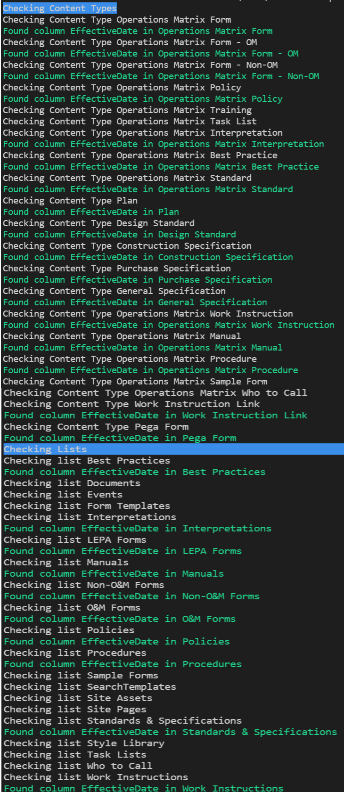
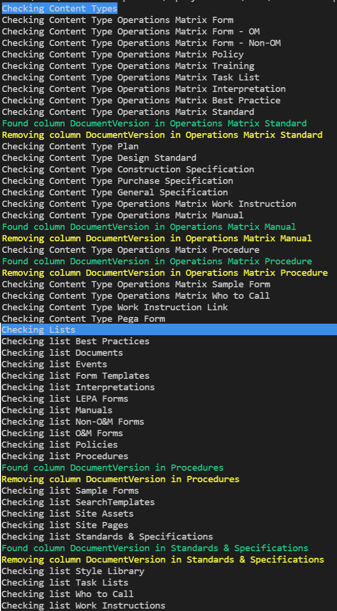
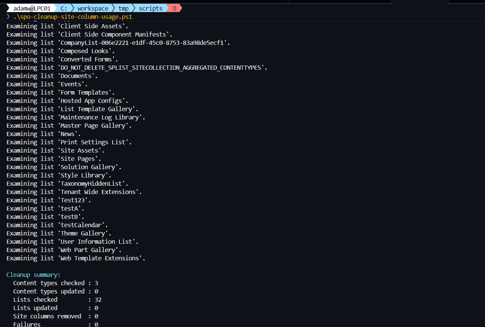
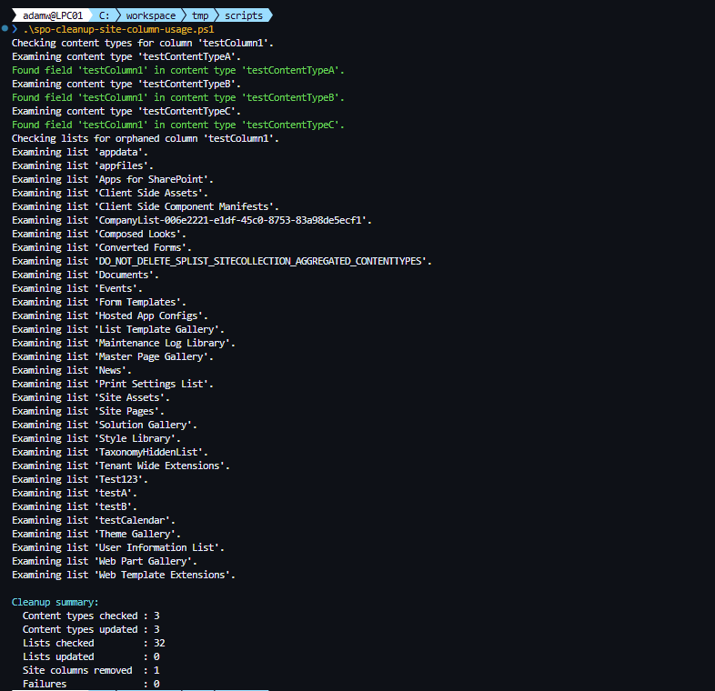

# Clean Up Unwanted Site Columns from Content Types and Lists/Libraries

## Summary

Sometimes when we iteratively build out our information architecture, we’re over-zealous. It seems like we need a set of Site Columns to maintain metadata on lists or libraries, but in the end, we decide we want to trim away a few of the Site Columns we’ve created. Or, maybe you’ve migrated a bunch of metadata into SharePoint with a set of documents and it turns out that metadata is no longer valid or useful.

If the Site Columns exist in only one or two libraries, it’s not a big deal to do this manually. But when you need to remove several Site Columns across a dozen or so Content Types, which are applied to a dozen or so libraries, PowerShell may make more sense.

When we want to clean up use of a Site Column – and we’re setting up our information architecture well – there are three main steps:

* Remove the Site Column from all Content Types which have it.
* Remove the orphaned Site Column from all lists/libraries which have it. When we remove a Site Column from Content Types which are enabled on lists or libraries, the orphaned Site Column remains. This makes sense, because you probably have some data in that column. To truly remove it, you need to remove the column in each list as well.
* Remove the Site Column itself. This removes it from the site entirely.

## $reportOnly = $true



## $reportOnly = $false



---
CLI version of the script works the same except the user needs to provide a list of content types that needs to be checked.

## $reportOnly = $true



## $reportOnly = $false



# [PnP.PowerShell](#tab/pnp-ps)
```powershell
# Import modules
Import-Module PnP.PowerShell

# Base variables
$siteURL = "https://tenant.sharepoint.com/sites/sitename"
$siteColumn = "EffectiveDate"
$reportOnly = $false # If $true, just report. If $false, take action.

# Connect to the tenant
$siteConnection = Connect-PnPOnline -Url $siteUrl -Interactive -ReturnConnection

# Remove the Site Column from all Content Types which have it
Write-Host -BackgroundColor Blue "Checking Content Types"

# Get all the Content Types. Here, I have all my custom Content Types in a Group called _ClientName.
$cts = Get-PnPContentType -Connection $siteConnection | Where-Object { $_.Group -eq "_ClientName" }

foreach ($ct in $cts) {

    Write-Host "Checking Content Type $($ct.Name)"

    $fields = Get-PnPProperty -ClientObject $ct -property "Fields" | Where-Object { $_.InternalName -eq $siteColumn }
    $field = $fields | Where-Object { $_.InternalName -eq $siteColumn }

    if ($field) {
        Write-Host -ForegroundColor Green "Found column $($siteColumn) in $($ct.Name)"
        if (!$reportOnly) {
            Write-Host -ForegroundColor Yellow "Removing column $($siteColumn) in $($ct.Name)"
            Remove-PnPFieldFromContentType -Field $field -ContentType $ct -Connection $siteConnection
        }
    }

}

# Remove the orphaned Site Column from all lists/libraries which have it
Write-Host -BackgroundColor Blue "Checking Lists"

# Get all lists/libraries in the site, but exclude System or Hidden lists
$lists = Get-PnPList -Connection $siteConnection | Where-Object { $_.Hidden -ne $true -and $_.IsSystemList -ne $true }

foreach ($list in $lists) {

    Write-Host "Checking list $($list.Title)"

    $field = Get-PnPField -List $list | Where-Object { $_.InternalName -eq $siteColumn }

    if ($field) {
        Write-Host -ForegroundColor Green "Found column $($siteColumn) in $($list.Title)"

        if (!$reportOnly) {
            Write-Host -ForegroundColor Yellow "Removing column $($siteColumn) in $($list.Title)"
            Remove-PnPField -Identity $field -List $list -Connection $siteConnection -Force
        }

    }

}

# Remove the Site Column itself
if (!$reportOnly) {
    Remove-PnPField -Identity $siteColumn
}
```
[!INCLUDE [More about PnP.PowerShell](../../docfx/includes/MORE-PNPPS.md)]

# [CLI for Microsoft 365 with PowerShell](#tab/cli-m365-ps)
```powershell

# Base variables
$siteURL = "https://tenant.sharepoint.com/sites/sitename"
$contentTypeArray = @('testCT1','CustomContentType1')
$siteColumn = "EffectiveDate"
$reportOnly = $true # If $true, just report. If $false, take action.

$m365Status = m365 status
if ($m365Status -match "Logged Out") {
    m365 login
}

# Remove the Site Column from all Content Types which have it
Write-Host -BackgroundColor Blue "Checking Content Types"

foreach ($contentTypeName in $contentTypeArray) {

    Write-Host "Checking Content Type $contentTypeName"

    $contentType = m365 spo contenttype get --webUrl $siteURL --name $contentTypeName
    $contentType = $contentType | ConvertFrom-Json
    $schemaXml = $contentType.SchemaXml
    $schemaXml = [xml]"<xml>$schemaXml</xml>"
    $field = $schemaXml.xml.ContentType.Fields.Field | ? { $_.Name -eq $siteColumn }

    if ($field) {
        Write-Host -ForegroundColor Green "Found column $($siteColumn) in $($contentTypeName)"
        if (!$reportOnly) {
            Write-Host -ForegroundColor Yellow "Removing column $($siteColumn) in $($contentTypeName)"
            $contentTypeId = $contentType.Id.StringValue
            $fieldLinkId = $field.ID.Replace("{", "").Replace("}", "")
            m365 spo contenttype field remove  --contentTypeId $contentTypeId --fieldLinkId $fieldLinkId --webUrl $siteURL --confirm
        }
    }
}


# Remove the orphaned Site Column from all lists/libraries which have it
Write-Host -BackgroundColor Blue "Checking Lists"

$lists = m365 spo list list --webUrl $siteURL
$lists = $lists | ConvertFrom-Json

foreach ($list in $lists) {

    $listTitle = $list.Title
    Write-Host "Checking list $($listTitle)"

    $field = m365 spo field get --webUrl $siteURL --listTitle $listTitle --fieldTitle $siteColumn

    if ($field) {
        Write-Host -ForegroundColor Green "Found column $($siteColumn) in $($listTitle)"

        if (!$reportOnly) {
            Write-Host -ForegroundColor Yellow "Removing column $($siteColumn) in $($listTitle)"
            m365 spo field remove --webUrl $siteURL --listTitle $listTitle --fieldTitle $siteColumn --confirm
        }
    }
}

# Remove the Site Column itself
if (!$reportOnly) {
    m365 spo field remove --webUrl $siteURL --fieldTitle $siteColumn --confirm
}


```
[!INCLUDE [More about CLI for Microsoft 365](../../docfx/includes/MORE-CLIM365.md)]
***

## Source Credit

Sample first appeared on [Clean Up Unwanted Site Columns from Content Types and Lists/Libraries | Marc D Anderson''s Blog](https://sympmarc.com/2021/10/14/clean-up-unwanted-site-columns-from-content-types-and-lists-libraries/)

## Contributors

| Author(s) |
|-----------|
| Marc D Anderson |
| Adam Wójcik |

[!INCLUDE [DISCLAIMER](../../docfx/includes/DISCLAIMER.md)]

