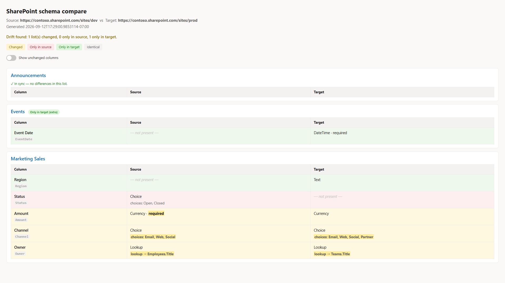

# Compare SharePoint list schema between two sites

## Summary

A schema diff for SharePoint, in the spirit of a SQL schema compare or a git diff. Point it at two sites (or a saved baseline versus a live site) and it reports exactly what drifted between them: lists that exist on only one side, and for every custom column, whether it was Added, Removed, or Changed (type, Required, choices, lookup target, formula, default, or indexing).

It does not copy anything. Provisioning tools already copy structure well; this answers a different question, one they do not: what is actually different between these two sites right now? That comes up constantly for environment drift (Dev, Test, and Prod slowly diverging when someone edits a column by hand), provisioning verification (did `Invoke-PnPSiteTemplate` apply everything?), migration validation, and keeping a schema baseline in source control.

The design point that makes it work: you cannot diff raw `SchemaXml`, because it carries values that differ on every site (GUIDs, `ColName`, version numbers), so a naive comparison flags everything as changed. This script normalises each column to a canonical model and compares that. Columns are matched by internal name, and a lookup's target is resolved from its GUID to the target list title, so a lookup to `Projects` matches across two sites even though the underlying list GUIDs are different.

It runs two ways. Give it two site URLs to compare live, or give it a saved snapshot on one side (export one with `-ExportSourceSnapshot`) to check a live site against a committed baseline. It writes a colour-coded console summary, an HTML report, and a JSON report, and it sets its exit code (`0` in sync, `2` drift found, `1` error) so a pipeline can fail the build when a site has drifted from its approved baseline. The HTML report presents the comparison side by side, one aligned table per list with Source and Target columns colour-coded by status; identical columns are shown too, so it doubles as schema documentation even when the sites are in sync.



> [!Note]
> Reading list and column settings requires access to both sites. Register an app for interactive sign-in once with `Register-PnPEntraIDAppForInteractiveLogin` and pass its client id with `-ClientId`. For unattended runs (CI), pass `-Tenant` and `-Thumbprint` (or `-CertificatePath`) instead for app-only certificate authentication.

This focused sample is drawn from a fuller tool that adds content types, views, and Managed Metadata handling: [SharePoint List Schema Compare](https://github.com/gvijaikumar9/SPSchemaCompare).

# [PnP PowerShell](#tab/pnpps)

```powershell
<#
.SYNOPSIS
  Compare the LIST + FIELD schema of two SharePoint sites (or a saved baseline vs a live site)
  and report exactly what is different - lists only on one side, and per-field Added / Removed / Changed.

.DESCRIPTION
  A "schema compare" for SharePoint, in the spirit of a SQL-schema diff or a git diff.
  It does NOT copy anything. It reads structure and tells you what drifted.

  Use cases:
   - Environment drift (Dev vs Test vs Prod got out of sync)
   - Provisioning verification (did Invoke-PnPSiteTemplate actually apply everything?)
   - Migration validation (does the target match the source after a move?)
   - Schema in version control (snapshot to JSON, commit, diff current vs baseline)

  KEY DESIGN POINT: raw SchemaXml cannot be diffed (GUIDs / ColName / version differ per site,
  so everything looks "changed"). This tool normalises each field to a canonical model
  { internalName, type, required, choices, lookupTarget(by TITLE), formula, default, indexed }
  and diffs THAT. Fields are matched by internal name; lookup targets are resolved GUID -> list TITLE
  so a lookup to "Projects" matches across sites even though the GUIDs differ.

.PARAMETER SourceUrl / TargetUrl
  Live site URLs to snapshot and compare (live-vs-live mode).

.PARAMETER SourceSnapshotPath / TargetSnapshotPath
  Use a previously exported snapshot JSON instead of a live URL on that side
  (baseline-vs-live mode, and how the offline tests run).

.PARAMETER ExportSourceSnapshot / ExportTargetSnapshot
  Also write the snapshot(s) to JSON so they can be committed as a baseline.

.PARAMETER Lists
  Optional list of list Titles to limit the comparison.

.PARAMETER IncludeHidden
  Include hidden lists (default: skip them).

.PARAMETER OutDir
  Folder for the JSON + HTML reports (default: current folder).

.OUTPUTS
  Console table, schema-diff.json, schema-diff.html.
  Exit code: 0 = identical, 2 = drift found, 1 = error. (CI can gate on this.)

.EXAMPLE
  # Live vs live
  .\Compare-SPListSchema.ps1 -SourceUrl https://contoso.sharepoint.com/sites/dev `
                             -TargetUrl https://contoso.sharepoint.com/sites/prod

.EXAMPLE
  # Capture a baseline, then later check for drift
  .\Compare-SPListSchema.ps1 -SourceUrl https://contoso.sharepoint.com/sites/prod -ExportSourceSnapshot .\prod-baseline.json
  .\Compare-SPListSchema.ps1 -SourceSnapshotPath .\prod-baseline.json -TargetUrl https://contoso.sharepoint.com/sites/prod
#>
[CmdletBinding()]
param(
  [string]$SourceUrl,
  [string]$TargetUrl,
  [string]$SourceSnapshotPath,
  [string]$TargetSnapshotPath,
  [string]$ClientId = "a0748433-4fa0-4bf0-8c45-949d49fbe112",
  [string]$Tenant,
  [string]$Thumbprint,
  [string]$CertificatePath,
  [System.Security.SecureString]$CertificatePassword,
  [string[]]$Lists,
  [switch]$IncludeHidden,
  [string]$ExportSourceSnapshot,
  [string]$ExportTargetSnapshot,
  [string]$OutDir = ".",
  [switch]$NoHtml,
  [switch]$NoInventory
)

$ErrorActionPreference = 'Stop'

# ---------- canonical field model from a live PnP field ----------
function ConvertTo-CanonicalField {
  param($Field, [hashtable]$ListTitleById)
  $type = $Field.TypeAsString
  $choices = @()
  $lookupTarget = $null; $lookupField = $null; $formula = $null
  try {
    [xml]$x = $Field.SchemaXml
    $n = $x.Field
    if ($n.CHOICES) { $choices = @($n.CHOICES.CHOICE) }
    if ($n.Formula) { $formula = [string]$n.Formula }
    if ($type -like 'Lookup*') {
      $lid = [string]$n.List
      if ($lid) {
        $lid = $lid.Trim('{','}').ToLower()
        if ($ListTitleById.ContainsKey($lid)) { $lookupTarget = $ListTitleById[$lid] }
        else { $lookupTarget = "EXTERNAL:$lid" }
      }
      $lookupField = [string]$n.ShowField
    }
  } catch { Write-Verbose "Could not parse SchemaXml for '$($Field.InternalName)': $($_.Exception.Message)" }
  [pscustomobject][ordered]@{
    internalName = [string]$Field.InternalName
    displayName  = [string]$Field.Title
    type         = [string]$type
    required     = [bool]$Field.Required
    choices      = $choices
    lookupTarget = $lookupTarget
    lookupField  = $lookupField
    formula      = $formula
    default      = [string]$Field.DefaultValue
    indexed      = [bool]$Field.Indexed
  }
}

# ---------- live snapshot from a site ----------
function Get-SchemaSnapshotLive {
  param([string]$Url, [hashtable]$Auth, [string[]]$Lists, [switch]$IncludeHidden)
  $mode = if ($Auth.ContainsKey('Interactive')) { 'interactive' } else { 'app-only' }
  Write-Host "Connecting to $Url ($mode) ..." -ForegroundColor Cyan
  Connect-PnPOnline -Url $Url @Auth | Out-Null
  $all = Get-PnPList -Includes RootFolder, Hidden, BaseTemplate
  $titleById = @{}
  foreach ($l in $all) { $titleById[$l.Id.Guid.ToLower()] = $l.Title }

  $listsOut = @()
  foreach ($l in $all) {
    if ($l.Hidden -and -not $IncludeHidden) { continue }
    if ($l.BaseTemplate -notin 100, 101) { continue }          # generic lists + document libraries
    if ($Lists -and ($l.Title -notin $Lists)) { continue }
    try {
      $flds = Get-PnPField -List $l | Where-Object { -not $_.Hidden -and -not $_.FromBaseType -and $_.InternalName -ne 'ContentType' }
    } catch {
      Write-Warning "Skipping list '$($l.Title)': $($_.Exception.Message)"
      continue
    }
    $canon = @()
    foreach ($f in $flds) { $canon += ConvertTo-CanonicalField -Field $f -ListTitleById $titleById }
    $listsOut += [pscustomobject][ordered]@{
      title    = [string]$l.Title
      url      = [string]$l.RootFolder.ServerRelativeUrl
      template = [int]$l.BaseTemplate
      fields   = $canon
    }
    Write-Host ("  {0,-40} {1} columns" -f $l.Title, $canon.Count) -ForegroundColor DarkGray
  }
  [pscustomobject][ordered]@{
    site      = $Url
    extracted = (Get-Date).ToString('o')
    lists     = $listsOut
  }
}

function Get-Snapshot {
  param([string]$Url, [string]$SnapshotPath, [hashtable]$Auth, [string[]]$Lists, [switch]$IncludeHidden, [string]$Export)
  if ($SnapshotPath) {
    Write-Host "Loading snapshot $SnapshotPath ..." -ForegroundColor Cyan
    $snap = Get-Content -Raw -Path $SnapshotPath | ConvertFrom-Json
  } else {
    $snap = Get-SchemaSnapshotLive -Url $Url -Auth $Auth -Lists $Lists -IncludeHidden:$IncludeHidden
  }
  if ($Export) {
    $snap | ConvertTo-Json -Depth 10 | Set-Content -Path $Export -Encoding UTF8
    Write-Host "Snapshot saved to $Export" -ForegroundColor Green
  }
  $snap
}

# ---------- the diff engine ----------
$FIELD_PROPS = 'type', 'required', 'lookupTarget', 'lookupField', 'formula', 'default', 'indexed'

function Compare-Schema {
  param($Source, $Target)
  $srcByTitle = @{}; foreach ($l in $Source.lists) { $srcByTitle[$l.title] = $l }
  $tgtByTitle = @{}; foreach ($l in $Target.lists) { $tgtByTitle[$l.title] = $l }

  $onlyInSource = @(); $onlyInTarget = @(); $changed = @()
  foreach ($l in $Source.lists) { if (-not $tgtByTitle.ContainsKey($l.title)) { $onlyInSource += $l.title } }
  foreach ($l in $Target.lists) { if (-not $srcByTitle.ContainsKey($l.title)) { $onlyInTarget += $l.title } }

  foreach ($sl in $Source.lists) {
    if (-not $tgtByTitle.ContainsKey($sl.title)) { continue }
    $tl = $tgtByTitle[$sl.title]
    $sf = @{}; foreach ($f in $sl.fields) { $sf[$f.internalName] = $f }
    $tf = @{}; foreach ($f in $tl.fields) { $tf[$f.internalName] = $f }

    $fAdded = @(); $fRemoved = @(); $fChanged = @()
    foreach ($f in $tl.fields) { if (-not $sf.ContainsKey($f.internalName)) { $fAdded += $f.internalName } }
    foreach ($f in $sl.fields) { if (-not $tf.ContainsKey($f.internalName)) { $fRemoved += $f.internalName } }

    foreach ($f in $sl.fields) {
      if (-not $tf.ContainsKey($f.internalName)) { continue }
      $t = $tf[$f.internalName]
      $changes = @()
      foreach ($p in $FIELD_PROPS) {
        $a = "$($f.$p)"; $b = "$($t.$p)"
        if ($a -ne $b) { $changes += [pscustomobject]@{ property = $p; source = $a; target = $b } }
      }
      $ac = (@($f.choices) -join ' | '); $bc = (@($t.choices) -join ' | ')
      if ($ac -ne $bc) { $changes += [pscustomobject]@{ property = 'choices'; source = $ac; target = $bc } }
      if ($changes.Count) { $fChanged += [pscustomobject]@{ field = $f.internalName; displayName = $f.displayName; changes = $changes } }
    }

    if ($fAdded.Count -or $fRemoved.Count -or $fChanged.Count) {
      $changed += [pscustomobject]@{
        list          = $sl.title
        fieldsOnlyInTarget = $fAdded
        fieldsOnlyInSource = $fRemoved
        fieldsChanged = $fChanged
      }
    }
  }

  [pscustomobject][ordered]@{
    source        = $Source.site
    target        = $Target.site
    generated     = (Get-Date).ToString('o')
    listsOnlyInSource = $onlyInSource
    listsOnlyInTarget = $onlyInTarget
    listsChanged  = $changed
    inSync        = -not ($onlyInSource.Count -or $onlyInTarget.Count -or $changed.Count)
  }
}

# ---------- console report ----------
function Write-ConsoleReport {
  param($Diff)
  Write-Host ""
  Write-Host "=== SharePoint schema compare ===" -ForegroundColor White
  Write-Host ("Source: {0}" -f $Diff.source)
  Write-Host ("Target: {0}" -f $Diff.target)
  Write-Host ""
  if ($Diff.inSync) { Write-Host "IN SYNC - no structural differences found." -ForegroundColor Green; return }

  if ($Diff.listsOnlyInSource.Count) { Write-Host ("Lists only in SOURCE (missing from target): {0}" -f ($Diff.listsOnlyInSource -join ', ')) -ForegroundColor Red }
  if ($Diff.listsOnlyInTarget.Count) { Write-Host ("Lists only in TARGET (extra):             {0}" -f ($Diff.listsOnlyInTarget -join ', ')) -ForegroundColor Yellow }

  foreach ($l in $Diff.listsChanged) {
    Write-Host ""
    Write-Host ("List: {0}" -f $l.list) -ForegroundColor Cyan
    if ($l.fieldsOnlyInSource.Count) { Write-Host ("  - removed on target : {0}" -f ($l.fieldsOnlyInSource -join ', ')) -ForegroundColor Red }
    if ($l.fieldsOnlyInTarget.Count) { Write-Host ("  + added on target   : {0}" -f ($l.fieldsOnlyInTarget -join ', ')) -ForegroundColor Green }
    foreach ($fc in $l.fieldsChanged) {
      Write-Host ("  ~ {0}" -f $fc.field) -ForegroundColor Yellow
      foreach ($c in $fc.changes) { Write-Host ("      {0}: '{1}' -> '{2}'" -f $c.property, $c.source, $c.target) -ForegroundColor DarkYellow }
    }
  }
  Write-Host ""
}

# ---------- compact column signature for a side-by-side cell ----------
function Get-FieldSig {
  param($Field, $Enc, [string[]]$DiffProps = @())
  if ($null -eq $Field) { return "<span class='none'>&mdash; not present &mdash;</span>" }
  $hl = { param($t, $p) if ($DiffProps -contains $p) { "<b class='hl'>$t</b>" } else { $t } }
  $parts = @( (& $hl (& $Enc $Field.type) 'type') )
  if ($Field.required) { $parts += (& $hl 'required' 'required') }
  if ($Field.indexed) { $parts += (& $hl 'indexed' 'indexed') }
  $sig = $parts -join ' &middot; '
  $detail = $null; $dprop = $null
  if (@($Field.choices).Count) { $detail = 'choices: ' + (& $Enc ((@($Field.choices)) -join ', ')); $dprop = 'choices' }
  elseif ($Field.lookupTarget) { $detail = 'lookup &rarr; ' + (& $Enc $Field.lookupTarget) + $(if ($Field.lookupField) { '.' + (& $Enc $Field.lookupField) } else { '' }); $dprop = 'lookupTarget' }
  elseif ($Field.formula) { $detail = 'formula = ' + (& $Enc $Field.formula); $dprop = 'formula' }
  if ($detail) {
    if ($dprop -and (($DiffProps -contains $dprop) -or ($dprop -eq 'lookupTarget' -and $DiffProps -contains 'lookupField'))) { $detail = "<b class='hl'>$detail</b>" }
    $sig += "<div class='det'>$detail</div>"
  }
  $sig
}

# ---------- HTML report: aligned, side-by-side (source | target) ----------
function Write-HtmlReport {
  param($Diff, $Source, $Target, [switch]$IncludeInventory, [string]$Path)
  Add-Type -AssemblyName System.Web
  $enc = { param($s) if ($null -eq $s) { '' } else { [System.Web.HttpUtility]::HtmlEncode([string]$s) } }

  $srcL = @{}; foreach ($l in $Source.lists) { $srcL[$l.title] = $l }
  $tgtL = @{}; foreach ($l in $Target.lists) { $tgtL[$l.title] = $l }
  $allTitles = @(@($Source.lists.title) + @($Target.lists.title) | Select-Object -Unique | Sort-Object)

  $sb = [System.Text.StringBuilder]::new()
  [void]$sb.Append(@"
<!doctype html><html><head><meta charset="utf-8"><title>SharePoint schema compare</title>
<style>
 body{font:15px/1.6 -apple-system,Segoe UI,Roboto,sans-serif;margin:24px;color:#1b1b1b;background:#faf9f8}
 h1{font-size:23px;margin:0 0 4px}
 .meta{color:#605e5c;margin-bottom:14px}
 .sync{color:#107c10;font-weight:600;font-size:15px}
 .summary{color:#8a6d00;font-weight:600}
 .legend{margin:6px 0 18px;font-size:13px}
 .legend .k{display:inline-block;padding:2px 10px;border-radius:4px;margin-right:8px}
 .k.chg{background:#fff4ce;color:#8a6d00}
 .k.only-src{background:#fde7e9;color:#a4262c}
 .k.only-tgt{background:#dff6dd;color:#107c10}
 .k.same{background:#f3f2f1;color:#605e5c}
 .card{background:#fff;border:1px solid #edebe9;border-radius:8px;padding:12px 16px;margin:12px 0}
 .list{font-size:18px;font-weight:600;color:#0f6cbd;margin:0 0 8px}
 .badge{font-size:11px;font-weight:600;padding:2px 8px;border-radius:10px;margin-left:8px}
 .badge.r{background:#fde7e9;color:#a4262c}.badge.g{background:#dff6dd;color:#107c10}
 table{border-collapse:collapse;margin:2px 0;width:100%;table-layout:fixed}
 td,th{border:1px solid #edebe9;padding:8px 12px;text-align:left;font-size:14.5px;vertical-align:top;word-break:break-word}
 th{background:#f3f2f1;font-size:13px}
 code{background:#f3f2f1;padding:1px 4px;border-radius:3px;font-size:13px}
 .muted{color:#a19f9d;font-size:13px;margin-top:2px}
 .det{color:#605e5c;font-size:13.5px;margin-top:3px}
 .none{color:#c8c6c4;font-style:italic}
 tr.changed td{background:#fff8e1}
 tr.only-src td{background:#fdeef0}
 tr.only-tgt td{background:#eef8ec}
 tr.changed td:first-child,tr.only-src td:first-child,tr.only-tgt td:first-child{font-weight:600}
 b.hl{background:#ffec99;font-weight:700;padding:0 2px;border-radius:2px}
 tr.same{display:none}
 body.show-same tr.same{display:table-row}
 .insync-note{display:none;color:#107c10;font-size:13px;margin:2px 0}
 body:not(.show-same) .card.nodiff .insync-note{display:block}
 .toggle{display:inline-flex;align-items:center;gap:9px;margin:0 0 16px;font-size:13px;color:#323130;cursor:pointer;user-select:none}
 .toggle input{position:absolute;opacity:0;width:0;height:0}
 .switch{position:relative;width:38px;height:22px;background:#c8c6c4;border-radius:22px;transition:background .15s;flex:none}
 .switch::after{content:'';position:absolute;top:2px;left:2px;width:18px;height:18px;background:#fff;border-radius:50%;transition:transform .15s;box-shadow:0 1px 2px rgba(0,0,0,.3)}
 .toggle input:checked + .switch{background:#0f6cbd}
 .toggle input:checked + .switch::after{transform:translateX(16px)}
 .toggle input:focus-visible + .switch{outline:2px solid #0f6cbd;outline-offset:2px}
</style></head><body class="$(if ($Diff.inSync) { 'show-same' })">
<h1>SharePoint schema compare</h1>
<div class="meta">Source: <b>$(& $enc $Diff.source)</b> &nbsp;vs&nbsp; Target: <b>$(& $enc $Diff.target)</b><br>Generated $(& $enc $Diff.generated)</div>
"@)

  if ($Diff.inSync) {
    [void]$sb.Append("<p class='sync'>&#10003; In sync &mdash; the two sites have the same list and column structure.</p>")
  } else {
    $nc = @($Diff.listsChanged).Count; $ns = @($Diff.listsOnlyInSource).Count; $nt = @($Diff.listsOnlyInTarget).Count
    [void]$sb.Append("<p class='summary'>Drift found: $nc list(s) changed, $ns only in source, $nt only in target.</p>")
  }
  [void]$sb.Append("<div class='legend'><span class='k chg'>Changed</span><span class='k only-src'>Only in source</span><span class='k only-tgt'>Only in target</span><span class='k same'>Identical</span></div>")
  if ($IncludeInventory) {
    $chk = if ($Diff.inSync) { 'checked' } else { '' }
    [void]$sb.Append("<label class='toggle'><input type='checkbox' $chk onclick=""document.body.classList.toggle('show-same', this.checked)""><span class='switch'></span>Show unchanged columns</label>")
  }

  $order = @{ 'only-src' = 0; 'only-tgt' = 0; 'changed' = 1; 'same' = 2 }

  foreach ($title in $allTitles) {
    $s = $srcL[$title]; $t = $tgtL[$title]
    $lstatus = if ($null -eq $t) { 'only-src' } elseif ($null -eq $s) { 'only-tgt' } else { 'both' }
    $badge = switch ($lstatus) {
      'only-src' { "<span class='badge r'>Only in source (missing from target)</span>" }
      'only-tgt' { "<span class='badge g'>Only in target (extra)</span>" }
      default { '' }
    }

    $sf = @{}; if ($s) { foreach ($f in $s.fields) { $sf[$f.internalName] = $f } }
    $tf = @{}; if ($t) { foreach ($f in $t.fields) { $tf[$f.internalName] = $f } }
    $names = @(@($sf.Keys) + @($tf.Keys) | Select-Object -Unique)

    $rows = foreach ($n in $names) {
      $a = $sf[$n]; $b2 = $tf[$n]
      $d = @()
      $st = if ($null -eq $b2) { 'only-src' } elseif ($null -eq $a) { 'only-tgt' } else {
        foreach ($p in $FIELD_PROPS) { if ("$($a.$p)" -ne "$($b2.$p)") { $d += $p } }
        if ((@($a.choices) -join '|') -ne (@($b2.choices) -join '|')) { $d += 'choices' }
        if ($d.Count) { 'changed' } else { 'same' }
      }
      $disp = if ($a) { $a.displayName } else { $b2.displayName }
      [pscustomobject]@{ name = $n; disp = $disp; a = $a; b = $b2; st = $st; diff = $d }
    }
    $rows = @($rows)

    # -NoInventory => diff-only: skip in-sync lists, and show only differing rows
    if (-not $IncludeInventory) {
      $rows = @($rows | Where-Object { $_.st -ne 'same' })
      if ($lstatus -eq 'both' -and $rows.Count -eq 0) { continue }
    }
    $rows = @($rows | Sort-Object @{ e = { $order[$_.st] } }, disp)

    $hasDiff = @($rows | Where-Object { $_.st -ne 'same' }).Count -gt 0
    $cardClass = if ($hasDiff) { 'card' } else { 'card nodiff' }
    [void]$sb.Append("<div class='$cardClass'><div class='list'>$(& $enc $title) $badge</div>")
    [void]$sb.Append("<div class='insync-note'>&#10003; In sync &mdash; no differences in this list.</div>")
    [void]$sb.Append("<table><colgroup><col style='width:24%'><col style='width:38%'><col style='width:38%'></colgroup><tr><th>Column</th><th>Source</th><th>Target</th></tr>")
    if ($rows.Count -eq 0) {
      [void]$sb.Append("<tr class='placeholder'><td colspan='3' class='muted'>No custom columns.</td></tr>")
    }
    foreach ($r in $rows) {
      [void]$sb.Append("<tr class='$($r.st)'><td>$(& $enc $r.disp)<div class='muted'><code>$(& $enc $r.name)</code></div></td><td>$(Get-FieldSig -Field $r.a -Enc $enc -DiffProps $r.diff)</td><td>$(Get-FieldSig -Field $r.b -Enc $enc -DiffProps $r.diff)</td></tr>")
    }
    [void]$sb.Append("</table></div>")
  }

  [void]$sb.Append("</body></html>")
  Set-Content -Path $Path -Value $sb.ToString() -Encoding UTF8
}

# =================== main ===================
# Dot-sourcing the script (e.g. from Pester) defines the functions without running the report.
if ($MyInvocation.InvocationName -eq '.') { return }

try {
  if (-not $SourceUrl -and -not $SourceSnapshotPath) { throw "Provide -SourceUrl or -SourceSnapshotPath." }
  if (-not $TargetUrl -and -not $TargetSnapshotPath) { throw "Provide -TargetUrl or -TargetSnapshotPath." }
  if (($SourceUrl -or $TargetUrl) -and -not (Get-Module -ListAvailable -Name PnP.PowerShell)) {
    throw "PnP.PowerShell is required for live comparison. Install it with: Install-Module PnP.PowerShell -Scope CurrentUser"
  }
  if (-not (Test-Path $OutDir)) { New-Item -ItemType Directory -Force -Path $OutDir | Out-Null }

  # Build the PnP connection splat: app-only (certificate) when a thumbprint or cert path is given,
  # otherwise interactive sign-in. App-only is what lets this run headless in CI.
  $auth = @{ ClientId = $ClientId }
  if ($Thumbprint) {
    if (-not $Tenant) { throw "App-only auth needs -Tenant (e.g. contoso.onmicrosoft.com) alongside -Thumbprint." }
    $auth.Tenant = $Tenant; $auth.Thumbprint = $Thumbprint
  }
  elseif ($CertificatePath) {
    if (-not $Tenant) { throw "App-only auth needs -Tenant (e.g. contoso.onmicrosoft.com) alongside -CertificatePath." }
    $auth.Tenant = $Tenant; $auth.CertificatePath = $CertificatePath
    if ($CertificatePassword) { $auth.CertificatePassword = $CertificatePassword }
  }
  else {
    $auth.Interactive = $true
  }

  $src = Get-Snapshot -Url $SourceUrl -SnapshotPath $SourceSnapshotPath -Auth $auth -Lists $Lists -IncludeHidden:$IncludeHidden -Export $ExportSourceSnapshot
  $tgt = Get-Snapshot -Url $TargetUrl -SnapshotPath $TargetSnapshotPath -Auth $auth -Lists $Lists -IncludeHidden:$IncludeHidden -Export $ExportTargetSnapshot

  $diff = Compare-Schema -Source $src -Target $tgt

  Write-ConsoleReport -Diff $diff

  $jsonPath = Join-Path $OutDir 'schema-diff.json'
  $diff | ConvertTo-Json -Depth 12 | Set-Content -Path $jsonPath -Encoding UTF8
  Write-Host "JSON report:  $jsonPath" -ForegroundColor Gray

  if (-not $NoHtml) {
    $htmlPath = Join-Path $OutDir 'schema-diff.html'
    Write-HtmlReport -Diff $diff -Source $src -Target $tgt -IncludeInventory:(-not $NoInventory) -Path $htmlPath
    Write-Host "HTML report:  $htmlPath" -ForegroundColor Gray
  }

  if ($diff.inSync) { exit 0 } else { exit 2 }
}
catch {
  Write-Host "ERROR: $($_.Exception.Message)" -ForegroundColor Red
  exit 1
}
```

[!INCLUDE [More about PnP PowerShell](../../docfx/includes/MORE-PNPPS.md)]

***

## Source Credit

Sample first appeared on [https://github.com/gvijaikumar9/SPSchemaCompare](https://github.com/gvijaikumar9/SPSchemaCompare)

## Contributors

| Author(s) |
| --------- |
| Vijay Kumar G |

[!INCLUDE [DISCLAIMER](../../docfx/includes/DISCLAIMER.md)]

