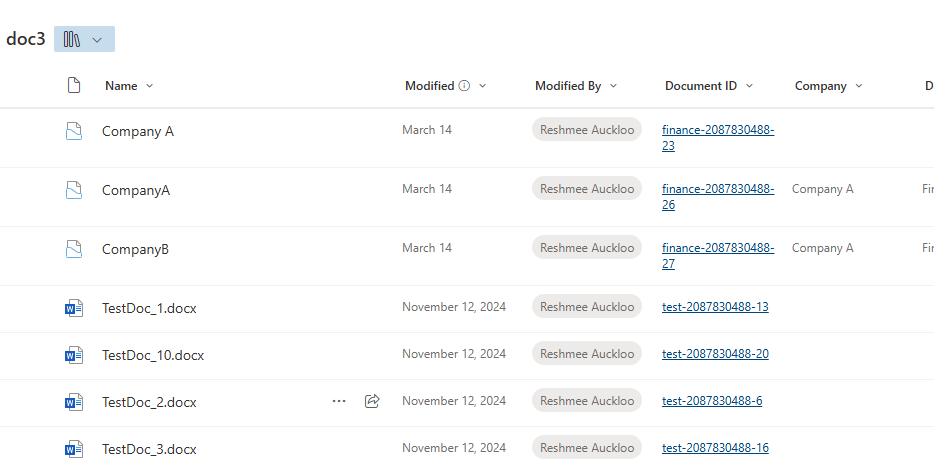

# Enabling and Configuring Document ID in SharePoint

## Summary

The `Document ID` feature in SharePoint is a powerful tool that assigns a unique ID to files, making it easier to reference and track documents. The script activates and configures the Document ID feature using PnP PowerShell. It uses the `Set-PnPSiteDocumentIdPrefix` cmdlet, which simplifies the process of setting a custom prefix for Document IDs.



# [PnP PowerShell](#tab/pnpps)
```powershell
param (
    [Parameter(Mandatory = $true)]
    [string] $siteUrl,
    [Parameter(Mandatory = $true)]
    [string] $DocIDPrefix #The Document ID prefix must be 4 to 12 characters long, and contain only digits (0-9) and letters.
)

#Connect to PnP Online
Connect-PnPOnline -Url $SiteURL -Interactive

$featureId = "b50e3104-6812-424f-a011-cc90e6327318" #Document ID Feature
# Get Feature from SharePoint site
$spFeature = Get-PnPFeature -Scope Site -Identity $featureId

if($null -eq $spFeature.DefinitionId) {  
    # Activate the site feature
    Enable-PnPFeature -Scope Site -Identity $featureId 
}

Set-PnPSiteDocumentIdPrefix  -DocumentIdPrefix $DocIDPrefix -ScheduleAssignment $true -OverwriteExistingIds $true

$ExcludedLists = @("Access Requests", "App Packages", "appdata", "appfiles", "Apps in Testing", "Cache Profiles", "Composed Looks", "Content and Structure Reports", "Content type publishing error log", "Converted Forms",
    "Device Channels", "Form Templates", "fpdatasources", "Get started with Apps for Office and SharePoint", "List Template Gallery", "Long Running Operation Status", "Maintenance Log Library", "Images", "site collection images"
    , "Master Docs", "Master Page Gallery", "MicroFeed", "NintexFormXml", "Quick Deploy Items", "Relationships List", "Reusable Content", "Reporting Metadata", "Reporting Templates", "Search Config List", "Site Assets", "Preservation Hold Library",
    "Site Pages", "Solution Gallery", "Style Library", "Suggested Content Browser Locations", "Theme Gallery", "TaxonomyHiddenList", "User Information List", "Web Part Gallery", "wfpub", "wfsvc", "Workflow History", "Workflow Tasks", "Pages")

Get-PnPList | Where-Object { $_.BaseTemplate -eq 101 -and $_.Hidden -eq $False  -and $_.Title -notin $ExcludedLists} | foreach {
    #Get the Default View from the list
    $DefaultListView  =  Get-PnPView -List $_ | Where {$_.DefaultView -eq $True}
    
    #Add column to the View
    If($DefaultListView.ViewFields -notcontains "_dlc_DocIdUrl")
    {
        try {
            $DefaultListView.ViewFields.Add("_dlc_DocIdUrl")
            $DefaultListView.Update()
            Invoke-PnPQuery
            Write-host -f Green "Document ID column Added to the Default View in library  $($_.Title)!"            
        }
        catch {
            Write-host -f Red "Error Adding Document ID column to the View!  $($_.Title)"
        }
    }
    else
    {
        Write-host -f Yellow "Document ID column already exists in the View! $($_.Title)"
    }
}
```

[!INCLUDE [More about PnP PowerShell](../../docfx/includes/MORE-PNPPS.md)]

***

## Source Credit

Inspired by [PnP PowerShell: Enabling and Configuring Document ID in SharePoint](https://reshmeeauckloo.com/posts/powershell-sharepoint-enabling-configuring-documentid/)


## Contributors

| Author(s) |
|-----------|
| [Reshmee Auckloo](https://github.com/reshmee011)|

[!INCLUDE [DISCLAIMER](../../docfx/includes/DISCLAIMER.md)]

