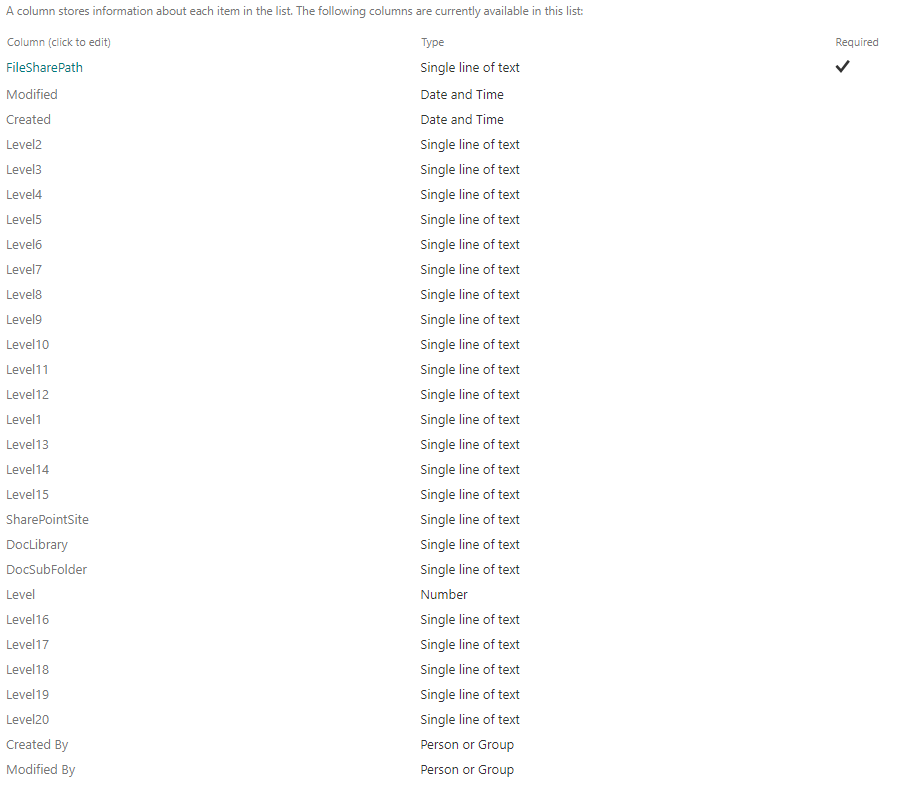

# Copies the structure of a directory to a SharePoint list

## Summary

Say we are trying to migrate file shares to SharePoint. We want to get all the individual directories int a SharePoint list so that we can somehow trigger an migration using the SharePoint Migration Manager (https://tenant-admin.SharePoint.com/_layouts/15/online/AdminHome.aspx#/migration/fileshare).

This script will scan a selected file share for all folders and create an entry in a SharePoint list for each folder found. This list then can be used to trigger migrations on specific folders to specific SharePoint location in a number of different ways. (PowerApps,PowerAutomate, SPFX, export to excel.

Before running the script we must first create a SharePoint list to hold the folder structure. I created an empty list and renamed the Title column to FileSharePath.
I then added 20 text columns (my directory is 20 levels deep) name Level1...Level20 and added an index to each (so we can filter on them easily). I also added a number column called Level that represents the depth in the hierarchy and 3 additional columns (SharePointSite, DocLibrary and DocSubfolder) that a user can enter into the list online to facilitate migrations using the SharePoint Migration Service.

The final list is shown below:


After running the script the list will be populated with one row for each folder in your
fileshare.

So now you can go to the list and enter the url for a SharePoint site, a document library and an optional subfolder for each directory. 

Note: The longest path in the directory structure cannot exceed 260 characters!

There are multiple ways to trigger a migration with this info. The simplest is to create a view with just the FileSharePath, Modified, ModifiedBy, SharePointSite and doclib and Docsubfolder.
This matches the columns required by the Migration Manger as documented at https://learn.microsoft.com/en-us/SharePointmigration/mm-bulk-upload-format-csv-json. (Note that Modified, ModifiedBy are not used by the tool, they are just used as filler). You can then export this list as a csv, remove all rows that dont have a valid SharePointSite and doclib and Docsubfolder and upload it to the Migration Manager.

A flow can also be created to automatically trigger a migration when the SharePointSite and doclib and Docsubfolder are updated. The flow needs use 'Send and Http Request to SharePoint' to Post Data to tenant-admin.SharePoint.com/_api/MigrationCenterServices/Tasks/BatchCreate.
The body of the request should contain 
```json
{
    "taskSettings": {
        "AgentGroupName": "",
        "AzureActiveDirectoryLkp": true,
        "CustomAzureAccessKey": "",
        "CustomAzureDeletionAfterMig": false,
        "CustomAzureStorageAccount": "",
        "DateCreated": "2020-01-26T17:42:25.634Z",
        "DateModified": "2020-01-26T17:42:25.634Z",
        "EnableIncremental": false,
        "EnableUserMappings": false,
        "Encrypted": true,
        "FilterOutHiddenFiles": false,
        "FilterOutPathSpecialCharacters": false,
        "IgnoredFileExtensions": "",
        "InvalidCharsReplacement": "",
        "MigrateAllWebStructures": false,
        "MigrateOneNoteNotebook": true,
        "MigrateSchema": true,
        "PreservePermissionForFileShare": false,
        "PreserveUserPermissionForOnPrem": true,
        "ReplaceInvalidChars": false,
        "ScanOnly": false,
        "SkipListWithAudienceEnabled": true,
        "StartMigrationAutomaticallyWhenNoScanIssue": false,
        "Tags": [],
        "TurnOnDateCreatedFilter": false,
        "TurnOnDateModifiedFilter": false,
        "TurnOnExtensionFilter": false,
        "UseCustomAzureStorage": false,
        "UserMappingCSVFile": "",
        "VersionNumsPreserved": 10
    },
    "taskDefinitions": [
        {
            "Name": "testmig",
            "Type": 0,
            "SourceUri": "\\\\server\\share\\folder",
            "SourceListName": "",
            "SourceListRelativePath": "",
            "TargetSiteUrl": "https://tenant.SharePoint.com/sites/site",
            "TargetListName": "testlib",
            "TargetListRelativePath": "folder"
        }
     
    ],
    "mmTaskSettings": {
        "ScheduledType": 0,
        "ScheduledTimeUtc": "1901-01-02T00:00:00.000Z",
        "AgentGroupName": "Default"
    }
}

```

# [PnP PowerShell](#tab/pnpps)

```powershell
CLS
$count = 0
$rootpath = "\\server\fileshare"
Connect-PnPOnline -Url "https://tenant.SharePoint.com/sites/site with the targetlist" -Interactive
$list = Get-PnPList  "FolderTest4"
$Batch = new-PnPBatch
function add-listitemwithLevels {
    PARAM (
        [PARAMETER(Mandatory = $True, Position = 0, HelpMessage = "Path")][String]$path,
        [PARAMETER(Mandatory = $True, Position = 0, HelpMessage = "Level")][String]$level,
        [PARAMETER(Mandatory = $True, Position = 0, HelpMessage = "level1")][String]$level1,
        [PARAMETER(Mandatory = $false, Position = 0, HelpMessage = "level2")][String]$level2,
        [PARAMETER(Mandatory = $false, Position = 0, HelpMessage = "level3")][String]$level3,
        [PARAMETER(Mandatory = $false, Position = 0, HelpMessage = "level4")][String]$level4,
        [PARAMETER(Mandatory = $false, Position = 0, HelpMessage = "level5")][String]$level5,
        [PARAMETER(Mandatory = $false, Position = 0, HelpMessage = "level6")][String]$level6,
        [PARAMETER(Mandatory = $false, Position = 0, HelpMessage = "level7")][String]$level7,
        [PARAMETER(Mandatory = $false, Position = 0, HelpMessage = "level8")][String]$level8,
        [PARAMETER(Mandatory = $false, Position = 0, HelpMessage = "level9")][String]$level9,
        [PARAMETER(Mandatory = $false, Position = 0, HelpMessage = "level10")][String]$level10,
        [PARAMETER(Mandatory = $false, Position = 0, HelpMessage = "level11")][String]$level11,
        [PARAMETER(Mandatory = $false, Position = 0, HelpMessage = "level12")][String]$level12,
        [PARAMETER(Mandatory = $false, Position = 0, HelpMessage = "level13")][String]$level13,
        [PARAMETER(Mandatory = $false, Position = 0, HelpMessage = "level14")][String]$level14,
        [PARAMETER(Mandatory = $false, Position = 0, HelpMessage = "level15")][String]$level15,
        [PARAMETER(Mandatory = $false, Position = 0, HelpMessage = "level16")][String]$level16,
        [PARAMETER(Mandatory = $false, Position = 0, HelpMessage = "level17")][String]$level17,
        [PARAMETER(Mandatory = $false, Position = 0, HelpMessage = "level18")][String]$level18,
        [PARAMETER(Mandatory = $false, Position = 0, HelpMessage = "level19")][String]$level19,
        [PARAMETER(Mandatory = $false, Position = 0, HelpMessage = "level20")][String]$level20
    
    )
   
    Add-PnPListItem -List $list -Values     @{"Title" = $path; "Level" = $level; "Level1" = $level1; "Level2" = $level2; "Level3" = $level3; "Level4" = $level4; "Level5" = $level5; "Level6" = $level6; "Level7" = $level7; "Level8" = $level8; "Level9" = $level9; "Level10" = $level10; "Level11" = $level11; "Level12" = $level12; "Level13" = $level13; "Level14" = $level14; "Level15" = $level15; "Level16" = $level16; "Level17" = $level17; "Level18" = $level18; "Level19" = $level19; "Level20" = $level20 } -Batch $Batch
    $Global:count = $Global:count + 1
    if ( $Global:count -eq 500) {
        Invoke-PnpBatch $Batch
        $Batch = new-PnPBatch
        $Global:count = 0
    }

}
function get-folders {
    PARAM (
        [PARAMETER(Mandatory = $True, Position = 0, HelpMessage = "Path")][String]$path,
        [PARAMETER(Mandatory = $True, Position = 0, HelpMessage = "Level")][Int32]$level
    )

    $items = Get-ChildItem $path -Directory
    foreach ($item in $items) {
        if ($item.Mode -eq "d-----") {
            $itemname = $item.Name
            $fullpath = "$path\$itemname"
            switch ($level) {
                1 { $level1 = $itemname }
                2 { $level2 = $itemname }
                3 { $level3 = $itemname }
                4 { $level4 = $itemname }
                5 { $level5 = $itemname }
                6 { $level6 = $itemname }
                7 { $level7 = $itemname }
                8 { $level8 = $itemname }
                9 { $level9 = $itemname }
                10 { $level10 = $itemname }
                11 { $level11 = $itemname }
                12 { $level12 = $itemname }
                13 { $level13 = $itemname }
                14 { $level14 = $itemname }
                15 { $level15 = $itemname }
                16 { $level16 = $itemname }
                17 { $level17 = $itemname }
                18 { $level18 = $itemname }
                19 { $level19 = $itemname }
                20 { $level20 = $itemname }
                Default { Write-Host "Level $level reached" }
            }
            add-listitemwithLevels -path $fullpath -level $level  -level1 $level1  -level2 $level2  -level3 $level3  -level4 $level4  -level5 $level5  -level6 $level6  -level7 $level7  -level8 $level8  -level9 $level9  -level10 $level10  -level11 $level11  -level12 $level12  -level13 $level13  -level14 $level14 -level15 $level15  -level16 $level16  -level17 $level17  -level18 $level18  -level19 $level19  -level20 $level20 
            get-folders -path $fullpath -level ($level + 1) 
        }

    }
}

$level1 = ""
$level2 = ""
$level3 = ""
$level4 = ""
$level5 = ""
$level6 = ""
$level7 = ""
$level8 = ""
$level9 = ""
$level10 = ""
$level11 = ""
$level12 = ""
$level13 = ""
$level14 = ""
$level15 = ""
$level16 = ""
$level17 = ""
$level18 = ""
$level19 = ""
$level20 = ""

$subfolders = get-folders -path $rootpath -level 1
 if ( $Global:count-gt 0){
  Invoke-PnpBatch $Batch
}

    # End

```
[!INCLUDE [More about PnP PowerShell](../../docfx/includes/MORE-PNPPS.md)]
***

## Contributors

| Author(s) |
|-----------|
| Russell Gove |

[!INCLUDE [DISCLAIMER](../../docfx/includes/DISCLAIMER.md)]


