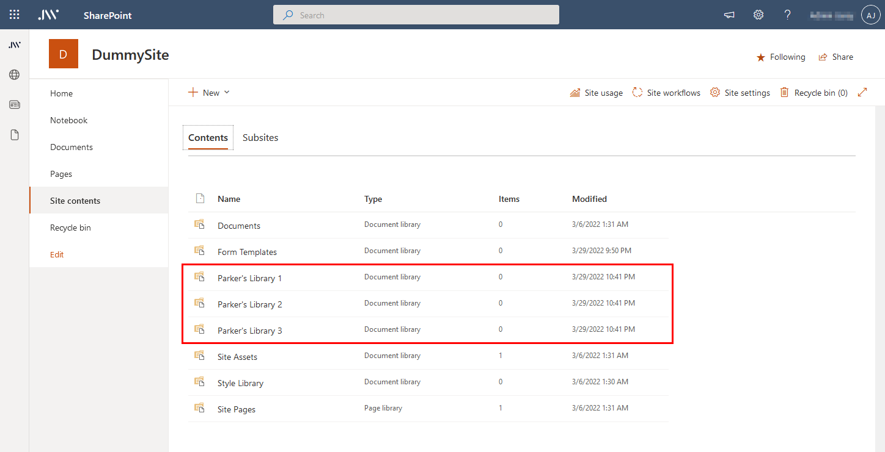

# Bulk library generation

## Summary

With this sample, you can create a whole bunch of libraries at once. These are fairly simple libraries with an extra view and a few extra columns.



## Script parameters

| Parameter         | Mandatory | Description                               | Default value        |
|-------------------|-----------|-------------------------------------------|----------------------|
| TargetWebUrl      |    Yes    | Target SharePoint site                    |                      |
| AmountLibraries   |     No    | Amount of libraries to create             |           5          |
| LibraryName       |     No    | Name for your libraries                   |   Parker's Library   |
| LibraryTemplate   |     No    | Library template to use for bulk creation |    DocumentLibrary   |
| LibraryFields     |     No    | Fields to add to your library             |  Description,Status  |
| LibraryView       |     No    | View name to add to your library          | Parker's Perspective |

# [PnP PowerShell](#tab/pnpps)

```powershell

# Usage example: 
#     .\Create-Bulk-Libraries.ps1 -TargetSitePartUrl mytargetsite -PartTenant contoso -AmountLibraries 3

[CmdletBinding()]
param (
    [Parameter(Mandatory = $true, HelpMessage = "Target site e.g. https://contoso.sharepoint.com/sites/Intranet")]
    [string]$TargetWebUrl,

    [Parameter(Mandatory = $true, HelpMessage = "Organisation url fragment e.g. contoso ")]
    [string]$PartTenant,

    [Parameter(Mandatory = $false, HelpMessage = "Amount of libraries to create e.g. 5 ")]
    [float]$AmountLibraries = 5,

    [Parameter(Mandatory = $false, HelpMessage = "Name for your libraries e.g. Parker's Library ")]
    [string]$LibraryName = "Parker's Library",

    [Parameter(Mandatory = $false, HelpMessage = "Library template to use for bulk creation e.g. DocumentLibrary ")]
    [string]$LibraryTemplate = "DocumentLibrary",

    [Parameter(Mandatory = $false, HelpMessage = "Fields to add to your library e.g. Description,Status ")]
    [string[]]$LibraryFields = @("Description", "Status"),

    [Parameter(Mandatory = $false, HelpMessage = "View name to add to your library e.g. Parker's Perspective ")]
    [string]$LibraryView = "Parker's Perspective"
)
begin {
    Write-Host "`nConnecting to " $TargetWebUrl
        
    Connect-PnPOnline -Url $TargetWebUrl -ReturnConnection -Interactive | Out-Null
}
process {
    Write-Host "`nCreating new libraries..." -ForegroundColor Cyan
        
    for ($counter = 1; $counter -le $AmountLibraries; $counter++ )
    {
      $newList = New-PnPList -Title "$($LibraryName) $($counter)" -Template $LibraryTemplate

      if ($null -ne $LibraryFields) {  
        foreach ($fieldName in $LibraryFields) {
          Add-PnPField -list $newList -InternalName $fieldName.replace(' ','') -DisplayName $fieldName -Type "Text" | Out-Null
        }
      }

      if ($null -ne $LibraryView) {  
        Add-PnPView  -list $newList -Title $LibraryView -Fields (,"Name" + $LibraryFields) | Out-Null
      }

      Write-Progress -Activity "Library creation" -Status "$counter libraries created" -PercentComplete (($counter / $AmountLibraries) * 100)
    }

    Write-Host "`nScript Complete! :)" -ForegroundColor Green
}

```
[!INCLUDE [More about PnP PowerShell](../../docfx/includes/MORE-PNPPS.md)]

# [CLI for Microsoft 365 with PowerShell](#tab/cli-m365-ps)

```powershell
# Usage example: 
#     .\Create-Bulk-Libraries.ps1 -TargetWebUrl https://contoso.sharepoint.com/sites/Intranet -AmountLibraries 3

[CmdletBinding()]
param (
  [Parameter(Mandatory = $true, HelpMessage = "Target site e.g. https://contoso.sharepoint.com/sites/Intranet")]
  [string]$TargetWebUrl,

  [Parameter(Mandatory = $false, HelpMessage = "Amount of libraries to create e.g. 5 ")]
  [float]$AmountLibraries = 5,

  [Parameter(Mandatory = $false, HelpMessage = "Name for your libraries e.g. Parker's Library ")]
  [string]$LibraryName = "Parker's Library",

  [Parameter(Mandatory = $false, HelpMessage = "Library template to use for bulk creation e.g. DocumentLibrary ")]
  [string]$LibraryTemplate = "DocumentLibrary",

  [Parameter(Mandatory = $false, HelpMessage = "Fields to add to your library e.g. Description,Status ")]
  [string[]]$LibraryFields = @("Description", "Status"),

  [Parameter(Mandatory = $false, HelpMessage = "View name to add to your library e.g. Parker's Perspective ")]
  [string]$LibraryView = "Parker's Perspective"
)
begin {
  $m365Status = m365 status
  if ($m365Status -match "Logged Out") {
    m365 login
  }
}
process {
  Write-Host "`nCreating new libraries..." -ForegroundColor Cyan
  Write-Progress -Activity "Library creation" -Status "Creating libraries" -PercentComplete 0
  
  for ($counter = 1; $counter -le $AmountLibraries; $counter++ )
  {
    $newList = m365 spo list add --webUrl $TargetWebUrl --title "$($LibraryName) $($counter)" --baseTemplate $LibraryTemplate | ConvertFrom-Json

    if ($null -ne $LibraryFields) {
      foreach ($fieldName in $LibraryFields) {
        $internalFieldName = $fieldName.replace(' ', '')
        m365 spo field add --webUrl $TargetWebUrl --listTitle $newList.Title.Replace("'", "''") --xml "<Field Type='Text' DisplayName='$($fieldName)' StaticName='$($internalFieldName)' Name='$($internalFieldName)' />" | Out-Null
      }
    }

    if ($null -ne $LibraryView) {
      m365 spo list view add --webUrl $TargetWebUrl --listId $newList.Id --title $LibraryView --fields $($LibraryFields -Join ",") | Out-Null
    }

    Write-Progress -Activity "Library creation" -Status "$counter libraries created" -PercentComplete (($counter / $AmountLibraries) * 100)
  }

  Write-Host "`nScript Complete! :)" -ForegroundColor Green
}
```

[!INCLUDE [More about CLI for Microsoft 365](../../docfx/includes/MORE-CLIM365.md)]

## Contributors

| Author(s) |
|-----------|
| Jasey Waegebaert |
| Milan Holemans |


[!INCLUDE [DISCLAIMER](../../docfx/includes/DISCLAIMER.md)]
