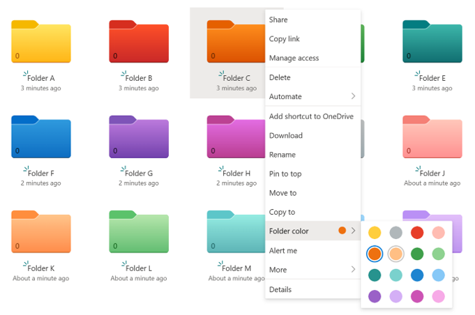

# Create Colored Folder

## Summary

Colored Folders can be created in OneDrive for Business and SharePoint document libraries.



> [!Note]
> Colored Folder is a feature in deployment as of September 3, 2023 and may not be available to your tenant. (Microsoft Roadmap ID [124980](https://www.microsoft.com/microsoft-365/roadmap?filters=&searchterms=124980))

The folder's color setting information is stored in the `_ColorHex` column. This `_ColorHex` column is then set to the numeric value corresponding to each color. The following is a table of the numerical values corresponding to each color:

|Color|_ColorHex value|
|:----|:----|
|Yellow|Empty or 0|
|Dark red|1|
|Dark orange|2|
|Dark green|3|
|Dark teal|4|
|Dark blue|5|
|Dark purple|6|
|Dark pink|7|
|Grey|8|
|Light red|9|
|Light orange|10|
|Light green|11|
|Light teal|12|
|Light blue|13|
|Light purple|14|
|Light pink|15|

This sample code creates a new folder in the SharePoint document library, sets the value of the `_ColorHex` column of the created folder, and changes the folder's color.

# [PnP PowerShell](#tab/pnpps)

```powershell

# Set Variables
$siteUrl = "https://contoso.sharepoint.com/sites/Marketing"
$documentLibrary = "Documents"
$folderName = "FolderA"
$folderColor = 3

try {
    # Connect to SharePoint site
    Connect-PnPOnline -Url $siteUrl -Interactive -ErrorAction Stop

    # Create the folder
    $newFolder = Add-PnPFolder -Name $folderName -Folder $documentLibrary -ErrorAction Stop

    # Get the created folder item
    $newFolderItem = Get-PnPListItem -List $documentLibrary -UniqueId $newFolder.UniqueId -ErrorAction Stop

    # Change the value of the _ColorHex column of the created folder to change the color
    Set-PnPListItem -List $documentLibrary -Identity $newFolderItem.Id -Values @{"_ColorHex" = $folderColor } -ErrorAction Stop

    Write-Host "Folder created and color changed successfully." -ForegroundColor Green
    Write-Host "Folder URL: $siteUrl/$documentLibrary/$folderName" -ForegroundColor Green
}
catch {
    Write-Host "An error occurred: $_" -ForegroundColor Red
}
finally {
    # Disconnect from SharePoint site
    Disconnect-PnPOnline
}

```

[!INCLUDE [More about PnP PowerShell](../../docfx/includes/MORE-PNPPS.md)]

# [CLI for Microsoft 365](#tab/cli-m365-ps)

```powershell

# Set Variables
$siteUrl = "https://contoso.sharepoint.com/sites/Marketing"
$relativeUrlOfParentFolder = "/Shared Documents"
$documentLibraryDisplayName = "Documents"
$folderName = "FolderA"
$folderColor = 3

try {
    # Get Credentials to connect to SharePoint Online site
    $m365Status = m365 status
    if ($m365Status -match "Logged Out") {
        m365 login
    }

    # Create the folder
    $newFolder = m365 spo folder add --webUrl $siteUrl --parentFolderUrl $relativeUrlOfParentFolder --name $folderName | ConvertFrom-Json

    # Get the created folder item
    $newFolderItem = m365 spo listitem get --webUrl $siteUrl --listTitle $documentLibraryDisplayName --uniqueId $newFolder.UniqueId | ConvertFrom-Json

    # Change the value of the _ColorHex column of the created folder to change the color
    m365 spo listitem set --webUrl $siteUrl --listTitle $documentLibraryDisplayName --id $newFolderItem.Id --_ColorHex $folderColor

    Write-Host "Folder created and color changed successfully." -ForegroundColor Green
    Write-Host "Folder URL: $siteUrl/$relativeUrlOfParentFolder/$folderName" -ForegroundColor Green
}
catch {
    Write-Host "An error occurred: $_" -ForegroundColor Red
}
finally {
    # Disconnect from SharePoint site
    m365 logout
}

```
[!INCLUDE [More about CLI for Microsoft 365](../../docfx/includes/MORE-CLIM365.md)]

***

## Contributors

| Author(s)        |
|------------------|
| [Tetsuya Kawahara](https://github.com/tecchan1107) |
| [Ganesh Sanap](https://ganeshsanapblogs.wordpress.com/about) |

[!INCLUDE [DISCLAIMER](../../docfx/includes/DISCLAIMER.md)]

