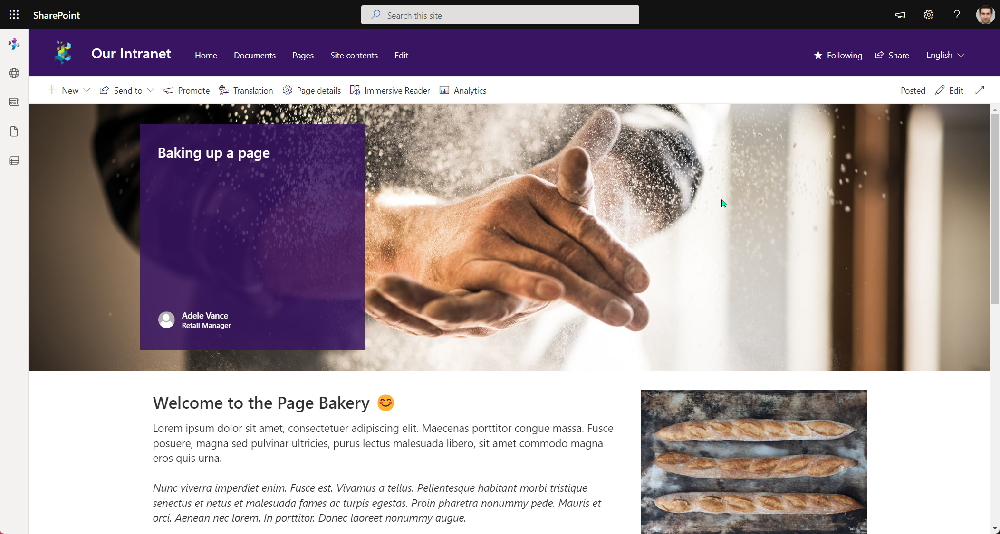

# Create Modern SharePoint Pages and add web parts

## Summary

This sample demonstrates how to create Modern SharePoint Pages without the use of a provisioning engine then add the web parts of the page. 
This shows:

- Creating a page
- Setting up the page header, topic, image and author.
- Adding sections
- Adding Web Parts with some example content


> [!div class="full-image-size"]
> 


# [PnP PowerShell](#tab/pnpps)

```powershell

[CmdletBinding()]
param (
  [string]$Tenant = "contoso",
  [string]$Site = "Intranet",
  [switch]$CleanExistingPage
)
begin{

    Connect-PnPOnline "https://$($Tenant).sharepoint.com/sites/$($Site)" -Interactive

    # Add Page
    $pageParams = @{
        Name = "Script-Built-Page.aspx"
        Title = "Baking up a page"
        HeaderLayoutType = "ColorBlock"
    }

}
process {

    if($CleanExistingPage){
        # Clean Up if repeating script
        Write-Host "Removing existing page..." -ForegroundColor Yellow
        Remove-PnPPage $pageParams.Name -Force
    }
        
    Write-Host "Adding new page..."
    $newPage = Add-PnPPage @pageParams

    # Set the header, topic, image, and person
    Write-Host "Setting the header, topic, image, and person..."
    
    # You can use ?maintenancemode=true on an existing page to help get these values or Use Get-PnPPage and look through the properties in the controls object.
    $newPage.PageHeader.ImageServerRelativeUrl = "https://cdn.hubblecontent.osi.office.net/m365content/publish/3c506e10-e846-4698-a041-f133fc505b7b/1140201187.jpg"
    $newPage.PageHeader.TopicHeader = "Example"
    $newPage.PageHeader.Show
    $newPage.PageHeader.TranslateX = 49.6248124062031
    $newPage.PageHeader.TranslateY = 37.5
    
    # Authors details will reference the target tenant e.g. domain etc.
    $newPage.PageHeader.Authors = '[{"id":"AdeleV@contoso.co.uk","email":"AdeleV@contoso.co.uk","name":"Adele Vance","role":"Retail Manager"}]'
    $newPage.PageHeader.AuthorByLine = '["AdeleV@contoso.co.uk"]'

    # Save the page
    $newPage.Save()

    # Refresh variable
    $newPage = Get-PnPPage $pageParams.Name

    # Create a one-third right section
    # Add Text, Image
    Write-Host "Row 1 - Setting the section and web parts"
    $newPage | Add-PnPPageSection -SectionTemplate TwoColumnLeft -Order 1

    # Column 1 - Text Web Part
    $newPage | Add-PnPPageTextPart -Order 1 -Column 1 -Section 1 `
                -Text @"
                        <h2>Welcome to the Page Bakery 😊</h2>
                        <p>Lorem ipsum dolor sit amet, consectetuer adipiscing elit. Maecenas porttitor congue massa. Fusce posuere, magna sed pulvinar ultricies, purus lectus malesuada libero, sit amet commodo magna eros quis urna. </p>
                        <p><em>Nunc viverra imperdiet enim. Fusce est. Vivamus a tellus. Pellentesque habitant morbi tristique senectus et netus et malesuada fames ac turpis egestas. Proin pharetra nonummy pede. Mauris et orci. Aenean nec lorem. In porttitor. Donec laoreet nonummy augue.​​​​​​​</em></p>
"@

    # Column 2 - Image Web Part

    # The referenced image uses a stock image
    $propsBreadImg = '{"title": "Image", "description": "Image", "dataVersion": "1.8", "properties": {"imageSourceType":2,"altText":"","overlayText":"","imgWidth":5616,"imgHeight":3744,"fixAspectRatio":false}, "serverProcessedContent": {"searchablePlainTexts":{"captionText":"Baking a lovely page"},"imageSources":{"imageSource":"https://cdn.hubblecontent.osi.office.net/m365content/publish/005eb6ca-fe86-4433-921c-126cb23c7adb/576678384.jpg"},"links":{}}}'

    $newPage | Add-PnPPageWebPart -Order 1 -Column 2 -Section 1 -DefaultWebPartType Image -WebPartProperties $propsBreadImg

    

    # Create a one-third left section
    # Add Text, Image
    Write-Host "Row 2 - Setting the section and web parts"
    $newPage | Add-PnPPageSection -SectionTemplate TwoColumnRight -Order 2 -ZoneEmphasis 2

    # Column 1 - Image Web Part
    #  Use Get-PnPPage and look through the properties in the controls object, if you want a reference
    $propsBookImg = '{"title": "Image", "description": "Image", "dataVersion": "1.8", "properties": {"imageSourceType":2,"altText":"","overlayText":"","imgWidth":5616,"imgHeight":3744,"fixAspectRatio":false}, "serverProcessedContent": {"searchablePlainTexts":{"captionText":"Showing pages some love"},"imageSources":{"imageSource":"https://cdn.hubblecontent.osi.office.net/m365content/publish/0d3ff8a6-8854-4a6a-aee1-b1c7d04bb857/691081033.jpg"},"links":{}}}'

    $newPage | Add-PnPPageWebPart -Order 1 -Column 1 -Section 2 -DefaultWebPartType Image -WebPartProperties $propsBookImg

    # Column 2 - Text Web Part
    $newPage | Add-PnPPageTextPart -Order 1 -Column 2 -Section 2 `
    -Text @"
            <h2>How you can improve your pages?</h2>
            <p>Lorem ipsum dolor sit amet, consectetuer adipiscing elit. Maecenas porttitor congue massa. Fusce posuere, magna sed pulvinar ultricies, purus lectus malesuada libero, sit amet commodo magna eros quis urna. </p>
            <p><strong><em>Nunc viverra imperdiet enim. Fusce est. Vivamus a tellus. Pellentesque habitant morbi tristique senectus et netus et malesuada fames ac turpis egestas. Proin pharetra nonummy pede. Mauris et orci. Aenean nec lorem. In porttitor. Donec laoreet nonummy augue.​​​​​​​<strong></em></p>
"@
    

    # Create single column section
    # Add Quick Links inc Icons

    Write-Host "Row 3 - Setting the section and web parts"
    $newPage | Add-PnPPageSection -SectionTemplate OneColumn -Order 3 -ZoneEmphasis 3

    # Column 1 - Quicklinks Web Part
    # You can use ?maintenancemode=true on an existing page to help get these values or Use Get-PnPPage and look through the properties in the controls object.
    $propsLinksWebPart = @"
    {
        "title": "Quick links",
        "description": "Show a collection of links to content such as documents, images, videos, and more in a variety of layouts with options for icons, images, and audience targeting.",
        "serverProcessedContent": {
          "searchablePlainTexts": {
            "title": "Interesting resources",
            "items[0].title": "How to make a page",
            "items[1].title": "Bringing pages into modern",
            "items[2].title": "Accessibility Considerations in Pages",
            "items[3].title": "Showing your page some love with images"
          },
          "links": {
            "baseUrl": "/sites/Intranet",
            "items[0].sourceItem.url": "/sites/Intranet/SitePages/Homepage-Example.aspx",
            "items[1].sourceItem.url": "/sites/Intranet/SitePages/Homepage-Example.aspx",
            "items[2].sourceItem.url": "/sites/Intranet/SitePages/Homepage-Example.aspx",
            "items[3].sourceItem.url": "/sites/Intranet/SitePages/Homepage-Example.aspx"
          }
        },
        "dataVersion": "2.2",
        "properties": {
          "items": [
            {
              "thumbnailType": 2,
              "id": 4,
              "description": "",
              "fabricReactIcon": { "iconName": "glimmer"},
              "altText": "",
              "rawPreviewImageMinCanvasWidth": 32767
            },
            {
              "thumbnailType": 2,
              "id": 3,
              "description": "",
              "fabricReactIcon": { "iconName": "webappbuilderfragment" },
              "altText": "",
              "rawPreviewImageMinCanvasWidth": 32767
            },
            {
              "thumbnailType": 2,
              "id": 2,
              "description": "",
              "fabricReactIcon": { "iconName": "group" },
              "altText": "",
              "rawPreviewImageMinCanvasWidth": 32767
            },
            {
              "thumbnailType": 2,
              "id": 1,
              "description": "",
              "fabricReactIcon": { "iconName": "heartfill" },
              "altText": "",
              "rawPreviewImageMinCanvasWidth": 32767
            }
          ],
          "isMigrated": true,
          "layoutId": "CompactCard",
          "shouldShowThumbnail": true,
          "imageWidth": 100,
          "buttonLayoutOptions": {
            "showDescription": false,
            "buttonTreatment": 2,
            "iconPositionType": 2,
            "textAlignmentVertical": 2,
            "textAlignmentHorizontal": 2,
            "linesOfText": 2
          },
          "listLayoutOptions": { "showDescription": false, "showIcon": true },
          "waffleLayoutOptions": { "iconSize": 1, "onlyShowThumbnail": false },
          "hideWebPartWhenEmpty": true,
          "dataProviderId": "QuickLinks",
          "iconPicker": "glimmer"
        }
      }
"@

    $newPage | Add-PnPPageWebPart -Order 1 -Column 1 -Section 3 -DefaultWebPartType QuickLinks -WebPartProperties $propsLinksWebPart

    Write-Host "Publishing Page and promote Page as News..."
    $newPage | Set-PnPPage -PromoteAs NewsArticle -Publish

}
end{

  Write-Host "Done! :)" -ForegroundColor Green
}

```
[!INCLUDE [More about PnP PowerShell](../../docfx/includes/MORE-PNPPS.md)]
***


## Contributors

| Author(s) |
|-----------|
| Paul Bullock |


[!INCLUDE [DISCLAIMER](../../docfx/includes/DISCLAIMER.md)]
