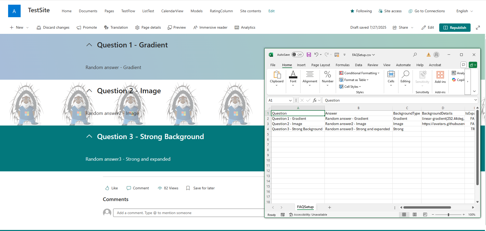

# Creation of an FAQ page in SharePoint from an CSV file as the source.

## Summary
The script creates a basic SharePoint FAQ page using collapsible sections, with CSV data as the source.




# [CLI for Microsoft 365](#tab/cli-m365-ps)

```powershell
$m365Status = m365 status
if ($m365Status -match "Logged Out") {
    m365 login
}

$csvFilePath = "scripts/spo-create-sharepoint-faq-page/assets/FAQSetup.csv"
$webUrl = "https://contoso.sharepoint.com/sites/TestSite"
$page = "page.aspx"

$csvContent = Import-Csv -Path $csvFilePath
$index = 1
foreach ($row in $csvContent) {
    switch($row.BackgroundType) {
        "Gradient" {
            m365 spo page section add --pageName $page --webUrl $webUrl --sectionTemplate OneColumn --zoneEmphasis Gradient --gradientText $row.BackgroundDetails --isCollapsibleSection --collapsibleTitle $row.Question --isExpanded $row.IsExpanded 
        }
        "Image" {
            m365 spo page section add --pageName $page --webUrl $webUrl --sectionTemplate OneColumn --zoneEmphasis Image --imageUrl $row.BackgroundDetails --fillMode Tile --isCollapsibleSection --collapsibleTitle $row.Question --isExpanded $row.IsExpanded
        }
        "Soft" {
            m365 spo page section add --pageName $page --webUrl $webUrl --sectionTemplate OneColumn --zoneEmphasis Soft --isCollapsibleSection  --collapsibleTitle $row.Question --isExpanded $row.IsExpanded
        }
        "Strong" {
            m365 spo page section add --pageName $page --webUrl $webUrl --sectionTemplate OneColumn --zoneEmphasis Strong --isCollapsibleSection  --collapsibleTitle $row.Question --isExpanded $row.IsExpanded
        }
        "Neutral" {
            m365 spo page section add --pageName $page --webUrl $webUrl --sectionTemplate OneColumn --zoneEmphasis Neutral --isCollapsibleSection  --collapsibleTitle $row.Question --isExpanded $row.IsExpanded
        }
        Default {
            m365 spo page section add --pageName $page --webUrl $webUrl --sectionTemplate OneColumn --isCollapsibleSection  --collapsibleTitle $row.Question --isExpanded $row.IsExpanded
        } 
    }

    m365 spo page text add --text $row.Answer --pageName $page --webUrl $webUrl --section $index
    $index++
}

#Disconnect SharePoint online connection
m365 logout
```

[!INCLUDE [More about CLI for Microsoft 365](../../docfx/includes/MORE-CLIM365.md)]

***

## Contributors

| Author(s)                                 |
| ----------------------------------------- |
| [Michał Kornet](https://github.com/mkm17) |


[!INCLUDE [DISCLAIMER](../../docfx/includes/DISCLAIMER.md)]
