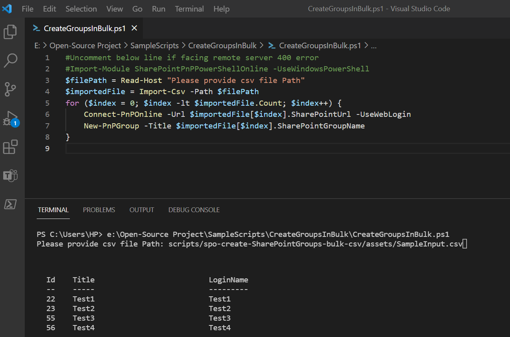
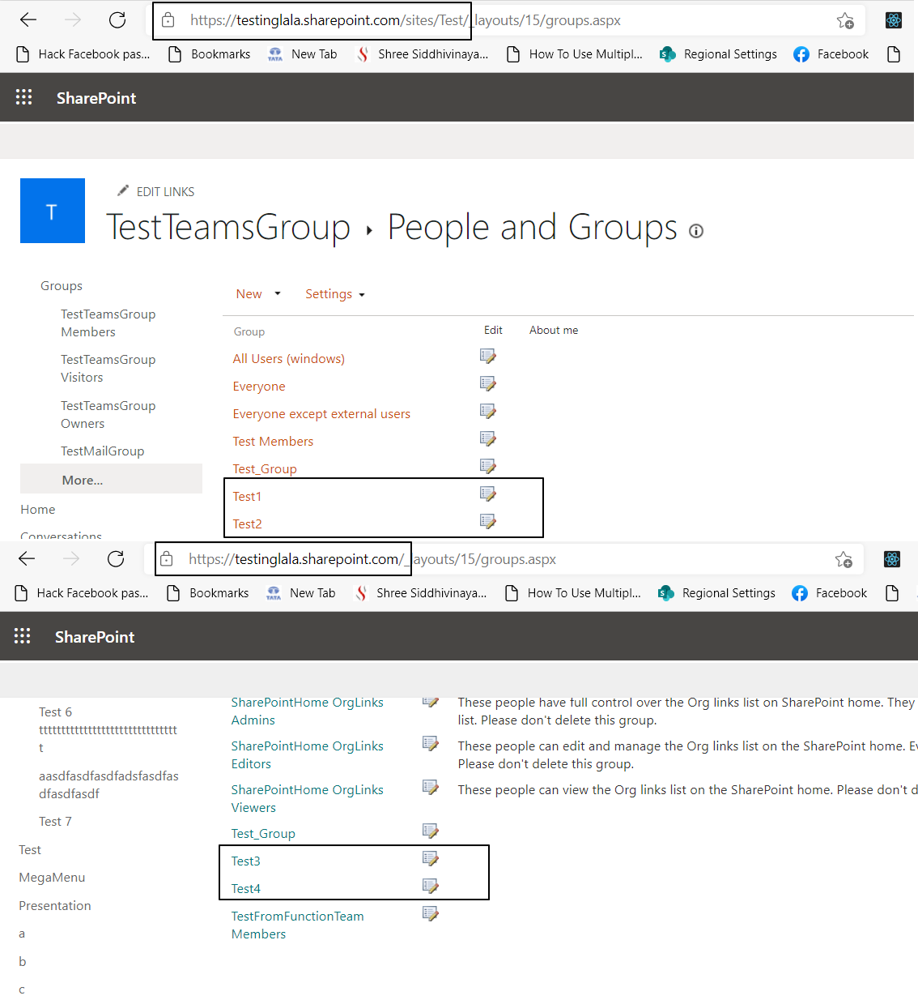

# Create SharePoint Groups in Bulk using CSV file

## Summary

This script shows how to create multiple groups in SharePoint for different site collection providing input from CSV file.

## Implementation

- Open Windows PowerShell ISE
- Create a new file
- Write a script as below,
- Create a CSV using the provided sample. Two columns are required SharePointUrl and SharePointGroupName
- Then we provide the path of the file as input to the PowerShell when prompted in the window when executed.

Download Sample CSV from this [link](assets/SampleInput.csv)

### Execution Image and output Image




 
# [PnP PowerShell](#tab/pnpps)
```powershell

#Uncomment below line if facing remote server 400 error
#Import-Module SharePointPnPPowerShellOnline -UseWindowsPowerShell
$filePath = Read-Host "Please provide csv file Path" 
$importedFile = Import-Csv -Path $filePath
for ($index = 0; $index -lt $importedFile.Count; $index++) {
    Connect-PnPOnline -Url $importedFile[$index].SharePointUrl -UseWebLogin
    New-PnPGroup -Title $importedFile[$index].SharePointGroupName
}

```
[!INCLUDE [More about PnP PowerShell](../../docfx/includes/MORE-PNPPS.md)]
***


## Contributors

| Author(s) |
|-----------|
| Kunj Sangani |

[!INCLUDE [DISCLAIMER](../../docfx/includes/DISCLAIMER.md)]


