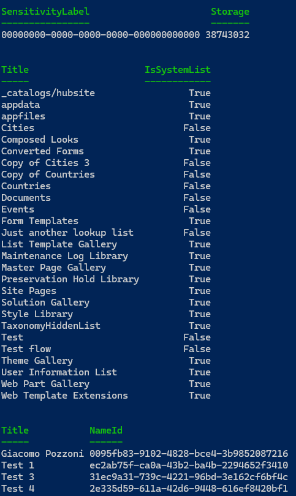

# Query advanced CSOM properties with PnP PowerShell

## Summary

This sample script shows how to query CSOM properties with PnP PowerShell by writing C# code, importing it in PowerShell and sending a single Invoke-PnPQuery request, useful when trying to speed up scripts that have to process a lot of site collections where every request affects the execution time.



# [PnP PowerShell](#tab/pnpps)

```powershell
$url = "<spo site url>"

$ErrorActionPreference = 'Stop'

# Connect to SPO using PnP PowerShell
Connect-PnPOnline $url -Interactive

# Example with PnP cmdlets
Function ExampleWithPnP
{
    # 1. Load site sensitivity label and site usage. 1 request
    Get-PnPSite -Includes SensitivityLabel,Usage | Select-Object SensitivityLabel -ExpandProperty Usage | Select-Object SensitivityLabel,Storage | Format-Table

    # 2. Load lists including if they are system lists. 1 request
    Get-PnPList -Includes IsSystemList | Select-Object Title,IsSystemList | Format-Table

    # 3. Load associated owner group, its users and the Entra ID object id of each user. 1 request + 1 request per user
    $owners = (Get-PnPGroup -AssociatedOwnerGroup -Includes Users).Users
    $owners | ForEach-Object {
        Get-PnPProperty $_ "AadObjectId" | Out-Null
    }
    $owners | Select-Object Title -ExpandProperty AadObjectId | Select-Object Title,NameId | Format-Table

    # Total requests with 3 owners: 6
}

Function LoadCSharpMethods
{
    Add-Type -TypeDefinition @"
using Microsoft.SharePoint.Client;

public class SPODataLoader
{
    public static void LoadSiteDetails(ClientContext ctx)
    {
        ctx.Load(ctx.Site, s => s.SensitivityLabel, s => s.SensitivityLabelInfo, s => s.Usage);
    }

    public static void LoadListsDetails(ClientContext ctx)
    {
        ctx.Load(ctx.Web.Lists, ls => ls.Include(l => l.Title, l => l.IsSystemList));
    }

    public static void LoadOwnersDetails(ClientContext ctx)
    {
        ctx.Load(ctx.Web.AssociatedOwnerGroup, g => g.Users.Include(u => u.Title, u => u.AadObjectId), g => g.Id);
    }
}
"@ -ErrorAction:SilentlyContinue -ReferencedAssemblies (
        "$([Microsoft.SharePoint.Client.ClientContext].Assembly.Location)",
        "$([Microsoft.SharePoint.Client.ClientRuntimeContext].Assembly.Location)",
        "netstandard",
        "System.Linq.Expressions")
}

# Example with C# CSOM
Function ExampleWithCSOM
{
    LoadCSharpMethods

    $ctx = Get-PnPContext
    [SPODataLoader]::LoadSiteDetails($ctx)
    [SPODataLoader]::LoadListsDetails($ctx)
    [SPODataLoader]::LoadOwnersDetails($ctx)

    # 1 single request
    Invoke-PnPQuery

    # 1. Site sensitivity label and site usage.
    $ctx.Site | Select-Object SensitivityLabel -ExpandProperty Usage | Select-Object SensitivityLabel,Storage | Format-Table

    #2. Lists including if they are system lists
    $ctx.Web.Lists | Select-Object Title,IsSystemList | Format-Table

    #3. Associated owner group, its users and the Entra ID object id of each user. 1 request + 1 request per user
    $ctx.Web.AssociatedOwnerGroup.Users | Select-Object Title -ExpandProperty AadObjectId | Select-Object Title,NameId | Format-Table

    # Total requests with 3 owners: 1
}

# Uncomment each function to try the different methods
# ExampleWithPnP
ExampleWithCSOM
```
[!INCLUDE [More about PnP PowerShell](../../docfx/includes/MORE-PNPPS.md)]
***

## Contributors

| Author(s) |
|-----------|
| Giacomo Pozzoni |

[!INCLUDE [DISCLAIMER](../../docfx/includes/DISCLAIMER.md)]

