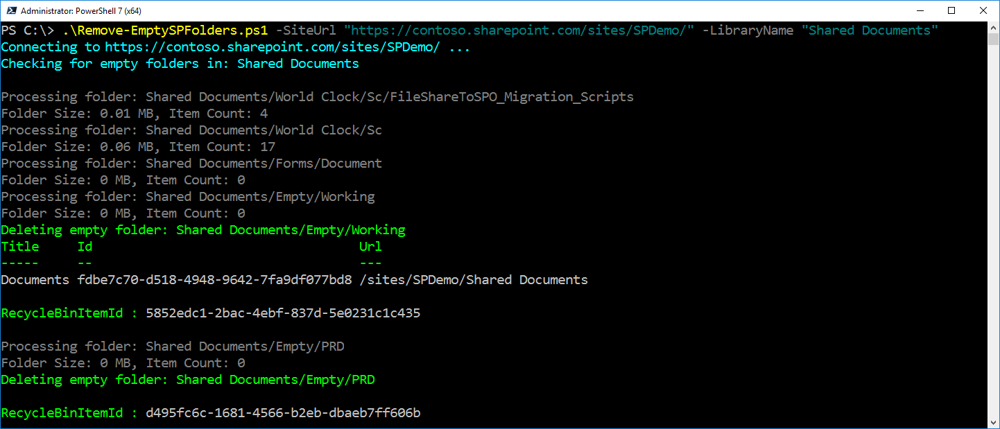

# Delete Empty Folders in SharePoint Document Library

## Summary

This sample demonstrates how to identify and delete empty folders in a SharePoint document library using PnP PowerShell. The script connects to a specified site, scans the target library (and optional folder path), checks each folder for files and size, and deletes those that are empty. You can run the script in report-only mode to list empty folders without deleting them.

SharePoint document libraries can accumulate empty folders over time due to user actions, migrations, or automated processes. Empty folders clutter the library, making navigation and management harder for users and administrators. By identifying and removing these folders, the script helps keep the document library organized, improves user experience, and can enhance performance by reducing unnecessary items. The report-only mode also allows safe auditing before deletion, minimizing accidental data loss.



# [PnP PowerShell](#tab/pnpps)

```powershell
<#
.SYNOPSIS
    Deletes empty folders from a SharePoint Online document library using only PnP cmdlets.

.DESCRIPTION
    Recursively checks for empty folders (and their subfolders) in a given SharePoint Online document library
    and deletes them if they contain no files or non-empty subfolders.

.PARAMETER SiteUrl
    SharePoint site URL.

.PARAMETER LibraryName
    Name of the document library.

.PARAMETER FolderPath
    Optional. Subfolder path inside the library to start from. If omitted, script checks from the root.

.EXAMPLE
    .\Remove-EmptySPFolders.ps1 -SiteUrl "https://contoso.sharepoint.com/sites/Projects" -LibraryName "Shared Documents"
    .\Remove-EmptySPFolders.ps1 -SiteUrl "https://contoso.sharepoint.com/sites/Projects" -LibraryName "Shared Documents" -FolderPath "2022/Old"
#>
param (
    [Parameter(Mandatory = $true)]
    [Alias("Url")]
    [string]$SiteUrl,

    [Parameter(Mandatory = $true)]
    [Alias("Library", "List")]
    [string]$LibraryName,

    [Parameter(Mandatory = $false)]
    [Alias("Path", "Folder")]
    [string]$FolderPath,

    [Parameter(Mandatory = $false)]
    [bool]$ReportOnly = $false
)

try {
    $ClientId = "<your-client-id>" # Replace with your Microsoft Entra ID (Azure AD) app client ID
    
    Write-Host "Connecting to $SiteUrl ..." -ForegroundColor Cyan
    Connect-PnPOnline -Url $SiteUrl -Interactive -ClientId $ClientId    

    $fullPath = if ($FolderPath) { "$LibraryName/$FolderPath" } else { $LibraryName }
    Write-Host "Checking for empty folders in: $fullPath" -ForegroundColor Cyan
    $items = Get-PnPFolderItem -FolderSiteRelativeUrl $fullPath -Recursive -ItemType Folder | Where-Object { $_.Name -ne "Forms" }

    Get-PnPList -Identity $LibraryName

    # get current web relative URL
    $currentWebRelativeUrl = (Get-PnPWeb).ServerRelativeUrl
    [System.Array]::Reverse($items)

    $deletedFolders = @()

    # loop through each folder
    foreach ($item in $items) {
        $itemUrl = $item.ServerRelativeUrl -replace "^$currentWebRelativeUrl/", ""
        Write-Host "Processing folder: $itemUrl" -ForegroundColor DarkGray

        $FolderSize = Get-PnPFolderStorageMetric -FolderSiteRelativeUrl $itemUrl | Select-Object -ExpandProperty TotalSize
        $FolderSize = [Math]::Round($FolderSize / 1MB, 2)
        $FolderItemCount = Get-PnPFolderStorageMetric -FolderSiteRelativeUrl $itemUrl | Select-Object -ExpandProperty TotalFileCount
        Write-Host "Folder Size: $FolderSize MB, Item Count: $FolderItemCount" -ForegroundColor DarkGray

        if (($FolderSize -eq 0) -and ($FolderItemCount -eq 0) -and -not ($itemUrl.ToString() -like "*/Forms/*") ) {
            if (-not $ReportOnly) {
                Write-Host "Deleting empty folder: $itemUrl" -ForegroundColor Green

                $nameParam = Split-Path $itemUrl -Leaf
                $folderParam = (Split-Path $itemUrl -Parent) -replace '\\', '/'

                Remove-PnPFolder -Name $nameParam `
                    -Folder $folderParam `
                    -Recycle -Force -ErrorAction Stop
            }
            else {
                Write-Host "Empty folder: $itemUrl" -ForegroundColor Green
            }

            $deletedFolders += [PSCustomObject]@{
                FolderUrl = $itemUrl
            }
        }
    }

    # Export deleted folders to CSV
    $deletedFolders | Export-Csv -Path "DeletedFolders.csv" -NoTypeInformation -Encoding UTF8
}
catch {
    Write-Error "Script failed: $_"
}
```
[!INCLUDE [More about PnP PowerShell](../../docfx/includes/MORE-PNPPS.md)]
***

## Contributors

| Author(s) |
|-----------|
| [Nanddeep Nachan](https://github.com/nanddeepn) |
| [Smita Nachan](https://github.com/SmitaNachan) |

[!INCLUDE [DISCLAIMER](../../docfx/includes/DISCLAIMER.md)]

