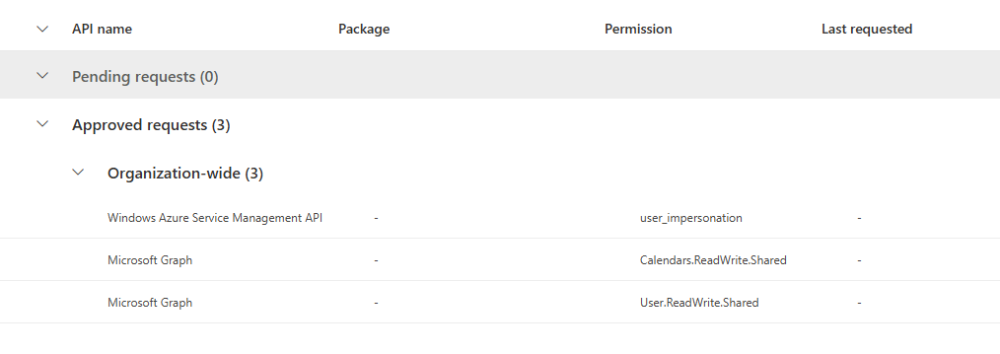
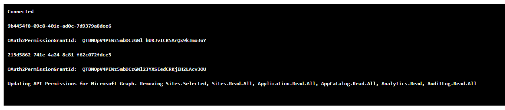

# Remove unused API Permissions assigned to "SharePoint Online Client Extensibility Web Application Principal" 

## Summary

To enhance your tenant's security posture, it's crucial to regularly review the API permissions requested 
by SPFx solutions and compare them with those granted to the "SharePoint Online Client Extensibility Web Application Principal".

This script removes unused API permissions assigned to the "SharePoint Online Client Extensibility Web Application Principal". 

It first retrieves permissions assigned to the SPO service principal, 


compares them with API permissions requested by  SPFx solutions installed in tenant- and site-level app catalogs, and removes any API permissions that are assigned to the SPO principal but not explicitely requested by any of the SPFx solutions.



To execute the script interactively, use the `-Interactive` flag. When using this script in **Azure Runbook/Azure Function**, make sure to **enable System-assigned Managed Identity** and grant all necessary API Permissions. 

See  [Grant Managed Identity permissions to audit and cleanup "SharePoint Online Client Extensibility Web Application Principal" API permissions](https://pnp.github.io/script-samples/aad-grant-serviceprincipal-api-permissions/README.md) script to assign required permissions to Microsoft Graph APIs and SharePoint Online sites.

To only print the API Permissions that should be removed, use the `-WhatIf` flag.



## Configuration

To execute this script in Azure Runbook, create an Automation Account and:
- enable System-assigned Managed Identity,
- import the following modules:
    - Microsoft.Graph.Authentication
    - Microsoft.Graph.Applications
    - Microsoft.Graph.Identity.SignIns
- create a new Runbook and use the PowerShell script provided below.

Before executing the script, use the [Grant Managed Identity permissions to audit and cleanup "SharePoint Online Client Extensibility Web Application Principal" API permissions](https://pnp.github.io/script-samples/aad-grant-serviceprincipal-api-permissions/README.md) script to assign required permissions to Microsoft Graph APIs and SharePoint Online sites.

This script was tested in Azure Runbooks using both, the 5.1 and 7.2 runtime versions, and locally using PowerShell 7.4.5.


# [Microsoft Graph PowerShell](#tab/graphps)

```powershell
<#
    .DESCRIPTION
        To enhance your tenant's security posture, it's crucial to regularly review the API permissions requested 
        by SPFx solutions and compare them with those granted to the 
        "SharePoint Online Client Extensibility Web Application Principal".

        IMPORTANT:
        To execute the script interactively, use the `-Interactive` flag.
        When using this script in Azure Runbook/Azure Function, make sure to enable System-assigned Managed Identity
        and grant all necessary API Permissions. 
        See [Grant Managed Identity permissions to audit and cleanup "SharePoint Online Client Extensibility Web Application Principal" API permissions](https://pnp.github.io/script-samples/aad-grant-serviceprincipal-api-permissions/README.md)

        To only print the API Permissions that should be removed, use the `-WhatIf` flag.


        To lists active SharePoint site collection application catalogs: 
        https://pnp.github.io/script-samples/spo-list-site-app-catalogs/README.html?tabs=cli-m365-ps

    .NOTES
        AUTHOR: Kinga Kazala
        LASTEDIT: Aug 26, 2024
#>
Param(
    [Parameter (Mandatory = $true)]
    [String] $tenantName = "your-tenant-name",
    [Parameter (Mandatory = $true)]
    [String] $appCatalogSiteName = "appcatalog",
    [Parameter (Mandatory = $true)]
    [switch]$WhatIf = $false,
    [switch]$Interactive = $false
)
#####################################
# The following PS modules must be added to the Azure Runbook
# Microsoft.Graph.Authentication
# Microsoft.Graph.Applications
# Microsoft.Graph.Identity.SignIns
#
#####################################
$Global:SPOAppName = "SharePoint Online Client Extensibility Web Application Principal"

<#
    .DESCRIPTION
    The Get-GrantedAPIPermissions function retrieves permissions ASSIGNED to the  "SharePoint Online Client Extensibility Web Application Principal" service principal
    
    Permissions required: 'Application.Read.All'

    .OUTPUTS
    API permissions assigned to the   "SharePoint Online Client Extensibility Web Application Principal" for application and delegated modes
    * Application mode API permissions are NOT supported for this principal
    #####################################
#>
function Get-GrantedAPIPermissions {
    param(
    )
    Try {

        #####################################
        # Get API Permissions for SharePoint Online Client Extensibility Web Application Principal
        #####################################

        $servicePrincipal = Get-MgServicePrincipal -Filter  "DisplayName eq '$($Global:SPOAppName)'"

        #Delegated permission grants authorizing this service principal to access an API on behalf of a signed-in user.
        $permissions = Get-MgServicePrincipalOauth2PermissionGrant -ServicePrincipalId $servicePrincipal.Id

        $permissionsDelegated = $permissions | ForEach-Object {
            # retrieve delegated permissions of the resource service principal
            $resource = Get-MgServicePrincipal -ServicePrincipalId $_.ResourceId

            [PSCustomObject]@{
                Scope      = $_.Scope
                ResourceId = $_.ResourceId
                Resource   = $resource.DisplayName
                AllUsers   = $_.ConsentType -eq "AllPrincipals"
            }
        }

        #this is NOT supported for the "SharePoint Online Client Extensibility Web Application Principal". Result should always be empty
        $permissionsApplication = get-MgServicePrincipalAppRoleAssignment -ServicePrincipalId $servicePrincipal.Id
        If ($null -ne $permissionsApplication) {
            Write-Warning ("Assigning Application permissions to the 'SharePoint Online Client Extensibility Web Application Principal' is NOT SUPPORTED") -ForegroundColor Red
        }

        @{
            delegated   = $permissionsDelegated
            application = $permissionsApplication
        }

    }
    Catch {
        Write-Error "Error downloading API Permissions information: $($_.Exception.Message)"
    }
}
<# 
    .DESCRIPTION
    The Revoke-SelectedAPIPermissio function removes unused API permissions assgined to the  
    "SharePoint Online Client Extensibility Web Application Principal".
    
    Permissions required: 'DelegatedPermissionGrant.ReadWrite.All'
#>
function Revoke-SelectedAPIPermissions {
    param(
        [System.Object] $delegatedPermissionsByScopeUsage ,
        [bool] $whatIf
    )
    $servicePrincipal = Get-MgServicePrincipal -Filter  "DisplayName eq '$($Global:SPOAppName)'"

    $permissions = Get-MgOauth2PermissionGrant -Filter "ClientId eq '$($servicePrincipal.Id)' and ConsentType eq 'AllPrincipals'"

    $delegatedPermissionsByScopeUsage | Group-Object -Property ResourceId  | ForEach-Object {
        $Grouped = $_
        
        $OAuth2PermissionGrant = $permissions | Where-Object { $_.ResourceId -eq $Grouped.Name }
        $OAuth2PermissionGrantId = $OAuth2PermissionGrant.id
       
        $required = ($Grouped.Group | Where-Object { $null -ne $_.spfxName }).Scope
        $notRequired = ($Grouped.Group | Where-Object { $null -eq $_.spfxName }).Scope

        if ( $null -ne $required -and $null -ne $notRequired) {
            "Updating API Permissions for $( $Grouped.Group[0].Resource). Removing $( $notRequired -join ', ')"
            $params = @{
                Scope = $required -join " "
            }
            if ($whatIf) {
                "*** Update-MgOauth2PermissionGrant -OAuth2PermissionGrantId $OAuth2PermissionGrantId -BodyParameter `$params"
                "*** With parameters:"
                $params | ConvertTo-Json 
            }
            else {
                Update-MgOauth2PermissionGrant -OAuth2PermissionGrantId $OAuth2PermissionGrantId -BodyParameter $params
            }
        }
        elseif ( $null -eq $required -and $null -ne $notRequired) {
            "Deleting all API Permissions for $( $Grouped.Group[0].Resource)."
            if ($whatIf) {
                "*** Remove-MgOauth2PermissionGrant -OAuth2PermissionGrantId $OAuth2PermissionGrantId"
            }
            else {
                Remove-MgOauth2PermissionGrant -OAuth2PermissionGrantId $OAuth2PermissionGrantId
            
            }
        }
    }
}
<#
    .DESCRIPTION
    The Get-SPFxAPIPermissions function retrieves permissions REQUESTED by SPFx solutions
    It audits tenant-level and site-level app catalogs
    

    Permissions required: 
    API permissions 'Sites.Selected'
    read access must be assigned on the level of each site audited (tenant- and site level)
#>
function Get-SPFxAPIPermissions {
    param(
        [string]$domainName,
        [string]$appcatalog
    )

    <#
    Function Get-SitesWithAppCatalog returns url part after /sites/ for each site with an app catalog
    #>
    function Get-SitesWithAppCatalog {
        param(
            [string]$domainName,
            [string]$appcatalog
        )

        $listTitle = "Site Collection App Catalogs"
        $expandQuery = '$expand=fields($select=id,sitecollectionurl)'
        $listItems = Invoke-MgGraphRequest -Method GET `
            "https://graph.microsoft.com/v1.0/sites/$($domainName):/sites/$($appcatalog):/lists/$($listTitle)/items?$expandQuery"

        $siteAppCatalogs = $listItems.value | ForEach-Object { 
            $url = $_.fields.SiteCollectionUrl
            $res = $url -match "sites/(?<siteName>.*)"
            if ($res) {
                $matches["siteName"]
            }
        }
        $siteAppCatalogs += $appcatalog 

        $siteAppCatalogs
    }
    function Get-SPFSolutionsAndAPIPermissions {
        param(
            [string]$domainName,
            [string[]]$siteUrls
        )

        $siteUrls | ForEach-Object {

            $siteUrl = $_
            $ErrorActionPreference = 'SilentlyContinue'

            $listTitle = "Apps for SharePoint"
            $expandQuery = '$expand=fields($select=FileLeafRef, AppVersion,WebApiPermissionScopesNote,Title)'
            $listItems = Invoke-MgGraphRequest -Method GET `
                "https://graph.microsoft.com/v1.0/sites/$($domainName):/sites/$($siteUrl):/lists/$($listTitle)/items?$expandQuery"
            
            $listItems.value | ForEach-Object { 
                if ($null -ne $_ -and $null -ne $_.fields) {
                    [PSCustomObject]@{
                        siteURL        = "https://$domainName/sites/$siteUrl"
                        fileName       = $_.fields.FileLeafRef
                        version        = "v$($_.fields.AppVersion)"
                        apiPermissions = $_.fields.WebApiPermissionScopesNote
                        title          = $_.fields.Title
                        Error          = ""
                    }
                }
                else {
                    [PSCustomObject]@{
                        siteURL        = "https://$domainName/sites/$siteUrl"
                        fileName       = ""
                        version        = ""
                        apiPermissions = ""
                        title          = ""
                        Error          = "Site not found or access denied."
                    }
                }
            }
        }
       
    }

    $siteUrls = Get-SitesWithAppCatalog -domainName $domainName -appcatalog $appcatalog
    Get-SPFSolutionsAndAPIPermissions -domainName $domainName -siteUrls $siteUrls
}
<#
    .DESCRIPTION
    The Get-Usage function analyzes API permissions requested by SPFx solutions and 
    the API Permissions assigned to the SharePoint Online Client Extensibility Web Application Principal.
    It groups the API permissions by Resource and Scope, and extends the assigned API permissions information 
    with a reference to SPFx solutions that use them.

    .OUTPUTS 
    spfxPermissionsByScope: value of the spfxPermissionsRequested parameter, grouped by Resource and Scope
    delegatedPermissionsByScopeUsage: value of the apiPermissionsGranted parameter, grouped by Resource and Scope and with a reference to SPFx solutions that use the permissions
#>
function Get-Usage {
    param(
        [System.Object]$apiPermissionsGranted, 
        [System.Object]$spfxPermissionsRequested 
    )
    
    function Get-SpfxPermissionsByScope {
        param(
            [System.Object]$spfxPermissions
        )
        $arr = @()
        $spfxPermissions | ForEach-Object {
            $fileName = $_.fileName
            $title = $_.title
            $_.apiPermissions -split "; " |  Sort-Object | Get-Unique | ForEach-Object { 
                $resource, $scope = $_.Trim() -split ", " 
                $item = $arr | Where-Object { $_.Resource -eq $resource -and $_.Scope -eq $scope }
                if ($null -eq $item) {
                    $arr += [PSCustomObject]@{
                        Resource = $resource
                        Scope    = $scope
                        fileName = @($fileName)
                        title    = @($title)
                    }
                }
                else {
                    If ($item.fileName -notcontains $fileName) {
                        $item.fileName += $fileName
                        $item.title += $title
                    }

                }
            }
        }
        $arr
    }
    function Get-GrantedPermissionsByScope {
        param(
            [System.Object] $apiPermissionsDelegated 
        )
        $apiPermissionsDelegated | ForEach-Object {
            $item = $_
            $_.Scope -split " " | ForEach-Object {
                [PSCustomObject]@{
                    Resource   = $item.Resource
                    ResourceId = $item.ResourceId
                    Scope      = $_
                    AllUsers   = $item.AllUsers
                }
            }
            
        }
    }
    function Join-Arrays {
        param (
            [Parameter(Mandatory = $true)] [array]$Left,
            [Parameter(Mandatory = $true)] [array]$Right
        )

        foreach ($leftItem in $Left) {
            $match = $Right | Where-Object { $leftItem.Resource -eq $_.Resource -and $leftItem.Scope -eq $_.Scope }
            [PSCustomObject]@{
                Resource     = $leftItem.Resource
                ResourceId   = $leftItem.ResourceId
                Scope        = $leftItem.Scope
                AllUsers     = $leftItem.AllUsers
                spfxName     = $match.fileName
                SolutionName = $match.title
            }
        }
    }


    # | Scope | Permission | array(fileName) | array(title) |
    $spfxPermissionsByScope = Get-SpfxPermissionsByScope -spfxPermissions ( $spfxPermissionsRequested | Where-Object { $null -ne $_.apiPermissions } )
    $delegatedPermissionsByScope = Get-GrantedPermissionsByScope -apiPermissionsDelegated $apiPermissionsGranted.delegated

    $delegatedPermissionsByScopeUsage = Join-Arrays -Left $delegatedPermissionsByScope -Right $spfxPermissionsByScope

    @{
        spfxPermissionsByScope           = $spfxPermissionsByScope
        delegatedPermissionsByScopeUsage = $delegatedPermissionsByScopeUsage
    }
}

<#
    .DESCRIPTION
    The Invoke-CleanupAPIPermissions removes unused API permissions assigned to the 
    "SharePoint Online Client Extensibility Web Application Principal".

    It  retrieves permissions assigned to the SPO service principal, compares them with API permissions requested by 
    SPFx solutions installed in tenant- and site-level app catalogs, and removes any API permissions that are assigned to the SPO 
    principal but not explicitely requested by any of the SPFx solutions.
#>
function Invoke-CleanupAPIPermissions {
    Param(
        [Parameter (Mandatory = $true)]
        [string]$tenantName,
        [string] $appCatalogSiteName ,
        [bool] $whatIf ,
        [bool]$interactive = $false
    )

    If ($interactive) {
        Connect-MgGraph -Scopes "Sites.Selected", "Application.Read.All", "DelegatedPermissionGrant.ReadWrite.All"
    }
    else {
        #####################################
        # If MSI is used, two environment variables MSI_ENDPOINT and MSI_SECRET are available
        #####################################
        if ($null -eq $env:MSI_ENDPOINT) {
            Write-Error "To execute this script, please enable Managed Identity for this automation, and grant all required API permissions"
            return
        }
  
        Connect-MgGraph  -Identity -NoWelcome
    }
    "Connected"
        
    # Get API permissions granted to the SPO service principal
    $apiPermissionsGranted = Get-GrantedAPIPermissions 
    # Get API permissions requested by SPFx solutions 
    # Important: if the Managed Identity doesn't have access to a site (e.g. site-level app catalog, the results will be incomplete)
    $spfxPermissionsRequested = Get-SPFxAPIPermissions -domainName "$tenantName.sharepoint.com" -appcatalog $appCatalogSiteName
    # compare assigned and requested API permissions    
    $apiUsageInfo = Get-Usage -apiPermissionsGranted $apiPermissionsGranted  -spfxPermissionsRequested $spfxPermissionsRequested 
    
    # remove unused API permissions assignments
    Revoke-SelectedAPIPermissions -delegatedPermissionsByScopeUsage $apiUsageInfo.delegatedPermissionsByScopeUsage -whatIf $whatIf

}
# Main runbook content 
Invoke-CleanupAPIPermissions -tenantName $tenantName -appCatalogSiteName $appCatalogSiteName -whatIf $WhatIf.IsPresent -interactive $Interactive.IsPresent
```
[!INCLUDE [More about Microsoft Graph PowerShell SDK](../../docfx/includes/MORE-GRAPHSDK.md)]


***


## Source Credit

This script is an enhancement of the previous version, [GET API Permissions for SPFx solutions](https://pnp.github.io/script-samples/spo-get-spfx-apipermissions/README.html), designed to run without user interaction and without the need to temporarily assign owner rights to the current user. 

It now supports scheduling when used in Azure Automation. 

Additionally, it includes the capability to delete unused permissions, a feature inspired by Reshmee Auckloo’s excellent blog post, ["PowerShell: Removing Web API Permissions for SPFx Solutions used by EntraID SharePoint Online Web Client Extensibility"](https://reshmeeauckloo.com/posts/powershell-remove-webapipermission-spfx/).


## Contributors

| Author(s) |
|-----------|
| Kinga Kazala |


[!INCLUDE [DISCLAIMER](../../docfx/includes/DISCLAIMER.md)]
