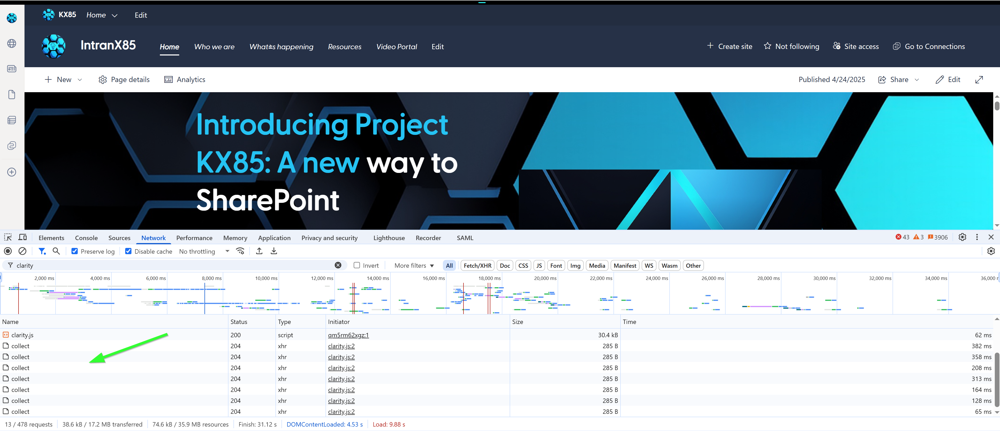
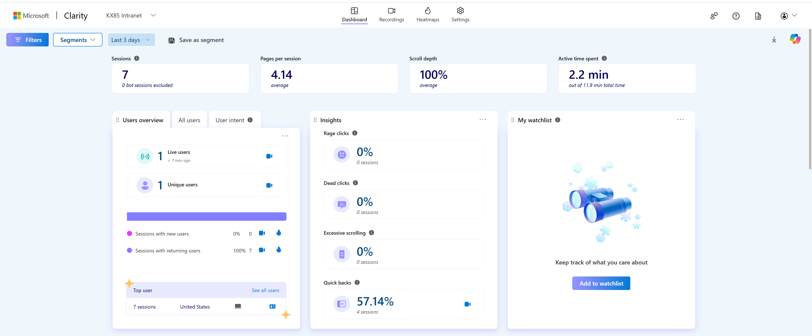

# Deploy Microsoft Clarity Application Customizer for Site Collections


## Summary

Deploy and activate the Microsoft Clarity SPFx application customizer to a specific set of sites listed in a csv for a Microsoft Clarity project. 
This will perform the following:

* Deploy site collection app catalog if not already deployed
* Upload the .sppkg file to the site collection app catalog   
* Deploy the application customizer to the site collection app catalog
* Activate the application customizer on the site collection
* Add the application customizer to the site contents of the site collection
* Wait for the app to be ready before activating it   
* Implement the custom action properties for the application customizer '{"clarityID": "<clarity project ID>"}'

Of course Microsoft Clarity can be deployed tenant wide, but what if you want to create separate Microsoft Clarity projects for certain hubs.  For example If you needed to share a Clarity project to the communications team that only covers the intranet.  

**Minimum Steps To Success**

* Create an app registration for Connect-PnPOnline using default permissions.
* Use the lastest sspkg for Microsoft Clarity


> [!Note]
> Further details on registering an app for using PnP PowerShell see Saluadeen > Rajacks [blog article](https://www.sharepointdiary.com/2022/10/connect-to-sharepoint-online-using-azure-ad-app-id-from-powershell.html) (External Site)
> 
> Undertanding Microsoft Clarity deployments see João Ferreira Step by Step > guide [guide](https://sharepoint.handsontek.net/2020/12/06/add-microsoft-clarity-modern-sharepoint/ ) (External Site)
> 
>Latest version of the SPFx Microsoft Clarity project Nishkalank Bezawada & >João Ferreira [Github](https://github.com/pnp/sp-dev-fx-extensions/tree/main/samples/js-application-microsoft-clarity ) (External Site)

### Prerequisites

Account that runs the script needs access to all of the locations where the files, folders, libraries or sites to be used in the agent are located.



When deployed correctly you will see the collection being done in the developer network tools.




# [PnP PowerShell](#tab/pnpps)

```powershell

<# 
----------------------------------------------------------------------------

Created:      Andrew Burns
Date:         5/01/2025
Disclaimer:   

THE SOFTWARE IS PROVIDED "AS IS", WITHOUT WARRANTY OF ANY KIND, EXPRESS OR
IMPLIED, INCLUDING BUT NOT LIMITED TO THE WARRANTIES OF MERCHANTABILITY,
FITNESS FOR A PARTICULAR PURPOSE AND NONINFRINGEMENT. IN NO EVENT SHALL THE
AUTHORS OR COPYRIGHT HOLDERS BE LIABLE FOR ANY CLAIM, DAMAGES OR OTHER
LIABILITY, WHETHER IN AN ACTION OF CONTRACT, TORT OR OTHERWISE, ARISING FROM,
OUT OF OR IN CONNECTION WITH THE SOFTWARE OR THE USE OR OTHER DEALINGS IN THE
SOFTWARE.

.Synopsis

    Deploy and activate the Microsoft Clarity SPFx application customizer to a specific set of sites listed in a csv for a Microsoft Clarity project. 
    This will perform the following::
        Deploy site collection app catalog if not already deployed
        Upload the .sppkg file to the site collection app catalog   
        Deploy the application customizer to the site collection app catalog
        Activate the application customizer on the site collection
        Add the application customizer to the site contents of the site collection
        Wait for the app to be ready before activating it   
        Implement the custom action properties for the application customizer '{"clarityID": "<clarity project ID>"}'

    Note: Site Templates will include all pages and exclude Application Lifecycle Management (due to getting stuck, but we capture that seperately anyway)

.Usage

    Deploy your Clarity project ID to specific site collections.  Share Clarity projects for specfic collections.
    This is useful if you want to track only the sites within a specific hub, like the intranet.

.Notes

    Make sure you have sufficient priveleges. It is recommended to run this script as a Global Admin or SharePoint Admin.
    I used an app registration with a certificate to connect to the tenant.
    The app registration must have the following permissions:
        - Sites.Read.All
        - Sites.ReadWrite.All
        - Sites.FullControl.All
        - User.Read.All
        - Group.Read.All
        - Group.ReadWrite.All

.References
    Salaudeen Rajack Connect to SharePoint Online using PnP PowerShell with App Registration
    https://www.sharepointdiary.com/2022/10/connect-to-sharepoint-online-using-azure-ad-app-id-from-powershell.html
    Nishkalank Bezawada & João Ferreira(SPFx v1.20.0) Community Call 2/20/2025
    https://github.com/pnp/sp-dev-fx-extensions/tree/main/samples/js-application-microsoft-clarity
    João Ferreira Step by Step guide
    https://sharepoint.handsontek.net/2020/12/06/add-microsoft-clarity-modern-sharepoint/ 
    Microsoft Clarity
    
 ----------------------------------------------------------------------------
#>

# Import the CSV file containing the list of site URLs
$csvPath = "C:\Clarity\Sites.csv" # Update with the path to your CSV file
$sites = Import-Csv -Path $csvPath

# Path to the Microsoft Clarity .sppkg file
$appPackagePath = "C:\Clarity\clarity.sppkg" # Update with the path to your .sppkg file
$logFilePath = Join-Path -Path (Split-Path -Path $appPackagePath -Parent) -ChildPath "DeploymentLog.txt"

# Initialize the log file
Write-Output "Deployment started at $(Get-Date)" | Out-File -FilePath $logFilePath -Append

# Client-side component ID and properties for the application customizer
$clientSideComponentId = "7f8fd1f2-9d26-4a4a-a607-bf4622d7ec11"
$clientSideComponentProperties = '{"clarityID": "<Clarity Project ID>"}'
$clientID = "PnP Online App Registrion Client ID"
$thumbprint = "Your ThumbPrint"
$tenant = "tenant.onmicrosoft.com" # Update with your tenant URL

# Loop through each site in the CSV
foreach ($site in $sites) {
    $siteUrl = $site.SiteUrl # Assumes the CSV has a column named 'SiteUrl'

    try {

        Write-Host "Connecting to site: $siteUrl" -ForegroundColor Yellow
        # Connect to the site
        Connect-PnPOnline -Url $siteUrl -ClientId $clientID -ThumbPrint $thumbPrint -Tenant $tenant
        Write-Host "$siteUrl Connected!" -ForegroundColor Green
        Write-Output "$siteUrl Connected!" | Out-File -FilePath $logFilePath -Append

        # Check if the site collection app catalog is enabled
        $appCatalogUrl = Get-PnPSiteCollectionAppCatalog -CurrentSite

        if (-not $appCatalogUrl) {
            Write-Host "Site collection app catalog is not enabled. Enabling it now..." -ForegroundColor Yellow
            Write-Output "Site collection app catalog is not enabled. Enabling it now..." | Out-File -FilePath $logFilePath -Append
            Add-PnPSiteCollectionAppCatalog -Site $siteUrl -ErrorAction Stop
            Write-Host "Site collection app catalog enabled successfully." -ForegroundColor Green
            Write-Output "Site collection app catalog enabled successfully." | Out-File -FilePath $logFilePath -Append
        } else {
            Write-Host "Site collection app catalog is already enabled." -ForegroundColor Green
            Write-Output "Site collection app catalog is already enabled." | Out-File -FilePath $logFilePath -Append
        }


    # Check if the app is already deployed
        $existingApp = Get-PnPApplicationCustomizer | Where-Object {$_.ClientSideComponentId -eq $clientSideComponentId -and $_.Scope -eq "Site"}
        
        if ($existingApp) {
            Write-Host "The application customizer is already deployed in the site collection app catalog." -ForegroundColor Green
            
        } else {
        # Upload the .sppkg file to the site collection app catalog
        Write-Host "Uploading the app package to the site collection app catalog..." -ForegroundColor Yellow
        Write-Output "Uploading the app package to the site collection app catalog..." | Out-File -FilePath $logFilePath -Append
        $uploadedApp = Add-PnPApp -Path $appPackagePath -Scope Site -Overwrite -Publish -ErrorAction Stop
        Write-Host "App package uploaded successfully to the catalog." -ForegroundColor Green
        Write-Output "App package uploaded successfully to the catalog." | Out-File -FilePath $logFilePath -Append

        # Wait for the app to be ready
        Write-Host "Waiting for the app package to be ready..." -ForegroundColor Yellow
        Write-Output "Waiting for the app package to be ready..." | Out-File -FilePath $logFilePath -Append
        Start-Sleep -Seconds 30 # Adjust the wait time as needed
        Write-Host "App package is ready" -ForegroundColor Green
        }        

        # Add the app to the site contents
        Write-Host "Installing the app..." -ForegroundColor Yellow
        Write-Output "Installing the apps..." | Out-File -FilePath $logFilePath -Append
        Install-PnPApp -Identity $uploadedApp.Id -Scope Site -ErrorAction Stop
        #Get-PnPApp -Identity $uploadedApp.Id -Scope Site | Install-PnPApp -Wait
        Write-Host "App installed successfully." -ForegroundColor Green
        Write-Output "App installed successfully." | Out-File -FilePath $logFilePath -Append

        # Wait for the app to be ready
        Write-Host "Waiting for the app to be ready..." -ForegroundColor Yellow
        Write-Output "Waiting for the app to be ready..." | Out-File -FilePath $logFilePath -Append
        Start-Sleep -Seconds 30 # Adjust the wait time as needed

        # Add the application customizer
        Write-Host "Adding the application customizer custom actions..." -ForegroundColor Yellow
        Write-Output "Adding the application customizer custom actions..." | Out-File -FilePath $logFilePath -Append
        
        Add-PnPCustomAction -ClientSideComponentId $clientSideComponentId `
                            -Name "Microsoft Clarity" `
                            -Title "Microsoft Clarity" `
                            -Location ClientSideExtension.ApplicationCustomizer `
                            -ClientSideComponentProperties $clientSideComponentProperties `
                            -Scope Site
        
        #Review the deployment
        #Write-Output "Application customizer details " -ForegroundColor Yellow
        # Add the application customizer
        Write-Host "Adding the application customizer custom actions added successfully" -ForegroundColor Green
        Write-Output "Adding the application customizer custom actions  added successfully" | Out-File -FilePath $logFilePath -Append

        Write-Output "Application customizer details " -ForegroundColor Yellow
        $customActions = Get-PnPApplicationCustomizer
        $customActions | Format-Table -Property Name, Id, ClientSideComponentId, ClientSideComponentProperties                                            

        Write-Output "End " | Out-File -FilePath $logFilePath -Append
    

    } catch {
        Write-Output "An error occurred while processing site $site $_"  -ForegroundColor Cyan
    } finally {
        # Disconnect from the site
        Disconnect-PnPOnline
    }
}

Write-Host "Script execution completed." -ForegroundColor Cyan
Write-Output "Script execution completed at $(Get-Date)" | Out-File -FilePath $logFilePath -Append

```

# [CSV](#tab/csv)

```

Site name,SiteUrl,Teams,Channel sites,Storage used (GB),Primary admin,Hub,Template,Last activity (UTC),Date created,Created by,Storage limit (GB),Storage used (%),Microsoft 365 group,Files viewed or edited,Page views,Page visits,Files,Sensitivity,External sharing,Segments
Intranet5,https://some.sharepoint.com,FALSE,,1.35,Some Author,Intranet,Communication site,3/25/2025 17:00,9/24/2024 10:16,Andrew Burns,25600,0,FALSE,162,226,25,175,,Off,
News,https://some.sharepoint.com/sites/News,FALSE,,0,Some Author,News,Communication site,3/9/2025 17:00,1/13/2025 12:33,Andrew Burns,25600,0,FALSE,4,4,4,16,,Off,
Retail,https://some.sharepoint.com/sites/Retail,TRUE,,0.01,,Retail,Team site,11/17/2024 16:00,7/17/2024 3:48,Retail Owners,25600,0,TRUE,0,0,0,53,,On,
Sales and Marketing,https://some.sharepoint.com/sites/SalesandMarketing,TRUE,,0,,Sales,Team site,3/10/2025 17:00,7/17/2024 3:49,Sales and Marketing Owners,25600,0,TRUE,3,1,1,22,,On,

```

> [!Note]
> Save the CSV block of text as a CSV file and name it "Sites.csv"


## Contributors

| Author(s) |
|-----------|
| Andrew Burns |


[!INCLUDE [DISCLAIMER](../../docfx/includes/DISCLAIMER.md)]

