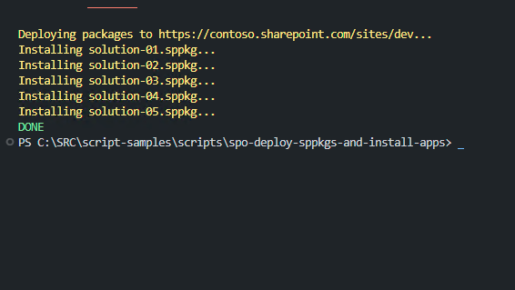

# Deploy sppkgs and install apps

## Summary

Deploy all packages from a local folder and install the apps to the SharePoint site.



# [PnP PowerShell](#tab/pnpps)

```powershell

param (
  [Parameter(Mandatory = $true)]
  [string]$url,
  [Parameter(Mandatory = $true)]
  [string]$username,
  [Parameter(Mandatory = $true)]
  [string]$password
)

clear-host

# Connect
$psw = ConvertTo-SecureString -String $password -AsPlainText -Force
$credentials = New-Object -TypeName System.Management.Automation.PSCredential -argumentlist $UserName, $psw
Connect-PnPOnline -Url $url -Credentials $credentials

# Local sppkg folder path
$sppkgFolder = "./packages"

Write-Host ("Deploying packages to {0}..." -f $url) -ForegroundColor Yellow

$packagesFiles = Get-ChildItem $sppkgFolder

foreach ($package in $packagesFiles) {
  Write-Host ("Installing {0}..." -f $package.PSChildName) -ForegroundColor Yellow

  # Deploy sppkg
  $App = Add-PnPApp -Path ("{0}/{1}" -f $sppkgFolder, $package.PSChildName) -Scope Site -Publish -Overwrite

  #Install app
  Install-PnPApp -Identity $App.Id -Scope Site
}

Disconnect-PnPOnline

Write-Host ("DONE") -ForegroundColor Green

```

[!INCLUDE [More about PnP PowerShell](../../docfx/includes/MORE-PNPPS.md)]

---

## Contributors

| Author(s)                                 |
| ----------------------------------------- |
| [Matteo Serpi](https://github.com/srpmtt) |

[!INCLUDE [DISCLAIMER](../../docfx/includes/DISCLAIMER.md)]

