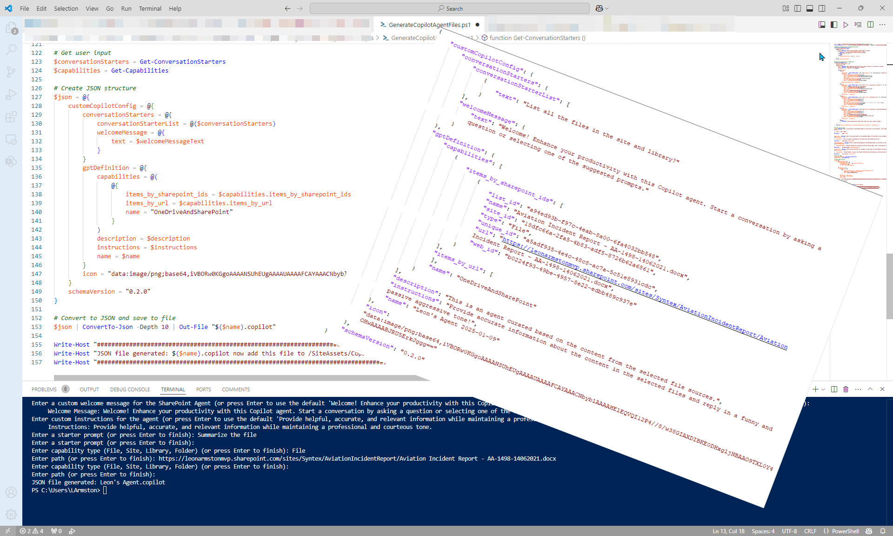

# Creating SharePoint Agents (.copilot Files) with PowerShell

## Summary

I have written a script to automate the creation of .copilot files which you can then add to your sites & libraries. In the script you can then specify the details for the copilot i.e. name, welcome message, starter prompts & sources for the agent i.e. specific files, folders, libraries or sites that the agent is then grounded on. The script uses search to find the site ids, web ids and unique Ids of documents.




**Minimum Steps To Success**

* Enter a URL of a SharePoint site you have access to.
* Run the script (you will be asked for the following:)
  * Name of the SharePoint Agent
  * Description of the Agent
  * Custom welcome message for the Agent
  * Instructions for the Agent
  * Enter at least one Starter Prompt i.e "How can you help me?"
  * Enter at least one SharePoint source (File, Folder, Library or Site)
* Add created <Agent Name>.copilot file to /SiteAssets/Copilots folder.

Further details on my [blog article](https://www.leonarmston.com/2025/01/creating-sharepoint-agents-with-powershell/) (External Site)

### Prerequisites

Account that runs the script needs access to all of the locations where the files, folders, libraries or sites to be used in the agent are located.

# [PnP PowerShell](#tab/pnpps)

```powershell
$url = "https://contoso.sharepoint.com/sites/Syntex"


Connect-PnPOnline -Url $url -Interactive

# Function to prompt user for conversation starters
function Get-ConversationStarters {
    $conversationStarters = @()
    while ($true) {
        $text = Read-Host "Enter a starter prompt (or press Enter to finish)"
        if ($text -eq "" -and $conversationStarters.Count -eq 0) {
            Write-Host "You must enter at least one starter prompt."
        } elseif ($text -eq "") {
            break
        } else {
            $conversationStarters += @{ text = $text }
        }
    }
    return $conversationStarters
}

# Function to prompt user for capabilities
function Get-Capabilities {
    $items_by_sharepoint_ids = @()
    $items_by_url = @()
    while ($true) {
        $type = Read-Host "Enter capability type (File, Site, Library, Folder) (or press Enter to finish)"
        $path = Read-Host "Enter path (or press Enter to finish)"
        if ($type -eq "" -or $path -eq "") { break }

        switch ($type) {
            "File" {

                <#{
                    "list_id": "50f033bf-f372-48ac-8bd6-6af3f421a1c6",
                    "name": "PnP Recognition Letter - Leon.pdf",
                    "site_id": "18dfc66a-2fa5-4b83-adf5-8726b62a6861",
                    "type": "File",
                    "unique_id": "9328a5ca-dd8e-4e46-a51e-782e53d7275d",
                    "url": "https://leonarmstonmvp.sharepoint.com/sites/Syntex/Shared%20Documents/PnP%20Recognition%20Letter%20-%20Leon.pdf",
                    "web_id": "b0224f93-49be-4957-8e22-edbb489c937e"
                }#>

                $searchQuery = Submit-PnPSearchQuery -Query "Path:`"$path`"" -All -SelectProperties "ListId","FileType","SiteTitle","IdentityListItemId","Path","IdentityWebId"


                $capability = @{
                    list_id = $searchQuery.ResultRows[0].ListId
                    name = $searchQuery.ResultRows[0].OriginalPath.Split("/")[-1]
                    site_id = $searchQuery.ResultRows[0].IdentitySiteCollectionId
                    type = $type
                    unique_id = $searchQuery.ResultRows[0].IdentityListItemId
                    url = $searchQuery.ResultRows[0].Path
                    web_id = $searchQuery.ResultRows[0].IdentityWebId
                }
                $items_by_sharepoint_ids += $capability
            }
            "Site" {
                <#{
                    "list_id": "00000000-0000-0000-0000-000000000000",
                    "name": "Projects Hub",
                    "site_id": "171f7026-6c47-45ce-a734-21f0ee741965",
                    "type": "Site",
                    "unique_id": "00000000-0000-0000-0000-000000000000",
                    "url": "https://leonarmstonmvp.sharepoint.com/sites/ProjectsHub",
                    "web_id": "b0224f93-49be-4957-8e22-edbb489c937e"
                }#>

                $searchQuery = Submit-PnPSearchQuery -Query "Path:`"$path`" contentclass:`"STS_Site`"" -All -SelectProperties "ListId","FileType","SiteTitle","IdentityListItemId","Path","IdentityWebId","IdentitySiteId"

                $capability = @{
                    list_id = "00000000-0000-0000-0000-000000000000"
                    name = $searchQuery.ResultRows[0].SiteTitle
                    site_id = $searchQuery.ResultRows[0].IdentitySiteCollectionId
                    type = $type
                    unique_id = "00000000-0000-0000-0000-000000000000"
                    url = $searchQuery.ResultRows[0].SPWebUrl
                    web_id = $searchQuery.ResultRows[0].IdentityWebId
                }
                $items_by_url += $capability
            }
            "Folder" {
                <#      
                        {
                            "list_id": "a1ed0c2f-aa4c-4a4f-a3ce-23c745fe17d0",
                            "name": "NORR",
                            "site_id": "18dfc66a-2fa5-4b83-adf5-8726b62a6861",
                            "type": "Folder",
                            "unique_id": "057676b7-9212-44cb-8321-d5df359be4d7",
                            "url": "https://leonarmstonmvp.sharepoint.com/sites/Syntex/DrawingPlansDiffCompanies/NORR",
                            "web_id": "b0224f93-49be-4957-8e22-edbb489c937e"
                        }
                #>
                $searchQuery = Submit-PnPSearchQuery -Query "Path:`"$path`" IsContainer:true" -All -SelectProperties "ListId","FileType","SiteTitle","IdentityListItemId","Path","IdentityWebId","IdentitySiteId"

                $capability = @{
                    list_id = $searchQuery.ResultRows[0].ListId
                    name = $searchQuery.ResultRows[0].Title
                    site_id = $searchQuery.ResultRows[0].SiteId
                    type = $type
                    unique_id = $searchQuery.ResultRows[0].UniqueId -replace "{","" -replace "}","".Trim()
                    url = $searchQuery.ResultRows[0].OriginalPath
                    web_id = $searchQuery.ResultRows[0].WebId
                }
                $items_by_url += $capability
            }
            "Library" {
                <#      {
                            "list_id": "e042afcd-15d9-4790-a125-264e3b80cdaf",
                            "name": "Autofill",
                            "site_id": "18dfc66a-2fa5-4b83-adf5-8726b62a6861",
                            "type": "Folder",
                            "unique_id": "00000000-0000-0000-0000-000000000000",
                            "url": "https://leonarmstonmvp.sharepoint.com/sites/Syntex/Autofill",
                            "web_id": "b0224f93-49be-4957-8e22-edbb489c937e"
                        }
                #>
                $searchQuery = Submit-PnPSearchQuery -Query "Path:`"$path`" contentclass:`"STS_List_DocumentLibrary`"" -All -SelectProperties "ListId","FileType","SiteTitle","IdentityListItemId","Path","IdentityWebId","IdentitySiteId"

                $capability = @{
                    list_id = $searchQuery.ResultRows[0].ListId
                    name = $searchQuery.ResultRows[0].Title
                    site_id = $searchQuery.ResultRows[0].SiteId
                    type = "Folder"
                    unique_id = "00000000-0000-0000-0000-000000000000"
                    url = $searchQuery.ResultRows[0].OriginalPath.Split("/Forms")[0]
                    web_id = $searchQuery.ResultRows[0].WebId
                }
                $items_by_url += $capability
            }
            default {
                Write-Host "Invalid type entered. Please enter either File, Site, or Folder."
            }
        }
    }
    return @{ items_by_sharepoint_ids = $items_by_sharepoint_ids; items_by_url = $items_by_url }
}

# Prompt user for name
$name = Read-Host "Enter a custom name for the SharePoint Agent (or press Enter to use the default `"Leon's Agent`")"
if($name -eq "") 
{
    $name = "Leon's Agent"
}
Write-Host "     Name: $name"


$description = Read-Host "Enter a custom description for the SharePoint Agent (or press Enter to use the default 'This is an agent curated based on the content from the selected file sources.')"
if($description -eq "") 
{
    $description = "This is an agent curated based on the content from the selected file sources."
}
Write-Host "     Description: $description"

$welcomeMessageText = Read-Host "Enter a custom welcome message for the SharePoint Agent (or press Enter to use the default 'Welcome! Enhance your productivity with this Copilot agent. Start a conversation by asking a question or selecting one of the suggested prompts.')"
if($welcomeMessageText -eq "") 
{
    $welcomeMessageText = "Welcome! Enhance your productivity with this Copilot agent. Start a conversation by asking a question or selecting one of the suggested prompts."
}
Write-Host "     Welcome Message: $welcomeMessageText"

$instructions = Read-Host "Enter custom instructions for the agent (or press Enter to use the default 'Provide helpful, accurate, and relevant information while maintaining a professional and courteous tone.')"
if($instructions -eq "") 
{
    $instructions = "Provide helpful, accurate, and relevant information while maintaining a professional and courteous tone."
}
Write-Host "     Instructions: $instructions"

# Get user input
$conversationStarters = Get-ConversationStarters
$capabilities = Get-Capabilities

# Create JSON structure
$json = @{
    customCopilotConfig = @{
        conversationStarters = @{
            conversationStarterList = @($conversationStarters)
            welcomeMessage = @{
                text = $welcomeMessageText
            }
        }
        gptDefinition = @{
            capabilities = @(
                @{
                    items_by_sharepoint_ids = $capabilities.items_by_sharepoint_ids
                    items_by_url = $capabilities.items_by_url
                    name = "OneDriveAndSharePoint"
                }
            )
            description = $description
            instructions = $instructions
            name = $name
        }
        icon = "data:image/png;base64,iVBORw0KGgoAAAANSUhEUgAAAAUAAAAFCAYAAACNbyblAAAAHElEQVQI12P4//8/w38GIAXDIBKE0DHxgljNBAAO9TXL0Y4OHwAAAABJRU5ErkJggg=="
    }
    schemaVersion = "0.2.0"
}

# Convert to JSON and save to file
$json | ConvertTo-Json -Depth 10 | Out-File "$($name).copilot"

Write-Host "JSON file generated: $($name).copilot"

```
[!INCLUDE [More about PnP PowerShell](../../docfx/includes/MORE-PNPPS.md)]
***


## Contributors

| Author(s) |
|-----------|
| Leon Armston |

[!INCLUDE [DISCLAIMER](../../docfx/includes/DISCLAIMER.md)]

