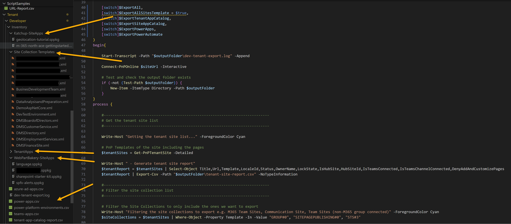

# Report and Export Solutions from M365 Developer Tenant

## Summary

This script will report and optionally export all solutions from the M365 Developer Tenant - this is useful if your tenant is expiring and need to understand what projects you have in the tenant before closure. You will be able to get an inventory of the following information:

| Solution Type | Report | Export | Description |
|---|---|---|---|
| Tenant Sites List | Yes | No | List of all sites in the tenant |
| Tenant App Catalog | Yes | Yes | List of all apps in the tenant app catalog and export them (optional) |
| Site Collections App Catalog | Yes | Yes | List MODERN (Group#0,STS#03,SITEPUBLISHING#0) site collections in the tenant and export them (optional) |
| Power Platform Environments | Yes | No | List of all Power Platform environments in the tenant |
| Power Apps | Yes | Yes | List of all Power Apps in the tenant and export them (optional) |
| Power Automate Flows | No | No | Disabled at the moment (issue with cmdlets) |
| Azure AD Apps | Yes | No | List of all Azure AD Apps in the tenant |
| Teams Apps | Yes | No | List of all Teams Apps in the tenant |

Reports are exported to a CSV in a directory called "Inventory", each app type will create appropriate sub folder when using the export modes.

> [!Warning]
> If you are getting error below with Power Apps or Flow, switch to 2.3.x nightly builds or newer release as API changed.
    "Bad Request (400): Calling Power Automate through ARM is no longer supported. Please use "https://api.flow.microsoft.com/" instead."



Other notes:

- Power Platform will only download Default Environment (it could be expanded to all environments)
- Azure Apps needs bit more work e.g. permissions, will likely update the sample accordingly
- Site collections are limited to modern types for development purposes, not classic e.g., site collection app catalogs will not download outside of the three core base template types (Group#0,STS#03,SITEPUBLISHING#0) but could be easily be expanded
- Power Automate - I am having issues with the cmdlet as result of the MS change, will update when resolved
- Exporting site collections will include all pages, search configurations and exclude Classic Components, Application Lifecycle Management (due to getting stuck, but we capture that separately anyway)


# [PnP PowerShell](#tab/pnpps)

```powershell

<# 
----------------------------------------------------------------------------

Created:      Paul Bullock
Date:         24/02/2024
Disclaimer:   

THE SOFTWARE IS PROVIDED "AS IS", WITHOUT WARRANTY OF ANY KIND, EXPRESS OR
IMPLIED, INCLUDING BUT NOT LIMITED TO THE WARRANTIES OF MERCHANTABILITY,
FITNESS FOR A PARTICULAR PURPOSE AND NONINFRINGEMENT. IN NO EVENT SHALL THE
AUTHORS OR COPYRIGHT HOLDERS BE LIABLE FOR ANY CLAIM, DAMAGES OR OTHER
LIABILITY, WHETHER IN AN ACTION OF CONTRACT, TORT OR OTHERWISE, ARISING FROM,
OUT OF OR IN CONNECTION WITH THE SOFTWARE OR THE USE OR OTHER DEALINGS IN THE
SOFTWARE.

.Synopsis

    Get an expiring developer tenant, lets see what you can report on and optionally export these:
    This will export:
        Tenant SPFx Apps
        Site collection - provisioning templates and SPFx apps
        Power App and Power Automate (not working yet) apps (Power Platform Environment Reporting)
        Report only on Teams Apps and Azure AD Apps

    Note: Site Templates will include all pages and exclude Application Lifecycle Management (due to getting stuck, but we capture that seperately anyway)

.Usage

    .\dev-tenant-report-export.ps1 
        -siteUrl: The site collection to connect to
        -ExportAllSitesTemplate: Export all site collections to the output folder
        -ExportTenantAppCatalog: Export all apps from the tenant app catalog
        -ExportSiteAppCatalog: Export all apps from the site collection app catalogs
        -ExportPowerApps: Export all Power Apps from the default environment
        -ExportPowerAutomate: Export all Power Automate Flows from the default environment

.Notes

    If you are getting error below with Power Apps or Flow, switch to 2.3.x nightly builds or newer release as API changed.
    "Bad Request (400): Calling Power Automate through ARM is no longer supported. Please use "https://api.flow.microsoft.com/" instead."

 ----------------------------------------------------------------------------
#>

[CmdletBinding()]
param (
    $outputFolder = "Inventory",
    $siteUrl = "https://contoso.sharepoint.com",

    [switch]$ExportAll,
    [switch]$ExportAllSitesTemplate,
    [switch]$ExportTenantAppCatalog,
    [switch]$ExportSiteAppCatalog,
    [switch]$ExportPowerApps,
    [switch]$ExportPowerAutomate
)
begin{

    Start-Transcript -Path "$outputFolder\dev-tenant-export.log" -Append

    Connect-PnPOnline $siteUrl -Interactive

    # Test and check the output folder exists
    if (-not (Test-Path $outputFolder)) {
        New-Item -ItemType Directory -Path $outputFolder
    }
}
process {

    #----------------------------------------------------------------------------
    # Get the tenant site list
    #----------------------------------------------------------------------------

    Write-Host "Getting the tenant site list..." -ForegroundColor Cyan

    # PnP Templates of the site including the pages
    $tenantSites = Get-PnPTenantSite -Detailed
    
    Write-Host " - Generate tenant site report"
    $tenantReport = $tenantSites | Select-Object Title,Url,Template,LocaleId,Status,OwnerName,LockState,IsHubSite,HubSiteId,IsTeamsConnected,IsTeamsChannelConnected,DenyAddAndCustomizePages
    $tenantReport | Export-Csv -Path "$outputFolder\tenant-site-report.csv" -NoTypeInformation

    #----------------------------------------------------------------------------
    # Filter the site collection list
    #----------------------------------------------------------------------------

    # Filter the Site Collections to only include the ones we want to export
    Write-Host "Filtering the site collections to export e.g. M365 Team Sites, Communication Site, Team Sites (non-M365 group connected)" -ForegroundColor Cyan
    $siteCollections = $tenantSites | Where-Object -Property Template -In -Value "GROUP#0", "SITEPAGEPUBLISHING#0", "STS#3" 

    if($ExportAllSitesTemplate -or $ExportAll){

        Write-Host "Exporting all $($siteCollections.Count) site collections to '$outputFolder/Site Collection Templates' folder"
        Write-Host " - Note: Settings are standard + IncludeAllPages, Excludes Application LifeCycle Management - this may take a while" -ForegroundColor Yellow
        # Get the templates for all the selected sites
        foreach ($site in $siteCollections) {
            try{
                Write-Host " - Exporting Site Template $($site.Title)..."
                $siteConn = Connect-PnPOnline -Url $site.Url -Interactive -ReturnConnection
                # Site title but only characters that are allowed a-z0-9
                $siteTitle = $site.Title -replace "[^a-zA-Z0-9]", ""
                # Check the path
                $templatePath = "$outputFolder\Site Collection Templates\"
                if (-not (Test-Path $templatePath)) {
                    New-Item -ItemType Directory -Path $templatePath
                }
                
                # Check if the template already exists and skip
                if(Test-Path "$templatePath\$siteTitle.xml"){
                    Write-Host " - Site template already exists, skipping..." -ForegroundColor Yellow
                    continue
                }

                # Some areas getting stuck, so excluding them during testing, however templates seem fine...
                Get-PnPSiteTemplate -Out $($templatePath + "\" + $siteTitle + ".xml") `
                    -IncludeAllPages -IncludeSearchConfiguration `
                    -Connection $siteConn `
                    -ExcludeHandlers ApplicationLifecycleManagement, ImageRenditions, Workflows, Publishing, ComposedLook
                    
            }catch{
                Write-Host " - Error exporting site template" -ForegroundColor Red
                Write-Host $_.Exception.Message -ForegroundColor DarkRed
            }
        }
        Write-Host "Site collection templates exported to $outputFolder" -ForegroundColor Green
    }

    #----------------------------------------------------------------------------
    # Process the app catalog
    #----------------------------------------------------------------------------
    
    Write-Host "Getting the tenant app catalog for apps..." -ForegroundColor Cyan
    # Get the details of the tenant app catalog
    $appCatalog = Get-PnPApp

    Write-Host " - Generate tenant app catalog report"
    $appCatalog | Export-Csv -Path "$outputFolder\tenant-app-catalog-report.csv" -NoTypeInformation
        
    # Export Mode
    if($ExportTenantAppCatalog -or $ExportAll){
        Write-Host " - Exporting tenant apps..."
        $appUrl = Get-PnPTenantAppCatalogUrl
        $appsiteConn = Connect-PnPOnline -Url $appUrl -Interactive -ReturnConnection
        $appCatalogList = Get-PnPList -Identity "AppCatalog" -Connection $appsiteConn
        
        if($appCatalogList){
            $spfxItems = $appCatalogList | Get-PnPListItem -Includes File.serverRelativeUrl,File.Name -Connection $appsiteConn 
            $spfxItems | Foreach-Object{
                try{
                    # Check the path
                    $appsPath = "$outputFolder\TenantApps\"
                    if (-not (Test-Path $appsPath)) {
                        New-Item -ItemType Directory -Path $appsPath
                    }
                    Write-Host " - Exporting $($_.serverRelativeUrl)..." -ForegroundColor Cyan
                    # Grab the file
                    Get-PnPFile -ServerRelativeUrl $_.File.serverRelativeUrl -AsFile -Path $appsPath -FileName "$($_.File.Name)" -Force -Connection $appsiteConn
                    Write-Host " - Tenant app catalog exported to $appsPath$($_.File.Name)" -ForegroundColor Green
                }catch{
                    Write-Host " - Error downloading file $($_.File.Name)" -ForegroundColor Red
                    Write-Host $_.Exception.Message -ForegroundColor DarkRed
                }
            }
        }
    }
    
    #----------------------------------------------------------------------------
    # Process the site app catalogs
    #----------------------------------------------------------------------------

    Write-Host "Checking for site collection app catalogs..." -ForegroundColor Cyan

    # Get details of site collection app catalogs
    # Delete existing site app catalog report
    if (Test-Path "$outputFolder\site-app-catalog-report.csv") {
        Remove-Item "$outputFolder\site-app-catalog-report.csv"
    }

    $siteCollections | ForEach-Object {
        $site = $_
        $siteConn = Connect-PnPOnline -Url $site.Url -Interactive -ReturnConnection
        
        try{
            Write-Host " - Checking for app catalog in $($site.Title) - $($site.Url)" -ForegroundColor Cyan
            $siteAppCatalog = Get-PnPApp -Scope Site -Connection $siteConn
            if($siteAppCatalog) {
                $siteAppCatalogReport = $siteAppCatalog | Add-Member -MemberType NoteProperty -Name Url -Value $site.Url -PassThru
                $siteAppCatalogReport | Export-Csv -Path "$outputFolder\site-app-catalog-report.csv" -NoTypeInformation -Append
            }
            else{
                Write-Host " - No apps found in app catalog" -ForegroundColor Gray
            }
        }
        catch{
            Write-Host " - No app catalog found" -ForegroundColor Gray
        }

        # Export Mode
        if($ExportSiteAppCatalog -or $ExportAll){
            Write-Host " - Checking for app catalog in $($site.Title) - $($site.Url)" -ForegroundColor Cyan
            try{
                $siteAppCatalog = Get-PnPApp -Scope Site -Connection $siteConn
                
                Write-Host " - Exporting site apps..."
                $siteAppCatalogList = Get-PnPList -Identity "AppCatalog" -Connection $siteConn
                if($siteAppCatalogList){
                    $spfxItems = $siteAppCatalogList | Get-PnPListItem -Includes File.serverRelativeUrl,File.Name -Connection $siteConn
                    $spfxItems | Foreach-Object{
                        try{
                            # Make nice with the title
                            $siteTitle = $site.Title -replace "[^a-zA-Z0-9]", ""
                            # Check the path
                            $siteAppsPath = "$outputFolder\$siteTitle-SiteApps\"
                            if (-not (Test-Path $siteAppsPath)) {
                                New-Item -ItemType Directory -Path $siteAppsPath
                            }
                            # Grab the file
                            Write-Host " - Exporting app $($_.serverRelativeUrl)..."
                            Get-PnPFile -ServerRelativeUrl $_.File.serverRelativeUrl -AsFile -Path $siteAppsPath -FileName "$($_.File.Name)" -Force -Connection $siteConn
                            Write-Host " - Site app catalog exported to $siteAppsPath" -ForegroundColor Green
                        }catch{
                            Write-Host " - Error downloading file $($_.File.Name)" -ForegroundColor Red
                            Write-Host $_.Exception.Message -ForegroundColor DarkRed
                        }
                    }
                }
                
            }catch{
                Write-Host " - No apps catalog found" -ForegroundColor Gray
            }
           
        }
    }

    #----------------------------------------------------------------------------
    # Process Power Platform Environments
    #----------------------------------------------------------------------------
    Write-Host "Checking for Power Platform Environments (Default Only)" -ForegroundColor Cyan
    Write-Host " - Reporting Power Platform Environment..."
    $environments = Get-PnPPowerPlatformEnvironment
    if($environments){
        Write-Host " - Power Platform Environment found" -ForegroundColor Green
        $environmentReport = $environments | Select-Object Id,Location,Type,State,Default,Properties -ExpandProperty Properties
        $environmentReport | Export-Csv -Path "$outputFolder\power-platform-environments.csv" -NoTypeInformation
    }
    else{
        Write-Host " - No Power Platform Environment found" -ForegroundColor Gray
    }
    

    # Select single environment, could expand in future
    $environment = Get-PnPPowerPlatformEnvironment -IsDefault

    #----------------------------------------------------------------------------
    # Process Power Apps
    #----------------------------------------------------------------------------
    
    Write-Host "Checking for Power Apps in the Default Environment ONLY" -ForegroundColor Cyan
    $powerApps = Get-PnPPowerApp -Environment $environment.Name -AsAdmin

    
    Write-Host " - Reporting Power Apps in the Default Environment ONLY" -ForegroundColor Yellow
    $powerAppsReport = $powerApps | Select-Object Id,Name,Type,AppLocation,AppType,IsAppComponentLibrary,`
        @{Name='DisplayName'; Expression={$_.Properties.DisplayName}},`
        @{Name='Description'; Expression={$_.Properties.Description}},`
        @{Name='CreatedTime'; Expression={$_.Properties.CreatedTime}},`
        @{Name='LastModifiedTime'; Expression={$_.Properties.LastModifiedTime}},`
        @{Name='AppPlanClassification'; Expression={$_.Properties.AppPlanClassification}},`
        @{Name='UsesPremiumApi'; Expression={$_.Properties.UsesPremiumApi}},`
        @{Name='UsesCustomApi'; Expression={$_.Properties.UsesCustomApi}} 
        
    $powerAppsReport | Export-Csv -Path "$outputFolder\power-apps.csv" -NoTypeInformation
    

    if($ExportPowerApps -or $ExportAll){
        Write-Host " - Exporting Power Apps in the Default Environment.." -ForegroundColor Yellow       
        $powerApps | ForEach-Object {
            try{
                $app = $_
                Write-Host " - Exporting $($app.Properties.DisplayName)" -ForegroundColor Cyan
                $appTitle = $app.Properties.DisplayName -replace "[^a-zA-Z0-9]", ""
                $powerAppPath = "$outputFolder\PowerApps\"
                if (-not (Test-Path $powerAppPath)) {
                    New-Item -ItemType Directory -Path $powerAppPath
                }
                Export-PnPPowerApp -Identity $app -OutPath "$powerAppPath\$appTitle.zip" -Environment $environment.Name
            }catch{
                Write-Host " - Error exporting Power App" -ForegroundColor Red
                Write-Host $_.Exception.Message -ForegroundColor DarkRed
            }
        }
        Write-Host " - Power Apps exported to $powerAppPath" -ForegroundColor Green
    }

    #----------------------------------------------------------------------------
    # Process Power Automate
    #----------------------------------------------------------------------------
    Write-Host "Checking for Power Automate Flows in the Default Environment" -ForegroundColor Cyan
    #$powerAutomate = Get-PnPFlow -AsAdmin
    
    Write-Host "Reporting Disabled due to issues running the cmdlet" -ForegroundColor Red
    # Write-Host " - Reporting Power Automate Flows in the Default Environment" -ForegroundColor Yellow    
    # $powerAutomate | Export-Csv -Path "$outputFolder\power-automate-flows.csv" -NoTypeInformation
    
    if($ExportPowerAutomate -or $ExportAll){
        Write-Host "Exporting Disabled due to issues running the cmdlet" -ForegroundColor Red
        # Write-Host " - Exporting Power Automate Flows in the Default Environment.." -ForegroundColor Cyan
        # $powerAutomate | ForEach-Object {
        #     try{
        #         $flow = $_
        #         Write-Host " - Exporting $($flow.DisplayName)" -ForegroundColor Cyan
        #         $flowTitle = $flow.DisplayName -replace "[^a-zA-Z0-9]", ""
        #         $powerAutomatePath = "$outputFolder\PowerAutomate\"
        #         if (-not (Test-Path $powerAutomatePath)) {
        #             New-Item -ItemType Directory -Path $powerAutomatePath
        #         }
        #         Export-PnPFlow -Identity $flow -Path "$powerAutomatePath\$flowTitle.zip"
        #     }catch{
        #         Write-Host " - Error exporting Power Automate Flow" -ForegroundColor Red
        #     }
        # }
        # Write-Host " - Power Automate Flows exported to $powerAutomatePath" -ForegroundColor Green
    }

    #----------------------------------------------------------------------------
    # Process Azure AD Apps
    #----------------------------------------------------------------------------
    Write-Host "Checking for Azure AD Apps" -ForegroundColor Cyan
   
    Write-Host " - Reporting Azure AD Apps" -ForegroundColor Yellow
    $azureADApps = Get-PnPAzureADApp
    $azureADApps | Export-Csv -Path "$outputFolder\azure-ad-apps.csv" -NoTypeInformation
    

    Write-Host "Checking for Azure AD App with SharePoint Permissions" -ForegroundColor Cyan

    #----------------------------------------------------------------------------
    # Process Teams apps
    #----------------------------------------------------------------------------
    Write-Host "Checking for Teams apps (excluding the store apps)" -ForegroundColor Cyan
    
    Write-Host " - Reporting Teams apps" -ForegroundColor Yellow
    $teamsApps = Get-PnPTeamsApp
    if($teamsApps){
        Write-Host " - Teams apps found" -ForegroundColor Green
        $teamsAppsReport = $teamsApps | Where-Object {$_.DistributionMethod -ne "store"}
        $teamsAppsReport | Export-Csv -Path "$outputFolder\teams-apps.csv" -NoTypeInformation
    }
    else{
        Write-Host " - No Teams apps found" -ForegroundColor Gray
    }
    
}
end{
  
  Write-Host "Done! :)" -ForegroundColor Green
  Stop-Transcript
}

```
[!INCLUDE [More about PnP PowerShell](../../docfx/includes/MORE-PNPPS.md)]
***


## Contributors

| Author(s) |
|-----------|
| Paul Bullock |

[!INCLUDE [DISCLAIMER](../../docfx/includes/DISCLAIMER.md)]

