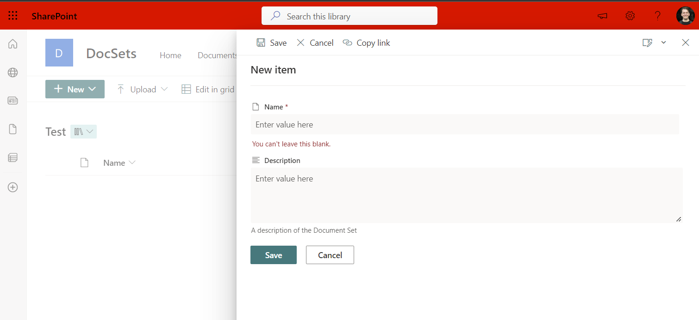

# Enable modern creation forms for Document sets

## Summary

I've found that setting the NewFormClientSideComponentId to _NULL_ on a documents set content type will cause it to render a modern creation form over the default, this script will help you do that. (Also see alternate version below, which works on the Content Type Hub.)



# [PnP PowerShell](#tab/pnpps)

```powershell

# SharePoint online site url
$siteUrl = Read-Host -Prompt "Enter your site url (e.g https://<tenant>.sharepoint.com/sites/contoso)";

# Connect to SharePoint Online site
Connect-PnPOnline -Url $siteUrl -Interactive

# Get the doclibs on the site
$lists = Get-PnPList | Where-Object {$_.BaseTemplate -eq 101}

# List the document libraries
foreach($list in $lists){
    Write-Host "[$($lists.IndexOf($list)+1)] $($list.Title)"
}

$index = Read-Host -Prompt "Which list to you wish to modernize your content type"

# Get the "Folder" content types on the document library
$cts = Get-PnPContentType -List $($lists[$index-1]) | Where-Object {$_.Id.StringValue.StartsWith("0x0120")}

foreach($ct in $cts){
    Write-Host "[$($cts.IndexOf($ct)+1)] $($ct.name)"
}

$CTindex = Read-Host -Prompt "Which content type to you wish to modernize"

# Null out the NewFormClientSideComponentId as that seems to bring it to modern UI
$cts[$CTindex-1].NewFormClientSideComponentId = $null;
$cts[$CTindex-1].Update($false);

Invoke-PnPQuery

Write-Host -ForegroundColor Green "All done"

```
[!INCLUDE [More about PnP PowerShell](../../docfx/includes/MORE-PNPPS.md)]

# [PnP PowerShell Alternative](#tab/pnpps2)

This alternate version, based on Dan's script above, works on the Content Type Hub, allowing you to modernize Document Sets stored at the enterprise level. See [Modernizing the Document Set NewDocSet Form](https://sympmarc.com/2025/06/12/modernizing-the-document-set-newdocset-form/) for more details

```powershell
$tenant = "YourTenantName"
$clientId = "YourAppRegistrationGUID"

$cthConnection = Connect-PnPOnline -ClientId $clientId -Url "https://$($tenant).sharepoint.com/sites/ContentTypeHub" -Interactive

# Get the "Document Set" content types
$cts = Get-PnPContentType | Where-Object { $_.Id.StringValue.StartsWith("0x0120D520") }

foreach ($ct in $cts) {
    $currVal = "❌"
    if($ct.NewFormClientSideComponentId.Length -eq '') {
        $currVal = "✅"
    }
    Write-Host "[$($cts.IndexOf($ct)+1)] $($ct.name) $($currVal)"
}

$CTindex = Read-Host -Prompt "Which content type to you wish to modernize"

# Null out the NewFormClientSideComponentId as that seems to bring it to modern UI
$cts[$CTindex - 1].NewFormClientSideComponentId = $null;
$cts[$CTindex - 1].Update($false);

Invoke-PnPQuery

$ctPub = Read-Host -Prompt "Content Type $($cts[$CTindex-1].Name) updated. Would you like to publish the change? (Y/N)"
if ($ctPub -ne 'Y' -and $ctPub -ne 'y') {
    Write-Host -ForegroundColor Red "Exiting without publishing changes."
    exit
}
else {
    # Publish the changed content type
    Write-Host -ForegroundColor Yellow "Publishing content type $($cts[$CTindex-1].Name) with ID $($cts[$CTindex-1].Id)"
    Publish-PnPContentType -ContentType $cts[$CTindex - 1].Id
}

Write-Host -ForegroundColor Green "All done"

```

[!INCLUDE [More about PnP PowerShell](../../docfx/includes/MORE-PNPPS.md)]
***

## Contributors

| Author(s)                          |
| ---------------------------------- |
| [Dan Toft](https://blog.dan-toft.dk) |
| [Marc D Anderson](https://sympmarc.com) |

[!INCLUDE [DISCLAIMER](../../docfx/includes/DISCLAIMER.md)]

