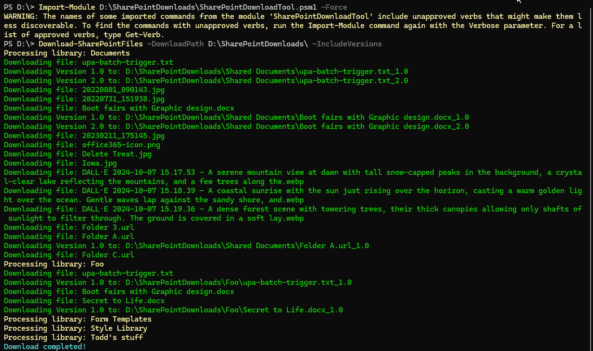
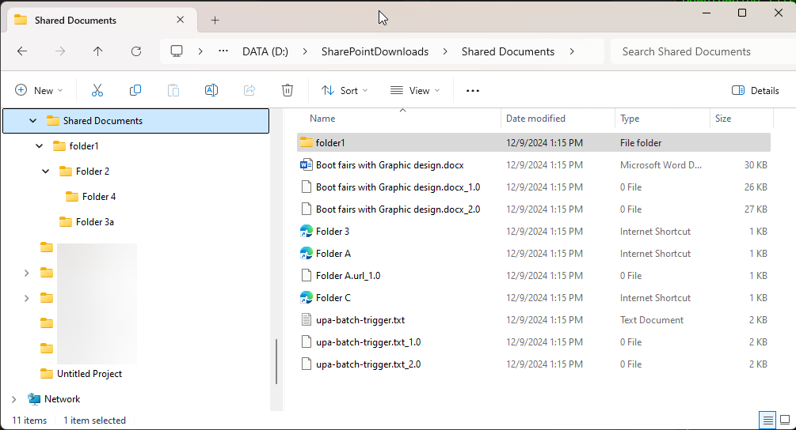

# Download all documents from all document libraries in a site, including version history

## Summary

This PowerShell function will download all documents from all document libraries in a site, including version history. The documents will be saved in a folder structure that matches the library structure. You will have to connect to the site first using Connect-PnPOnline before running this script.
Save the code to a PSM1 file, then import it into your PowerShell session using Import-Module like in Example01. You can then run the function Download-SharePointFiles to download the documents.



This screenshot shows the script in action downloading documents from a site.



This screenshot shows the folder structure created by the script after the documents have been downloaded.


# [PnP PowerShell](#tab/pnpps)

```powershell

<#
.SYNOPSIS
Downloads files from all SharePoint document libraries in a tenant to a local directory. Requires PnP PowerShell 2.x and and existing connection to the tenant with Connect-PnPOnline.

.DESCRIPTION
This script connects to a SharePoint tenant using PnP PowerShell, iterates through all document libraries, and downloads files to a specified local directory. It can optionally overwrite existing files and download all versions of the files.

.PARAMETER DownloadPath
Specifies the local directory where files will be saved.

.PARAMETER Overwrite
Indicates whether to overwrite existing files in the local directory.

.PARAMETER IncludeVersions
Specifies whether to download all versions of the files.

.EXAMPLE
Download files to a local directory:
Download-SharePointFiles -DownloadPath "C:\SharePointDownloads"

.EXAMPLE
Download files and overwrite existing ones:
Download-SharePointFiles -DownloadPath "C:\SharePointDownloads" -Overwrite

.EXAMPLE
Download files including all versions:
Download-SharePointFiles -DownloadPath "C:\SharePointDownloads" -IncludeVersions

.EXAMPLE
Download files, overwrite existing ones, and include all versions:
Download-SharePointFiles -DownloadPath "C:\SharePointDownloads" -Overwrite -IncludeVersions
#>
function Download-SharePointFiles {
        
    [CmdletBinding()]
    param (
        [Parameter(Mandatory = $true)]
        [string]$DownloadPath, # The local directory to save files

        [Parameter(Mandatory = $false)]
        [switch]$Overwrite, # Whether to overwrite existing files

        [Parameter(Mandatory = $false)]
        [switch]$IncludeVersions # Whether to download all versions of the files
    )

    # Ensure there is a connection to SharePoint
    $connection = Get-PnPConnection -ErrorAction Stop
        if ($null -ne $connection) {
            Write-Verbose "You are connected to your tenant: $($connection.TenantUrl)"
        } else {
            throw "Please connect and try again"
        }

    # Ensure the download directory exists
    if (-not (Test-Path -Path $DownloadPath)) {
        New-Item -Path $DownloadPath -ItemType Directory | Out-Null
    }

    # Get Context if -IncludeVersions is specified
    if ($IncludeVersions.IsPresent) {
        $Ctx = Get-PnPContext
    }

    # Get all document libraries in the site
    Write-Verbose "Fetching all document libraries in the site..." 
    $Libraries = Get-PnPList | Where-Object { $_.BaseTemplate -eq 101 } # 101 = Document Library

    # Loop through each library and download files
    foreach ($Library in $Libraries) {
        Write-Host "Processing library: $($Library.Title)" -ForegroundColor Yellow

        # Get all files in the library
        $Files = Get-PnPListItem -List $Library.Title -PageSize 1000 -Fields FileLeafRef, FileDirRef | Where-Object { $_.FileSystemObjectType -eq "File" }

        foreach ($File in $Files) {
            $FileUrl = $File["FileRef"]
            $LocalPath = Join-Path $DownloadPath ($File["FileDirRef"] -replace "/", "\") # Convert SharePoint folder structure to local paths
            $FileName = $File["FileLeafRef"]
            $LocalFilePath = Join-Path $LocalPath $FileName

            # Create local directory if it doesn't exist
            if (-not (Test-Path -Path $LocalPath)) {
                New-Item -Path $LocalPath -ItemType Directory | Out-Null
            }

            # Download the current version of the file
            if (-not (Test-Path -Path $LocalFilePath) -or $Overwrite.IsPresent) {
                Write-Host "Downloading file: $FileName" -ForegroundColor Green
                Write-Verbose $FileUrl
                Get-PnPFile -Url $FileUrl  -Path $LocalPath -FileName $FileName -AsFile -Force
            } else {
                Write-Host "File already exists: $FileName. Skipping..." -ForegroundColor Yellow
            }

            # Optionally download all versions
            # got help from https://www.sharepointdiary.com/2018/06/sharepoint-online-download-all-versions-using-powershell.html
            if ($IncludeVersions.IsPresent) {
                Write-Verbose "Fetching versions for: $FileName"
                Write-Verbose $FileUrl
                $pnpfile = Get-PnPFile -Url $FileUrl
                $Versions = Get-PnPProperty -ClientObject $pnpfile -Property Versions

                if ($Versions.Count -gt 0) {
                    foreach ($Version in $Versions) {
                        # Construct version filename
                        $VersionFileName = "$($LocalPath)\$($FileName)_$($Version.VersionLabel)"
          
                        #Get Contents of the File Version
                        $VersionStream = $Version.OpenBinaryStream()
                        $Ctx.ExecuteQuery()
                
                        #Download File version to local disk
                        [System.IO.FileStream] $FileStream = [System.IO.File]::Open($VersionFileName,[System.IO.FileMode]::OpenOrCreate)
                        $VersionStream.Value.CopyTo($FileStream)
                        $FileStream.Close()
                        
                        Write-Host -f Green "Downloading Version $($Version.VersionLabel) to:" $VersionFileName
                        
                    }
                } else {
                    if ($PSCmdlet.MyInvocation.BoundParameters["Verbose"]) {
                        Write-Host "No versions available for file: $FileName" -ForegroundColor Yellow
                    } 

                    
                }
            }
        }
    }

    Write-Host "Download completed!" -ForegroundColor Cyan
}


```
[!INCLUDE [More about PnP PowerShell](../../docfx/includes/MORE-PNPPS.md)]

***


## Source Credit

Sample first appeared on [https://pnp.github.io/cli-microsoft365/sample-scripts/spo/spo-download-all-doclibs/](https://pnp.github.io/cli-microsoft365/sample-scripts/spo/spo-download-all-doclibs/)

## Contributors

| Author(s) |
|-----------|
| Todd Klindt (https://www.toddklindt.com/blog) |


[!INCLUDE [DISCLAIMER](../../docfx/includes/DISCLAIMER.md)]
