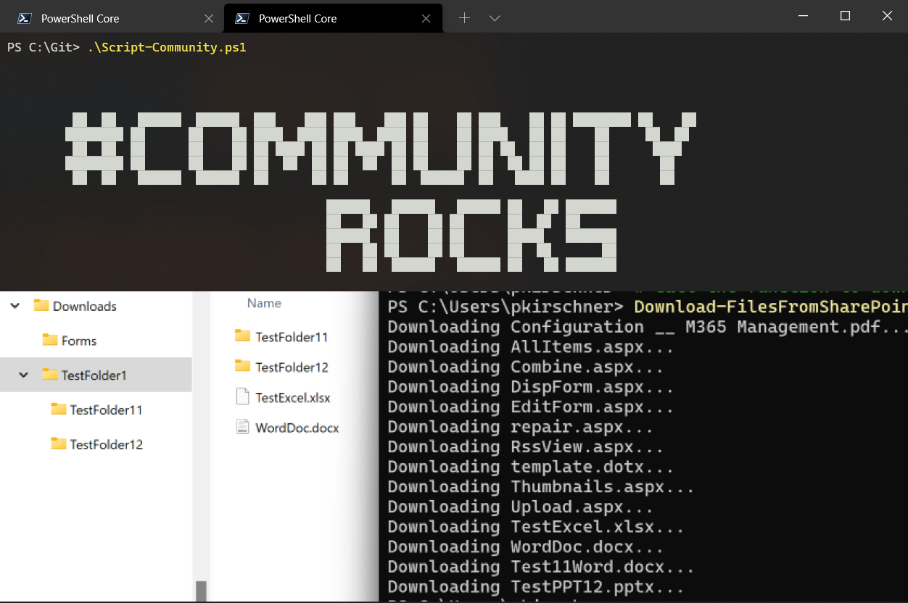

# Download all files from Document Libarary/Folder

## Summary

The script will download all files from an SharePoint Document Libraray or Folder
1. Download Doclib
2. Download a Folder from Doclib




- Open Windows PowerShell ISE or VS Code
- Copy script below to your clipboard
- Paste script into your preferred editor
- Change config variables to reflect the site, library name & download location required


# [PnP PowerShell](#tab/pnpps)

```powershell
$clientId="......"
# Define variables
$siteUrl = "https://yoursharepointsite.sharepoint.com/sites/yoursite"
# Option 1:
# comment the line below and specify $libraryPath this parameter will be used
$libraryTitle = "Documents"
# Option 2:
$libraryPath = "/Shared Documents/YourFolder"
$localDownloadPath = "C:\Downloads\SharePointFiles"


# Connect to the SharePoint site
Connect-PnPOnline -Url $siteUrl -Interactive -clientID $clientID


if ($libraryTitle -ne $null) {
    $doclib = $doclib = Get-PnPList -Identity $libraryTitle -Includes RootFolder
    $libraryPath = "/"+$doclib.RootFolder.Name
}


function Download-FilesFromSharePoint {
    param (
        [string]$LibraryPath,
        [string]$LocalDownloadPath,
        [bool]$Recursive = $true
    )
    $folder =Get-PnPFolder -Url $LibraryPath
    $files = Get-PnPFolderItem -FolderSiteRelativeUrl $LibraryPath -ItemType File -Recursive:$Recursive
    # Download each file
    foreach ($file in $files) {
        $fileUrl = $file.ServerRelativeUrl
        $fileName = $file.Name
        $relpath = $fileUrl.SubString($folder.ServerRelativeUrl.length+1).Replace($fileName,"")
        $localFilePath =  $LocalDownloadPath
        if($relpath.length -gt 0){
            $localFilePath = Join-Path -Path $LocalDownloadPath -ChildPath $relpath
        }
         # Ensure the local download path exists
            if (-not (Test-Path -Path $localFilePath)) {
                $localFolder=New-Item -ItemType Directory -Path $localFilePath;
            }
        Write-Host "Downloading $fileName..."
        Get-PnPFile -Url $fileUrl  -Path $localFilePath -FileName $fileName -AsFile
    }
}

# Call the function to download files
Download-FilesFromSharePoint -LibraryPath $libraryPath -LocalDownloadPath $localDownloadPath 

Write-Host "Download completed."

```
[!INCLUDE [More about PnP PowerShell](../../docfx/includes/MORE-PNPPS.md)]
# [CLI for Microsoft 365 using PowerShell](#tab/cli-m365-ps)

```powershell
# Define variables
$siteUrl = "https://yoursharepointsite.sharepoint.com/sites/yoursite"
$libraryPath = "/Shared Documents/YourFolder"
$localDownloadPath = "C:\Downloads\SharePointFiles"

m365 login

function Download-FilesFromSharePoint {
    param (
        [string]$LibraryPath,
        [string]$LocalDownloadPath,
        [bool]$Recursive = $true
    )
    $folder = m365 spo folder get --webUrl $siteUrl --url $LibraryPath --output json | ConvertFrom-Json
    if($Recursive){
        # Get all files in the folder and subfolders
        $files = m365 spo file list --webUrl $siteUrl --folderUrl  $LibraryPath --recursive --output json | ConvertFrom-Json
    }
    else{
        # Get all files in the folder
    $files = m365 spo file list --webUrl $siteUrl --folderUrl  $LibraryPath --output json | ConvertFrom-Json
    }
    # Download each file
    foreach ($file in $files) {
        $fileUrl = $file.ServerRelativeUrl
        $fileName = $file.Name
        $relpath = $fileUrl.SubString($folder.ServerRelativeUrl.length+1).Replace($fileName,"")
        $localFilePath =  $LocalDownloadPath
        if($relpath.length -gt 0){
            $localFilePath = Join-Path -Path $LocalDownloadPath -ChildPath $relpath
        }
        # Ensure the local download path exists
        if (-not (Test-Path -Path $localFilePath)) {
            $localFolder = New-Item -ItemType Directory -Path $localFilePath
        }
        Write-Host "Downloading $fileName..."
        m365 spo file get --webUrl $siteUrl --url $fileUrl --asFile  --path (Join-Path -Path $localFilePath -ChildPath $fileName)
    }
}

# Call the function to download files
Download-FilesFromSharePoint -LibraryPath $libraryPath -LocalDownloadPath $localDownloadPath

Write-Host "Download completed."

```
[!INCLUDE [More about CLI for Microsoft 365](../../docfx/includes/MORE-CLIM365.md)]

***

## Contributors

| Author(s) |
|-----------|
| [Peter Paul Kirschner](https://github.com/petkir) |


[!INCLUDE [DISCLAIMER](../../docfx/includes/DISCLAIMER.md)]
