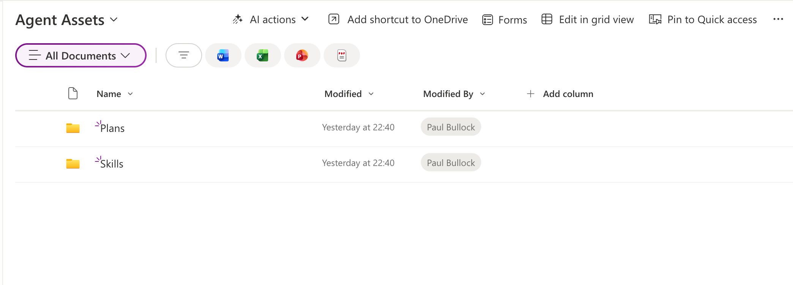

# Enable AI skills in SharePoint Online

## Summary

This script checks and optionally enables the SharePoint Online site feature required for Knowledge Agent assets (`AgentAssets`) on a target site collection to use skills.

Use this script when you want to prepare a site for AI/Knowledge Agent capabilities and confirm whether the required site feature is already active.



The script:

- Connects to SharePoint Online using interactive authentication.
- Retrieves the current state of the `Agent Assets` site feature.
- Optionally enables the feature when the `-Activate` switch is used.

## Prerequisites

- [PnP PowerShell](https://aka.ms/pnp/powershell)
- Permissions to manage site collection features on the target site


# [PnP PowerShell](#tab/pnpps)

```powershell
<# 
----------------------------------------------------------------------------

Created:      Paul Bullock
Date:         04/05/2026

.Notes

    Features of Knowledge Agent include:

	Agent Assets
    Provides storage for agent plans, skills, and other contextual information that makes Knowledge Agent more knowledgeable on the site.

 ----------------------------------------------------------------------------
#>
[CmdletBinding()]
param (
	$SiteUrl = "https://<tenant>.sharepoint.com/sites/SiteA",
	$ClientId = "<application-client-id-for-pnp-powershell>",
	[switch]$Activate
)

begin {
	Write-Host "This script will enable site agents for the specified SharePoint site." -ForegroundColor Green
}
process {
	Connect-PnPOnline -Url $SiteUrl -ClientId $ClientId -Interactive

	$featureName = "AgentAssets"
	$featureId = "9e14d30c-1e0d-4c8c-8dcb-a8d29f7d4c15"

	Get-PnPFeature -Identity $featureId -Scope Site | Format-List

	if ($Activate) {
		Write-Host "Activating feature $featureName..." -ForegroundColor Green
		Enable-PnPFeature -Identity $featureId -Scope Site -Force
	}
}
end {
	Write-Host "Done! :)" -ForegroundColor Green
}

```
[!INCLUDE [More about PnP PowerShell](../../docfx/includes/MORE-PNPPS.md)]
***


## Contributors

| Author(s) |
|-----------|
| Paul Bullock |


[!INCLUDE [DISCLAIMER](../../docfx/includes/DISCLAIMER.md)]
