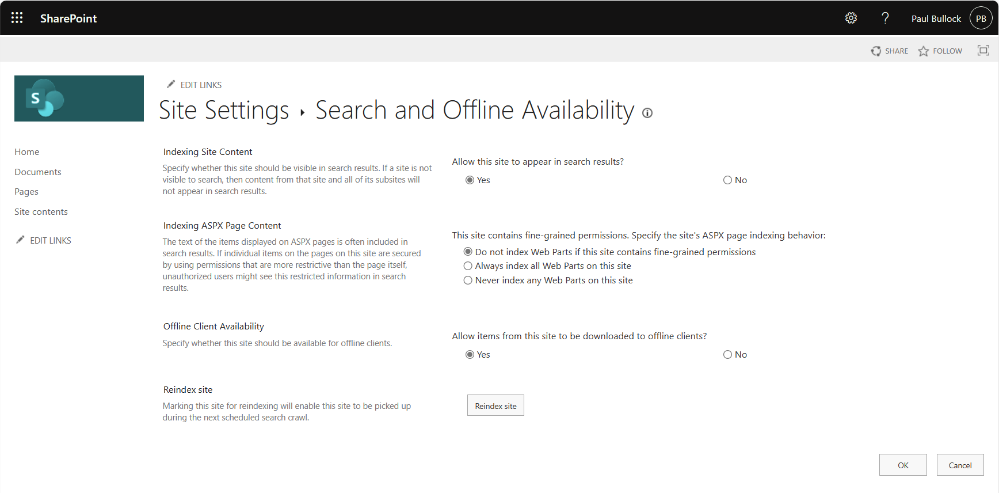

# Enable/Disable Search Crawling on Sites and Libraries

## Summary

This sample allows you to enable or disable the Search crawling on a site or a library. You can use this to control the search indexing of a site or a library. But if you disable it, web parts and search experiences will not work against the locations you disable. However, this can be used to remove locations from Microsoft 365 Copilot. 

> [!Warning]
> Please be aware this script contains a command that will remove content from search, ensure you test and understand the implications of running the script. If this is an active site, it can negatively impact the user experience.




# [PnP PowerShell](#tab/pnpps)

```powershell

# Connect to SharePoint Online site
Connect-PnPOnline https://contoso.sharepoint.com/sites/SearchEnableDisableTest -Interactive

# Note: No Search Crawl is false because it is crawling the site by default - love these MS negative logic
$status = Get-PnPWeb -Includes NoCrawl
Write-Host "Current WEB status - Crawling: $(!$status.NoCrawl)"

# Disable No Site Scripting
# If you don't do this, you may get an access denied error
Set-PnPSite -NoScriptSite $false

# Disable Search Crawl
#----------------------------
Set-PnPWeb -NoCrawl

$status = Get-PnPWeb -Includes NoCrawl
Write-Host "Current WEB status - Crawling: $(!$status.NoCrawl)" 

# Enable Search Crawl
#----------------------------
Set-PnPWeb -NoCrawl:$false

$status = Get-PnPWeb -Includes NoCrawl
Write-Host "Current WEB status - Crawling: $(!$status.NoCrawl)"

# Enable No Site Scripting
Set-PnPSite -NoScriptSite $true

#-----------------------------------------------------------
# Library Level
#-----------------------------------------------------------

# Remember - No Search Crawl is false because it is crawling the site by default
$listName = "Documents"

# Get the current status of the list
$list = Get-PnPList -Identity $listName -Includes NoCrawl
Write-Host "Current DOCUMENT LIBRARY ($($listName)) status - Crawling: $(!$list.NoCrawl)"

# Disable Search Crawl on list
#-------------------------------
Set-PnPList -Identity $listName -NoCrawl

$list = Get-PnPList -Identity $listName -Includes NoCrawl
Write-Host "Current DOCUMENT LIBRARY ($($listName)) status - Crawling: $(!$list.NoCrawl)"

# Enable Search Crawl on list
#-------------------------------
Set-PnPList -Identity $listName -NoCrawl:$false

$list = Get-PnPList -Identity $listName -Includes NoCrawl
Write-Host "Current DOCUMENT LIBRARY ($($listName)) status - Crawling: $(!$list.NoCrawl)"  

# Disconnect SharePoint online connection
Disconnect-PnPOnline

```
[!INCLUDE [More about PnP PowerShell](../../docfx/includes/MORE-PNPPS.md)]

# [CLI for Microsoft 365](#tab/cli-m365-ps)

```powershell

# Get Credentials to connect
$m365Status = m365 status
if ($m365Status -match "Logged Out") {
    m365 login
}

# SharePoint online site URL
$siteUrl = Read-Host -Prompt "Enter your SharePoint site URL (e.g https://contoso.sharepoint.com/sites/SearchEnableDisableTest)"

# Note: No Search Crawl is false because it is crawling the site by default - love these MS negative logic
$status = m365 spo web get --url $siteUrl | ConvertFrom-Json
Write-Host "Current WEB status - Crawling: $(!$status.NoCrawl)"

# Disable No Site Scripting
# If you don't do this, you may get an access denied error
m365 spo site set --url $siteUrl --noScriptSite false

# Disable Search Crawl
#----------------------------

m365 spo web set --url $siteUrl --NoCrawl true

$status = m365 spo web get --url $siteUrl | ConvertFrom-Json
Write-Host "Current WEB status - Crawling: $(!$status.NoCrawl)"

# Enable Search Crawl
#----------------------------

m365 spo web set --url $siteUrl --NoCrawl false

$status = m365 spo web get --url $siteUrl | ConvertFrom-Json
Write-Host "Current WEB status - Crawling: $(!$status.NoCrawl)"

# Enable No Site Scripting
m365 spo site set --url $siteUrl --noScriptSite true

#-----------------------------------------------------------
# Library Level
#-----------------------------------------------------------

# Remember - No Search Crawl is false because it is crawling the site by default
$libraryName = "Documents"

# Get the current status of the list/library
$library = m365 spo list get --title $libraryName --webUrl $siteUrl | ConvertFrom-Json
Write-Host "Current DOCUMENT LIBRARY ($($libraryName)) status - Crawling: $(!$library.NoCrawl)"

# Disable Search Crawl on list/library
#-------------------------------

m365 spo list set --webUrl $siteUrl --title $libraryName --noCrawl true

$library = m365 spo list get --title $libraryName --webUrl $siteUrl | ConvertFrom-Json
Write-Host "Current DOCUMENT LIBRARY ($($libraryName)) status - Crawling: $(!$library.NoCrawl)"

# Enable Search Crawl on list
#-------------------------------

m365 spo list set --webUrl $siteUrl --title $libraryName --noCrawl false

$library = m365 spo list get --title $libraryName --webUrl $siteUrl | ConvertFrom-Json
Write-Host "Current DOCUMENT LIBRARY ($($libraryName)) status - Crawling: $(!$library.NoCrawl)"

# Disconnect SharePoint online connection
m365 logout

```

[!INCLUDE [More about CLI for Microsoft 365](../../docfx/includes/MORE-CLIM365.md)]

***

## Contributors

| Author(s) |
|-----------|
| Paul Bullock |
| [Ganesh Sanap](https://ganeshsanapblogs.wordpress.com/about) |

[!INCLUDE [DISCLAIMER](../../docfx/includes/DISCLAIMER.md)]

