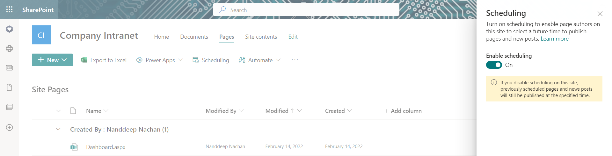

# Enable page scheduling on a modern site pages library

## Summary

The script enables the page scheduling feature on a modern site pages library.



## Implementation

- Open Windows PowerShell ISE
- Create a new file
- Copy the code below
- Save the file and run it

# [PnP PowerShell](#tab/pnpps)

```powershell
# Example: .\Enable-PageScheduling.ps1 -SiteUrl "https://contoso.sharepoint.com"
[CmdletBinding()]
param (
    [Parameter(Mandatory = $true, HelpMessage = "URL of the SharePoint site, e.g.https://contoso.sharepoint.com")]
    [string]$SiteUrl
)

begin  {
    Write-Host "Connecting to SharePoint Site '$($SiteUrl)'" -f Yellow
    Connect-PnPOnline -Url $SiteUrl
}
process {
    # enable page publishing scheduling on the current site
    Enable-PnPPageScheduling
}
end {
    Disconnect-PnPOnline
    Write-Host "Finished" -ForegroundColor Green
}
```
[!INCLUDE [More about PnP PowerShell](../../docfx/includes/MORE-PNPPS.md)]

***

## Contributors

| Author(s) |
|-----------|
| [Nanddeep Nachan](https://github.com/nanddeepn) |


[!INCLUDE [DISCLAIMER](../../docfx/includes/DISCLAIMER.md)]
