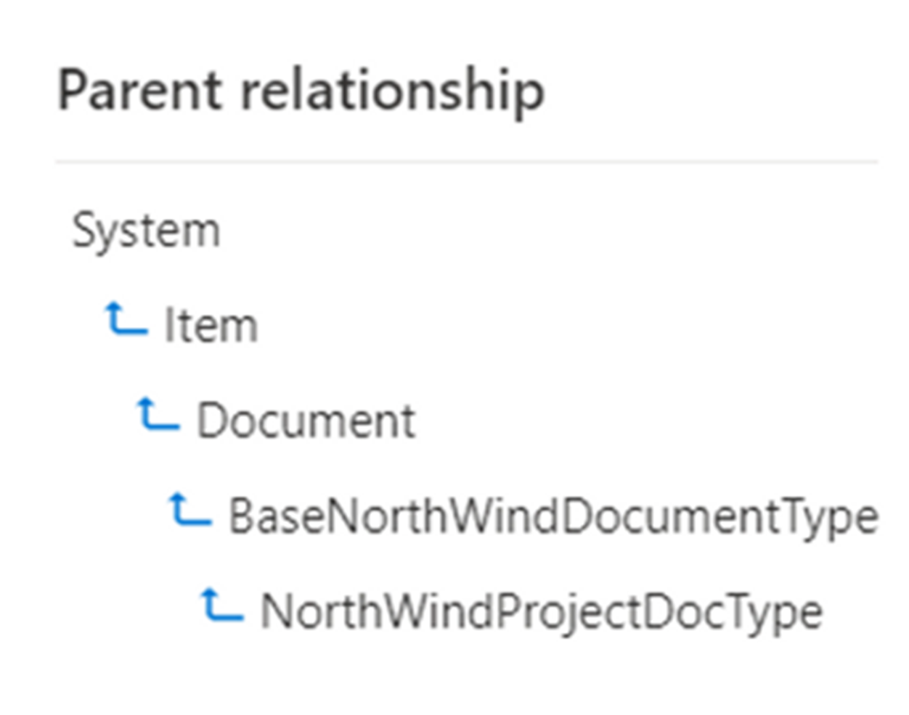

# Ensure all required Content Types are available before Get-PnPSiteTemplate

## Summary

If one of the Content Types you are using on your master site is part of a Content Type Hierachy, you need to ensure that all the Content Types are available on the site before you use the `Get-PnPSiteTemplate` cmdlet. This will ensure that you can deploy the Template without any issues.




# [PnP PowerShell](#tab/pnpps)

```powershell

$sourceUrl = "https://contoso.sharepoint.com/sites/MasterSite"
$sourceConn = Connect-PnPOnline -Url $sourceUrl -Interactive -ReturnConnection
$ctHubConn = Connect-PnPOnline -Url "https://contoso.sharepoint.com/sites/contenttypehub" -Interactive -ReturnConnection
$allcontenttypesInCTHub = Get-PnPContentType -Connection $ctHubConn

function getParentContenttype($contentType) 
{
    $contenttypes = @()
    if($contentType.Id.StringValue -eq "0x01" -or $contentType.Id.StringValue -eq "0x0101" -or $contentType.Id.StringValue -eq "0x0120") #root content type
    {
        Write-Host "Root content type" -ForegroundColor Green
    }
    else 
    {
        write-host "$($contentType.Name) with id $($contentType.Id)" -ForegroundColor Blue
        $contenttypes += $contentType.Id
        $ctInHub = $allcontenttypesInCTHub | Where-Object { $_.Id.StringValue -eq $contentType.Id.StringValue }    
        $ctInHubParent = Get-PnPProperty -ClientObject $ctInHub -Property Parent -Connection $ctHubConn
        
        getParentContenttype($ctInHubParent)
        
    }
    return $contenttypes
}

#iterate through all non default lists and libraries on the site
$lists = Get-PnPList -Connection $sourceConn 
foreach($list in $lists)
{
    if($list.Hidden -eq $true -or $list.Title -eq "Site Assets" -or $list.Title -eq "Site Pages" -or $list.Title -eq "Style Library" -or $list.Title -eq "Form Templates" )
    {
        Write-Host "Skipping List $($list.Title) as it is a default list" -ForegroundColor Yellow
    }
    else 
    {
        Write-Host "Processing List $($list.Title)" -ForegroundColor Green
        $listContentTypes = Get-PnPContentType -List $list.Title -Connection $sourceConn
        foreach($ct in $listContentTypes)
        {
            #get site content type
            $onsiteCT = Get-PnPContentType -Identity $ct.Name -Connection $sourceConn
            $result = getParentContenttype($onsiteCT)
            #add the parent content type to the site
            foreach($ctId in $result)
            {
                Add-PnPContentTypesFromContentTypeHub -ContentTypes $ctId.StringValue -Connection $sourceConn -ErrorAction Stop | Out-Null
            }
        }
    }
}


```
[!INCLUDE [More about PnP PowerShell](../../docfx/includes/MORE-PNPPS.md)]
***


## Contributors

| Author(s) |
|-----------|
| Kasper Larsen |

[!INCLUDE [DISCLAIMER](../../docfx/includes/DISCLAIMER.md)]

