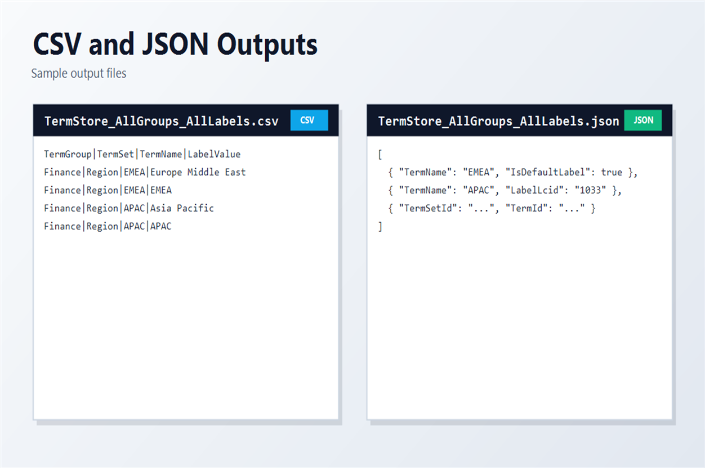

# Export all term groups with translation labels

## Summary

This script exports SharePoint Term Store data across all available term groups (or a selected subset) including term sets, terms, and multilingual labels.



The output can be generated as CSV, JSON, or both formats. The script handles token expiration by reconnecting and retrying, supports optional filtering by term group names, and writes one output file per term group.

Use this sample when you need a complete export of taxonomy structures and translated labels for governance, migration, or reporting.

# [PnP PowerShell](#tab/pnpps)

```powershell

[CmdletBinding()]
param(
	[Parameter(Mandatory = $true)]
	[string]$TenantAdminUrl,

	[Parameter(Mandatory = $true)]
	[string]$ClientId,

	[Parameter(Mandatory = $false)]
	[string]$OutputPath,

	[Parameter(Mandatory = $false)]
	[ValidateSet("Csv", "Json", "Both")]
	[string]$ExportFormat = "Csv",

	[Parameter(Mandatory = $false)]
	[string[]]$TermGroups = @(),

	[Parameter(Mandatory = $false)]
	[switch]$IncludeSiteCollectionGroups
)

# Requires PnP.PowerShell v3.2+
$requiredVersion = [version]"3.2.0"
$installedModule = Get-Module -ListAvailable -Name PnP.PowerShell |
	Sort-Object Version -Descending |
	Select-Object -First 1

if ($null -eq $installedModule -or $installedModule.Version -lt $requiredVersion)
{
	throw "PnP.PowerShell v3.2.0 or newer is required. Install-Module PnP.PowerShell -Scope CurrentUser"
}

function Get-PropValue
{
	param(
		[Parameter(Mandatory = $true)]$Object,
		[Parameter(Mandatory = $true)][string[]]$Names,
		$Default = $null
	)

	foreach ($name in $Names)
	{
		if ($Object.PSObject.Properties.Name -contains $name)
		{
			try
			{
				$value = $Object.$name
			}
			catch
			{
				continue
			}

			if ($null -ne $value)
			{
				try
				{
					if (-not [string]::IsNullOrWhiteSpace([string]$value))
					{
						return $value
					}
				}
				catch
				{
					continue
				}
			}
		}
	}

	return $Default
}

function Connect-TermStorePnP
{
	Write-Host "Connecting to $TenantAdminUrl ..." -ForegroundColor Cyan
	return (Connect-PnPOnline -Url $TenantAdminUrl -Interactive -ClientId $ClientId -ReturnConnection)
}

function Test-IsExpiredPnPTokenError
{
	param(
		[Parameter(Mandatory = $true)]$Exception
	)

	$message = [string]$Exception
	return (
		$message -match "AADSTS70043" -or
		$message -match "refresh token has expired" -or
		$message -match "sign-in frequency"
	)
}

function Invoke-PnPWithReconnect
{
	param(
		[Parameter(Mandatory = $true)][scriptblock]$Operation,
		[Parameter(Mandatory = $true)][ref]$ConnectionRef,
		[string]$ActionDescription = "PnP operation"
	)

	try
	{
		return (& $Operation $ConnectionRef.Value)
	}
	catch
	{
		if (-not (Test-IsExpiredPnPTokenError -Exception $_.Exception))
		{
			throw
		}

		Write-Warning ("{0} failed because the delegated token expired. Reconnecting and retrying once..." -f $ActionDescription)
		$ConnectionRef.Value = Connect-TermStorePnP
		return (& $Operation $ConnectionRef.Value)
	}
}

function Get-AllTermsUnique
{
	param(
		[Parameter(Mandatory = $true)]$TermGroup,
		[Parameter(Mandatory = $true)]$TermSet,
		[Parameter(Mandatory = $true)][ref]$ConnectionRef
	)

	$terms = @(Invoke-PnPWithReconnect -ConnectionRef $ConnectionRef -ActionDescription ("Reading terms for term set '{0}'" -f $TermSet.Name) -Operation {
			param($activeConnection)
			@(Get-PnPTerm -TermGroup $TermGroup.Id -TermSet $TermSet.Id -IncludeChildTerms -IncludeDeprecated -Connection $activeConnection -ErrorAction Stop)
		})

	# Defensive deduplication: recursive retrieval can occasionally return overlaps.
	$byId = @{}
	foreach ($term in $terms)
	{
		$byId[$term.Id.Guid.ToString()] = $term
	}

	return @($byId.Values)
}

function Resolve-OutputPath
{
	param(
		[string]$Path,
		[Parameter(Mandatory = $true)][ValidateSet("Csv", "Json", "Both")][string]$Format
	)

	$ticks = [DateTime]::UtcNow.Ticks

	if ([string]::IsNullOrWhiteSpace($Path))
	{
		$baseName = "TermStore_AllGroups_AllLabels_{0}" -f $ticks

		switch ($Format)
		{
			"Csv"
			{
				return (Join-Path -Path (Get-Location) -ChildPath ("{0}.csv" -f $baseName))
			}
			"Json"
			{
				return (Join-Path -Path (Get-Location) -ChildPath ("{0}.json" -f $baseName))
			}
			default
			{
				return (Join-Path -Path (Get-Location) -ChildPath $baseName)
			}
		}
	}

	$resolved = $Path

	# Supported placeholders:
	# - {ticks}
	# - {0:...} (legacy date-format placeholder): replaced with ticks to keep filenames valid and unique.
	$resolved = $resolved.Replace("{ticks}", [string]$ticks)
	$resolved = [regex]::Replace($resolved, "\{0:[^}]+\}", [string]$ticks)

	# If no placeholder was used, append ticks before extension (or at end if no extension).
	if ($resolved -notmatch [regex]::Escape([string]$ticks))
	{
		$ext = [System.IO.Path]::GetExtension($resolved)
		if ([string]::IsNullOrWhiteSpace($ext))
		{
			$resolved = "{0}_{1}" -f $resolved, $ticks
		}
		else
		{
			$dir = [System.IO.Path]::GetDirectoryName($resolved)
			$name = [System.IO.Path]::GetFileNameWithoutExtension($resolved)
			$resolved = [System.IO.Path]::Combine($dir, ("{0}_{1}{2}" -f $name, $ticks, $ext))
		}
	}

	return $resolved
}

function Convert-ToSafeString
{
	param(
		$Value,
		[string]$Default = ""
	)

	if ($null -eq $Value)
	{
		return $Default
	}

	try
	{
		return [string]$Value
	}
	catch
	{
		return $Default
	}
}

function Convert-ToSafeFileName
{
	param(
		[string]$Value,
		[string]$Default = "UnknownGroup"
	)

	if ([string]::IsNullOrWhiteSpace($Value))
	{
		return $Default
	}

	$safeValue = $Value
	foreach ($invalidChar in [System.IO.Path]::GetInvalidFileNameChars())
	{
		$safeValue = $safeValue.Replace([string]$invalidChar, "_")
	}

	$safeValue = $safeValue.Trim().Trim('.')
	if ([string]::IsNullOrWhiteSpace($safeValue))
	{
		return $Default
	}

	return $safeValue
}

function Resolve-GroupOutputPath
{
	param(
		[Parameter(Mandatory = $true)][string]$ResolvedPath,
		[Parameter(Mandatory = $true)][string]$GroupName,
		[Parameter(Mandatory = $true)][ValidateSet("Csv", "Json", "Both")][string]$Format
	)

	$safeGroupName = Convert-ToSafeFileName -Value $GroupName
	$extension = [System.IO.Path]::GetExtension($ResolvedPath)

	if ($Format -eq "Both" -or [string]::IsNullOrWhiteSpace($extension))
	{
		return "{0}_{1}" -f $ResolvedPath, $safeGroupName
	}

	$directory = [System.IO.Path]::GetDirectoryName($ResolvedPath)
	$nameWithoutExtension = [System.IO.Path]::GetFileNameWithoutExtension($ResolvedPath)
	$fileName = "{0}_{1}{2}" -f $nameWithoutExtension, $safeGroupName, $extension

	if ([string]::IsNullOrWhiteSpace($directory))
	{
		return $fileName
	}

	return [System.IO.Path]::Combine($directory, $fileName)
}

function Convert-LcidToLanguageTag
{
	param(
		$Lcid
	)

	if ($null -eq $Lcid)
	{
		return ""
	}

	try
	{
		$lcidInt = [int]$Lcid
		return [System.Globalization.CultureInfo]::GetCultureInfo($lcidInt).Name
	}
	catch
	{
		return ""
	}
}

$conn = Connect-TermStorePnP

try
{
	Write-Host "Reading term groups..." -ForegroundColor Cyan
	$allGroups = @(Invoke-PnPWithReconnect -ConnectionRef ([ref]$conn) -ActionDescription "Reading term groups" -Operation {
			param($activeConnection)
			@(Get-PnPTermGroup -Connection $activeConnection -ErrorAction Stop)
		})

	if (-not $IncludeSiteCollectionGroups)
	{
		$allGroups = @($allGroups | Where-Object { -not $_.IsSiteCollectionGroup })
	}

	if ($TermGroups.Count -gt 0)
	{
		$selectedGroupNames = @(
			$TermGroups |
				ForEach-Object { $_.Trim() } |
				Where-Object { -not [string]::IsNullOrWhiteSpace($_) }
		)

		if ($selectedGroupNames.Count -gt 0)
		{
			Write-Host ("Filtering to selected term groups: {0}" -f ($selectedGroupNames -join ", ")) -ForegroundColor Cyan
			$allGroups = @($allGroups | Where-Object { $_.Name -in $selectedGroupNames })
		}
	}
	else
	{
		Write-Host "No term group filter provided. Exporting all available term groups." -ForegroundColor Cyan
	}

	$rows = New-Object System.Collections.Generic.List[object]
	$groupCount = 0
	$setCount = 0
	$termCount = 0
	$labelCount = 0

	foreach ($group in $allGroups)
	{
		$groupCount++
		Write-Host ("[{0}/{1}] Group: {2}" -f $groupCount, $allGroups.Count, $group.Name) -ForegroundColor Yellow

		$termSets = @(Invoke-PnPWithReconnect -ConnectionRef ([ref]$conn) -ActionDescription ("Reading term sets for group '{0}'" -f $group.Name) -Operation {
				param($activeConnection)
				@(Get-PnPTermSet -TermGroup $group.Id -Connection $activeConnection -ErrorAction Stop)
			})
		foreach ($set in $termSets)
		{
			$setCount++
			$terms = Get-AllTermsUnique -TermGroup $group -TermSet $set -ConnectionRef ([ref]$conn)
			Write-Host ("  Term set: {0}, number of terms = {1}" -f $set.Name, $terms.Count) -ForegroundColor Green

			foreach ($term in $terms)
			{
				$termCount++

				$labels = @(Invoke-PnPWithReconnect -ConnectionRef ([ref]$conn) -ActionDescription ("Reading labels for term '{0}'" -f $term.Name) -Operation {
						param($activeConnection)
						@(Get-PnPTermLabel -Term $term.Id -TermSet $set.Id -TermGroup $group.Id -Connection $activeConnection -ErrorAction SilentlyContinue)
					})

				if ($labels.Count -eq 0)
				{
					# Export at least one row even when no labels are returned.
					$rows.Add([pscustomobject]@{
						TermGroupName = Convert-ToSafeString -Value $group.Name
						TermGroupId = Convert-ToSafeString -Value $group.Id
						TermSetName = Convert-ToSafeString -Value $set.Name
						TermSetId = Convert-ToSafeString -Value $set.Id
						TermName = Convert-ToSafeString -Value $term.Name
						TermId = Convert-ToSafeString -Value $term.Id
						ParentTermId = Convert-ToSafeString -Value (Get-PropValue -Object $term -Names @("ParentId") -Default "")
						TermPath = Convert-ToSafeString -Value (Get-PropValue -Object $term -Names @("PathOfTerm") -Default "")
						IsDeprecated = (Get-PropValue -Object $term -Names @("IsDeprecated") -Default $false)
						IsAvailableForTagging = (Get-PropValue -Object $term -Names @("IsAvailableForTagging") -Default $false)
						LabelValue = Convert-ToSafeString -Value $term.Name
						LabelLcid = ""
						LabelLanguage = ""
						IsDefaultLabel = $true
					})
					$labelCount++
					continue
				}

				foreach ($label in $labels)
				{
					$labelText = Convert-ToSafeString -Value (Get-PropValue -Object $label -Names @("Value", "Name") -Default "")
					$labelLcid = Convert-ToSafeString -Value (Get-PropValue -Object $label -Names @("Language", "Lcid") -Default "")
					$isDefault = [bool](Get-PropValue -Object $label -Names @("IsDefault", "IsDefaultForLanguage") -Default $false)
					$labelLanguage = Convert-ToSafeString -Value (Get-PropValue -Object $label -Names @("LanguageTag") -Default "")
					if ([string]::IsNullOrWhiteSpace($labelLanguage))
					{
						$labelLanguage = Convert-LcidToLanguageTag -Lcid $labelLcid
					}

					$rows.Add([pscustomobject]@{
						TermGroupName = Convert-ToSafeString -Value $group.Name
						TermGroupId = Convert-ToSafeString -Value $group.Id
						TermSetName = Convert-ToSafeString -Value $set.Name
						TermSetId = Convert-ToSafeString -Value $set.Id
						TermName = Convert-ToSafeString -Value $term.Name
						TermId = Convert-ToSafeString -Value $term.Id
						ParentTermId = Convert-ToSafeString -Value (Get-PropValue -Object $term -Names @("ParentId") -Default "")
						TermPath = Convert-ToSafeString -Value (Get-PropValue -Object $term -Names @("PathOfTerm") -Default "")
						IsDeprecated = (Get-PropValue -Object $term -Names @("IsDeprecated") -Default $false)
						IsAvailableForTagging = (Get-PropValue -Object $term -Names @("IsAvailableForTagging") -Default $false)
						LabelValue = $labelText
						LabelLcid = $labelLcid
						LabelLanguage = $labelLanguage
						IsDefaultLabel = $isDefault
					})
					$labelCount++
				}
			}
		}
	}

	$resolvedOutputPath = Resolve-OutputPath -Path $OutputPath -Format $ExportFormat

	$writtenFiles = New-Object System.Collections.Generic.List[string]
	$groupedRows = $rows | Group-Object TermGroupName | Sort-Object Name

	foreach ($groupRows in $groupedRows)
	{
		$groupOutputPath = Resolve-GroupOutputPath -ResolvedPath $resolvedOutputPath -GroupName $groupRows.Name -Format $ExportFormat
		$sortedRows = $groupRows.Group | Sort-Object TermGroupName, TermSetName, TermPath, TermName, LabelLcid, LabelValue

		switch ($ExportFormat)
		{
			"Csv"
			{
				$sortedRows | Export-Csv -Path $groupOutputPath -Delimiter "|" -NoTypeInformation -Encoding utf8BOM -Force
				$writtenFiles.Add($groupOutputPath)
			}
			"Json"
			{
				$sortedRows | ConvertTo-Json -Depth 8 | Set-Content -Path $groupOutputPath -Encoding UTF8
				$writtenFiles.Add($groupOutputPath)
			}
			"Both"
			{
				$csvPath = "{0}.csv" -f $groupOutputPath
				$jsonPath = "{0}.json" -f $groupOutputPath

				$sortedRows | Export-Csv -Path $csvPath -Delimiter "|" -NoTypeInformation -Encoding utf8BOM -Force
				$sortedRows | ConvertTo-Json -Depth 8 | Set-Content -Path $jsonPath -Encoding UTF8

				$writtenFiles.Add($csvPath)
				$writtenFiles.Add($jsonPath)
			}
		}
	}

	Write-Host ""
	Write-Host "Export completed." -ForegroundColor Cyan
	Write-Host ("Groups : {0}" -f $groupCount)
	Write-Host ("Sets   : {0}" -f $setCount)
	Write-Host ("Terms  : {0}" -f $termCount)
	Write-Host ("Labels : {0}" -f $labelCount)
	foreach ($file in $writtenFiles)
	{
		Write-Host ("File   : {0}" -f $file)
	}
}
finally
{
	# Disconnect-PnPOnline -Connection $conn -ErrorAction SilentlyContinue
}


# Example:
# .\Export-AllTermGroupsWithTranslationLabels.ps1 -TenantAdminUrl "https://contoso-admin.sharepoint.com/" -ClientId "<client-id>" -ExportFormat Both -OutputPath "C:\Temp\TermStoreExport_{0:yyyyMMdd_HHmmss}" -TermGroups "HR"

```
[!INCLUDE [More about PnP PowerShell](../../docfx/includes/MORE-PNPPS.md)]
***


## Contributors

| Author(s) |
|-----------|
| Kasper Larsen |

[!INCLUDE [DISCLAIMER](../../docfx/includes/DISCLAIMER.md)]

