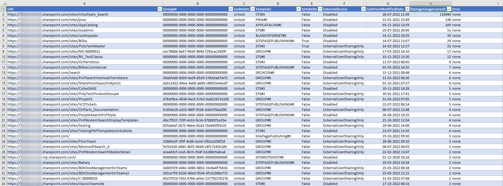

# Sample showing how to use extract basic site collection properties to a CSV file

## Summary

Often we will have to provide a report containing various Site Collection properties to stakeholders which do not have access to the SharePoint Admin Center. This samples shows an export of a few basic properties but it can expanded without too much hassle.

## Implementation

- Open VS Code
- Create a new file
- Copy the code below,
- Change the variables to target to your environment
- Run the script.
 
## Screenshot of Output 



# [PnP PowerShell](#tab/pnpps)
```powershell

$SharePointAdminUrl = "https://yourtenant-admin.sharepoint.com"

#connect to the admin site using one of the many options provided by Connect-PnPOnline
#Connect-PnPOnline -Url $SharePointAdminUrl -Interactive
#Connect-PnPOnline -Url $SharePointAdminUrl -ClientId XXXX -Tenant 'contoso.onmicrosoft.com' -Thumbprint YYYYY
Connect-PnPOnline -Url $SharePointAdminUrl -UseWebLogin

$allsites = Get-PnPTenantSite -Detailed 
Write-Host $allsites.Count

$Output = @()
$count = 0
foreach($s in $allsites)
{
    Write-Host " Working on item $count of $($allsites.Count))"
    $count++
    try 
    {
        $localconn = Connect-PnPOnline -Url $s.Url -Interactive -ReturnConnection
        
        $site = Get-PnPSite -Connection $localconn
        $web = Get-PnPWeb -Connection $localconn -ErrorAction stop

        $lastItemUserModifiedDate = Get-PnPProperty -ClientObject $web -Property "LastItemUserModifiedDate" -Connection $localconn
        $isHubsite = Get-PnPProperty -ClientObject $site -Property "IsHubSite" -Connection $localconn

        $myObject = [PSCustomObject]@{
            URL     = $s.Url
            GroupId = $s.GroupId
            LockState    = $s.LockState
            Template = $s.Template
            IsHubsite = $isHubSite
            ExternalAccess = $s.SharingCapability
            LastUserModifiedDate =  $lastItemUserModifiedDate
            StorageUsageCurrent = $s.StorageUsageCurrent 
            Error = "none"
        }        
    }
    catch 
    {
        $myObject = [PSCustomObject]@{
            URL     = $s.Url
            GroupId = $s.GroupId
            LockState    = $s.LockState
            Template = $s.Template
            IsHubsite = $isHubSite
            ExternalAccess = $s.SharingCapability
            StorageUsageCurrent = $s.StorageUsageCurrent
            Error = $_.Exception.message
        }
    
        
    }
    $Output+=($myObject)
}
$Output | Export-Csv  -Path c:\temp\sites.csv -Encoding utf8NoBOM -Force  -Delimiter "|"


```
[!INCLUDE [More about PnP PowerShell](../../docfx/includes/MORE-PNPPS.md)]
***

## Contributors

| Author(s) |
|-----------|
| Kasper Larsen, Fellowmind|

[!INCLUDE [DISCLAIMER](../../docfx/includes/DISCLAIMER.md)]

